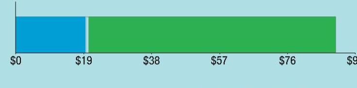

## EVERSEURCE

Account Number: 51892702010
Statement Date: 01/02/25
Service Provided To:
DUNN PAPER-EAST HARTFORD, LLC.

## Total Amount Due by 01/30/25

Amount Due On 12/30/24
Last Payment Received On 12/30/24
Balance Forward
Total Current Charges
$\$ 95.01$

Current Charges for Electricity

| Supply | Delivery |
| :--: | :--: |
| \$19.61 | \$69.73 |
| Cost of electricity from NEXTERA ENERGY SERVICES CONN | Cost to deliver electricity from Eversource |

The image is a bar chart. 

- The chart visually represents a cost breakdown.
- The x-axis is labeled with dollar amounts: $0, $19, $38, $57, $76, and $95.
- The bar is divided into two segments:
  - The first segment is blue, extending from $0 to $19.
  - The second segment is green, extending from $19 to $95.
- The chart likely illustrates the cost distribution between two categories, possibly corresponding to "Supply" and "Delivery" as mentioned in the Markdown context.

Your electric supplier is
NEXTERA ENERGY SERVICES CONN
20455 STATE HIGHWAY 249
HOUSTON TX 77070-2757
800-882-1276

# News For You 

Beginning Jan. 1, if you've chosen Eversource as your energy supplier, the Standard Service supply rate will increase compared to December. This is consistent with the typical summer to winter upward adjustment. The price of energy from power generators usually increases in the winter due to the demand for natural gas, which is used for heating and to produce roughly half of New England's electricity. To learn about programs we offer to manage your energy use and help you pay your bill this winter, visit Eversource.com/winter-bill.

Remit Payment To: Eversource, PO Box 56002, Boston, MA 02205-6002
CE. 260102PROD.TXT
Please make your check payable to Eversource and consider adding $\$ 1$ for Operation Fuel.
You can also add $\$ 2$ or $\$ 3$ when paying your bill online. $100 \%$ of your tax-deductible donation provides energy assistance grants. If mailing, please allow up to 5 business days to post.

## EVERSEURCE

Account Number: 51892702010
Non-residential and residential non-hardship customers may be subject to a $1.00 \%$ late payment charge if the "Total Amount Due" is not received by 01/30/25.

## Total Amount Due

by $01 / 30 / 25$
$\$ 95.01$

## Amount Enclosed

DUNN PAPER-EAST HARTFORD, LLC.
C/O DUNN PAPER
2 FORBES ST
EAST HARTFORD CT 06108-3727

Eversource
PO Box 56002
Boston, MA 02205-6002

## EVERSEURCE

Account Number: 51892702010
Customer name key: DUNN
Statement Date: 01/02/25
Service Provided To:
DUNN PAPER-EAST HARTFORD, LLC.

| Svc Addr: 2 FORBES ST EAST HARTFORD CT 06108 |  |  |  |  |  |  |
| :--: | :--: | :--: | :--: | :--: | :--: | :--: |
| Rate 116 Serv Ref: 014704004 |  |  |  | Bill Cycle: 20 |  |  |
| Service From: 12/02/24 - 01/02/25 |  |  |  | 31 Days |  |  |
| 8500 LED |  |  |  |  |  |  |
| Number of Devices |  |  |  | Unmetered Usage |  |  |
| 0002 |  |  |  | 81 kWh |  |  |

Cust provided ID: ST LTS

| Monthly kWh Use |  |  |  |  |  |  |
| :--: | :--: | :--: | :--: | :--: | :--: | :--: |
| Dec | Jan | Feb | Mar | Apr | May | Jun |
| 81 | 79 | 69 | 66 | 56 | 51 | 46 |
| Jul | Aug | Sep | Oct | Nov | Dec |  |
| 49 | 55 | 61 | 71 | 75 | 81 |  |
| Svc Addr: 2 FORBES ST EAST HARTFORD CT 06108 |  |  |  |  |  |  |
| Rate 116 Serv Ref: 289034003 |  |  |  | Bill Cycle: 20 |  |  |
| Service From: 12/02/24 - 01/02/25 |  |  |  | 31 Days |  |  |
| 23067 LED FLUIDEIGRT |  |  |  |  |  |  |
| Number of Devices |  |  |  | Unmetered Usage |  |  |
| 0001 |  |  |  | 88 kWh |  |  |

Cust provided ID: ST LTS

| Monthly kWh Use |  |  |  |  |  |  |
| :--: | :--: | :--: | :--: | :--: | :--: | :--: |
| Dec | Jan | Feb | Mar | Apr | May | Jun |
| 87 | 85 | 74 | 72 | 61 | 55 | 50 |
| Jul | Aug | Sep | Oct | Nov | Dec |  |
| 53 | 60 | 66 | 76 | 81 | 88 |  |

## Total Amount Due by 01/30/25

## $* 95.01$

Electric Account Summary
Amount Due On 12/30/24
$* 91.57$
Last Payment Received On 12/30/24
$* 91.57$
Balance Forward
$* 0.00$
Current Charges/Credits
Electric Supply Services
$* 19.61$
Delivery Services
Other Charges or Credits
Total Current Charges
Total Amount Due

Total Charges for Electricity

## Supplier

## NEXTERA ENERGY

Service Reference: 014704004
Supply
$80.60 \mathrm{kWh} \times \$ 0.09734$
$* 7.85$

## Eversource

Service Reference: 289034003
Allocated for 12/02/24 to 12/31/24
Supply
Allocated for 12/31/24 to 01/02/25
Supply
$81.50 \mathrm{kWh} \times \$ 0.08282$
$* 6.75$
5.60 kWh X \$0.10958
$* 0.61$

Service Reference: 616034006
Supply
Allocated for 12/31/24 to 01/02/25
Supply
Subtotal Supplier Services

## Delivery

(DISTRIBUTION RATE: 116)

# EVERSEURCE 

Account Number: 51892702010
Customer name key: DUNN
Statement Date: 01/02/25
Service Provided To:
DUNN PAPER-EAST HARTFORD, LLC.

Continued from previous page...

| Svc Addr: 2 FORBES ST EAST HARTFORD CT 06108 |  |  |  |  |  |
| :--: | :--: | :--: | :--: | :--: | :--: |
| Rate 116 Serv Ref: 616034006 |  |  | Bill Cycle: 20 |  |  |
| Service From: 12/02/24 - 01/02/25 |  |  | 31 Days |  |  |
| 14579 LEN FLUIDEIGHT |  |  |  |  |  |
| Number of Devices |  |  | Unmetered Usage |  |  |
| 0001 |  |  | 53 kWh |  |  |

Cust provided ID: ST LTS
Monthly kWh Use

| Dec | Jan | Feb | Mar | Apr | May | Jun |
| :--: | :--: | :--: | :--: | :--: | :--: | :--: |
| 53 | 51 | 45 | 43 | 36 | 33 | 30 |
| Jul | Aug | Sep | Oct | Nov | Dec |  |
| 32 | 36 | 39 | 46 | 49 | 53 |  |

## Contact Information

Emergency: 800-286-2000
www.eversource.com
Pay by Phone: 888-783-6618
Customer Service: 888-783-6617

## Important Messages About Your Account

Because the billing period spans a change in the rates, your usage has been calculated partly on the old rate and partly on the new rate.

Thank you for participating in the Online Bill and Payment Service.

## Total Amount Due by $01 / 30 / 25$

Continued from previous page...

| Service Reference: 014704004 |  |  |
| :--: | :--: | :--: |
| Transmission | 80.60kWh X $\$ 0.02052$ | \$1.65 |
| Local Delivery |  | \$17.12 |
| Revenue Decoupling | 80.60kWh X $\$ 0.00195$ | \$0.16 |
| CTA | 80.60kWh X $\$ 0.00038$ | \$0.03 |
| FMCC Charge | 80.60kWh X $\$ 0.02842$ | \$2.29 |
| Comb Public Benefit Chrg | 80.60kWh X $\$ 0.01996$ | \$1.61 |
| Local Delivery Improvements | 80.60kWh X $\$ 0.03521$ | \$2.84 |
| (DISTRIBUTION RATE: 116) |  |  |
| Service Reference: 289034003 |  |  |
| Allocated for 12/02/24 to 12/31/24 |  |  |
| Transmission | 81.50kWh X $\$ 0.02052$ | \$1.67 |
| Local Delivery |  | \$14.53 |
| Revenue Decoupling | 81.50kWh X $\$ 0.00195$ | \$0.16 |
| CTA | 81.50kWh X $\$ 0.00038$ | \$0.03 |
| FMCC Charge | 81.50kWh X $\$ 0.02842$ | \$2.32 |
| Comb Public Benefit Chrg | 81.50kWh X $\$ 0.01996$ | \$1.63 |
| Local Delivery Improvements | 81.50kWh X $\$ 0.03521$ | \$2.87 |
| Allocated for 12/31/24 to 01/02/25 |  |  |
| Transmission | 5.60kWh X $\$ 0.02052$ | \$0.11 |
| Local Delivery |  | \$0.91 |
| Revenue Decoupling | 5.60kWh X $\$ 0.00195$ | \$0.01 |
| FMCC Charge | 5.60kWh X $\$ 0.02842$ | \$0.16 |
| Comb Public Benefit Chrg | 5.60kWh X $\$ 0.01996$ | \$0.11 |
| Local Delivery Improvements | 5.60kWh X $\$ 0.03521$ | \$0.20 |
| (DISTRIBUTION RATE: 116) |  |  |
| Service Reference: 616034006 |  |  |
| Transmission | 48.70kWh X $\$ 0.02052$ | \$1.00 |
| Local Delivery |  | \$12.97 |
| Revenue Decoupling | 48.70kWh X $\$ 0.00195$ | \$0.09 |
| CTA | 48.70kWh X $\$ 0.00038$ | \$0.02 |
| FMCC Charge | 48.70kWh X $\$ 0.02842$ | \$1.38 |
| Comb Public Benefit Chrg | 48.70kWh X $\$ 0.01996$ | \$0.97 |
| Local Delivery Improvements | 48.70kWh X $\$ 0.03521$ | \$1.71 |
| Allocated for 12/31/24 to 01/02/25 |  |  |
| Transmission | 3.40kWh X $\$ 0.02052$ | \$0.07 |
| Local Delivery |  | \$0.81 |
| Revenue Decoupling | 3.40kWh X $\$ 0.00195$ | \$0.01 |
| FMCC Charge | 3.40kWh X $\$ 0.02842$ | \$0.10 |

# EVERSEURCE 

Account Number: 51892702010
Customer name key: DUNN
Statement Date: 01/02/25
Service Provided To:
DUNN PAPER-EAST HARTFORD, LLC.

| Total Amount Due by 01/30/25 |  | \%95.01 |
| :--: | :--: | :--: |
| Continued from previous page... |  |  |
| Comb Public Benefit Chrg | 3.40kWh X \$0.01996 | $\$ 0.07$ |
| Local Delivery Improvements | 3.40kWh X \$0.03521 | $\$ 0.12$ |
| Subtotal Delivery Services |  | \$69.73 |
| Total Cost of Electricity |  | \$89.34 |
| Other Charges or Credits |  |  |
| CT Sales Tax Supplier |  | $\$ 1.25$ |
| CT Sales Tax Delivery |  | $\$ 4.42$ |
| Subtotal Other Charges or Credits |  | $\$ 5.67$ |
| Total Current Charges |  | \$95.01 |

