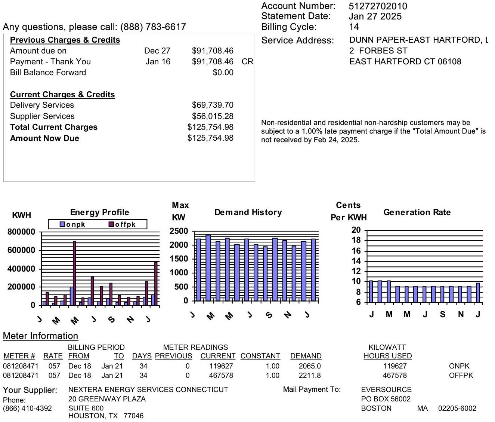

The image is a photo of a utility bill statement.

- **Embedded Text:**
  - "Any questions, please call: (888) 783-6617"
  - "Previous Charges & Credits"
  - "Amount due on Dec 27 $91,708.46"
  - "Payment - Thank You Jan 16 $91,708.46 CR"
  - "Bill Balance Forward $0.00"
  - "Current Charges & Credits"
  - "Delivery Services $69,739.70"
  - "Supplier Services $56,015.28"
  - "Total Current Charges $125,754.98"
  - "Amount Now Due $125,754.98"
  - "Account Number: 51272702010"
  - "Statement Date: Jan 27 2025"
  - "Billing Cycle: 14"
  - "Service Address: DUNN PAPER-EAST HARTFORD, L 2 FORBES ST EAST HARTFORD CT 06108"
  - "Non-residential and residential non-hardship customers may be subject to a 1.00% late payment charge if the 'Total Amount Due' is not received by Feb 24, 2025."
  - "Energy Profile"
  - "Demand History"
  - "Generation Rate"
  - "Meter Information"
  - "METER # 081208471"
  - "RATE 057"
  - "BILLING PERIOD FROM Dec 18 TO Jan 21"
  - "DAYS 34"
  - "METER READINGS PREVIOUS 0 CURRENT 119627"
  - "CONSTANT 1.00"
  - "DEMAND 2065.0"
  - "KILOWATT HOURS USED 119627 ONPK"
  - "METER # 081208471"
  - "RATE 057"
  - "BILLING PERIOD FROM Dec 18 TO Jan 21"
  - "DAYS 34"
  - "METER READINGS PREVIOUS 0 CURRENT 467578"
  - "CONSTANT 1.00"
  - "DEMAND 2211.8"
  - "KILOWATT HOURS USED 467578 OFFPK"
  - "Your Supplier: NEXTERA ENERGY SERVICES CONNECTICUT"
  - "Phone: (866) 410-4392"
  - "20 GREENWAY PLAZA SUITE 600 HOUSTON, TX 77046"
  - "Mail Payment To: EVERSOURCE PO BOX 56002 BOSTON MA 02205-6002"

- **Spatial Relationships:**
  - The "Previous Charges & Credits" section is on the left side above the "Current Charges & Credits" section.
  - The account information is on the right side of the image.
  - The "Energy Profile," "Demand History," and "Generation Rate" graphs are aligned horizontally below the charges and credits sections.
  - "Meter Information" is located below the graphs.

Please Make Checks Payable to EVERSOURCE And Return This Portion With Your Payment. Thank You.

| Account Number | Statement Date | Amount Now Due | Amount Enclosed |
| :--: | :--: | :--: | :--: |
| 51-272702010 | 01/27/2025 | \$125,754.98 |  |

Pay by Feb 24, 2025 to avoid a 1.00\% late charge. Payment due upon receipt unless other arrangements have been made.

# 512727020102? 0125754981 0125754981 

DUNN PAPER-EAST HARTFORD, LLC.
C/O DUNN PAPER
2 FORBES ST
EAST HARTFORD CT 06108

EVERSOURCE
PO BOX 56002
BOSTON MA
02205-6002

