## (1) PSEG

We make things work for you.

## Your energy bill

## (1) Message Center

This bill reflects a BPU-approved change in the Supply portion of your electric bill effective on and after September 1, 2023. The increase in the Supply portion of your bill is due to a change in the Transmission rate. The overall impact for business customers will vary by individual customer usage. Tariff information may also be found by visiting pseg.com.

The success of your business is important to us. We are working hard to make it easier to do business with us. To learn more about how we can help, visit pseg.com/Business.
J.D. Power named PSE\&G \#1 in customer satisfaction for both Residential Electric and Natural Gas Service in the East among Large Utilities. On behalf of the more than 12,000 PSEG employees who work hard every day, we thank you for rating us as a top utilities provider. For J.D. Power 2022 award information, visit jdpower.com/awards.

NEXT METER READING October 20, 2023

## How to contact us

## 1-855-BIZ-PSEG (249-7734)

Customer Service: 8am to 5:30pm Mon to Fri,
Closed on weekends and holidays
Emergencies / Outages / WorryFree Services: 24/7
TTY for the hearing impaired: 1-800-225-0072
Visit pseg.com/myaccount to access your account anytime
Text us. Register for MyAlerts by texting REG to 4PSEG(47734)
$>$ Text OUT to report an outage.
facebook.com/pseg
twitter.com/psegdelivers

PAY YOUR WAY, 24/7
We offer a variety of methods that make it easy to pay your bill. See reverse side for more information.

By checking this box, I authorize PSE\&G to enroll me in paperless billing at this email address:

068534000040838
$\left.\mathrm{If} \mathrm{ll}_{\mathrm{l}} \mathrm{ll}_{\mathrm{l}} \mathrm{l}_{\mathrm{l}} \mathrm{l}_{\mathrm{l}} \mathrm{l}_{\mathrm{l}} \mathrm{l}_{\mathrm{l}} \mathrm{l}_{\mathrm{l}} \mathrm{l}_{\mathrm{l}} \mathrm{l}_{\mathrm{l}} \mathrm{l}_{\mathrm{l}} \mathrm{l}_{\mathrm{l}} \mathrm{l}_{\mathrm{l}} \mathrm{l}_{\mathrm{l}} \mathrm{l}_{\mathrm{l}} \mathrm{l}_{\mathrm{l}} \mathrm{l}_{\mathrm{l}} \mathrm{l}_{\mathrm{l}} \mathrm{l}_{\mathrm{l}} \mathrm{l}_{\mathrm{l}} \mathrm{l}_{\mathrm{l}} \mathrm{l}_{\mathrm{l}} \mathrm{l}_{\mathrm{l}} \mathrm{l}_{\mathrm{l}} \mathrm{l}_{\mathrm{l}} \mathrm{l}_{\mathrm{l}} \mathrm{l}_{\mathrm{l}} \mathrm{l}_{\mathrm{l}} \mathrm{l}_{\mathrm{l}} \mathrm{l}_{\mathrm{l}} \mathrm{l}_{\mathrm{l}} \mathrm{l}_{\mathrm{l}} \mathrm{l}_{\mathrm{l}} \mathrm{l}_{\mathrm{l}} \mathrm{l}_{\mathrm{l}} \mathrm{l}_{\mathrm{l}} \mathrm{l}_{\mathrm{l}} \mathrm{l}_{\mathrm{l}} \mathrm{l}_{\mathrm{l}} \mathrm{l}_{\mathrm{l}} \mathrm{l}_{\mathrm{l}} \mathrm{l}_{\mathrm{l}} \mathrm{l}_{\mathrm{l}} \mathrm{l}_{\mathrm{l}} \mathrm{l}_{\mathrm{l}} \mathrm{l}_{\mathrm{l}} \mathrm{l}_{\mathrm{l}} \mathrm{l}_{\mathrm{l}} \mathrm{l}_{\mathrm{l}} \mathrm{l}_{\mathrm{l}} \mathrm{l}_{\mathrm{l}} \mathrm{l}_{\mathrm{l}} \mathrm{l}_{\mathrm{l}} \mathrm{l}_{\mathrm{l}} \mathrm{l}_{\mathrm{l}} \mathrm{l}_{\mathrm{l}} \mathrm{l}_{\mathrm{l}} \mathrm{l}_{\mathrm{l}} \mathrm{l}_{\mathrm{l}} \mathrm{l}_{\mathrm{l}} \mathrm{l}_{\mathrm{l}} \mathrm{l}_{\mathrm{l}} \mathrm{l}_{\mathrm{l}} \mathrm{l}_{\mathrm{l}} \mathrm{l}_{\mathrm{l}} \mathrm{l}_{\mathrm{l}} \mathrm{l}_{\mathrm{l}} \mathrm{l}_{\mathrm{l}} \mathrm{l}_{\mathrm{l}} \mathrm{l}_{\mathrm{l}} \mathrm{l}_{\mathrm{l}} \mathrm{l}_{\mathrm{l}} \mathrm{l}_{\mathrm{l}} \mathrm{l}_{\mathrm{l}} \mathrm{l}_{\mathrm{l}} \mathrm{l}_{\mathrm{l}} \mathrm{l}_{\mathrm{l}} \mathrm{l}_{\mathrm{l}} \mathrm{l}_{\mathrm{l}} \mathrm{l}_{\mathrm{l}} \mathrm{l}_{\mathrm{l}} \mathrm{l}_{\mathrm{l}} \mathrm{l}_{\mathrm{l}} \mathrm{l}_{\mathrm{l}} \mathrm{l}_{\mathrm{l}} \mathrm{l}_{\mathrm{l}} \mathrm{l}_{\mathrm{l}} \mathrm{l}_{\mathrm{l}} \mathrm{l}_{\mathrm{l}} \mathrm{l}_{\mathrm{l}} \mathrm{l}_{\mathrm{l}} \mathrm{l}_{\mathrm{l}} \mathrm{l}_{\mathrm{l}} \mathrm{l}_{\mathrm{l}} \mathrm{l}_{\mathrm{l}} \mathrm{l}_{\mathrm{l}} \mathrm{l}_{\mathrm{l}} \mathrm{l}_{\mathrm{l}} \mathrm{l}_{\mathrm{l}} \mathrm{l}_{\mathrm{l}} \mathrm{l}_{\mathrm{l}} \mathrm{l}_{\mathrm{l}} \mathrm{l}_{\mathrm{l}} \mathrm{l}_{\mathrm{l}} \mathrm{l}_{\mathrm{l}} \mathrm{l}_{\mathrm{l}} \mathrm{l}_{\mathrm{l}} \mathrm{l}_{\mathrm{l}} \mathrm{l}_{\mathrm{l}} \mathrm{l}_{\mathrm{l}} \mathrm{l}_{\mathrm{l}} \mathrm{l}_{\mathrm{l}} \mathrm{l}_{\mathrm{l}} \mathrm{l}_{\mathrm{l}} \mathrm{l}_{\mathrm{l}} \mathrm{l}_{\mathrm{l}} \mathrm{l}_{\mathrm{l}} \mathrm{l}_{\mathrm{l}} \mathrm{l}_{\mathrm{l}} \mathrm{l}_{\mathrm{l}} \mathrm{l}_{\mathrm{l}} \mathrm{l}_{\mathrm{l}} \mathrm{l}_{\mathrm{l}} \mathrm{l}_{\mathrm{l}} \mathrm{l}_{\mathrm{l}} \mathrm{l}_{\mathrm{l}} \mathrm{l}_{\mathrm{l}} \mathrm{l}_{\mathrm{l}} \mathrm{l}_{\mathrm{l}} \mathrm{l}_{\mathrm{l}} \mathrm{l}_{\mathrm{l}} \mathrm{l}_{\mathrm{l}} \mathrm{l}_{\mathrm{l}} \mathrm{l}_{\mathrm{l}} \mathrm{l}_{\mathrm{l}} \mathrm{l}_{\mathrm{l}} \mathrm{l}_{\mathrm{l}} \mathrm{l}_{\mathrm{l}} \mathrm{l}_{\mathrm{l}} \mathrm{l}_{\mathrm{l}} \mathrm{l}_{\mathrm{l}} \mathrm{l}_{\mathrm{l}} \mathrm{l}_{\mathrm{l}} \mathrm{l}_{\mathrm{l}} \mathrm{l}_{\mathrm{l}} \mathrm{l}_{\mathrm{l}} \mathrm{l}_{\mathrm{l}} \mathrm{l}_{\mathrm{l}} \mathrm{l}_{\mathrm{l}} \mathrm{l}_{\mathrm{l}} \mathrm{l}_{\mathrm{l}} \mathrm{l}_{\mathrm{l}} \mathrm{l}_{\mathrm{l}} \mathrm{l}_{\mathrm{l}} \mathrm{l}_{\mathrm{l}} \mathrm{l}_{\mathrm{l}} \mathrm{l}_{\mathrm{l}} \mathrm{l}_{\mathrm{l}} \mathrm{l}_{\mathrm{l}} \mathrm{l}_{\mathrm{l}} \mathrm{l}_{\mathrm{l}} \mathrm{l}_{\mathrm{l}} \mathrm{l}_{\mathrm{l}} \mathrm{l}_{\mathrm{l}} \mathrm{l}_{\mathrm{l}} \mathrm{l}_{\mathrm{l}} \mathrm{l}_{\mathrm{l}} \mathrm{l}_{\mathrm{l}} \mathrm{l}_{\mathrm{l}} \mathrm{l}_{\mathrm{l}} \mathrm{l}_{\mathrm{l}} \mathrm{l}_{\mathrm{l}} \mathrm{l}_{\mathrm{l}} \mathrm{l}_{\mathrm{l}} \mathrm{l}_{\mathrm{l}} \mathrm{l}_{\mathrm{l}} \mathrm{l}_{\mathrm{l}} \mathrm{l}_{\mathrm{l}} \mathrm{l}_{\mathrm{l}} \mathrm{l}_{\mathrm{l}} \mathrm{l}_{\mathrm{l}} \mathrm{l}_{\mathrm{l}} \mathrm{l}_{\mathrm{l}} \mathrm{l}_{\mathrm{l}} \mathrm{l}_{\mathrm{l}} \mathrm{l}_{\mathrm{l}} \mathrm{l}_{\mathrm{l}} \mathrm{l}_{\mathrm{l}} \mathrm{l}_{\mathrm{l}} \mathrm{l}_{\mathrm{l}} \mathrm{l}_{\mathrm{l}} \mathrm{l}_{\mathrm{l}} \mathrm{l}_{\mathrm{l}} \mathrm{l}_{\mathrm{l}} \mathrm{l}_{\mathrm{l}} \mathrm{l}_{\mathrm{l}} \mathrm{l}_{\mathrm{l}} \mathrm{l}_{\mathrm{l}} \mathrm{l}_{\mathrm{l}} \mathrm{l}_{\mathrm{l}} \mathrm{l}_{\mathrm{l}} \mathrm{l}_{\mathrm{l}} \mathrm{l}_{\mathrm{l}} \mathrm{l}_{\mathrm{l}} \mathrm{l}_{\mathrm{l}} \mathrm{l}_{\mathrm{l}} \mathrm{l}_{\mathrm{l}} \mathrm{l}_{\mathrm{l}} \mathrm{l}_{\mathrm{l}} \mathrm{l}_{\mathrm{l}} \mathrm{l}_{\mathrm{l}} \mathrm{l}_{\mathrm{l}} \mathrm{l}_{\mathrm{l}} \mathrm{l}_{\mathrm{l}} \mathrm{l}_{\mathrm{l}} \mathrm{l}_{\mathrm{l}} \mathrm{l}_{\mathrm{l}} \mathrm{l}_{\mathrm{l}} \mathrm{l}_{\mathrm{l}} \mathrm{l}_{\mathrm{l}} \mathrm{l}_{\mathrm{l}} \mathrm{l}_{\mathrm{l}} \mathrm{l}_{\mathrm{l}} \mathrm{l}_{\mathrm{l}} \mathrm{l}_{\mathrm{l}} \mathrm{l}_{\mathrm{l}} \mathrm{l}_{\mathrm{l}} \mathrm{l}_{\mathrm{l}} \mathrm{l}_{\mathrm{l}} \mathrm{l}_{\mathrm{l}} \mathrm{l}_{\mathrm{l}} \mathrm{l}_{\mathrm{l}} \mathrm{l}_{\mathrm{l}} \mathrm{l}_{\mathrm{l}} \mathrm{l}_{\mathrm{l}} \mathrm{l}_{\mathrm{l}} \mathrm{l}_{\mathrm{l}} \mathrm{l}_{\mathrm{l}} \mathrm{l}_{\mathrm{l}} \mathrm{l}_{\mathrm{l}} \mathrm{l}_{\mathrm{l}} \mathrm{l}_{\mathrm{l}} \mathrm{l}_{\mathrm{l}} \mathrm{l}_{\mathrm{l}} \mathrm{l}_{\mathrm{l}} \mathrm{l}_{\mathrm{l}} \mathrm{l}_{\mathrm{l}} \mathrm{l}_{\mathrm{l}} \mathrm{l}_{\mathrm{l}} \mathrm{l}_{\mathrm{l}} \mathrm{l}_{\mathrm{l}} \mathrm{l}_{\mathrm{l}} \mathrm{l}_{\mathrm{l}} \mathrm{l}_{\mathrm{l}} \mathrm{l}_{\mathrm{l}} \mathrm{l}_{\mathrm{l}} \mathrm{l}_{\mathrm{l}} \mathrm{l}_{\mathrm{l}} \mathrm{l}_{\mathrm{l}} \mathrm{l}_{\mathrm{l}} \mathrm{l}_{\mathrm{l}} \mathrm{l}_{\mathrm{l}} \mathrm{l}_{\mathrm{l}} \mathrm{l}_{\mathrm{l}} \mathrm{l}_{\mathrm{l}} \mathrm{l}_{\mathrm{l}} \mathrm{l}_{\mathrm{l}} \mathrm{l}_{\mathrm{l}} \mathrm{l}_{\mathrm{l}} \mathrm{l}_{\mathrm{l}} \mathrm{l}_{\mathrm{l}} \mathrm{l}_{\mathrm{l}} \mathrm{l}_{\mathrm{l}} \mathrm{l}_{\mathrm{l}} \mathrm{l}_{\mathrm{l}} \mathrm{l}_{\mathrm{l}} \mathrm{l}_{\mathrm{l}} \mathrm{l}_{\mathrm{l}} \mathrm{l}_{\mathrm{l}} \mathrm{l}_{\mathrm{l}} \mathrm{l}_{\mathrm{l}} \mathrm{l}_{\mathrm{l}} \mathrm{l}_{\mathrm{l}} \mathrm{l}_{\mathrm{l}} \mathrm{l}_{\mathrm{l}} \mathrm{l}_{\mathrm{l}} \mathrm{l}_{\mathrm{l}} \mathrm{l}_{\mathrm{l}} \mathrm{l}_{\mathrm{l}} \mathrm{l}_{\mathrm{l}} \mathrm{l}_{\mathrm{l}} \mathrm{l}_{\mathrm{l}} \mathrm{l}_{\mathrm{l}} \mathrm{l}_{\mathrm{l}} \mathrm{l}_{\mathrm{l}} \mathrm{l}_{\mathrm{l}} \mathrm{l}_{\mathrm{l}} \mathrm{l}_{\mathrm{l}} \mathrm{l}_{\mathrm{l}} \mathrm{l}_{\mathrm{l}} \mathrm{l}_{\mathrm{l}} \mathrm{l}_{\mathrm{l}} \mathrm{l}_{\mathrm{l}} \mathrm{l}_{\mathrm{l}} \mathrm{l}_{\mathrm{l}} \mathrm{l}_{\mathrm{l}} \mathrm{l}_{\mathrm{l}} \mathrm{l}_{\mathrm{l}} \mathrm{l}_{\mathrm{l}} \mathrm{l}_{\mathrm{l}} \mathrm{l}_{\mathrm{l}} \mathrm{l}_{\mathrm{l}} \mathrm{l}_{\mathrm{l}} \mathrm{l}_{\mathrm{l}} \mathrm{l}_{\mathrm{l}} \mathrm{l}_{\mathrm{l}} \mathrm{l}_{\mathrm{l}} \mathrm{l}_{\mathrm{l}} \mathrm{l}_{\mathrm{l}} \mathrm{l}_{\mathrm{l}} \mathrm{l}_{\mathrm{l}} \mathrm{l}_{\mathrm{l}} \mathrm{l}_{\mathrm{l}} \mathrm{l}_{\mathrm{l}} \mathrm{l}_{\mathrm{l}} \mathrm{l}_{\mathrm{l}} \mathrm{l}_{\mathrm{l}} \mathrm{l}_{\mathrm{l}} \mathrm{l}_{\mathrm{l}} \mathrm{l}_{\mathrm{l}} \mathrm{l}_{\mathrm{l}} \mathrm{l}_{\mathrm{l}} \mathrm{l}_{\mathrm{l}} \mathrm{l}_{\mathrm{l}} \mathrm{l}_{\mathrm{l}} \mathrm{l}_{\mathrm{l}} \mathrm{l}_{\mathrm{l}} \mathrm{l}_{\mathrm{l}} \mathrm{l}_{\mathrm{l}} \mathrm{l}_{\mathrm{l}} \mathrm{l}_{\mathrm{l}} \mathrm{l}_{\mathrm{l}} \mathrm{l}_{\mathrm{l}} \mathrm{l}_{\mathrm{l}} \mathrm{l}_{\mathrm{l}} \mathrm{l}_{\mathrm{l}} \mathrm{l}_{\mathrm{l}} \mathrm{l}_{\mathrm{l}} \mathrm{l}_{\mathrm{l}} \mathrm{l}_{\mathrm{l}} \mathrm{l}_{\mathrm{l}} \mathrm{l}_{\mathrm{l}} \mathrm{l}_{\mathrm{l}} \mathrm{l}_{\mathrm{l}} \mathrm{l}_{\mathrm{l}} \mathrm{l}_{\mathrm{l}} \mathrm{l}_{\mathrm{l}} \mathrm{l}_{\mathrm{l}} \mathrm{l}_{\mathrm{l}} \mathrm{l}_{\mathrm{l}} \mathrm{l}_{\mathrm{l}} \mathrm{l}_{\mathrm{l}} \mathrm{l}_{\mathrm{l}} \mathrm{l}_{\mathrm{l}} \mathrm{l}_{\mathrm{l}} \mathrm{l}_{\mathrm{l}} \mathrm{l}_{\mathrm{l}} \mathrm{l}_{\mathrm{l}} \mathrm{l}_{\mathrm{l}} \mathrm{l}_{\mathrm{l}} \mathrm{l}_{\mathrm{l}} \mathrm{l}_{\mathrm{l}} \mathrm{l}_{\mathrm{l}} \mathrm{l}_{\mathrm{l}} \mathrm{l}_{\mathrm{l}} \mathrm{l}_{\mathrm{l}} \mathrm{l}_{\mathrm{l}} \mathrm{l}_{\mathrm{l}} \mathrm{l}_{\mathrm{l}} \mathrm{l}_{\mathrm{l}} \mathrm{l}_{\mathrm{l}} \mathrm{l}_{\mathrm{l}} \mathrm{l}_{\mathrm{l}} \mathrm{l}_{\mathrm{l}} \mathrm{l}_{\mathrm{l}} \mathrm{l}_{\mathrm{l}} \mathrm{l}_{\mathrm{l}} \mathrm{l}_{\mathrm{l}} \mathrm{l}_{\mathrm{l}} \mathrm{l}_{\mathrm{l}} \mathrm{l}_{\mathrm{l}} \mathrm{l}_{\mathrm{l}} \mathrm{l}_{\mathrm{l}} \mathrm{l}_{\mathrm{l}} \mathrm{l}_{\mathrm{l}} \mathrm{l}_{\mathrm{l}} \mathrm{l}_{\mathrm{l}} \mathrm{l}_{\mathrm{l}} \mathrm{l}_{\mathrm{l}} \mathrm{l}_{\mathrm{l}} \mathrm{l}_{\mathrm{l}} \mathrm{l}_{\mathrm{l}} \mathrm{l}_{\mathrm{l}} \mathrm{l}_{\mathrm{l}} \mathrm{l}_{\mathrm{l}} \mathrm{l}_{\mathrm{l}} \mathrm{l}_{\mathrm{l}} \mathrm{l}_{\mathrm{l}} \mathrm{l}_{\mathrm{l}} \mathrm{l}_{\mathrm{l}} \mathrm{l}_{\mathrm{l}} \mathrm{l}_{\mathrm{l}} \mathrm{l}_{\mathrm{l}} \mathrm{l}_{\mathrm{l}} \mathrm{l}_{\mathrm{l}} \mathrm{l}_{\mathrm{l}} \mathrm{l}_{\mathrm{l}} \mathrm{l}_{\mathrm{l}} \mathrm{l}_{\mathrm{l}} \mathrm{l}_{\mathrm{l}} \mathrm{l}_{\mathrm{l}} \mathrm{l}_{\mathrm{l}} \mathrm{l}_{\mathrm{l}} \mathrm{l}_{\mathrm{l}} \mathrm{l}_{\mathrm{l}} \mathrm{l}_{\mathrm{l}} \mathrm{l}_{\mathrm{l}} \mathrm{l}_{\mathrm{l}} \mathrm{l}_{\mathrm{l}} \mathrm{l}_{\mathrm{l}} \mathrm{l}_{\mathrm{l}} \mathrm{l}_{\mathrm{l}} \mathrm{l}_{\mathrm{l}} \mathrm{l}_{\mathrm{l}} \mathrm{l}_{\mathrm{l}} \mathrm{l}_{\mathrm{l}} \mathrm{l}_{\mathrm{l}} \mathrm{l}_{\mathrm{l}} \mathrm{l}_{\mathrm{l}} \mathrm{l}_{\mathrm{l}} \mathrm{l}_{\mathrm{l}} \mathrm{l}_{\mathrm{l}} \mathrm{l}_{\mathrm{l}} \mathrm{l}_{\mathrm{l}} \mathrm{l}_{\mathrm{l}} \mathrm{l}_{\mathrm{l}} \mathrm{l}_{\mathrm{l}} \mathrm{l}_{\mathrm{l}} \mathrm{l}_{\mathrm{l}} \mathrm{l}_{\mathrm{l}} \mathrm{l}_{\mathrm{l}} \mathrm{l}_{\mathrm{l}} \mathrm{l}_{\mathrm{l}} \mathrm{l}_{\mathrm{l}} \mathrm{l}_{\mathrm{l}} \mathrm{l}_{\mathrm{l}} \mathrm{l}_{\mathrm{l}} \mathrm{l}_{\mathrm{l}} \mathrm{l}_{\mathrm{l}} \mathrm{l}_{\mathrm{l}} \mathrm{l}_{\mathrm{l}} \mathrm{l}_{\mathrm{l}} \mathrm{l}_{\mathrm{l}} \mathrm{l}_{\mathrm{l}} \mathrm{l}_{\mathrm{l}} \mathrm{l}_{\mathrm{l}} \mathrm{l}_{\mathrm{l}} \mathrm{l}_{\mathrm{l}} \mathrm{l}_{\mathrm{l}} \mathrm{l}_{\mathrm{l}} \mathrm{l}_{\mathrm{l}} \mathrm{l}_{\mathrm{l}} \mathrm{l}_{\mathrm{l}} \mathrm{l}_{\mathrm{l}} \mathrm{l}_{\mathrm{l}} \mathrm{l}_{\mathrm{l}} \mathrm{l}_{\mathrm{l}} \mathrm{l}_{\mathrm{l}} \mathrm{l}_{\mathrm{l}} \mathrm{l}_{\mathrm{l}} \mathrm{l}_{\mathrm{l}} \mathrm{l}_{\mathrm{l}} \mathrm{l}_{\mathrm{l}} \mathrm{l}_{\mathrm{l}} \mathrm{l}_{\mathrm{l}} \mathrm{l}_{\mathrm{l}} \mathrm{l}_{\mathrm{l}} \mathrm{l}_{\mathrm{l}} \mathrm{l}_{\mathrm{l}} \mathrm{l}_{\mathrm{l}} \mathrm{l}_{\mathrm{l}} \mathrm{l}_{\mathrm{l}} \mathrm{l}_{\mathrm{l}} \mathrm{l}_{\mathrm{l}} \mathrm{l}_{\mathrm{l}} \mathrm{l}_{\mathrm{l}} \mathrm{l}_{\mathrm{l}} \mathrm{l}_{\mathrm{l}} \mathrm{l}_{\mathrm{l}} \mathrm{l}_{\mathrm{l}} \mathrm{l}_{\mathrm{l}} \mathrm{l}_{\mathrm{l}} \mathrm{l}_{\mathrm{l}} \mathrm{l}_{\mathrm{l}} \mathrm{l}_{\mathrm{l}} \mathrm{l}_{\mathrm{l}} \mathrm{l}_{\mathrm{l}} \mathrm{l}_{\mathrm{l}} \mathrm{l}_{\mathrm{l}} \mathrm{l}_{\mathrm{l}} \mathrm{l}_{\mathrm{l}} \mathrm{l}_{\mathrm{l}} \mathrm{l}_{\mathrm{l}} \mathrm{l}_{\mathrm{l}} \mathrm{l}_{\mathrm{l}} \mathrm{l}_{\mathrm{l}} \mathrm{l}_{\mathrm{l}} \mathrm{l}_{\mathrm{l}} \mathrm{l}_{\mathrm{l}} \mathrm{l}_{\mathrm{l}} \mathrm{l}_{\mathrm{l}} \mathrm{l}_{\mathrm{l}} \mathrm{l}_{\mathrm{l}} \mathrm{l}_{\mathrm{l}} \mathrm{l}_{\mathrm{l}} \mathrm{l}_{\mathrm{l}} \mathrm{l}_{\mathrm{l}} \mathrm{l}_{\mathrm{l}} \mathrm{l}_{\mathrm{l}} \mathrm{l}_{\mathrm{l}} \mathrm{l}_{\mathrm{l}} \mathrm{l}_{\mathrm{l}} \mathrm{l}_{\mathrm{l}} \mathrm{l}_{\mathrm{l}} \mathrm{l}_{\mathrm{l}} \mathrm{l}_{\mathrm{l}} \mathrm{l}_{\mathrm{l}} \mathrm{l}_{\mathrm{l}} \mathrm{l}_{\mathrm{l}} \mathrm{l}_{\mathrm{l}} \mathrm{l}_{\mathrm{l}} \mathrm{l}_{\mathrm{l}} \mathrm{l}_{\mathrm{l}} \mathrm{l}_{\mathrm{l}} \mathrm{l}_{\mathrm{l}} \mathrm{l}_{\mathrm{l}} \mathrm{l}_{\mathrm{l}} \mathrm{l}_{\mathrm{l}} \mathrm{l}_{\mathrm{l}} \mathrm{l}_{\mathrm{l}} \mathrm{l}_{\mathrm{l}} \mathrm{l}_{\mathrm{l}} \mathrm{l}_{\mathrm{l}} \mathrm{l}_{\mathrm{l}} \mathrm{l}_{\mathrm{l}} \mathrm{l}_{\mathrm{l}} \mathrm{l}_{\mathrm{l}} \mathrm{l}_{\mathrm{l}} \mathrm{l}_{\mathrm{l}} \mathrm{l}_{\mathrm{l}} \mathrm{l}_{\mathrm{l}} \mathrm{l}_{\mathrm{l}} \mathrm{l}_{\mathrm{l}} \mathrm{l}_{\mathrm{l}} \mathrm{l}_{\mathrm{l}} \mathrm{l}_{\mathrm{l}} \mathrm{l}_{\mathrm{l}} \mathrm{l}_{\mathrm{l}} \mathrm{l}_{\mathrm{l}} \mathrm{l}_{\mathrm{l}} \mathrm{l}_{\mathrm{l}} \mathrm{l}_{\mathrm{l}} \mathrm{l}_{\mathrm{l}} \mathrm{l}_{\mathrm{l}} \mathrm{l}_{\mathrm{l}} \mathrm{l}_{\mathrm{l}} \mathrm{l}_{\mathrm{l}} \mathrm{l}_{\mathrm{l}} \mathrm{l}_{\mathrm{l}} \mathrm{l}_{\mathrm{l}} \mathrm{l}_{\mathrm{l}} \mathrm{l}_{\mathrm{l}} \mathrm{l}_{\mathrm{l}} \mathrm{l}_{\mathrm{l}} \mathrm{l}_{\mathrm{l}} \mathrm{l}_{\mathrm{l}} \mathrm{l}_{\mathrm{l}} \mathrm{l}_{\mathrm{l}} \mathrm{l}_{\mathrm{l}} \mathrm{l}_{\mathrm{l}} \mathrm{l}_{\mathrm{l}} \mathrm{l}_{\mathrm{l}} \mathrm{l}_{\mathrm{l}} \mathrm{l}_{\mathrm{l}} \mathrm{l}_{\mathrm{l}} \mathrm{l}_{\mathrm{l}} \mathrm{l}_{\mathrm{l}} \mathrm{l}_{\mathrm{l}} \mathrm{l}_{\mathrm{l}} \mathrm{l}_{\mathrm{l}} \mathrm{l}_{\mathrm{l}} \mathrm{l}_{\mathrm{l}} \mathrm{l}_{\mathrm{l}} \mathrm{l}_{\mathrm{l}} \mathrm{l}_{\mathrm{l}} \mathrm{l}_{\mathrm{l}} \mathrm{l}_{\mathrm{l}} \mathrm{l}_{\mathrm{l}} \mathrm{l}_{\mathrm{l}} \mathrm{l}_{\mathrm{l}} \mathrm{l}_{\mathrm{l}} \mathrm{l}_{\mathrm{l}} \mathrm{l}_{\mathrm{l}} \mathrm{l}_{\mathrm{l}} \mathrm{l}_{\mathrm{l}} \mathrm{l}_{\mathrm{l}} \mathrm{l}_{\mathrm{l}} \mathrm{l}_{\mathrm{l}} \mathrm{l}_{\mathrm{l}} \mathrm{l}_{\mathrm{l}} \mathrm{l}_{\mathrm{l}} \mathrm{l}_{\mathrm{l}} \mathrm{l}_{\mathrm{l}} \mathrm{l}_{\mathrm{l}} \mathrm{l}_{\mathrm{l}} \mathrm{l}_{\mathrm{l}} \mathrm{l}_{\mathrm{l}} \mathrm{l}_{\mathrm{l}} \mathrm{l}_{\mathrm{l}} \mathrm{l}_{\mathrm{l}} \mathrm{l}_{\mathrm{l}} \mathrm{l}_{\mathrm{l}} \mathrm{l}_{\mathrm{l}} \mathrm{l}_{\mathrm{l}} \mathrm{l}_{\mathrm{l}} \mathrm{l}_{\mathrm{l}} \mathrm{l}_{\mathrm{l}} \mathrm{l}_{\mathrm{l}} \mathrm{l}_{\mathrm{l}} \mathrm{l}_{\mathrm{l}} \mathrm{l}_{\mathrm{l}} \mathrm{l}_{\mathrm{l}} \mathrm{l}_{\mathrm{l}} \mathrm{l}_{\mathrm{l}} \mathrm{l}_{\mathrm{l}} \mathrm{l}_{\mathrm{l}} \mathrm{l}_{\mathrm{l}} \mathrm{l}_{\mathrm{l}} \mathrm{l}_{\mathrm{l}} \mathrm{l}_{\mathrm{l}} \mathrm{l}_{\mathrm{l}} \mathrm{l}_{\mathrm{l}} \mathrm{l}_{\mathrm{l}} \mathrm{l}_{\mathrm{l}} \mathrm{l}_{\mathrm{l}} \mathrm{l}_{\mathrm{l}} \mathrm{l}_{\mathrm{l}} \mathrm{l}_{\mathrm{l}} \mathrm{l}_{\mathrm{l}} \mathrm{l}_{\mathrm{l}} \mathrm{l}_{\mathrm{l}} \mathrm{l}_{\mathrm{l}} \mathrm{l}_{\mathrm{l}} \mathrm{l}_{\mathrm{l}} \mathrm{l}_{\mathrm{l}} \mathrm{l}_{\mathrm{l}} \mathrm{l}_{\mathrm{l}} \mathrm{l}_{\mathrm{l}} \mathrm{l}_{\mathrm{l}} \mathrm{l}_{\mathrm{l}} \mathrm{l}_{\mathrm{l}} \mathrm{l}_{\mathrm{l}} \mathrm{l}_{\mathrm{l}} \mathrm{l}_{\mathrm{l}} \mathrm{l}_{\mathrm{l}} \mathrm{l}_{\mathrm{l}} \mathrm{l}_{\mathrm{l}} \mathrm{l}_{\mathrm{l}} \mathrm{l}_{\mathrm{l}} \mathrm{l}_{\mathrm{l}} \mathrm{l}_{\mathrm{l}} \mathrm{l}_{\mathrm{l}} \mathrm{l}_{\mathrm{l}} \mathrm{l}_{\mathrm{l}} \mathrm{l}_{\mathrm{l}} \mathrm{l}_{\mathrm{l}} \mathrm{l}_{\mathrm{l}} \mathrm{l}_{\mathrm{l}} \mathrm{l}_{\mathrm{l}} \mathrm{l}_{\mathrm{l}} \mathrm{l}_{\mathrm{l}} \mathrm{l}_{\mathrm{l}} \mathrm{l}_{\mathrm{l}} \mathrm{l}_{\mathrm{l}} \mathrm{l}_{\mathrm{l}} \mathrm{l}_{\mathrm{l}} \mathrm{l}_{\mathrm{l}} \mathrm{l}_{\mathrm{l}} \mathrm{l}_{\mathrm{l}} \mathrm{l}_{\mathrm{l}} \mathrm{l}_{\mathrm{l}} \mathrm{l}_{\mathrm{l}} \mathrm{l}_{\mathrm{l}} \mathrm{l}_{\mathrm{l}} \mathrm{l}_{\mathrm{l}} \mathrm{l}_{\mathrm{l}} \mathrm{l}_{\mathrm{l}} \mathrm{l}_{\mathrm{l}} \mathrm{l}_{\mathrm{l}} \mathrm{l}_{\mathrm{l}} \mathrm{l}_{\mathrm{l}} \mathrm{l}_{\mathrm{l}} \mathrm{l}_{\mathrm{l}} \mathrm{l}_{\mathrm{l}} \mathrm{l}_{\mathrm{l}} \mathrm{l}_{\mathrm{l}} \mathrm{l}_{\mathrm{l}} \mathrm{l}_{\mathrm{l}} \mathrm{l}_{\mathrm{l}} \mathrm{l}_{\mathrm{l}} \mathrm{l}_{\mathrm{l}} \mathrm{l}_{\mathrm{l}} \mathrm{l}_{\mathrm{l}} \mathrm{l}_{\mathrm{l}} \mathrm{l}_{\mathrm{l}} \mathrm{l}_{\mathrm{l}} \mathrm{l}_{\mathrm{l}} \mathrm{l}_{\mathrm{l}} \mathrm{l}_{\mathrm{l}} \mathrm{l}_{\mathrm{l}} \mathrm{l}_{\mathrm{l}} \mathrm{l}_{\mathrm{l}} \mathrm{l}_{\mathrm{l}} \mathrm{l}_{\mathrm{l}} \mathrm{l}_{\mathrm{l}} \mathrm{l}_{\mathrm{l}} \mathrm{l}_{\mathrm{l}} \mathrm{l}_{\mathrm{l}} \mathrm{l}_{\mathrm{l}} \mathrm{l}_{\mathrm{l}} \mathrm{l}_{\mathrm{l}} \mathrm{l}_{\mathrm{l}} \mathrm{l}_{\mathrm{l}} \mathrm{l}_{\mathrm{l}} \mathrm{l}_{\mathrm{l}} \mathrm{l}_{\mathrm{l}} \mathrm{l}_{\mathrm{l}} \mathrm{l}_{\mathrm{l}} \mathrm{l}_{\mathrm{l}} \mathrm{l}_{\mathrm{l}} \mathrm{l}_{\mathrm{l}} \mathrm{l}_{\mathrm{l}} \mathrm{l}_{\mathrm{l}} \mathrm{l}_{\mathrm{l}} \mathrm{l}_{\mathrm{l}} \mathrm{l}_{\mathrm{l}} \mathrm{l}_{\mathrm{l}} \mathrm{l}_{\mathrm{l}} \mathrm{l}_{\mathrm{l}} \mathrm{l}_{\mathrm{l}} \mathrm{l}_{\mathrm{l}} \mathrm{l}_{\mathrm{l}} \mathrm{l}_{\mathrm{l}} \mathrm{l}_{\mathrm{l}} \mathrm{l}_{\mathrm{l}} \mathrm{l}_{\mathrm{l}} \mathrm{l}_{\mathrm{l}} \mathrm{l}_{\mathrm{l}} \mathrm{l}_{\mathrm{l}} \mathrm{l}_{\mathrm{l}} \mathrm{l}_{\mathrm{l}} \mathrm{l}_{\mathrm{l}} \mathrm{l}_{\mathrm{l}} \mathrm{l}_{\mathrm{l}} \mathrm{l}_{\mathrm{l}} \mathrm{l}_{\mathrm{l}} \mathrm{l}_{\mathrm{l}} \mathrm{l}_{\mathrm{l}} \mathrm{l}_{\mathrm{l}} \mathrm{l}_{\mathrm{l}} \mathrm{l}_{\mathrm{l}} \mathrm{l}_{\mathrm{l}} \mathrm{l}_{\mathrm{l}} \mathrm{l}_{\mathrm{l}} \mathrm{l}_{\mathrm{l}} \mathrm{l}_{\mathrm{l}} \mathrm{l}_{\mathrm{l}} \mathrm{l}_{\mathrm{l}} \mathrm{l}_{\mathrm{l}} \mathrm{l}_{\mathrm{l}} \mathrm{l}_{\mathrm{l}} \mathrm{l}_{\mathrm{l}} \mathrm{l}_{\mathrm{l}} \mathrm{l}_{\mathrm{l}} \mathrm{l}_{\mathrm{l}} \mathrm{l}_{\mathrm{l}} \mathrm{l}_{\mathrm{l}} \mathrm{l}_{\mathrm{l}} \mathrm{l}_{\mathrm{l}} \mathrm{l}_{\mathrm{l}} \mathrm{l}_{\mathrm{l}} \mathrm{l}_{\mathrm{l}} \mathrm{l}_{\mathrm{l}} \mathrm{l}_{\mathrm{l}} \mathrm{l}_{\mathrm{l}} \mathrm{l}_{\mathrm{l}} \mathrm{l}_{\mathrm{l}} \mathrm{l}_{\mathrm{l}} \mathrm{l}_{\mathrm{l}} \mathrm{l}_{\mathrm{l}} \mathrm{l}_{\mathrm{l}} \mathrm{l}_{\mathrm{l}} \mathrm{l}_{\mathrm{l}} \mathrm{l}_{\mathrm{l}} \mathrm{l}_{\mathrm{l}} \mathrm{l}_{\mathrm{l}} \mathrm{l}_{\mathrm{l}} \mathrm{l}_{\mathrm{l}} \mathrm{l}_{\mathrm{l}} \mathrm{l}_{\mathrm{l}} \mathrm{l}_{\mathrm{l}} \mathrm{l}_{\mathrm{l}} \mathrm{l}_{\mathrm{l}} \mathrm{l}_{\mathrm{l}} \mathrm{l}_{\mathrm{l}} \mathrm{l}_{\mathrm{l}} \mathrm{l}_{\mathrm{l}} \mathrm{l}_{\mathrm{l}} \mathrm{l}_{\mathrm{l}} \mathrm{l}_{\mathrm{l}} \mathrm{l}_{\mathrm{l}} \mathrm{l}_{\mathrm{l}} \mathrm{l}_{\mathrm{l}} \mathrm{l}_{\mathrm{l}} \mathrm{l}_{\mathrm{l}} \mathrm{l}_{\mathrm{l}} \mathrm{l}_{\mathrm{l}} \mathrm{l}_{\mathrm{l}} \mathrm{l}_{\mathrm{l}} \mathrm{l}_{\mathrm{l}} \mathrm{l}_{\mathrm{l}} \mathrm{l}_{\mathrm{l}} \mathrm{l}_{\mathrm{l}} \mathrm{l}_{\mathrm{l}} \mathrm{l}_{\mathrm{l}} \mathrm{l}_{\mathrm{l}} \mathrm{l}_{\mathrm{l}} \mathrm{l}_{\mathrm{l}} \mathrm{l}_{\mathrm{l}} \mathrm{l}_{\mathrm{l}} \mathrm{l}_{\mathrm{l}} \mathrm{l}_{\mathrm{l}} \mathrm{l}_{\mathrm{l}} \mathrm{l}_{\mathrm{l}} \mathrm{l}_{\mathrm{l}} \mathrm{l}_{\mathrm{l}} \mathrm{l}_{\mathrm{l}} \mathrm{l}_{\mathrm{l}} \mathrm{l}_{\mathrm{l}} \mathrm{l}_{\mathrm{l}} \mathrm{l}_{\mathrm{l}} \mathrm{l}_{\mathrm{l}} \mathrm{l}_{\mathrm{l}} \mathrm{l}_{\mathrm{l}} \mathrm{l}_{\mathrm{l}} \mathrm{l}_{\mathrm{l}} \mathrm{l}_{\mathrm{l}} \mathrm{l}_{\mathrm{l}} \mathrm{l}_{\mathrm{l}} \mathrm{l}_{\mathrm{l}} \mathrm{l}_{\mathrm{l}} \mathrm{l}_{\mathrm{l}} \mathrm{l}_{\mathrm{l}} \mathrm{l}_{\mathrm{l}} \mathrm{l}_{\mathrm{l}} \mathrm{l}_{\mathrm{l}} \mathrm{l}_{\mathrm{l}} \mathrm{l}_{\mathrm{l}} \mathrm{l}_{\mathrm{l}} \mathrm{l}_{\mathrm{l}} \mathrm{l}_{\mathrm{l}} \mathrm{l}_{\mathrm{l}} \mathrm{l}_{\mathrm{l}} \mathrm{l}_{\mathrm{l}} \mathrm{l}_{\mathrm{l}} \mathrm{l}_{\mathrm{l}} \mathrm{l}_{\mathrm{l}} \mathrm{l}_{\mathrm{l}} \mathrm{l}_{\mathrm{l}} \mathrm{l}_{\mathrm{l}} \mathrm{l}_{\mathrm{l}} \mathrm{l}_{\mathrm{l}} \mathrm{l}_{\mathrm{l}} \mathrm{l}_{\mathrm{l}} \mathrm{l}_{\mathrm{l}} \mathrm{l}_{\mathrm{l}} \mathrm{l}_{\mathrm{l}} \mathrm{l}_{\mathrm{l}} \mathrm{l}_{\mathrm{l}} \mathrm{l}_{\mathrm{l}} \mathrm{l}_{\mathrm{l}} \mathrm{l}_{\mathrm{l}} \mathrm{l}_{\mathrm{l}} \mathrm{l}_{\mathrm{l}} \mathrm{l}_{\mathrm{l}} \mathrm{l}_{\mathrm{l}} \mathrm{l}_{\mathrm{l}} \mathrm{l}_{\mathrm{l}} \mathrm{l}_{\mathrm{l}} \mathrm{l}_{\mathrm{l}} \mathrm{l}_{\mathrm{l}} \mathrm{l}_{\mathrm{l}} \mathrm{l}_{\mathrm{l}} \mathrm{l}_{\mathrm{l}} \mathrm{l}_{\mathrm{l}} \mathrm{l}_{\mathrm{l}} \mathrm{l}_{\mathrm{l}} \mathrm{l}_{\mathrm{l}} \mathrm{l}_{\mathrm{l}} \mathrm{l}_{\mathrm{l}} \mathrm{l}_{\mathrm{l}} \mathrm{l}_{\mathrm{l}} \mathrm{l}_{\mathrm{l}} \mathrm{l}_{\mathrm{l}} \mathrm{l}_{\mathrm{l}} \mathrm{l}_{\mathrm{l}} \mathrm{l}_{\mathrm{l}} \mathrm{l}_{\mathrm{l}} \mathrm{l}_{\mathrm{l}} \mathrm{l}_{\mathrm{l}} \mathrm{l}_{\mathrm{l}} \mathrm{l}_{\mathrm{l}} \mathrm{l}_{\mathrm{l}} \mathrm{l}_{\mathrm{l}} \mathrm{l}_{\mathrm{l}} \mathrm{l}_{\mathrm{l}} \mathrm{l}_{\mathrm{l}} \mathrm{l}_{\mathrm{l}} \mathrm{l}_{\mathrm{l}} \mathrm{l}_{\mathrm{l}} \mathrm{l}_{\mathrm{l}} \mathrm{l}_{\mathrm{l}} \mathrm{l}_{\mathrm{l}} \mathrm{l}_{\mathrm{l}} \mathrm{l}_{\mathrm{l}} \mathrm{l}_{\mathrm{l}} \mathrm{l}_{\mathrm{l}} \mathrm{l}_{\mathrm{l}} \mathrm{l}_{\mathrm{l}} \mathrm{l}_{\mathrm{l}} \mathrm{l}_{\mathrm{l}} \mathrm{l}_{\mathrm{l}} \mathrm{l}_{\mathrm{l}} \mathrm{l}_{\mathrm{l}} \mathrm{l}_{\mathrm{l}} \mathrm{l}_{\mathrm{l}} \mathrm{l}_{\mathrm{l}} \mathrm{l}_{\mathrm{l}} \mathrm{l}_{\mathrm{l}} \mathrm{l}_{\mathrm{l}} \mathrm{l}_{\mathrm{l}} \mathrm{l}_{\mathrm{l}} \mathrm{l}_{\mathrm{l}} \mathrm{l}_{\mathrm{l}} \mathrm{l}_{\mathrm{l}} \mathrm{l}_{\mathrm{l}} \mathrm{l}_{\mathrm{l}} \mathrm{l}_{\mathrm{l}} \mathrm{l}_{\mathrm{l}} \mathrm{l}_{\mathrm{l}} \mathrm{l}_{\mathrm{l}} \mathrm{l}_{\mathrm{l}} \mathrm{l}_{\mathrm{l}} \mathrm{l}_{\mathrm{l}} \mathrm{l}_{\mathrm{l}} \mathrm{l}_{\mathrm{l}} \mathrm{l}_{\mathrm{l}} \mathrm{l}_{\mathrm{l}} \mathrm{l}_{\mathrm{l}} \mathrm{l}_{\mathrm{l}} \mathrm{l}_{\mathrm{l}} \mathrm{l}_{\mathrm{l}} \mathrm{l}_{\mathrm{l}} \mathrm{l}_{\mathrm{l}} \mathrm{l}_{\mathrm{l}} \mathrm{l}_{\mathrm{l}} \mathrm{l}_{\mathrm{l}} \mathrm{l}_{\mathrm{l}} \mathrm{l}_{\mathrm{l}} \mathrm{l}_{\mathrm{l}} \mathrm{l}_{\mathrm{l}} \mathrm{l}_{\mathrm{l}} \mathrm{l}_{\mathrm{l}} \mathrm{l}_{\mathrm{l}} \mathrm{l}_{\mathrm{l}} \mathrm{l}_{\mathrm{l}} \mathrm{l}_{\mathrm{l}} \mathrm{l}_{\mathrm{l}} \mathrm{l}_{\mathrm{l}} \mathrm{l}_{\mathrm{l}} \mathrm{l}_{\mathrm{l}} \mathrm{l}_{\mathrm{l}} \mathrm{l}_{\mathrm{l}} \mathrm{l}_{\mathrm{l}} \mathrm{l}_{\mathrm{l}} \mathrm{l}_{\mathrm{l}} \mathrm{l}_{\mathrm{l}} \mathrm{l}_{\mathrm{l}} \mathrm{l}_{\mathrm{l}} \mathrm{l}_{\mathrm{l}} \mathrm{l}_{\mathrm{l}} \mathrm{l}_{\mathrm{l}} \mathrm{l}_{\mathrm{l}} \mathrm{l}_{\mathrm{l}} \mathrm{l}_{\mathrm{l}} \mathrm{l}_{\mathrm{l}} \mathrm{l}_{\mathrm{l}} \mathrm{l}_{\mathrm{l}} \mathrm{l}_{\mathrm{l}} \mathrm{l}_{\mathrm{l}} \mathrm{l}_{\mathrm{l}} \mathrm{l}_{\mathrm{l}} \mathrm{l}_{\mathrm{l}} \mathrm{l}_{\mathrm{l}} \mathrm{l}_{\mathrm{l}} \mathrm{l}_{\mathrm{l}} \mathrm{l}_{\mathrm{l}} \mathrm{l}_{\mathrm{l}} \mathrm{l}_{\mathrm{l}} \mathrm{l}_{\mathrm{l}} \mathrm{l}_{\mathrm{l}} \mathrm{l}_{\mathrm{l}} \mathrm{l}_{\mathrm{l}} \mathrm{l}_{\mathrm{l}} \mathrm{l}_{\mathrm{l}} \mathrm{l}_{\mathrm{l}} \mathrm{l}_{\mathrm{l}} \mathrm{l}_{\mathrm{l}} \mathrm{l}_{\mathrm{l}} \mathrm{l}_{\mathrm{l}} \mathrm{l}_{\mathrm{l}} \mathrm{l}_{\mathrm{l}} \mathrm{l}_{\mathrm{l}} \mathrm{l}_{\mathrm{l}} \mathrm{l}_{\mathrm{l}} \mathrm{l}_{\mathrm{l}} \mathrm{l}_{\mathrm{l}} \mathrm{l}_{\mathrm{l}} \mathrm{l}_{\mathrm{l}} \mathrm{l}_{\mathrm{l}} \mathrm{l}_{\mathrm{l}} \mathrm{l}_{\mathrm{l}} \mathrm{l}_{\mathrm{l}} \mathrm{l}_{\mathrm{l}} \mathrm{l}_{\mathrm{l}} \mathrm{l}_{\mathrm{l}} \mathrm{l}_{\mathrm{l}} \mathrm{l}_{\mathrm{l}} \mathrm{l}_{\mathrm{l}} \mathrm{l}_{\mathrm{l}} \mathrm{l}_{\mathrm{l}} \mathrm{l}_{\mathrm{l}} \mathrm{l}_{\mathrm{l}} \mathrm{l}_{\mathrm{l}} \mathrm{l}_{\mathrm{l}} \mathrm{l}_{\mathrm{l}} \mathrm{l}_{\mathrm{l}} \mathrm{l}_{\mathrm{l}} \mathrm{l}_{\mathrm{l}} \mathrm{l}_{\mathrm{l}} \mathrm{l}_{\mathrm{l}} \mathrm{l}_{\mathrm{l}} \mathrm{l}_{\mathrm{l}} \mathrm{l}_{\mathrm{l}} \mathrm{l}_{\mathrm{l}} \mathrm{l}_{\mathrm{l}} \mathrm{l}_{\mathrm{l}} \mathrm{l}_{\mathrm{l}} \mathrm{l}_{\mathrm{l}} \mathrm{l}_{\mathrm{l}} \mathrm{l}_{\mathrm{l}} \mathrm{l}_{\mathrm{l}} \mathrm{l}_{\mathrm{l}} \mathrm{l}_{\mathrm{l}} \mathrm{l}_{\mathrm{l}} \mathrm{l}_{\mathrm{l}} \mathrm{l}_{\mathrm{l}} \mathrm{l}_{\mathrm{l}} \mathrm{l}_{\mathrm{l}} \mathrm{l}_{\mathrm{l}} \mathrm{l}_{\mathrm{l}} \mathrm{l}_{\mathrm{l}} \mathrm{l}_{\mathrm{l}} \mathrm{l}_{\mathrm{l}} \mathrm{l}_{\mathrm{l}} \mathrm{l}_{\mathrm{l}} \mathrm{l}_{\mathrm{l}} \mathrm{l}_{\mathrm{l}} \mathrm{l}_{\mathrm{l}} \mathrm{l}_{\mathrm{l}} \mathrm{l}_{\mathrm{l}} \mathrm{l}_{\mathrm{l}} \mathrm{l}_{\mathrm{l}} \mathrm{l}_{\mathrm{l}} \mathrm{l}_{\mathrm{l}} \mathrm{l}_{\mathrm{l}} \mathrm{l}_{\mathrm{l}} \mathrm{l}_{\mathrm{l}} \mathrm{l}_{\mathrm{l}} \mathrm{l}_{\mathrm{l}} \mathrm{l}_{\mathrm{l}} \mathrm{l}_{\mathrm{l}} \mathrm{l}_{\mathrm{l}} \mathrm{l}_{\mathrm{l}} \mathrm{l}_{\mathrm{l}} \mathrm{l}_{\mathrm{l}} \mathrm{l}_{\mathrm{l}} \mathrm{l}_{\mathrm{l}} \mathrm{l}_{\mathrm{l}} \mathrm{l}_{\mathrm{l}} \mathrm{l}_{\mathrm{l}} \mathrm{l}_{\mathrm{l}} \mathrm{l}_{\mathrm{l}} \mathrm{l}_{\mathrm{l}} \mathrm{l}_{\mathrm{l}} \mathrm{l}_{\mathrm{l}} \mathrm{l}_{\mathrm{l}} \mathrm{l}_{\mathrm{l}} \mathrm{l}_{\mathrm{l}} \mathrm{l}_{\mathrm{l}} \mathrm{l}_{\mathrm{l}} \mathrm{l}_{\mathrm{l}} \mathrm{l}_{\mathrm{l}} \mathrm{l}_{\mathrm{l}} \mathrm{l}_{\mathrm{l}} \mathrm{l}_{\mathrm{l}} \mathrm{l}_{\mathrm{l}} \mathrm{l}_{\mathrm{l}} \mathrm{l}_{\mathrm{l}} \mathrm{l}_{\mathrm{l}} \mathrm{l}_{\mathrm{l}} \mathrm{l}_{\mathrm{l}} \mathrm{l}_{\mathrm{l}} \mathrm{l}_{\mathrm{l}} \mathrm{l}_{\mathrm{l}} \mathrm{l}_{\mathrm{l}} \mathrm{l}_{\mathrm{l}} \mathrm{l}_{\mathrm{l}} \mathrm{l}_{\mathrm{l}} \mathrm{l}_{\mathrm{l}} \mathrm{l}_{\mathrm{l}} \mathrm{l}_{\mathrm{l}} \mathrm{l}_{\mathrm{l}} \mathrm{l}_{\mathrm{l}} \mathrm{l}_{\mathrm{l}} \mathrm{l}_{\mathrm{l}} \mathrm{l}_{\mathrm{l}} \mathrm{l}_{\mathrm{l}} \mathrm{l}_{\mathrm{l}} \mathrm{l}_{\mathrm{l}} \mathrm{l}_{\mathrm{l}} \mathrm{l}_{\mathrm{l}} \mathrm{l}_{\mathrm{l}} \mathrm{l}_{\mathrm{l}} \mathrm{l}_{\mathrm{l}} \mathrm{l}_{\mathrm{l}} \mathrm{l}_{\mathrm{l}} \mathrm{l}_{\mathrm{l}} \mathrm{l}_{\mathrm{l}} \mathrm{l}_{\mathrm{l}} \mathrm{l}_{\mathrm{l}} \mathrm{l}_{\mathrm{l}} \mathrm{l}_{\mathrm{l}} \mathrm{l}_{\mathrm{l}} \mathrm{l}_{\mathrm{l}} \mathrm{l}_{\mathrm{l}} \mathrm{l}_{\mathrm{l}} \mathrm{l}_{\mathrm{l}} \mathrm{l}_{\mathrm{l}} \mathrm{l}_{\mathrm{l}} \mathrm{l}_{\mathrm{l}} \mathrm{l}_{\mathrm{l}} \mathrm{l}_{\mathrm{l}} \mathrm{l}_{\mathrm{l}} \mathrm{l}_{\mathrm{l}} \mathrm{l}_{\mathrm{l}} \mathrm{l}_{\mathrm{l}} \mathrm{l}_{\mathrm{l}} \mathrm{l}_{\mathrm{l}} \mathrm{l}_{\mathrm{l}} \mathrm{l}_{\mathrm{l}} \mathrm{l}_{\mathrm{l}} \mathrm{l}_{\mathrm{l}} \mathrm{l}_{\mathrm{l}} \mathrm{l}_{\mathrm{l}} \mathrm{l}_{\mathrm{l}} \mathrm{l}_{\mathrm{l}} \mathrm{l}_{\mathrm{l}} \mathrm{l}_{\mathrm{l}} \mathrm{l}_{\mathrm{l}} \mathrm{l}_{\mathrm{l}} \mathrm{l}_{\mathrm{l}} \mathrm{l}_{\mathrm{l}} \mathrm{l}_{\mathrm{l}} \mathrm{l}_{\mathrm{l}} \mathrm{l}_{\mathrm{l}} \mathrm{l}_{\mathrm{l}} \mathrm{l}_{\mathrm{l}} \mathrm{l}_{\mathrm{l}} \mathrm{l}_{\mathrm{l}} \mathrm{l}_{\mathrm{l}} \mathrm{l}_{\mathrm{l}} \mathrm{l}_{\mathrm{l}} \mathrm{l}_{\mathrm{l}} \mathrm{l}_{\mathrm{l}} \mathrm{l}_{\mathrm{l}} \mathrm{l}_{\mathrm{l}} \mathrm{l}_{\mathrm{l}} \mathrm{l}_{\mathrm{l}} \mathrm{l}_{\mathrm{l}} \mathrm{l}_{\mathrm{l}} \mathrm{l}_{\mathrm{l}} \mathrm{l}_{\mathrm{l}} \mathrm{l}_{\mathrm{l}} \mathrm{l}_{\mathrm{l}} \mathrm{l}_{\mathrm{l}} \mathrm{l}_{\mathrm{l}} \mathrm{l}_{\mathrm{l}} \mathrm{l}_{\mathrm{l}} \mathrm{l}_{\mathrm{l}} \mathrm{l}_{\mathrm{l}} \mathrm{l}_{\mathrm{l}} \mathrm{l}_{\mathrm{l}} \mathrm{l}_{\mathrm{l}} \mathrm{l}_{\mathrm{l}} \mathrm{l}_{\mathrm{l}} \mathrm{l}_{\mathrm{l}} \mathrm{l}_{\mathrm{l}} \mathrm{l}_{\mathrm{l}} \mathrm{l}_{\mathrm{l}} \mathrm{l}_{\mathrm{l}} \mathrm{l}_{\mathrm{l}} \mathrm{l}_{\mathrm{l}} \mathrm{l}_{\mathrm{l}} \mathrm{l}_{\mathrm{l}} \mathrm{l}_{\mathrm{l}} \mathrm{l}_{\mathrm{l}} \mathrm{l}_{\mathrm{l}} \mathrm{l}_{\mathrm{l}} \mathrm{l}_{\mathrm{l}} \mathrm{l}_{\mathrm{l}} \mathrm{l}_{\mathrm{l}} \mathrm{l}_{\mathrm{l}} \mathrm{l}_{\mathrm{l}} \mathrm{l}_{\mathrm{l}} \mathrm{l}_{\mathrm{l}} \mathrm{l}_{\mathrm{l}} \mathrm{l}_{\mathrm{l}} \mathrm{l}_{\mathrm{l}} \mathrm{l}_{\mathrm{l}} \mathrm{l}_{\mathrm{l}} \mathrm{l}_{\mathrm{l}} \mathrm{l}_{\mathrm{l}} \mathrm{l}_{\mathrm{l}} \mathrm{l}_{\mathrm{l}} \mathrm{l}_{\mathrm{l}} \mathrm{l}_{\mathrm{l}} \mathrm{l}_{\mathrm{l}} \mathrm{l}_{\mathrm{l}} \mathrm{l}_{\mathrm{l}} \mathrm{l}_{\mathrm{l}} \mathrm{l}_{\mathrm{l}} \mathrm{l}_{\mathrm{l}} \mathrm{l}_{\mathrm{l}} \mathrm{l}_{\mathrm{l}} \mathrm{l}_{\mathrm{l}} \mathrm{l}_{\mathrm{l}} \mathrm{l}_{\mathrm{l}} \mathrm{l}_{\mathrm{l}} \mathrm{l}_{\mathrm{l}} \mathrm{l}_{\mathrm{l}} \mathrm{l}_{\mathrm{l}} \mathrm{l}_{\mathrm{l}} \mathrm{l}_{\mathrm{l}} \mathrm{l}_{\mathrm{l}} \mathrm{l}_{\mathrm{l}} \mathrm{l}_{\mathrm{l}} \mathrm{l}_{\mathrm{l}} \mathrm{l}_{\mathrm{l}} \mathrm{l}_{\mathrm{l}} \mathrm{l}_{\mathrm{l}} \mathrm{l}_{\mathrm{l}} \mathrm{l}_{\mathrm{l}} \mathrm{l}_{\mathrm{l}} \mathrm{l}_{\mathrm{l}} \mathrm{l}_{\mathrm{l}} \mathrm{l}_{\mathrm{l}} \mathrm{l}_{\mathrm{l}} \mathrm{l}_{\mathrm{l}} \mathrm{l}_{\mathrm{l}} \mathrm{l}_{\mathrm{l}} \mathrm{l}_{\mathrm{l}} \mathrm{l}_{\mathrm{l}} \mathrm{l}_{\mathrm{l}} \mathrm{l}_{\mathrm{l}} \mathrm{l}_{\mathrm{l}} \mathrm{l}_{\mathrm{l}} \mathrm{l}_{\mathrm{l}} \mathrm{l}_{\mathrm{l}} \mathrm{l}_{\mathrm{l}} \mathrm{l}_{\mathrm{l}} \mathrm{l}_{\mathrm{l}} \mathrm{l}_{\mathrm{l}} \mathrm{l}_{\mathrm{l}} \mathrm{l}_{\mathrm{l}} \mathrm{l}_{\mathrm{l}} \mathrm{l}_{\mathrm{l}} \mathrm{l}_{\mathrm{l}} \mathrm{l}_{\mathrm{l}} \mathrm{l}_{\mathrm{l}} \mathrm{l}_{\mathrm{l}} \mathrm{l}_{\mathrm{l}} \mathrm{l}_{\mathrm{l}} \mathrm{l}_{\mathrm{l}} \mathrm{l}_{\mathrm{l}} \mathrm{l}_{\mathrm{l}} \mathrm{l}_{\mathrm{l}} \mathrm{l}_{\mathrm{l}} \mathrm{l}_{\mathrm{l}} \mathrm{l}_{\mathrm{l}} \mathrm{l}_{\mathrm{l}} \mathrm{l}_{\mathrm{l}} \mathrm{l}_{\mathrm{l}} \mathrm{l}_{\mathrm{l}} \mathrm{l}_{\mathrm{l}} \mathrm{l}_{\mathrm{l}} \mathrm{l}_{\mathrm{l}} \mathrm{l}_{\mathrm{l}} \mathrm{l}_{\mathrm{l}} \mathrm{l}_{\mathrm{l}} \mathrm{l}_{\mathrm{l}} \mathrm{l}_{\mathrm{l}} \mathrm{l}_{\mathrm{l}} \mathrm{l}_{\mathrm{l}} \mathrm{l}_{\mathrm{l}} \mathrm{l}_{\mathrm{l}} \mathrm{l}_{\mathrm{l}} \mathrm{l}_{\mathrm{l}} \mathrm{l}_{\mathrm{l}} \mathrm{l}_{\mathrm{l}} \mathrm{l}_{\mathrm{l}} \mathrm{l}_{\mathrm{l}} \mathrm{l}_{\mathrm{l}} \mathrm{l}_{\mathrm{l}} \mathrm{l}_{\mathrm{l}} \mathrm{l}_{\mathrm{l}} \mathrm{l}_{\mathrm{l}} \mathrm{l}_{\mathrm{l}} \mathrm{l}_{\mathrm{l}} \mathrm{l}_{\mathrm{l}} \mathrm{l}_{\mathrm{l}} \mathrm{l}_{\mathrm{l}} \mathrm{l}_{\mathrm{l}} \mathrm{l}_{\mathrm{l}} \mathrm{l}_{\mathrm{l}} \mathrm{l}_{\mathrm{l}} \mathrm{l}_{\mathrm{l}} \mathrm{l}_{\mathrm{l}} \mathrm{l}_{\mathrm{l}} \mathrm{l}_{\mathrm{l}} \mathrm{l}_{\mathrm{l}} \mathrm{l}_{\mathrm{l}} \mathrm{l}_{\mathrm{l}} \mathrm{l}_{\mathrm{l}} \mathrm{l}_{\mathrm{l}} \mathrm{l}_{\mathrm{l}} \mathrm{l}_{\mathrm{l}} \mathrm{l}_{\mathrm{l}} \mathrm{l}_{\mathrm{l}} \mathrm{l}_{\mathrm{l}} \mathrm{l}_{\mathrm{l}} \mathrm{l}_{\mathrm{l}} \mathrm{l}_{\mathrm{l}} \mathrm{l}_{\mathrm{l}} \mathrm{l}_{\mathrm{l}} \mathrm{l}_{\mathrm{l}} \mathrm{l}_{\mathrm{l}} \mathrm{l}_{\mathrm{l}} \mathrm{l}_{\mathrm{l}} \mathrm{l}_{\mathrm{l}} \mathrm{l}_{\mathrm{l}} \mathrm{l}_{\mathrm{l}} \mathrm{l}_{\mathrm{l}} \mathrm{l}_{\mathrm{l}} \mathrm{l}_{\mathrm{l}} \mathrm{l}_{\mathrm{l}} \mathrm{l}_{\mathrm{l}} \mathrm{l}_{\mathrm{l}} \mathrm{l}_{\mathrm{l}} \mathrm{l}_{\mathrm{l}} \mathrm{l}_{\mathrm{l}} \mathrm{l}_{\mathrm{l}} \mathrm{l}_{\mathrm{l}} \mathrm{l}_{\mathrm{l}} \mathrm{l}_{\mathrm{l}} \mathrm{l}_{\mathrm{l}} \mathrm{l}_{\mathrm{l}} \mathrm{l}_{\mathrm{l}} \mathrm{l}_{\mathrm{l}} \mathrm{l}_{\mathrm{l}} \mathrm{l}_{\mathrm{l}} \mathrm{l}_{\mathrm{l}} \mathrm{l}_{\mathrm{l}} \mathrm{l}_{\mathrm{l}} \mathrm{l}_{\mathrm{l}} \mathrm{l}_{\mathrm{l}} \mathrm{l}_{\mathrm{l}} \mathrm{l}_{\mathrm{l}} \mathrm{l}_{\mathrm{l}} \mathrm{l}_{\mathrm{l}} \mathrm{l}_{\mathrm{l}} \mathrm{l}_{\mathrm{l}} \mathrm{l}_{\mathrm{l}} \mathrm{l}_{\mathrm{l}} \mathrm{l}_{\mathrm{l}} \mathrm{l}_{\mathrm{l}} \mathrm{l}_{\mathrm{l}} \mathrm{l}_{\mathrm{l}} \mathrm{l}_{\mathrm{l}} \mathrm{l}_{\mathrm{l}} \mathrm{l}_{\mathrm{l}} \mathrm{l}_{\mathrm{l}} \mathrm{l}_{\mathrm{l}} \mathrm{l}_{\mathrm{l}} \mathrm{l}_{\mathrm{l}} \mathrm{l}_{\mathrm{l}} \mathrm{l}_{\mathrm{l}} \mathrm{l}_{\mathrm{l}} \mathrm{l}_{\mathrm{l}} \mathrm{l}_{\mathrm{l}} \mathrm{l}_{\mathrm{l}} \mathrm{l}_{\mathrm{l}} \mathrm{l}_{\mathrm{l}} \mathrm{l}_{\mathrm{l}} \mathrm{l} \mathrm{l} \mathrm{l} \mathrm{l} \mathrm{l} \mathrm{l} \mathrm{l}} \mathrm{l}_{\mathrm{l}} \mathrm{l}_{\mathrm{l}} \mathrm{l} \mathrm{l} \mathrm{l} \mathrm{l} \mathrm{l} \mathrm{l} \mathrm{l} \mathrm{l} \mathrm{l} \mathrm{l}} \mathrm{l}_{\mathrm{l}} \mathrm{l} \mathrm{l} \mathrm{l} \mathrm{l} \mathrm{l} \mathrm{l} \mathrm{l} \mathrm{l} \mathrm{l} \mathrm{l} \mathrm{l} \mathrm{l} \mathrm{l} \mathrm{l} \mathrm{l} \mathrm{l} \mathrm{l} \mathrm{l} \mathrm{l} \mathrm{l} \mathrm{l} \mathrm{l} \mathrm{l} \mathrm{l} \mathrm{l} \mathrm{l} \mathrm{l} \mathrm{l} \mathrm{l} \mathrm{l} \mathrm{l} \mathrm{l} \mathrm{l} \mathrm{l} \mathrm{l} \mathrm{l} \mathrm{l} \mathrm{l} \mathrm{l} \mathrm{l} \mathrm{l} \mathrm{l} \mathrm{l} \mathrm{l} \mathrm{l} \mathrm{l} \mathrm{l} \mathrm{l} \mathrm{l} \mathrm{l}

## Message Center (Continued from page 1)

Si desea recibir en español una notificación de desconexión del servicio, llame al 1-800-357-2262.

Stay connected during hurricane season! Sign up for My Alerts to report power outages via text message, as well as receive outage updates by text and email. For more information, visit pseg.com/myalerts.

PSE\&G is installing smart meters that will provide electric customers with a number of benefits. These include more detailed electric-use information, near real-time power outage detection, and the elimination of almost all estimated electric bills. To learn more, visit pseg.com/smartmeters.

If you've ever misplaced your bill or had a due date slip your mind, it's time to sign up for Papertess Billing! Instead of receiving a paper bill each month, you'll get a monthly email showing your bill amount and due date, with the ability to view/print your current and past bills 24/7. To sign up, log in to My Account at pseg.com, and select "Papertess Billing."

At PSE\&G, we are committed to supporting your business needs. That's why we created a dedicated, toll-free phone number to address your energy questions and concerns. PSE\&G's Business Solutions Center is available Monday-Friday, 7:00 a.m. -5:30 p.m. at 1-855-249-7734 (1-855-BIZ-PSEG).

## Don't miss your meter reading

If you'll be away on your meter reading day, use our mobile app to upload a picture of your meter or enter your reading manually, or call 1-800-622-0197.

## Electric \& Gas Rate Information

For news about PSE\&G's rate filing and upcoming public hearings visit www.peeg.com/pseandgfilings. Under applicable tax law, the State Sales and Use Tax and corporate business tax are imposed upon the energy you have used.

## IT'S YOUR BILL. HOW YOU PAY IS YOUR CHOICE.

## My Account

Make a payment anytime from a checking or savings account stored in My Account. Visit pseg.com/ myaccount

Mobile: Download our Mobile App "PSE\&G"

Pay by text: Text PVY to 4PSEG (47734)

Voice: Ask Alexa or use Google Assistant

## Automatic BillPay

Automatic payments from your bank. Slap checks and stamps. News worry about due dates.

## Enroll at:

pseg.com/autopay

## Credit Card

Pay your bill with a credit card online or by phone. Because we don't use customer rates to subsidize the cost of this service, there is a fee.

## My Account:

pseg.com/myaccount
Phone:
1-833-277-8710

## Phone

Bank Account: 1-800-553-7734

Credit Card: 1-833-277-8710

## By Mail

Make your check payable to PSE\&G and write your account number on your check.

When you pay by check, you authorize PSE\&G to make a one-time electronic fund transfer from your account, in the amount of your check. If you prefer not to authorize us, call 1-800-436-PSEG.

## In Person

Payments are accepted at any customer service center or authorized location.

Locations can be found at: pseg.com/coc

| Details of your electric charges |  |
| :--: | :--: |
| Your rate: General Lighting \& Power (GLP) |  |
| Meter \# 316021207 | Usage |
| Actual reading Sep 21, 2023 | 88496 |
| Actual reading Aug 22, 2023 | 82734 |
| Total electric you used in 30 days | $5,782 \mathrm{kWh}$ |

## Delivery charges

| Monthly service charge | $\$ 5.04$ |
| :--: | :--: |
| Charges for delivering electric to you: |  |
| Annual Demand | $15,600 \mathrm{~kW} \times \$ 5.303205$ |
| The highest Measured Demand in any time period in the current month. | $\$ 82.73$ |
| Summer Demand | $15,600 \mathrm{~kW} \times \$ 10.037821$ |
| The Measured Demand (excluding off-peak) in each billing month of June through September. |  |
| kWh charges | $5,762 \mathrm{kWh} \times \$ 0.011147$ |
| Societal Benefits | $5,762 \mathrm{kWh} \times \$ 0.010413$ |
| This charge recovers the cost of government mandated programs designed to achieve public policy goals, such as energy conservation. | $\$ 60.00$ |
| Total electric delivery charges | $\$ 368.59$ |
| Supply charges |  |
| BGS Capacity |  |
| Generation | $17,092 \mathrm{~kW} \times \$ 1,741165$ |
| Transmission | $15,438 \mathrm{~kW} \times \$ 13,293820$ |
| Cost of electric supplied by PSE\&G: |  |
| Charges |  |
| For the first | $1,728 \mathrm{kWh} \times \$ 0.073247$ |
| For the next | $4,034 \mathrm{kWh} \times \$ 0.064564$ |
| Total electric supply charges | $\$ 622.01$ |
| Total electric charges | $\$ 990.60$ |

## Your monthly electric use

kWh
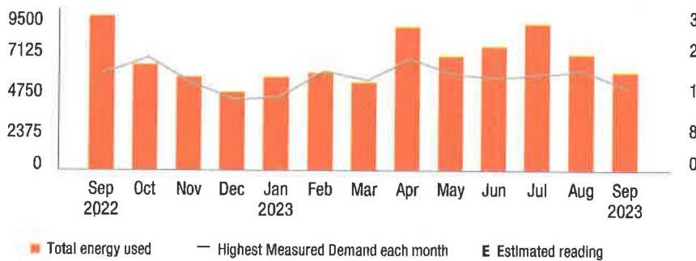

The image is a bar and line chart showing a yearly usage breakdown (monthly-based) of electricity from September 2022 to September 2023. 

- **Chart Type**: Bar and line chart
- **X-Axis**: Months from "Sep 2022" to "Sep 2023"
- **Y-Axis (Left)**: Energy usage in kWh, ranging from 0 to 9500
- **Y-Axis (Right)**: Not explicitly labeled but corresponds to the line graph
- **Legend**:
  - Orange bars represent "Total energy used"
  - A thin line represents "Highest Measured Demand each month"
  - "E" indicates "Estimated reading"
- **Data Points**: 
  - Each month has an orange bar indicating the total energy used.
  - A line runs across the chart indicating the highest measured demand each month.
- **Styling**: 
  - The bars are orange.
  - The line is a thin, possibly gray line.
  - The chart includes estimated readings marked with "E".

Visit MyAccount for more details regarding your energy usage.

## MEASURED DEMAND

Demand kW
15.60

Measured Demand is the maximum use of electricity at any time during a monthly time period, as measured by your meter.

## BILLED DEMAND

Annual Demand kW
15.60

Summer Demand kW
15.60

## SUPPLY CAPACITY

Generation kW
17.092

Transmission kW
15.438

Supply capacity is required to serve the system's annual peak usage. It represents your share of these facilities, in kilowatts (kW). It is calculated based on your peak usage from the previous summer. Supply capacity values are updated periodically throughout the year and are prorated based on your service period.

## Price to compare

If you want to consider getting your electric supply from another supplier, compare their price with ours. This month, your cost for energy supply is $\$ 622.01$. This price to compare varies month to month, depending on your usage.

Your PoD ID is: PE000011449247358492 Your PoD ID is your Point of Delivery identification within PSE\&G's system. You will need this number if you are considering enrolling with another supplier.

The image is a photo or illustration of a blank white page. There is no visible content or text on the page, except for a small text in the top right corner: "la.jpeg | 106010.jpg:publi.202302221117 sr=137070-000040838".

## PSEGG

We make things work for you.

## Your energy bill

## (1) Message Center

This bill reflects a BPU-approved change in the Supply portion of your electric bill effective on and after September 1, 2023. The increase in the Supply portion of your bill is due to a change in the Transmission rate. The overall impact for business customers will vary by individual customer usage. Tariff information may also be found by visiting pseg.com.

The success of your business is important to us. We are working hard to make it easier to do business with us. To learn more about how we can help, visit pseg.com/Business.
J.D. Power named PSE\&G \#1 in customer satisfaction for both Residential Electric and Natural Gas Service in the East among Large Utilities. On behalf of the more than 12,000 PSEG employees who work hard every day, we thank you for rating us as a top utilities provider. For J.D. Power 2022 award information, visit jdpower.com/awards.

NEXT METER READING October 20, 2023

## How to contact us

## 1-855-BIZ-PSEG (249-7734)

Customer Service: 8am to 5:30pm Mon to Fri,
Closed on weekends and holidays
Emergencies / Outages / WorryFree Services: 24/7
TTY for the hearing impaired: 1-800-225-0072
Visit pseg.com/myaccount to access your account anytime
Text us. Register for MyAlerts by texting REG to 4PSEG(47734)
$>$ Text OUT to report an outage.
facebook.com/pseg
twitter.com/psegdeilvers

## PSEGG

We make things work for you.

## PAY YOUR WAY, 24/7

We offer a variety of methods that make it easy to pay your bill. See reverse side for more information.

By checking this box, I authorize PSE\&G to enroll me in paperless billing at this email address:

000497000000065

HOTEL WOODBRIDGE LLC
120 WOOD AVE S
ISELIN NJ 08830-2736

## $59,365.10$

You do not need to make a payment.
With automatic bill payment, we'll debit your bank account on Oct 10, 2023

Bill date: September 25, 2023
For the period: August 23, 2023 to September 21, 2023

## - HOTEL WOODBRIDGE LLC

ACCOUNT NUMBER
4233450606

## SERVICE ADDRESS

S WOOD AVE METER 1 WOODBRIDGE TWP NJ 08830

## Your billing summary

Balance remaining from your last bill
PSE\&G balance from last bill
\$9,605.20
Lase: Payment received September 8, 2023 - thank you! - $\$ 9,605.20$
Balance remaining from your last bill
\$0.00

This month's charges and credits
Electric charges - PSE\&G for 1 meter
This month's charges and credits
Total amount we'll debit your
account on Oct 10, 2023
\$9,365.10
\$9,365.10
Page 1 of 4

Account number
Automatic bill payment - do not pay

Amount enclosed

000497000000065

HOTEL WOODBRIDGE LLC
120 WOOD AVE S
ISELIN NJ 08830-2736

## (1) Message Center (Continued from page 1)

Si desea recibir en español una notificación de desconexión del servicio, llame al 1-800-357-2262.

Stay connected during hurricane season! Sign up for My Alerts to report power outages via text message, as well as receive outage updates by text and email. For more information, visit pseg.com/myalerts.

PSE\&G is installing smart meters that will provide electric customers with a number of benefits. These include more detailed electric-use information, near real-time power outage detection, and the elimination of almost all estimated electric bills. To learn more, visit pseg.com/smartmeters.

If you've ever misplaced your bill or had a due date slip your mind, it's time to sign up for Paperless Billing! Instead of receiving a paper bill each month, you'll get a monthly email showing your bill amount and due date, with the ability to view/print your current and past bills 24/7. To sign up, log in to My Account at pseg.com, and select "Paperless Billing."

At PSE\&G, we are committed to supporting your business needs. That's why we created a dedicated, bill-free phone number to address your energy questions and concerns. PSE\&G's Business Solutions Center is available Monday-Friday, 7:00 a.m. 5:30 p.m. at 1-855-249-7734 (1-855-8IZ-PSEG).

## Don't miss your meter reading

If you'll be away on your meter reading day, use our mobile app to upload a picture of your meter or enter your reading manually, or call 1-800-622-0197.

## Electric \& Gas Rate Information

For news about PSE\&G's rate filing and upcoming public hearings visit www.pseg.com/pseandgfilings. Under applicable tax law, the State Sales and Use Tax and corporate business tax are imposed upon the energy you have used.

## IT'S YOUR BILL. HOW YOU PAY IS YOUR CHOICE.

## My Account

Make a payment anytime from a checking or savings account stored in My Account Visit pseg.com/ myaccount

Mobile: Download our Mobile App "PSE\&G"

Pay by text: Text PAY to 4PSEG (47734)

Voice: Ask Alissa or use Google Assistant.

## Automatic BillPay

Automatic payments from your bank. Skip checks and stamps. Never every about due dates.

## Enroll at:

pseg.com/autopay

## Credit Card

Pay your bill with a credit card online or by phone. Because we don't use customer rates to subsidize the cost of this service, there is a fee.

## My Account:

pseg.com/myaccount

## Phone:

1-800-553-7734

## In Person

Payments are accepted at any customer service center or authorized location.

Locations can be found at:
pseg.com/csc

| Details of your electric charges |  |
| :--: | :--: |
| Your rate: Large Power \& Lighting Secondary (LPLS) |  |
| Meter \# 9212220 | Usage |
| Reading Sep 21, 2023 |  |
| On-Peak Actual | 36520 |
| Reading Aug 23, 2023 |  |
| Less On-Peak Actual | 36210 |
| Multiplier | 200 |
| Total On kWh | 29,487 |
| Total Off kWh | 32,457 |
| Total kWh | 61,944 |

## Delivery charges

| Monthly service charge | $\$ 370.81$ |
| :--: | :--: |
| Charges for delivering electric to you: |  |
| Annual Demand | 138,800 kW $\times \$ 4,943156$ |
| The highest Measured Demand in any time period in the current month. |  |
| Summer Demand 135,500 kW $\times \$ 9,149742$ | $\$ 1,239.79$ |
| The Measured Demand (excluding off-peak) in each billing month of June through September. |  |
| kWh - On-peak 29,487 kWh $\times \$ 0.008613$ | $\$ 253.97$ |
| Energy consumed between 8am-10pm, Monday to Friday. |  |
| kWh - Off-peak 32,457 kWh $\times \$ 0.008613$ | $\$ 279.55$ |
| Energy consumed outside peak hours. |  |
| Societal Benefits 61,944 kWh $\times \$ 0.010413$ | $\$ 645.02$ |
| This charge recovers the cost of government mandated programs designed to achieve public policy goals, such as energy conservation. |  |
| Total electric delivery charges | $\$ 3,475.25$ |
| Supply charges |  |
| BGS Capacity |  |
| Generation 126.025 kW $\times \$ 1,740924$ | $\$ 219.40$ |
| Transmission 116.274 kW $\times \$ 13,293600$ | $\$ 1,545.70$ |
| Cost of electric supplied by PSE\&G: |  |
| On-peak |  |
| For the first | 8,817 kWh $\times \$ 0.081651$ |
| For the next | 20,670 kWh $\times \$ 0.072966$ |
| Off-peak |  |
| For the first | 9,398 kWh $\times \$ 0.064605$ |
| For the next | 23,059 kWh $\times \$ 0.055920$ |

## MEASURED DEMAND

| On-Peak kW | 135.50 |
| :-- | --: |
| Off-Peak2 kW | 138.80 |

Measured Demand is the maximum use of electricity at any time during a monthly time period, as measured by your meter.

## BILLED DEMAND

| Annual Demand kW | 138.80 |
| :-- | --: |
| Summer Demand kW | 135.50 |

## SUPPLY CAPACITY

| Generation kW | 126.025 |
| :-- | --: |
| Transmission kW | 116.274 |

Supply capacity is required to serve the system's annual peak usage. It represents your share of these facilities, in kilowatts (kW). It is calculated based on your peak usage from the previous summer. Supply capacity values are updated periodically throughout the year and are prorated based on your service period.

## Price to compare

If you want to consider getting your electric supply from another supplier, compare their price with ours. This month, your cost for energy supply is $\$ 5,889.85$. This price to compare varies month to month, depending on your usage.

Your PoO ID is: PE000008770092858492 -
Your PoO ID is your Point of Delivery identification within PSE\&G's system. You will need this number if you are considering enrolling with another supplier.

Your monthly electric use
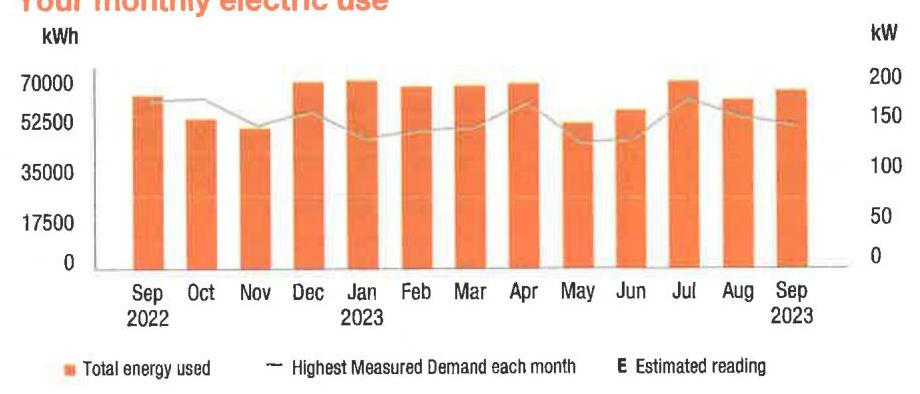

The image is a bar chart with a line graph overlay, showing a **yearly usage breakdown (monthly-based)** of electric use from September 2022 to September 2023. 

- **X-axis:** Displays months from "Sep 2022" to "Sep 2023."
- **Y-axis (left):** Labeled "kWh" with values ranging from 0 to 70,000.
- **Y-axis (right):** Labeled "kW" with values ranging from 0 to 200.
- **Legend:**
  - Orange bars represent "Total energy used."
  - A gray line represents "Highest Measured Demand each month."
  - "E" indicates "Estimated reading."

The chart shows orange bars for each month, with a gray line indicating the highest demand. The bars are consistent in height, suggesting steady energy use, with some variations. The estimated readings are marked with an "E."

Visit MyAccount for more details regarding your energy usage.

## (1) PSEG

We make things work for you.

## Your energy bill

## (1) Message Center

This bill reflects a BPU-approved change in the Supply portion of your electric bill effective on and after September 1, 2023. The increase in the Supply portion of your bill is due to a change in the Transmission rate. The overall impact for business customers will vary by individual customer usage. Tariff information may also be found by visiting pseg.com.

The success of your business is important to us. We are working hard to make it easier to do business with us. To learn more about how we can help, visit pseg.com/Business.
J.D. Power named PSE\&G \#1 in customer satisfaction for both Residential Electric and Natural Gas Service in the East among Large Utilities. On behalf of the more than 12,000 PSEG employees who work hard every day, we thank you for rating us as a top utilities provider. For J.D. Power 2022 award information, visit jdpower.com/awards.

## NEXT METER READING October 20, 2023

## How to contact us

## 1-855-BIZ-PSEG (249-7734)

Customer Service: 8am to 5:30pm Mon to Fri,
Closed on weekends and holidays
Emergencies / Outages / WorryFree Services: 24/7
TTY for the hearing impaired: 1-800-225-0072
Visit pseg.com/myaccount to access your account anytime
Text us. Register for MyAlerts by texting REG to 4PSEG(47734)
$>$ Text OUT to report an outage.
facebook.com/pseg
twitter.com/psegdeilvers

## PSEGG

We make things work for you.

## PAY YOUR WAY, 24/7

We offer a variety of methods that make it easy to pay your bill. See reverse side for more information.

By checking this box, I authorize PSE\&G to enroll me in paperless billing at this email address:

000499000000064

HOTEL WOODBRIDGE LLC
HOTEL WOODBRIDGE LLC /
120 WOOD AVE S
ISELIN NJ 08830-2736

## $14,643.11$

You do not need to make a payment.
With automatic bill payment, we'll debit your bank account on Oct 10, 2023

Bill date: September 25, 2023
For the period: August 23, 2023 to September 21, 2023

## - HOTEL WOODBRIDGE LLC   HOTEL WOODBRIDGE LLC /

## ACCOUNT NUMBER

4233251107

## SERVICE ADDRESS

S WOOD AVE METER 2 WOODBRIDGE TWP NJ 08830

## Your billing summary

Balance remaining from your last bill
PSE\&G balance from last bill
\$15,446.85
Less: Payment received September 8, 2023 - thank you!
\$15,446.85
Balance remaining from your last bill
This month's charges and credits
Electric charges : PSE\&G for 1 meter
This month's charges and credits
Total amount we'll debit your
\$14,643.11
account on Oct 10, 2023

Account number
Automatic bill payment - do not pay

Amount enclosed

000499000000064

HOTEL WOODBRIDGE LLC
HOTEL WOODBRIDGE LLC /
120 WOOD AVE S
ISELIN NJ 08830-2736

## (1) Message Center (Continued from page 1)

Si desea recibir en español una notificación de desconexión del servicio, llame al 1-800-357-2262.

Stay connected during hurricane season! Sign up for My Alerts to report power outages via text message, as well as receive outage updates by text and email. For more information, visit pseg.com/myalerts.

PSE\&G is installing smart meters that will provide electric customers with a number of benefits. These include more detailed electric-use information, near real-time power outage detection, and the elimination of almost all estimated electric bills. To learn more, visit pseg.com/smartmeters.

If you've ever misplaced your bill or had a due date slip your mind, it's time to sign up for Paperless Billing! Instead of receiving a paper bill each month, you'll get a monthly email showing your bill amount and due date, with the ability to view/print your current and past bills 24/7. To sign up, log in to My Account at pseg.com, and select "Paperless Billing."

At PSE\&G, we are committed to supporting your business needs. That's why we created a dedicated, toll-free phone number to address your energy questions and concerns. PSE\&G's Business Solutions Center is available Monday-Friday, 7:00 a.m. 5:30 p.m. at 1-855-249-7734 (1-855-BIZ-PSEG).

## Don't miss your meter reading

If you'll be away on your meter reading day, use our mobile app to upload a picture of your meter or enter your reading manually, or call 1-800-622-0197.

## Electric \& Gas Rate Information

For news about PSE\&G's rate filing and upcoming public hearings visit www.pseg.com/pseandgfilings. Under applicable tax law, the State Sales and Use Tax and corporate business tax are imposed upon the energy you have used.

## IT'S YOUR BILL. HOW YOU PAY IS YOUR CHOICE.

## My Account

Make a payment anytime from a checking or savings account stored in My Account Visit pseg.com/ myaccount

Mobile: Download our Mobile App "PSE\&G"

Pay by text: Text PAY to 4PSEG (47734)

Voice: Ask Alexa or use Google Assistant.

## Automatic BillPay

Automatic payments from your bank. Skip checks and stamps. Never worry about due dates.

## Enroll at:

pseg.com/autopay

## Credit Card

Pay your bill with a credit card online or by phone. Because we don't use customer rates to subsidize the cost of this service, there is a fee.

## My Account:

pseg.com/myaccount

## Phone:

1-803-277-8710

## $\Rightarrow$ Phone

Bank Account: 1-800-553-7734

## Credit Card:

1-833-277-8710

## $=$ By Mail

Make your check payable to PSE\&G and write your account number on your check.

When you pay by check, you authorize PSE\&G to make a one-time electronic fund transfer from your account, in the amount of your check. If you prefer not to authorize us, call 1-800-436-PSEG.

## In Person

Payments are accepted at any customer service center or authorized location.

Locations can be found at:
pseg.com/csc

Details of your electric charges
Your rate: Large Power \& Lighting Secondary (LPLS)

| Meter \# 9207467 | Usage |
| :--: | :--: |
| Reading Sep 21, 2023 |  |
| On-Peak Actual | 58349 |
| Reading Aug 23, 2023 |  |
| Lest On-Peak Actual | 57892 |
| Multiplier | 200 |
| Total On kWh | 42,531 |
| Total Off kWh | 48,855 |
| Total kWh | 91,386 |

## Delivery charges

| Monthly service charge | $\$ 370.81$ |
| :--: | :--: |
| Charges for delivering electric to you: |  |
| Annual Demand | 228,100 kW $\times \$ 4.943183$ |
| The highest Measured Demand in any time period in the current month. | \$1,127.54 |
| Summer Demand   The Measured Demand (excluding off-peak) in each billing month of June through September. | 228,100 kW $\times \$ 9.149671$ |
| kWh - On-peak | 42,531 kWh $\times \$ 0.008613$ |
| Energy consumed between 8am-10pm, Monday to Friday. |  |
| kWh - Off-peak | 48,855 kWh $\times \$ 0.008613$ |
| Energy consumed outside peak hours. |  |
| Societal Benefits | 91,386 kWh $\times \$ 0.010413$ |
| This charge recovers the cost of government mandated programs designed to achieve public policy goals, such as energy conservation. |  |
| Total electric delivery charges | $\$ 5,324.10$ |
| Supply charges |  |
| BGS Capacity |  |
| Generation | 239,095 kW $\times \$ 1.740898$ |
| Transmission | 213,069 kW $\times \$ 13.293581$ |
| Cost of electric supplied by PSE\&G: |  |
| On-peak |  |
| For the first | 12,675 kWh $\times \$ 0.081651$ |
| For the next | 29,856 kWh $\times \$ 0.072966$ |
| Off-peak |  |
| For the first | 14,387 kWh $\times \$ 0.064605$ |
| For the next | 34,468 kWh $\times \$ 0.055920$ |
| Total electric supply charges | $\$ 9,319.01$ |

## MEASURED DEMAND

| On-Peak kW | 228.10 |
| :-- | --: |
| Off-Peak2 kW | 183.10 |

Measured Demand is the maximum use of electricity at any time during a monthly time period, as measured by your meter.

## BILLED DEMAND

| Annual Demand kW | 228.10 |
| :-- | --: |
| Summer Demand kW | 228.10 |

## SUPPLY CAPACITY

| Generation kW | 239,095 |
| :-- | --: |
| Transmission kW | 213,069 |

Supply capacity is required to serve the system's annual peak usage. It represents your share of these facilities, in kilowatts (kW). It is calculated based on your peak usage from the previous summer. Supply capacity values are updated periodically throughout the year and are prorated based on your service period.

## Price to compare

If you want to consider getting your electric supply from another supplier, compare their price with ours. This month, your cost for energy supply is $\$ 9,319.01$. This price to compare varies month to month, depending on your usage.

Your PoD ID is: PE000009743170458492 Your PoD ID is your Point of Delivery identification within PSE\&G's system. You will need this number if you are considering enrolling with another supplier.

Your monthly electric use
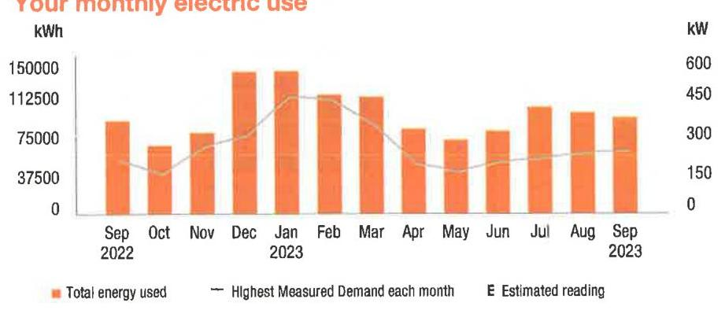

The image is a bar and line chart showing a **yearly usage breakdown (monthly-based)** of electricity usage from September 2022 to September 2023.

- **X-axis**: Months from "Sep 2022" to "Sep 2023".
- **Left Y-axis**: "kWh" ranging from 0 to 150,000.
- **Right Y-axis**: "kW" ranging from 0 to 600.

**Legend**:
- Orange bars represent "Total energy used".
- A gray line represents "Highest Measured Demand each month".
- "E" indicates "Estimated reading".

The chart shows monthly variations in energy usage, with notable peaks in December 2022 and July 2023. The highest measured demand line fluctuates across the months, with a peak in December 2022.

Visit MyAccount for more details regarding your energy usage.

## Your energy bill

## Message Center

This bill reflects a BPU-approved change in the Supply portion of your electric bill effective on and after September 1, 2023. The increase in the Supply portion of your bill is due to a change in the Transmission rate. The overall impact for business customers will vary by individual customer usage. Tariff information may also be found by visiting pseg.com.

The success of your business is important to us. We are working hard to make it easier to do business with us. To learn more about how we can help, visit pseg.com/Business.
J.D. Power named PSE\&G \#1 in customer satisfaction for both Residential Electric and Natural Gas Service in the East among Large Utilities. On behalf of the more than 12,000 PSEG employees who work hard every day, we thank you for rating us as a top utilities provider. For J.D. Power 2022 award information, visit jdpower.com/awards.

NEXT METER READING October 20, 2023

## How to contact us

## 1-855-BIZ-PSEG (249-7734)

Customer Service: 8am to 5:30pm Mon to Fri,
Closed on weekends and holidays
Emergencies / Outages / WorryFree Services: 24/7
TTY for the hearing impaired: 1-800-225-0072
Visit pseg.com/myaccount to access your account anytime
Text us. Register for MyAlerts by texting REG to 4PSEG(47734)
$>$ Text OUT to report an outage.
facebook.com/pseg
twitter.com/psegdelivers

## PSEG

We make things work for you.

## PAY YOUR WAY, 24/7

We offer a variety of methods that make it easy to pay your bill. See reverse side for more information.

By checking this box, i authority PSE\&G to enroll me in paperless billing at this email address:

068538000040836
$\left[\mu \mu_{1}^{\prime} \mid \mu_{1}^{\prime} \mu^{\prime} \mu^{\prime} \mu_{1}^{\prime} \mu_{1}^{\prime} \mu_{1}^{\prime} \mu_{1}^{\prime} \mu_{1}^{\prime} \mu_{1}^{\prime} \mu_{1}^{\prime} \mu_{1}^{\prime} \mu^{\prime} \mu_{1}^{\prime} \mu^{\prime} \mu^{\prime} \mu^{\prime} \mu^{\prime} \mu^{\prime} \mu^{\prime} \mu^{\prime} \mu^{\prime} \mu^{\prime} \mu^{\prime} \mu^{\prime} \mu^{\prime}$
HOTEL WOODBRIDGE LLC

ACCOUNT NUMBER
7208229406

## SERVICE ADDRESS

120 WOOD AVE 5 BLDG WOODBRIDGE TWP NJ 08830-2711

## Your billing summary

Balance remaining from your last bill
PSE\&G balance from last bill
\$7,396.10
\$7,396.10
Balance remaining from your last bill
\$0.00

This month's charges and credits
Electric charges - PSE\&G
This month's charges and credits
Total amount we'll debit your
\$7,270.28
account on Oct 10, 2023

Account number
7208229406
Automatic bill payment - do not pay

Amount enclosed

By checking this box, i authority PSE\&G to enroll me in paperless billing at
this email address:

## Message Center (Continued from page 1)

Si desea recibir en español una notificación de desconexión del servicio, llame al 1-800-357-2282.

Stay connected during hurricane season! Sign up for My Alerts to report power outages via text message, as well as receive outage updates by text and email. For more information, visit pseg.com/myalerts.

PSE\&G is installing smart meters that will provide electric customers with a number of benefits. These include more detailed electric-use information, near real-time power outage detection, and the elimination of almost all estimated electric bills. To learn more, visit pseg.com/smartmeters.

If you've ever misplaced your bill or had a due date slip your mind, it's time to sign up for Paperless Billing! Instead of receiving a paper bill each month, you'll get a monthly email showing your bill amount and due date, with the ability to view/print your current and past bills 24/7. To sign up, log in to My Account at pseg.com, and select "Paperless Billing."

At PSE\&G, we are committed to supporting your business needs. That's why we created a dedicated, toll-free phone number to address your energy questions and concerns. PSE\&G's Business Solutions Center is available Monday-Friday, 7:00 a.m. -5:30 p.m. at 1-855-249-7734 (1-855-BIZ-PSEG).

## Don't miss your meter reading

If you'll be away on your meter reading day, use our mobile app to upload a picture of your meter or enter your reading manually, or call 1-800-622-0197.

## Electric \& Gas Rate Information

For news about PSE\&G's rate filing and upcoming public hearings visit www.pseg.com/pseandgfilings. Under applicable tax law, the State Sales and Use Tax and corporate business tax are imposed upon the energy you have used.

# IT'S YOUR BILL. HOW YOU PAY IS YOUR CHOICE. 

## My Account

Make a payment anytime from a checking or savings account stored in My Account. Visit pseg.com/ myaccount

Mobile: Download our Mobile App "PSE\&G"

Pay by text: Text PAY to -6PSEG (47734)

Voice: Ank Alexa or use Google Assistant.

## Automatic BillPay

Automatic payments from your bank. Skip checks and stamps. Never worry about this dates.

Enroll at:
pseg.com/autopay

## Credit Card

Pay your bill with a credit card online or by phone. Because we don't use customer rates to subsidize the cost of this service, there is a fee.

## My Account:

pseg.com/myaccount

Phone:
1-803-277-8710

## Phone

Bank Account: 1-800-553-7734

Credit Card:
1-803-277-8710

## $>$ My Mail

Make your check payable to PSE\&G and write your account number on your check.

When you pay by check, you authorize PSE\&G to make a one-time electronic fund transfer from your account, in the amount of your check. If you prefer not to authorize us, call 1-800-436-PSEG.

## In Person

Payments are accepted at any customer service center or authorized location.

Locations can be found at:
pseg.com/csc

Details of your electric charges Your rate: General Lighting \& Power (GLP)

| Meter \# 309013632 | Usage |
| :--: | :--: |
| Actual reading Sep 21, 2023 | 4852 |
| Less | 4156 |
| Difference | 696 |
| Meter multiplier | 80 |
| Total kWh | 55,680 |

## Delivery charges

Monthly service charge
$\$ 5.04$
Charges for delivering electric to you:
Annual Demand
$86.400 \mathrm{~kW} \times \$ 5.302894$
The highest Measured Demand in any time period in the current month.
Summer Demand
$86.400 \mathrm{~kW} \times \$ 10.037847$
The Measured Demand (excluding off-peak) in each billing month of June through September.
kWh charges
$55,680 \mathrm{kWh} \times \$ 0.011147$
$\$ 620.66$
Societal Benefits
$55,680 \mathrm{kWh} \times \$ 0.010413$
This charge recovers the cost of government mandated programs designed to achieve public policy goals, such as energy conservation.
Total electric delivery charges
$\$ 2,530.94$
Supply charges
BGS Capacity
Generation
Transmission
$73.656 \mathrm{~kW} \times \$ 1.740931$
$73.656 \mathrm{~kW} \times \$ 1.740931$
\$128.23
Cost of electric supplied by PSE\&G:
Charges
For the first
For the next
Total electric supply charges
$\$ 1,218.85$
$\$ 2,520.54$
$\$ 4,739.34$
Total electric charges
$\$ 7,270.28$

Your monthly electric use
kWh
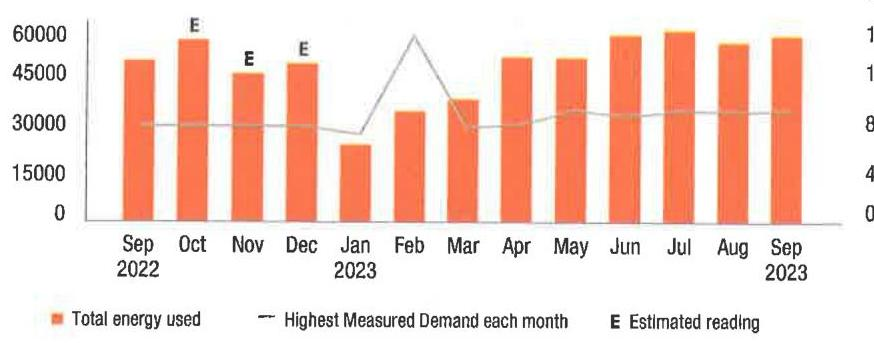

The image is a bar and line chart.

- **Chart Type**: Combination of bar and line chart.
- **X-Axis**: Months from September 2022 to September 2023.
- **Y-Axis (Left)**: Total energy used (kWh), ranging from 0 to 60000.
- **Y-Axis (Right)**: Highest Measured Demand each month (kW), ranging from 0 to 100.
- **Legend Entries**:
  - Orange bars represent "Total energy used."
  - A gray line represents "Highest Measured Demand each month."
  - "E" indicates "Estimated reading."
- **Data Points**:
  - **Total Energy Used**: Bars show varying heights, with notable peaks in October 2022, July 2023, and September 2023.
  - **Estimated Readings**: Marked with "E" in October, November, and December 2022.
  - **Highest Measured Demand**: The line peaks significantly in February 2023.
- **Yearly Usage Breakdown (Monthly-Based)**: The chart provides a monthly breakdown of energy usage and demand over a year.

The chart visually compares the total energy used each month with the highest measured demand, highlighting estimated readings.

Visit MyAccount for more details regarding your energy usage.

## MEASURED DEMAND

Demand kW
86.40

Measured Demand is the maximum use of electricity at any time during a monthly time period, as measured by your meter.

## BILLED DEMAND

Annual Demand kW
86.40

Summer Demand kW
86.40

## SUPPLY CAPACITY

Generation kW
73.656

Transmission kW
65.574

Supply capacity is required to serve the system's annual peak usage. It represents your share of these facilities, in kilowatts (kW). It is calculated based on your peak usage from the previous summer. Supply capacity values are updated periodically throughout the year and are prorated based on your service period.

## Price to compare

If you want to consider getting your electric supply from another supplier, compare their price with ours. This month, your cost for energy supply is $\$ 4,739.34$. This price to compare varies month to month, depending on your usage.

Your PoD ID is: PE000009012751558492 Your PoD ID is your Point of Delivery identification within PSE\&G's system. You will need this number if you are considering enrolling with another supplier.

la pnqnqj |10\&fid31.1pwqh8l.202309222117.zoo-137078-000040836

## Your energy bill

## Message Center

This bill reflects a BPU-approved change in the Supply portion of your electric bill effective on and after September 1, 2023. The increase in the Supply portion of your bill is due to a change in the Transmission rate. The overall impact for business customers will vary by individual customer usage. Tariff information may also be found by visiting pseg.com.

The success of your business is important to us. We are working hard to make it easier to do business with us. To learn more about how we can help, visit pseg.com/Business.
J.D. Power named PSE\&G \#1 in customer satisfaction for both Residential Electric and Natural Gas Service in the East among Large Utilities. On behalf of the more than 12,000 PSEG employees who work hard every day, we thank you for rating us as a top utilities provider. For J.D. Power 2022 award information, visit jdpower.com/awards.

## NEXT METER READING October 20, 2023

## How to contact us

## 1-855-8IZ-PSEG (249-7734)

Customer Service: 8am to 5:30pm Mon to Fri,
Closed on weekends and holidays
Emergencies / Outages / WorryFree Services: 24/7
TTY for the hearing impaired: 1-800-225-0072
Visit pseg.com/myaccount to access your account anytime
Text us. Register for MyAlerts by texting REG to 4PSEG(47734)
$>$ Text OUT to report an outage.
facebook.com/pseg
twitter.com/psegdeilvers

## PAY YOUR WAY, 24/7

We offer a variety of methods that make it easy to pay your bill. See reverse side for more information.

By checking this box, I authorize PSE\&G to enroll me in paperiess billing at this email address:

068542000040834
I|p|o|h|jp|jh|jp|jh|jp|jh|jp|jh|jp|jh|jp|jp|jh|jp|jh|jp|jh|jp|jh|jp|jh|jp|jh|jp|jh|jp|jh|jp|jh|jp|jh|jp|jh|jp|jh|jp|jh|jp|jh|jp|jh|jp|jh|jp|jh|jp|jh|jp|jh|jp|jh|jp|jh|jp|jh|jp|jh|jp|jh|jp|jh|jp|jh|jp|jh|jp|jh|jp|jh|jp|jh|jp|jh|jp|jh|jp|jh|jp|
PSE\&G CO
PO BOX 14444
NEW BRUNSWICK NJ 08906-4444

## (1) Message Center (Continued from page 1)

Si desea recibir en español una notificación de desconexión del servicio, llame al 1-800-357-2262.

Stay connected during hurricane season! Sign up for My Alerts to report power outages via text message, as well as receive outage updates by text and email. For more information, visit pseg.com/myalerts.

PSE\&G is installing smart meters that will provide electric customers with a number of benefits. These include more detailed electric-use information, near real-time power outage detection, and the elimination of almost all estimated electric bills. To learn more, visit pseg.com/smartmeters.

If you've ever misplaced your bill or had a due date slip your mind, it's time to sign up for Paperless Billing! Instead of receiving a paper bill each month, you'll get a monthly email showing your bill amount and due date, with the ability to view/print your current and past bills 24/7. To sign up, log in to My Account at pseg.com, and select "Paperless Billing."

At PSE\&G, we are committed to supporting your business needs. That's why we created a dedicated, toll-free phone number to address your energy questions and concerns. PSE\&G's Business Solutions Center is available Monday-Friday, 7:00 a.m. -5:30 p.m. at 1-855-249-7734 (1-855-BIZ-PSEG).

## Don't miss your meter reading

If you'll be away on your meter reading day, use our mobile app to upload a picture of your meter or enter your reading manually, or call 1-800-622-0197.

## Electric \& Gas Rate Information

For news about PSE\&G's rate filing and upcoming public hearings visit www.pseg.com/pseandgfilings. Under applicable tax law, the State Sales and Use Tax and corporate business tax are imposed upon the energy you have used.

# IT'S YOUR BILL. HOW YOU PAY IS YOUR CHOICE. 

My Account
Make a payment anytime from a checking or savings account stored in My Account Visit pseg.com/ myaccount

Mobile: Download our Mobile App "PSE\&G"

Pay by text: Text PAY to 4PSEG (47734)

Voice: Ask Alexa or use Google Assistant

## Automatic BillPay

Automatic payments from your bank. Skip checks and stamps. Never worry about duo dates.

Enroll at:
pseg.com/autopay

Credit Card
Pay your bill with a credit card online or by phone. Because we don't use customer rates to subsidize the cost of this service, there is a fee.

My Account:
pseg.com/myaccount
Phone:
1-833-277-8710

## Phone

Bank Account:
1-800-553-7734
Credit Card:
1-833-277-8710

## $>$ My

By Mail
Make your check payable to PSE\&G and seize your account number on your check.

When you pay by check, you authorize PSE\&G to make a one-time electronic fund transfer from your account, in the amount of your check. If you prefer not to authorize us, call 1-800-436-PSEG.

## In Person

Payments are accepted at any customer service center or authorized location

Locations can be found at:
pseg.com/csc

Details of your electric charges
Your rate: General Lighting \& Power (GLP)

| Meter \# 316021243 | Usage |
| :--: | :--: |
| Actual reading Sep 21, 2023 | 61572 |
| Less Actual reading Aug 22, 2023 | 53648 |
| Total electric you used in 30 days | 7,924 kWh |

## Delivery charges

| Monthly service charge | $\$ 5.04$ |
| :--: | :--: |
| Charges for delivering electric to you: |  |
| Annual Demand | 28,000 kW x \$5.302857 |
| The highest Measured Demand in any time period in the current month. | \$148.48 |
| Summer Demand 28,000 kW x \$10.037857 | \$281.06 |
| The Measured Demand (excluding off-peak) in each billing month of June through September. |  |
| kWh charges | 7,924 kWh x \$0.011147 |
| Societal Benefits | 7,924 kWh x \$0.010413 |
| This charge recovers the cost of government mandated programs designed to achieve public policy goals, such as energy conservation. | \$88.33 |
| Total electric delivery charges | $\$ 605.42$ |
| Supply charges |  |
| BGS Capacity |  |
| Generation 13,658 kW x \$1.741104 | \$23.78 |
| Transmission 12,337 kW x \$13.294156 | \$164.01 |
| Cost of electric supplied by PSE\&G: |  |
| Charges |  |
| For the first 2,377 kWh x \$0.073248 | \$174.11 |
| For the next 5,547 kWh x \$0.064563 | \$358.13 |
| Total electric supply charges | \$720.03 |
| Total electric charges | \$1,325.45 |

## Your monthly electric use

kWh
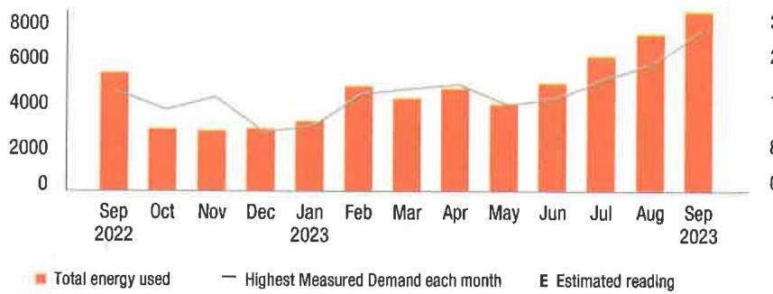

The image is a bar and line chart.

- **Chart Type**: Bar and line chart
- **Axes**:
  - Y-axis: 0 to 8000
  - X-axis: Monthly from Sep 2022 to Sep 2023
- **Legend Entries**:
  - Orange bars: Total energy used
  - Grey line: Highest Measured Demand each month
  - "E" symbol: Estimated reading
- **Data Points**:
  - Bars represent energy usage for each month, with a noticeable increase in usage in August and September 2023.
  - The line indicates the highest measured demand each month, with a general upward trend.
- **Styling**:
  - Orange bars for energy usage
  - Grey line for demand
  - The chart shows a yearly usage breakdown (monthly-based).

Visit MyAccount for more details regarding your energy usage.

## MEASURED DEMAND

Demand kW
28.00

Measured Demand is the maximum use of electricity at any time during a monthly time period, as measured by your meter.

## BILLED DEMAND

Annual Demand kW
28.00

Summer Demand kW
28.00

## SUPPLY CAPACITY

Generation kW
13.658

Transmission kW
12.337

Supply capacity is required to serve the system's annual peak usage. It represents your share of these facilities, in kilowatts (kW). It is calculated based on your peak usage from the previous summer. Supply capacity values are updated periodically throughout the year and are prorated based on your service period.

## Price to compare

If you want to consider getting your electric supply from another supplier, compare their price with ours. This month, your cost for energy supply is $\$ 720.03$. This price to compare varies month to month, depending on your usage.

Your PoD ID is: PE000009255797458492 -
Your PoD ID is your Point of Delivery identification within PSE\&G's system. You will need this number if you are considering enrolling with another supplier.

la.promp.(1014in01.1.angb61.202309222:117.000137088-000040834

## Your energy bill

## Message Center

This bill reflects a BPU-approved change in the Supply portion of your electric bill effective on and after September 1, 2023. The increase in the Supply portion of your bill is due to a change in the Transmission rate. The overall impact for business customers will vary by individual customer usage. Tariff information may also be found by visiting pseg.com.

The success of your business is important to us. We are working hard to make it easier to do business with us. To learn more about how we can help, visit pseg.com/Business.
J.D. Power named PSE\&G \#1 in customer satisfaction for both Residential Electric and Natural Gas Service in the East among Large Utilities. On behalf of the more than 12,000 PSEG employees who work hard every day, we thank you for rating us as a top utilities provider. For J.D. Power 2022 award information, visit jdpower.com/awards.

NEXT METER READING October 20, 2023

## How to contact us

## 1-855-BIZ-PSEG (249-7734)

Customer Service: 8am to 5:30pm Mon to Fri,
Closed on weekends and holidays
Emergencies / Outages / WorryFree Services: 24/7
TTY for the hearing impaired: 1-800-225-0072
Visit pseg.com/myaccount to access your account anytime
Text us. Register for MyAlerts by texting REG to 4PSEG(47734)
$>$ Text OUT to report an outage.
facebook.com/pseg
twitter.com/psegdelivers

## PSEG

We make things work for you.

## PAY YOUR WAY, 24/7

We offer a variety of methods that make it easy to pay your bill. See reverse side for more information.

By checking this box, i authority PSE\&G to enroll me in paperless billing at this email address:

068544000040833
$\mathrm{If}\left[\mathrm{If}_{\mathrm{If}} \mathrm{If}_{\mathrm{If}} \mathrm{If}_{\mathrm{If}} \mathrm{If}_{\mathrm{If}} \mathrm{If}_{\mathrm{If}} \mathrm{If}_{\mathrm{If}} \mathrm{If}_{\mathrm{If}} \mathrm{If}_{\mathrm{If}} \mathrm{If}_{\mathrm{If}} \mathrm{If}_{\mathrm{If}} \mathrm{If}_{\mathrm{If}} \mathrm{If}\right.$
HOTEL WOODBRIDGE LLC
120 WOOD AVE S
ISELIN NJ 08830-2736

## Total amount due

You do not need to make a payment.
Billi automatic bill payment, we'll debit your bank account on Oct 10, 2023

Bill date: September 25, 2023
For the period: August 23, 2023 to September 21, 2023

## HOTEL WOODBRIDGE LLC

ACCOUNT NUMBER
7222363807

## SERVICE ADDRESS

120 WOOD AVE S BLOWSE WOODBRIDGE TWP NJ 08830-2711

## Your billing summary

Balance remaining from your last bill
PSE\&G balance from last bill \$485.58
Likert Payment received September 8, 2023 - thank you! - $\$ 485.58$
Balance remaining from your last bill \$0.00

This month's charges and credits
Electric charges - PSE\&G \$461.04
This month's charges and credits \$461.04
Total amount we'll debit your \$461.04 account on Oct 10, 2023

Account number
7222363807
Automatic bill payment - do not pay

## Amount enclosed

$\mathrm{If}\left[\mathrm{If}_{\mathrm{If}} \mathrm{If}_{\mathrm{If}} \mathrm{If}_{\mathrm{If}} \mathrm{If}_{\mathrm{If}} \mathrm{If}_{\mathrm{If}} \mathrm{If}_{\mathrm{If}} \mathrm{If}_{\mathrm{If}} \mathrm{If}_{\mathrm{If}} \mathrm{If}\right.$
$\mathrm{If}\left[\mathrm{If}_{\mathrm{If}} \mathrm{If}_{\mathrm{If}} \mathrm{If}_{\mathrm{If}} \mathrm{If}\right.$
$\mathrm{If}\left[\mathrm{If}_{\mathrm{If}} \mathrm{If}_{\mathrm{If}} \mathrm{If}\right.$
$\mathrm{If}\left[\mathrm{If}_{\mathrm{If}} \mathrm{If}_{\mathrm{If}} \mathrm{If}\right.$
$\mathrm{If}\left[\mathrm{If}_{\mathrm{If}} \mathrm{If}_{\mathrm{If}} \mathrm{If}\right.$
$\mathrm{If}\left[\mathrm{If}_{\mathrm{If}} \mathrm{If}_{\mathrm{If}} \mathrm{If}\right.$
$\mathrm{If}\left[\mathrm{If}_{\mathrm{If}} \mathrm{If}_{\mathrm{If}} \mathrm{If}\right.$
$\mathrm{If}\left[\mathrm{If}_{\mathrm{If}} \mathrm{If}_{\mathrm{If}} \mathrm{If}\right.$
$\mathrm{If}\left[\mathrm{If}_{\mathrm{If}} \mathrm{If}_{\mathrm{If}} \mathrm{If}\right.$
$\mathrm{If}\left[\mathrm{If}_{\mathrm{If}} \mathrm{If}_{\mathrm{If}} \mathrm{If}\right.$
$\mathrm{If}\left[\mathrm{If}_{\mathrm{If}} \mathrm{If}_{\mathrm{If}} \mathrm{If}\right.$
$\mathrm{If}\left[\mathrm{If}_{\mathrm{If}} \mathrm{If}\right.$
$\mathrm{If}\left[\mathrm{If}_{\mathrm{If}} \mathrm{If}\right.$
$\mathrm{If}\left[\mathrm{If}_{\mathrm{If}} \mathrm{If}\right.$
$\mathrm{If}\left[\mathrm{If}_{\mathrm{If}} \mathrm{If}\right.$
$\mathrm{If}\left[\mathrm{If}_{\mathrm{If}} \mathrm{If}\right.$
$\mathrm{If}\left[\mathrm{If}_{\mathrm{If}} \mathrm{If}\right.$
$\mathrm{If}\left[\mathrm{If}_{\mathrm{If}} \mathrm{If}\right.$
$\mathrm{If}\left[\mathrm{If}_{\mathrm{If}} \mathrm{If}\right.$
$\mathrm{If}\left[\mathrm{If}_{\mathrm{If}} \mathrm{If}\right.$
$\mathrm{If}\left[\mathrm{If}_{\mathrm{If}} \mathrm{If}\right.$
$\mathrm{If}\left[\mathrm{If}_{\mathrm{If}} \mathrm{If}\right.$
$\mathrm{If}\left[\mathrm{If}_{\mathrm{If}} \mathrm{If}\right.$
$\mathrm{If}\left[\mathrm{If}_{\mathrm{If}} \mathrm{If}\right.$
$\mathrm{If}\left[\mathrm{If}_{\mathrm{If}} \mathrm{If}\right.$
$\mathrm{If}\left[\mathrm{If}_{\mathrm{If}} \mathrm{If}\right.$
$\mathrm{If}\left[\mathrm{If} \mathrm{If}\right.$
$\mathrm{If}\left[\mathrm{If} \mathrm{If}\right.$
$\mathrm{If}\left[\mathrm{If} \mathrm{If}\right.$
$\mathrm{If}\left[\mathrm{If} \mathrm{If}\right.$
$\mathrm{If}\left[\mathrm{If} \mathrm{If}\right.$
$\mathrm{If}\left[\mathrm{If} \mathrm{If}\right.$
$\mathrm{If}\left[\mathrm{If} \mathrm{If}\right.$
$\mathrm{If}\left[\mathrm{If} \mathrm{If}\right.$
$\mathrm{If}\left[\mathrm{If} \mathrm{If}\right.$
$\mathrm{If}\left[\mathrm{If} \mathrm{If}\right.$
$\mathrm{If}\left[\mathrm{If} \mathrm{If}\right.$
$\mathrm{If}\left[\mathrm{If} \mathrm{If}\right.$
$\mathrm{If}\left[\mathrm{If} \mathrm{If}\right.$
$\mathrm{If}\left[\mathrm{If} \mathrm{If}\right.$
$\mathrm{If}\left[\mathrm{If} \mathrm{If}\right.$
$\mathrm{If}\left[\mathrm{If} \mathrm{If}\right.$
$\mathrm{If}\left[\mathrm{If} \mathrm{If}\right.$
$\mathrm{If}\left[\mathrm{If} \mathrm{If}\right.$
$\mathrm{If}\left[\mathrm{If} \mathrm{If}\right.$
$\mathrm{If}\left[\mathrm{If} \mathrm{If}\right.$
$\mathrm{If}\left[\mathrm{If} \mathrm{If}\right.$
$\mathrm{If}\left[\mathrm{If} \mathrm{If}\right.$
$\mathrm{If}\left[\mathrm{If} \mathrm{If}\right.$
$\mathrm{If}\left[\mathrm{If} \mathrm{If}\right.$
$\mathrm{If}\left[\mathrm{If} \mathrm{If}\right.$
$\mathrm{If}\left[\mathrm{If} \mathrm{If}\right.$
$\mathrm{If}\left[\mathrm{If} \mathrm{If}\right.$
$\mathrm{If}\left[\mathrm{If} \mathrm{If}\right.$
$\mathrm{If}\left[\mathrm{If} \mathrm{If}\right.$
$\mathrm{If}\left[\mathrm{If} \mathrm{If}\right.$
$\mathrm{If}\left[\mathrm{If} \mathrm{If}\right.$

## Message Center (Continued from page 1)

Si desea recibir en español una notificación de desconexión del servicio, llame al 1-800-357-2262.

Stay connected during hurricane season! Sign up for My Alerts to report power outages via text message, as well as receive outage updates by text and email. For more information, visit pseg.com/myalerts.

PSE\&G is installing smart meters that will provide electric customers with a number of benefits. These include more detailed electric-use information, near real-time power outage detection, and the elimination of almost all estimated electric bills. To learn more, visit pseg.com/smartmeters.

If you've ever misplaced your bill or had a due date slip your mind, it's time to sign up for Paperless Billing! Instead of receiving a paper bill each month, you'll get a monthly email showing your bill amount and due date, with the ability to view/print your current and past bills 24/7. To sign up, log in to My Account at pseg.com, and select "Paperless Billing."

At PSE\&G, we are committed to supporting your business needs. That's why we created a dedicated, toll-free phone number to address your energy questions and concerns. PSE\&G's Business Solutions Center is available Monday-Friday, 7:00 a.m. -5:30 p.m. at 1-855-249-7734 (1-855-BIZ-PSEG).

## Don't miss your meter reading

If you'll be away on your meter reading day, use our mobile app to upload a picture of your meter or enter your reading manually, or call 1-800-622-0197.

## Electric \& Gas Rate Information

For news about PSE\&G's rate filing and upcoming public hearings visit www.pseg.com/pseandgfillings. Under applicable tax law, the State Sales and Use Tax and corporate business tax are imposed upon the energy you have used.

# IT'S YOUR BILL. HOW YOU PAY IS YOUR CHOICE. 

My Account
Make a payment anytime from a checking or savings account stored in My Account Visit pseg.com/ myaccount

Mobile: Download our Mobile App "PSI\&G"

Pay by text: Text PAY to 4PSEG (47734)

Voice: Ask Alexa or use Google Assistant

## Automatic BillPay

Automatic payments from your bank. Skip checks and stamps. Never worry about duo dates.

## Enroll at:

pseg.com/autopay

Credit Card
Pay your bill with a credit card online or by phone. Because we don't use customer rates to subsitize the cost of this service, there is a fee.

My Account: pseg.com/myaccount

Phone:
$1-803-277-8710$

Phone
Bank Account:
1-800-553-7734
Credit Card:
$1-803-277-8710$

## In Person

Payments are accepted at any customer service center or authorized location

Locations can be found at: pseg.com/csc

Details of your electric charges
Your rate: General Lighting \& Power (GLP)

| Meter \# 316021254 | Usage |
| :--: | :--: |
| Actual reading Sep 21, 2023 | 31966 |
| Less Actual reading Aug 22, 2023 | 29204 |
| Total electric you used in 30 days | 2,782 kWh |

## Delivery charges

| Monthly service charge | $\$ 5.04$ |
| :--: | :--: |
| Charges for delivering electric to you: |  |
| Annual Demand | $6.200 \mathrm{~kW} \times \$ 5.301613$ |
| The highest Measured Demand in any time period in the current month. |  |
| Summer Demand | $6.200 \mathrm{~kW} \times \$ 10.037097$ |
| The Measured Demand (excluding off-peak) in each billing month of June through September. |  |
| kWh charges | $2,762 \mathrm{kWh} \times \$ 0.011148$ |
| Societal Benefits | $2,762 \mathrm{kWh} \times \$ 0.010413$ |
| This charge recovers the cost of government mandated programs designed to achieve public policy goals, such as energy conservation. |  |
| Total electric delivery charges | $\$ 159.69$ |
| Supply charges |  |
| BGS Capacity |  |
| Generation | $8.425 \mathrm{~kW} \times \$ 1.741246$ |
| Transmission | $7.610 \mathrm{~kW} \times \$ 13.294350$ |
| Cost of electric supplied by PSE\&G: |  |
| Charges |  |
| For the first | $828 \mathrm{kWh} \times \$ 0.073249$ |
| For the next | $1,934 \mathrm{kWh} \times \$ 0.064560$ |
| Total electric supply charges |  |
| Total electric charges | $\$ 461.04$ |

## Your monthly electric use

kWh
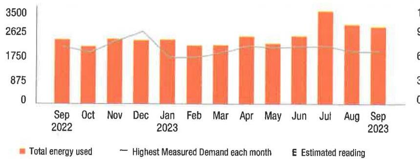

The image is a bar chart with a line graph overlay.

- **Chart Type**: Bar chart with line graph
- **X-Axis**: Months from "Sep 2022" to "Sep 2023"
- **Y-Axis**: Energy usage in kWh, ranging from 0 to 3500
- **Legend Entries**:
  - Orange bars represent "Total energy used"
  - A gray line represents "Highest Measured Demand each month"
  - An "E" symbol indicates "Estimated reading"
- **Data Points**:
  - Each month from September 2022 to September 2023 has an orange bar indicating the total energy used.
  - The gray line shows the highest measured demand for each month.
- **Styling**:
  - The bars are in orange.
  - The line graph is in gray.
  - The estimated readings are marked with an "E" symbol above the relevant bars.
- **Yearly Usage Breakdown (Monthly-Based)**: The chart provides a monthly breakdown of energy usage over the span of one year, from September 2022 to September 2023.

Visit MyAccount for more details regarding your energy usage.

## MEASURED DEMAND

Demand kW
Measurement is the maximum use of electricity at any time during a monthly time period, as measured by your meter.

## BILLED DEMAND

Annual Demand kW
5.20

Summer Demand kW
5.20

## SUPPLY CAPACITY

| Generation kW | 8.425 |
| :-- | --: |
| Transmission kW | 7.610 |

Supply capacity is required to serve the system's annual peak usage. It represents your share of these facilities, in kilowatts (kW). It is calculated based on your peak usage from the previous summer. Supply capacity values are updated periodically throughout the year and are prorated based on your service period.

## Price to compare

If you want to consider getting your electric supply from another supplier, compare their price with ours. This month, your cost for energy supply is $\$ 301.35$. This price to compare varies month to month, depending on your usage.

Your PoD ID is: PE000009742590458492 Your PoD ID is your Point of Delivery identification within PSE\&G's system. You will need this number if you are considering enrolling with another supplier.

le, preזggoj 10088601, jmgb00 2023092222117, cnn-137090-000040839

## Your energy bill

## Message Center

This bill reflects a BPU-approved change in the Supply portion of your electric bill effective on and after September 1, 2023. The increase in the Supply portion of your bill is due to a change in the Transmission rate. The overall impact for business customers will vary by individual customer usage. Tariff information may also be found by visiting pseg.com.

The success of your business is important to us. We are working hard to make it easier to do business with us. To learn more about how we can help, visit pseg.com/Business.
J.D. Power named PSE\&G \#1 in customer satisfaction for both Residential Electric and Natural Gas Service in the East among Large Utilities. On behalf of the more than 12,000 PSEG employees who work hard every day, we thank you for rating us as a top utilities provider. For J.D. Power 2022 award information, visit jdpower.com/awards.

## (2) NEXT METER READING October 20, 2023

## How to contact us

## 1-855-BIZ-PSEG (248-7734)

Customer Service: 8am to 5:30pm Mon to Fri,
Closed on weekends and holidays
Emergencies / Outages / WorryFree Services: 24/7
TTY for the hearing impaired: 1-800-225-0072
Visit pseg.com/myaccount to access your account anytime
Text us. Register for MyAlerts by texting REG to 4PSEG(47734)
$>$ Text OUT to report an outage.
facebook.com/pseg
twitter.com/psegdelivers

## PSEG

We make things work for you.

## PAY YOUR WAY, 24/7

We offer a variety of methods that make it easy to pay your bill. See reverse side for more information.

By checking this box, i authorize PSE\&G to enroll me in paperless billing at this email address:

068546000040832
$\left.{ }^{\mathrm{H}}\right|_{[1]} \mathrm{H}_{1}\left[{ }^{\mathrm{H}} \mathrm{I}^{\mathrm{H}} \mathrm{I}^{\mathrm{H}}\right] \mathrm{H}_{1}\left[{ }^{\mathrm{H}} \mathrm{I}^{\mathrm{H}} \mathrm{H}_{1}\right]\left[{ }^{\mathrm{H}} \mathrm{I}^{\mathrm{H}} \mathrm{H}_{1}\left[{ }^{\mathrm{H}} \mathrm{H}_{1}\right] \mathrm{H}_{1}\left[{ }^{\mathrm{H}} \mathrm{H}\right] \mathrm{H}_{1}\right] \mathrm{I}$
HOTEL WOODBRIDGE LLC
ACCOUNT NUMBER
7222363602

## SERVICE ADDRESS

120 WOOD AVE 5 BLG-65 WOODBRIDGE TWP NJ 08830-2711

## Your billing summary

Balance remaining from your last bill
PSE\&G balance from last bill
\$456.77
L888 Payment received September 8, 2023 - thank you! - $\$ 456.77$
Balance remaining from your last bill
\$0.00
This month's charges and credits
Electric charges - PSE\&G
This month's charges and credits
Total amount we'll debit your
\$368.85
account on Oct 10, 2023

Account number
7222363602
Automatic bill payment - do not pay

## Amount enclosed

$\mathrm{H}_{1}\left[{ }^{\mathrm{H}} \mathrm{I}^{\mathrm{H}} \mathrm{I}^{\mathrm{H}}\right] \mathrm{H}_{1}\left[{ }^{\mathrm{H}} \mathrm{I}^{\mathrm{H}} \mathrm{I}^{\mathrm{H}} \mathrm{I}^{\mathrm{H}} \mathrm{H}^{\mathrm{H}} \mathrm{I}^{\mathrm{H}} \mathrm{H}^{\mathrm{H}} \mathrm{I}^{\mathrm{H}} \mathrm{H}^{\mathrm{H}} \mathrm{I}^{\mathrm{H}}\right] \mathrm{H}_{1}\left[{ }^{\mathrm{H}} \mathrm{H}^{\mathrm{H}} \mathrm{I}^{\mathrm{H}}\right] \mathrm{H}^{\mathrm{H}} \mathrm{I}^{\mathrm{H}} \mathrm{H}^{\mathrm{H}} \mathrm{I}^{\mathrm{H}} \mathrm{I}^{\mathrm{H}}$ HOTEL WOODBRIDGE LLC
120 WOOD AVES
ISELIN NJ 08830-2736

## Message Center (Continued from page 1)

Si desea recibir en español una notificación de desconexión del servicio, llame al 1-800-357-2262.

Stay connected during hurricane season! Sign up for My Alerts to report power outages via text message, as well as receive outage updates by text and email. For more information, visit pseg.com/myalerts.

PSE\&G is installing smart meters that will provide electric customers with a number of benefits. These include more detailed electric-use information, near real-time power outage detection, and the elimination of almost all estimated electric bills. To learn more, visit pseg.com/smartmeters.

If you've ever misplaced your bill or had a due date slip your mind, it's time to sign up for Paperless Billing! Instead of receiving a paper bill each month, you'll get a monthly email showing your bill amount and due date, with the ability to view/print your current and past bills 24/7. To sign up, log in to My Account at pseg.com, and select "Paperless Billing."

At PSE\&G, we are committed to supporting your business needs. That's why we created a dedicated, toll-free phone number to address your energy questions and concerns. PSE\&G's Business Solutions Center is available Monday-Friday, 7:00 a.m. -5:30 p.m. at 1-855-249-7734 (1-855-BIZ-PSEG).

## Don't miss your meter reading

If you'll be away on your meter reading day, use our mobile app to upload a picture of your meter or enter your reading manually, or call 1-800-622-0197.

## Electric \& Gas Rate Information

For news about PSE\&G's rate filing and upcoming public hearings visit www.pseg.com/pseandgfilings. Under applicable tax law, the State Sales and Use Tax and corporate business tax are imposed upon the energy you have used.

# IT'S YOUR BILL. HOW YOU PAY IS YOUR CHOICE. 

## My Account

Make a payment anytime from a checking or savings account stored in My Account. Visit pseg.com/ myaccount

Mobile: Download our Mobile App "PSE\&G"
Pay by text: Test PAY to 4PSEG (47734)

Voice: Ask Alexa or use Google Assistant.

## Automatic BillPay

Automatic payments from your bank. Skip checks and stamps. Never worry about due dates.

Enroll at:
pseg.com/autopay

## Credit Card

Pay your bill with a credit card online or by phone. Because we don't use customer rates to subsidize the cost of this service, there is a fee.

My Account: pseg.com/myaccount

Phone:
1-803-277-8710

## Phone

Bank Account: 1-800-553-7734

Credit Card: 1-833-277-8710

## In Person

Payments are accepted at any customer service center or authorized location.

Locations can be found at: pseg.com/csc

Details of your electric charges Your rate: General Lighting \& Power (GLP)

| Meter \# 316021253 | Usage |
| :--: | :--: |
| Actual reading Sep 21, 2023 | 32748 |
| Less Actual reading Aug 22, 2023 | 31033 |
| Total electric you used in 30 days | 1,715 kWh |

## Delivery charges

Monthly service charge
$\$ 5.04$
Charges for delivering electric to you:
Annual Demand
4,500 kW x \$5.302222
The highest Measured Demand in any time period in the current month.
Summer Demand
4,500 kW x \$10.037778
The Measured Demand (excluding off-peak) in each billing month of June through September.
kWh charges
1,715 kWh x \$0.011149
$\$ 19.12$
Societal Benefits
1,715 kWh x \$0.010414
This charge recovers the cost of government mandated programs designed to achieve public policy goals, such as energy conservation.
Total electric delivery charges
$\$ 111.05$
Supply charges
BGS Capacity
Generation
10.372 kW x \$1.741226
Transmission
9.369 kW x \$13.293841
Cost of electric supplied by PSE\&G:
Charges
For the first
514 kWh x \$0.073249
For the next
1,201 kWh x \$0.064563
Total electric supply charges
$\$ 257.80$
Total electric charges
$\$ 388.85$

Your monthly electric use
kWh
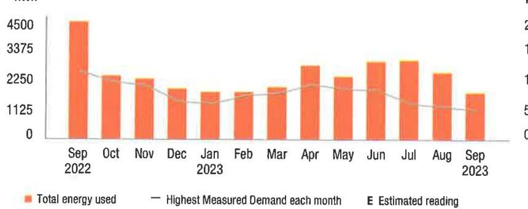

The image is a bar and line chart showing a **yearly usage breakdown (monthly-based)** of electricity usage and demand.

- **Chart Type**: Combination of bar and line chart.
- **X-Axis**: Months from September 2022 to September 2023.
- **Y-Axis**: Scale from 0 to 4500, likely representing kWh or kW.
- **Legend**:
  - Orange bars represent "Total energy used."
  - A gray line represents "Highest Measured Demand each month."
  - "E" indicates "Estimated reading."
- **Data Points**:
  - The chart shows varying heights of orange bars for each month, indicating changes in total energy used.
  - The gray line fluctuates, showing the highest measured demand each month.
- **Styling**: Orange bars are used for energy usage, and a gray line for demand, with specific emphasis on estimated readings marked with "E."

Visit MyAccount for more details regarding your energy usage.

## MEASURED DEMAND

Demand kW
4.50

Measured Demand is the maximum use of electricity at any time during a monthly time period, as measured by your meter.

## BILLED DEMAND

Annual Demand kW
4.50

Summer Demand kW
4.50

## SUPPLY CAPACITY

Generation kW
10.372

Transmission kW
9.369

Supply capacity is required to serve the system's annual peak usage. It represents your share of these facilities, in kilowatts (kW). It is calculated based on your peak usage from the previous summer. Supply capacity values are updated periodically throughout the year and are prorated based on your service period.

## Price to compare

If you want to consider getting your electric supply from another supplier, compare their price with ours. This month, your cost for energy supply is $\$ 257.80$. This price to compare varies month to month, depending on your usage.

Your PoD ID is: PE000011205153758492 -
Your PoD ID is your Point of Delivery identification within PSE\&G's system. You will need this number if you are considering enrolling with another supplier.

la.popag.|10\&tel:1.|pagb8:202309222:117 .res=137094-000040832

## Your energy bill

## Message Center

This bill reflects a BPU-approved change in the Supply portion of your electric bill effective on and after September 1, 2023. The increase in the Supply portion of your bill is due to a change in the Transmission rate. The overall impact for business customers will vary by individual customer usage. Tariff information may also be found by visiting pseg.com.

The success of your business is important to us. We are working hard to make it easier to do business with us. To learn more about how we can help, visit pseg.com/Business.
J.D. Power named PSE\&G \#1 in customer satisfaction for both Residential Electric and Natural Gas Service in the East among Large Utilities. On behalf of the more than 12,000 PSEG employees who work hard every day, we thank you for rating us as a top utilities provider. For J.D. Power 2022 award information, visit jdpower.com/awards.

## (3) NEXT METER READING October 20, 2023

## How to contact us

## 1-855-8IZ-PSEG (249-7734)

Customer Service: 8am to 5:30pm Mon to Fri,
Closed on weekends and holidays
Emergencies / Outages / WorryFree Services: 24/7
TTY for the hearing impaired: 1-800-225-0072
Visit pseg.com/myaccount to access your account anytime
Text us. Register for MyAlerts by texting REG to 4PSEG(47734)
$>$ Text OUT to report an outage.
facebook.com/pseg
twitter.com/psegdeilvers

## PAY YOUR WAY, 24/7

We offer a variety of methods that make it easy to pay your bill. See reverse side for more information.

By checking this box, I authorize PSE\&G to enroit me in paperless billing at this email address:

068548000040831
IIIIIIIIIIIIIIIIIIIIIIIIIIIIIIIIIIIIIIIIII
HOTEL WOODBRIDGE LLC
120 WOOD AVE S
ISELIN NJ 08830-2736

## Total amount due

You do not need to make a payment.
Bilti automatic bill payment, see 800000 your bill is account on Oct 10, 2023

Bill date: September 25, 2023
For the period: August 23, 2023 to September 21, 2023

## - HOTEL WOODBRIDGE LLC

## ACCOUNT NUMBER

7222362800

## SERVICE ADDRESS

120 WOOD AVE S BLG-25 WOODBRIDGE TWP NJ 08830-2711

## Your billing summary

## Balance remaining from your last bill

PSE\&G balance from last bill
$\$ 1,547.29$
Less: Payment received September 8, 2023 - thank you! - $\$ 1,547.29$
Balance remaining from your last bill $\$ 0.00$

This month's charges and credits
Electric charges - PSE\&G
This month's charges and credits
Total amount we'll debit your
$\$ 1,428.48$
account on Oct 10, 2023

Account number
7222362800
Automatic bill payment - do not pay

## Amount enclosed

$\mathrm{In}\left\{\mathrm{H}_{1} \mathrm{H}_{1}\right\}\left\{\mathrm{H}_{1}\right\}\left\{\mathrm{H}_{1}\right\}\left\{\mathrm{H}_{1}\right\}\left\{\mathrm{H}_{1}\right\}\left\{\mathrm{H}_{1}\right\}\left\{\mathrm{H}_{1}\right\}\left\{\mathrm{H}_{1}\right\}\left\{\mathrm{H}_{1}\right\}\left\{\mathrm{H}_{1}\right\}\left\{\mathrm{H}_{1}\right\}$
HOTEL WOODBRIDGE LLC
120 WOOD AVE S
NEW BRUNSWICK NJ 08906-4444

## Message Center (Continued from page 1)

Si desea recibir en español una notificación de desconexión del servicio, llame al 1-800-357-2262.

Stay connected during hurricane season! Sign up for My Alerts to report power outages via text message, as well as receive outage updates by text and email. For more information, visit pseg.com/myalerts.

PSE\&G is installing smart meters that will provide electric customers with a number of benefits. These include more detailed electric-use information, near real-time power outage detection, and the elimination of almost all estimated electric bills. To learn more, visit pseg.com/smartmeters.

If you've ever misplaced your bill or had a due date slip your mind, it's time to sign up for Paperless Billing! Instead of receiving a paper bill each month, you'll get a monthly email showing your bill amount and due date, with the ability to view/print your current and past bills 24/7. To sign up, log in to My Account at pseg.com, and select "Paperless Billing."

At PSE\&G, we are committed to supporting your business needs. That's why we created a dedicated, toll-free phone number to address your energy questions and concerns. PSE\&G's Business Solutions Center is available Monday-Friday, 7:00 a.m. -5:30 p.m. at 1-855-249-7734 (1-855-BIZ-PSEG).

## Don't miss your meter reading

If you'll be away on your meter reading day, use our mobile app to upload a picture of your meter or enter your reading manually, or call 1-800-622-0197.

## Electric \& Gas Rate Information

For news about PSE\&G's rate filing and upcoming public hearings visit www.pseg.com/pseandgfilings. Under applicable tax law, the State Sales and Use Tax and corporate business tax are imposed upon the energy you have used.

# IT'S YOUR BILL. HOW YOU PAY IS YOUR CHOICE. 

## My Account

Make a payment anytime from a checking or savings account stored in My Account. Visit pseg.com/ myaccount

Mobile: Download on: Mobile App "PSE\&G"
Pay by text: Text PAY to 4PSEG (47734)

Voice: Ask Alexa or use Google Assistant:

## Automatic BillPay

Automatic payments from your bank. Skip checks and stamps. Never worry about due dates.

Enroll at:
pseg.com/autopay

Credit Card
Pay your bill with a credit card online or by phone. Because we don't use customer rates to subsidize the cost of this service, there is a fee.

My Account: pseg.com/myaccount

Phone:
$1-803-277-8710$

Phone
Bank Account:
1-800-553-7734
Credit Card:
$1-803-277-8710$

## In Person

Payments are accepted at any customer service center or authorized location.

Locations can be found at: pseg.com/csc

|  | Details of your electric charges Your rate: General Lighting \& Power (GLP) |  |
| :--: | :--: | :--: |
| Meter \# 316021240 |  | Usage |
| Actual reading Sep 21, 2023 | 81076 |  |
| Less Actual reading Aug 22, 2023 | 72390 |  |
| Total electric you used in 30 days | 8,686 | kWh |
| Delivery charges |  |  |
| Monthly service charge |  | \$5.04 |
| Charges for delivering electric to you: |  |  |
| Annual Demand | 24,700 kW x \$5.302834 | \$130.98 |
| The highest Measured Demand in any time period in the current month. |  |  |
| Summer Demand | 24,700 kW x \$10.037652 | \$247.93 |
| The Measured Demand (excluding off-peak) in each billing month of June through September. |  |  |
| kWh charges | 8,686 kWh x \$0.011147 | \$96.82 |
| Societal Benefits | 8,686 kWh x \$0.010413 | \$90.45 |
| This charge recovers the cost of government mandated programs designed to achieve public policy goals, such as energy conservation. |  |  |
| Total electric delivery charges |  | \$571.22 |
| Supply charges |  |  |
| BGS Capacity |  |  |
| Generation | 19,918 kW x \$1.741139 | \$34.68 |
| Transmission | 17,991 kW x \$13.293313 | \$239.16 |
| Cost of electric supplied by PSE\&G: |  |  |
| Charges |  |  |
| For the first | 2,605 kWh x \$0.073248 | \$190.81 |
| For the next | 6,081 kWh x \$0.064563 | \$392.61 |
| Total electric supply charges |  | \$857.26 |
|  | Total electric charges | \$1,428.48 |

Your monthly electric use
kWh
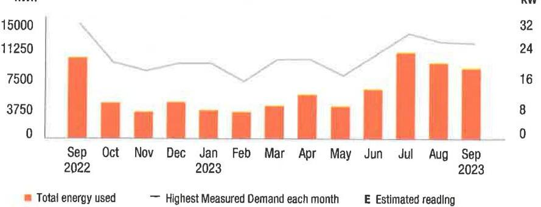

The image is a bar and line chart depicting a **yearly usage breakdown (monthly-based)** of electricity usage and demand from September 2022 to September 2023.

- **Chart Type**: Combination of bar and line chart.
- **X-Axis**: Months from September 2022 to September 2023.
- **Y-Axis (Left)**: kWh, ranging from 0 to 15,000.
- **Y-Axis (Right)**: kW, ranging from 0 to 32.
- **Bars**: Represent "Total energy used" in kWh for each month.
- **Line**: Represents "Highest Measured Demand each month" in kW.
- **Legend Entries**:
  - Orange bars: Total energy used
  - Gray line: Highest Measured Demand each month
  - "E": Estimated reading
- **Notable Styling**: The bars are orange, and the line is gray. The chart includes a legend indicating the meaning of the colors and symbols.

Visit MyAccount for more details regarding your energy usage.

## MEASURED DEMAND

Demand kW
24.70

Measured Demand is the maximum use of electricity at any time during a monthly time period, as measured by your meter.

## BILLED DEMAND

Annual Demand kW
24.70

Summer Demand kW
24.70

## SUPPLY CAPACITY

Generation kW
19,918
Transmission kW
17,991
Supply capacity is required to serve the system's annual peak usage. It represents your share of these facilities, in kilowatts (kW). It is calculated based on your peak usage from the previous summer. Supply capacity values are updated periodically throughout the year and are prorated based on your service period.

## Price to compare

If you want to consider getting your electric supply from another supplier, compare their price with ours. This month, your cost for energy supply is $\$ 857.26$. This price to compare varies month to month, depending on your usage.

Your PoD ID is: PE000009742589658492 Your PoD ID is your Point of Delivery identification within PSE\&G's system. You will need this number if you are considering enrolling with another supplier.

la.pnqing.|10x6e01.1qmgb6l 202309222117.rav-137098-000040831

## Your energy bill

## Message Center

This bill reflects a BPU-approved change in the Supply portion of your electric bill effective on and after September 1, 2023. The increase in the Supply portion of your bill is due to a change in the Transmission rate. The overall impact for business customers will vary by individual customer usage. Tariff information may also be found by visiting pseg.com.

The success of your business is important to us. We are working hard to make it easier to do business with us. To learn more about how we can help, visit pseg.com/Business.
J.D. Power named PSE\&G \#1 in customer satisfaction for both Residential Electric and Natural Gas Service in the East among Large Utilities. On behalf of the more than 12,000 PSEG employees who work hard every day, we thank you for rating us as a top utilities provider. For J.D. Power 2022 award information, visit jdpower.com/awards.

## NEXT METER READING October 20, 2023

## How to contact us

## 1-855-BIZ-PSEG (249-7734)

Customer Service: 8am to 5:30pm Mon to Fri,
Closed on weekends and holidays
Emergencies / Outages / WorryFree Services: 24/7
TTY for the hearing impaired: 1-800-225-0072
Visit pseg.com/myaccount to access your account anytime
Text us. Register for MyAlerts by texting REG to 4PSEG(47734)
$>$ Text OUT to report an outage.
facebook.com/pseg
twitter.com/psegdelivers

## PAY YOUR WAY, 24/7

We offer a variety of methods that make it easy to pay your bill. See reverse side for more information.

By checking this box, I authorize PSE\&G to enroll me in paperless billing at this email address:

068550000040830
$\left\|\mid_{\mid}\right\|_{1} \mid_{\| \|}\left\|\mid_{\mid}\right\|_{1}\left\|\mid_{\mid}\right\|_{1}\left\|\mid_{\mid}\right\|_{1}\left\|\mid_{\mid}\right\|_{1}\left\|\mid_{\mid}\right\|_{1}\left\|\mid_{\mid}\right\|_{1}\left\|\mid\right\|$
HOTEL WOODBRIDGE LLC
ACCOUNT NUMBER
7222317201
SERVICE ADDRESS
120 WOOD AVE 5 B4NE WOODBRIDGE TWP NJ 08830-2711

## Your billing summary

## Balance remaining from your last bill

PSE\&G balance from last bill
$\$ 781.06$
Less Payment received September 8, 2023 - thank you!
$\$ 781.06$
Balance remaining from your last bill
\$0.00

This month's charges and credits
Electric charges - PSE\&G
This month's charges and credits
Total amount we'll debit your
\$796.59
account on Oct 10, 2023

Account number
7222317201
Automatic bill payment - do not pay

Amount enclosed
$\mathrm{p} \mid\left\|_{\mid}\right\|_{1}\left\|\mid_{\mid}\right\|_{1}\left\|\mid_{\mid}\right\|_{1}\left\|\mid_{\mid}\right\|_{1}\left\|\mid_{\mid}\right\|_{1}\left\|\mid_{\mid}\right\|_{1}\left\|\mid_{\mid}\right\|_{1}\left\|\mid\right\|$
PSE\&G CO
PO BOX 14444
NEW BRUNSWICK NJ 08906-4444

## Message Center (Continued from page 1)

Si desea recibir en español una notificación de desconexión del servicio, llame al 1-800-357-2262.

Stay connected during hurricane season! Sign up for My Alerts to report power outages via text message, as well as receive outage updates by text and email. For more information, visit pseg.com/myalerts.

PSE\&G is installing smart meters that will provide electric customers with a number of benefits. These include more detailed electric-use information, near real-time power outage detection, and the elimination of almost all estimated electric bills. To learn more, visit pseg.com/smartmeters.

If you've ever misplaced your bill or had a due date slip your mind, it's time to sign up for Paperless Billing! Instead of receiving a paper bill each month, you'll get a monthly email showing your bill amount and due date, with the ability to view/print your current and past bills 24/7. To sign up, log in to My Account at pseg.com, and select "Paperless Billing."

At PSE\&G, we are committed to supporting your business needs. That's why we created a dedicated, toll-free phone number to address your energy questions and concerns. PSE\&G's Business Solutions Center is available Monday-Friday, 7:00 a.m. -5:30 p.m. at 1-855-249-7734 (1-855-BIZ-PSEG).

## Don't miss your meter reading

If you'll be away on your meter reading day, use our mobile app to upload a picture of your meter or enter your reading manually, or call 1-800-622-0197.

## Electric \& Gas Rate Information

For news about PSE\&G's rate filing and upcoming public hearings visit www.pseg.com/pseandgfilings. Under applicable tax law, the State Sales and Use Tax and corporate business tax are imposed upon the energy you have used.

# IT'S YOUR BILL. HOW YOU PAY IS YOUR CHOICE. 

## 1.10 My Account

Make a payment anytime from a checking or savings account stored in My Account. Visit pseg.com/ myaccount

Mobile: Download our Mobile App "PSE\&G"
Pay by text: Text PAY to -6PSEG (47734)

Voice: Ask Alexa or use Google Assistant:

## 1.11 Automatic BillPay

Automatic payments from your bank. Skip checks and stamps. Never worry about due dates.

Enroll at:
pseg.com/autopay

## Credit Card

Pay your bill with a credit card online or by phone. Because we don't use customer rates to subsidize the cost of this service, there is a fee.

## My Account:

pseg.com/myaccount

Phone:
1-833-277-8710

## Phone

Bank Account:
1-800-553-7734
Credit Card:
1-833-277-8710

## $L 2$ By Mail

Make your check payable to PSE\&G and write your account number on your check.

When you pay by check, you authorize PSE\&G to make a one-time electronic fund transfer from your account, in the amount of your check. If you prefer not to authorize us, call 1-800-436-PSEG

## 2 In Person

Payments are accepted at any customer service center or authorized location

Locations can be found at: pseg.com/csc

Details of your electric charges
Your rate: General Lighting \& Power (GLP)

| Meter \# 316021235 | Usage |
| :--: | :--: |
| Actual reading Sep 21, 2023 | 37567 |
|  | 32915 |
| Total electric you used in 30 days | 4,652 kWh |

## Delivery charges

| Monthly service charge | $\$ 5.04$ |
| :--: | :--: |
| Charges for delivering electric to you: |  |
| Annual Demand | 17.200 kW x \$5.302907 |
| The highest Measured Demand in any time period in the current month. | \$91.21 |
| Summer Demand 17.200 kW x \$10.038372 | \$172.66 |
| The Measured Demand (excluding off-peak) in each billing month of June through September. |  |
| kWh charges | 4,652 kWh x \$0.011148 |
| Societal Benefits 4,652 kWh x \$0.010413 | \$48.44 |
| This charge recovers the cost of government mandated programs designed to achieve public policy goals, such as energy conservation. |  |
| Total electric delivery charges | \$369.21 |
| Supply charges |  |
| BGS Capacity |  |
| Generation 8.358 kW x \$1.740847 | \$14.55 |
| Transmission 7.550 kW x \$13.294040 | \$100.37 |
| Cost of electric supplied by PSE\&G: |  |
| Charges |  |
| For the first 1,395 kWh x \$0.073247 | \$102.18 |
| For the next 3,257 kWh x \$0.064562 | \$210.28 |
| Total electric supply charges | \$427.38 |
| Total electric charges | \$796.59 |

## Your monthly electric use

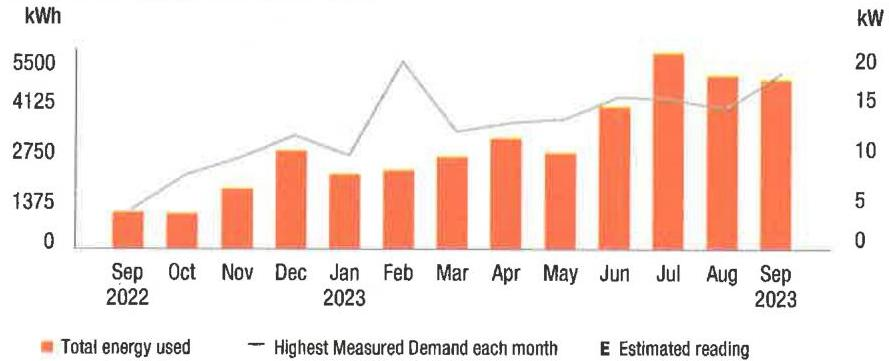

The image is a bar and line chart.

- **Chart Type**: Combination of bar and line chart.
- **X-Axis**: Time period from September 2022 to September 2023.
- **Y-Axis (Left)**: Energy usage in kWh, ranging from 0 to 5500.
- **Y-Axis (Right)**: Measured demand in kW, ranging from 0 to 20.
- **Legend**:
  - Orange bars represent "Total energy used."
  - A gray line represents "Highest Measured Demand each month."
  - A yellow dot indicates "Estimated reading."
- **Data Points**:
  - Monthly energy usage is shown with orange bars, with higher usage in summer months (June, July, August).
  - The highest measured demand is shown with a gray line, peaking around July and August.
- **Yearly Usage Breakdown (Monthly-Based)**: The chart provides a visual representation of monthly energy usage and demand over a year, highlighting seasonal variations.

Visit MyAccount for more details regarding your energy usage.

## MEASURED DEMAND

## Demand kW

17.20

Measured Demand is the maximum use of electricity at any time during a monthly time period, as measured by your meter.

## BILLED DEMAND

Annual Demand kW
17.20

Summer Demand kW
17.20

## SUPPLY CAPACITY

Generation kW
8.358

Transmission kW
7.550

Supply capacity is required to serve the system's annual peak usage. It represents your share of these facilities, in kilowatts (kW). It is calculated based on your peak usage from the previous summer. Supply capacity values are updated periodically throughout the year and are prorated based on your service period.

## Price to compare

If you want to consider getting your electric supply from another supplier, compare their price with ours. This month, your cost for energy supply is $\$ 427.38$. This price to compare varies month to month, depending on your usage.

Your PoD ID is: PE000008769508658492 Your PoD ID is your Point of Delivery identification within PSE\&G's system. You will need this number if you are considering enrolling with another supplier.

la.popag.|t088801.1@gmail.202309222117.rav-137103-090040830

## Your energy bill

## Message Center

This bill reflects a BPU-approved change in the Supply portion of your electric bill effective on and after September 1, 2023. The increase in the Supply portion of your bill is due to a change in the Transmission rate. The overall impact for business customers will vary by individual customer usage. Tariff information may also be found by visiting pseg.com.

The success of your business is important to us. We are working hard to make it easier to do business with us. To learn more about how we can help, visit pseg.com/Business.
J.D. Power named PSE\&G \#1 in customer satisfaction for both Residential Electric and Natural Gas Service in the East among Large Utilities. On behalf of the more than 12,000 PSEG employees who work hard every day, we thank you for rating us as a top utilities provider. For J.D. Power 2022 award information, visit jdpower.com/awards.

## (3) NEXT METER READING October 20, 2023

## How to contact us

## 1-855-BIZ-PSEG (249-7734)

Customer Service: 8am to 5:30pm Mon to Fri,
Closed on weekends and holidays
Emergencies / Outages / WorryFree Services: 24/7
TTY for the hearing impaired: 1-800-225-0072
Visit pseg.com/myaccount to access your account anytime
Text us. Register for MyAlerts by texting REG to 4PSEG(47734)
$>$ Text OUT to report an outage.
facebook.com/pseg
twitter.com/psegdelivers

## PSEG

We offer a variety of methods that make it easy to pay your bill. See reverse side for more information.

By checking this box, I authorize PSE\&G to enroll me in paperless billing at this email address:

068552 000040829
$\mathrm{ml} / \mathrm{ll} / \mathrm{l} / \mathrm{l} / \mathrm{l} / \mathrm{l} / \mathrm{l} / \mathrm{l} / \mathrm{l} / \mathrm{l} / \mathrm{l} / \mathrm{l} / \mathrm{l} / \mathrm{l} / \mathrm{l} / \mathrm{l} / \mathrm{l} / \mathrm{l} / \mathrm{l} / \mathrm{l} / \mathrm{l} / \mathrm{l} / \mathrm{l} / \mathrm{l} / \mathrm{l} / \mathrm{l} / \mathrm{l} / \mathrm{l} / \mathrm{l} / \mathrm{l} / \mathrm{l} / \mathrm{l} / \mathrm{l} / \mathrm{l} / \mathrm{l} / \mathrm{l} / \mathrm{l} / \mathrm{l} / \mathrm{l} / \mathrm{l} / \mathrm{l} / \mathrm{l

## Message Center (Continued from page 1)

Si desea recibir en español una notificación de desconexión del servicio, llame al 1-800-357-2262.

Stay connected during hurricane season! Sign up for My Alerts to report power outages via text message, as well as receive outage updates by text and email. For more information, visit pseg.com/myalerts.

PSE\&G is installing smart meters that will provide electric customers with a number of benefits. These include more detailed electric-use information, near real-time power outage detection, and the elimination of almost all estimated electric bills. To learn more, visit pseg.com/smartmeters.

If you've ever misplaced your bill or had a due date slip your mind, it's time to sign up for Paperless Billing! Instead of receiving a paper bill each month, you'll get a monthly email showing your bill amount and due date, with the ability to view/print your current and past bills 24/7. To sign up, log in to My Account at pseg.com, and select "Paperless Billing."

At PSE\&G, we are committed to supporting your business needs. That's why we created a dedicated, toll-free phone number to address your energy questions and concerns. PSE\&G's Business Solutions Center is available Monday-Friday, 7:00 a.m. -5:30 p.m. at 1-855-249-7734 (1-855-BIZ-PSEG).

## Don't miss your meter reading

If you'll be away on your meter reading day, use our mobile app to upload a picture of your meter or enter your reading manually, or call 1-800-622-0197.

## Electric \& Gas Rate Information

For news about PSE\&G's rate filing and upcoming public hearings visit www.pseg.com/pseandgfilings. Under applicable tax law, the State Sales and Use Tax and corporate business tax are imposed upon the energy you have used.

# IT'S YOUR BILL. HOW YOU PAY IS YOUR CHOICE. 

## 1.15 My Account

Make a payment anytime from a checking or savings account stored in My Account. Visit pseg.com/ myaccount

Mobile: Download our Mobile Age: "PSE\&G"
Pay by text: Text PAY to 4PSEG (47734)

Voice: Ask Alexa or use Google Assistant:

## 1.16 Automatic BillPay

Automatic payments from your bank, Skip checks and stamps. Nover worry about due dates.

## Enroll at:

pseg.com/autopay

## Credit Card

Pay your bill with a credit card online or by phone. Because we don't use customer rates to subsidize the cost of this service, there is a fee.

## My Account:

pseg.com/myaccount
Phone:
$1-833-277-8710$

## Phone

Bank Account: 1-800-553-7734

## Credit Card:

1-833-277-8710

## $>$ By Mail

Make your check payable to PSE\&G and write your account number on your check.

When you pay by check, you authorize PSE\&G to make a one-time electronic fund transfer from your account, in the amount of your check. If you prefer not to authorize us, call 1-800-436-PSEG.

## In Person

Payments are accepted at any customer service center or authorized location.

## Locations can be

found at:
pseg.com/csc

Details of your electric charges
Your rate: General Lighting \& Power (GLP)

| Meter \# 316021241 | Usage |
| :--: | :--: |
| Actual reading Sep 21, 2023 | 23664 |
| Actual reading Aug 22, 2023 | 22064 |
| Total electric you used in 30 days | 1,600 kWh |

## Delivery charges

| Monthly service charge | $\$ 5.04$ |
| :-- | --: |
| Charges for delivering electric to you: |  |
| Annual Demand | $5.200 \mathrm{~kW} \times \$ 5.301923$ |
| The highest Measured Demand in any time period in the |  |
| current month. | $\$ 27.57$ |
| Summer Demand | $5.200 \mathrm{~kW} \times \$ 10.038462$ |
| The Measured Demand (excluding off-peak) in each billing |  |
| month of June through September. | $\$ 17.84$ |
| kWh charges | $1,600 \mathrm{kWh} \times \$ 0.010413$ |
| Societal Benefits |  |
| This charge recovers the cost of government mandated |  |
| programs designed to achieve public policy goals, such as |  |
| energy conservation. |  |

Total electric delivery charges
Supply charges
BGS Capacity
Generation
3,811 kW $\times \$ 1.739701$
\$6.63
Transmission
3,442 kW $\times \$ 13.294596$
Cost of electric supplied by PSE\&G:
Charges
For the first
For the next
Total electric supply charges
\$159.86
Total electric charges
\$279.17

Your monthly electric use
kWh
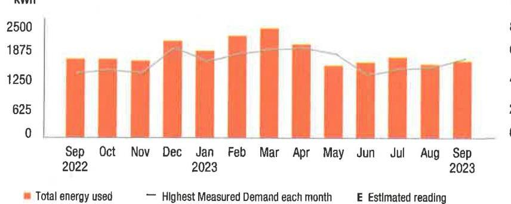

The image is a bar chart with a line graph overlay, representing a **yearly usage breakdown (monthly-based)** of electricity.

- **Chart Type**: Bar chart with line graph
- **Y-Axis Title**: kWh
- **Y-Axis Units**: 0 to 2500 in increments of 625
- **X-Axis Labels**: Months from Sep 2022 to Sep 2023
- **Legend Entries**:
  - Orange bars: Total energy used
  - Gray line: Highest Measured Demand each month
  - "E": Estimated reading

- **Data Points**:
  - Each month from Sep 2022 to Sep 2023 has an orange bar indicating the total energy used.
  - A gray line represents the highest measured demand each month.

- **Styling**:
  - Orange bars for energy usage
  - Gray line for demand
  - The chart includes a legend for clarity.

Visit MyAccount for more details regarding your energy usage.

## MEASURED DEMAND

Demand kW
Measure Demand is the maximum use of electricity at any time during a monthly time period, as measured by your meter.

## BILLED DEMAND

Annual Demand kW
5.20

Summer Demand kW
5.20

## SUPPLY CAPACITY

Generation kW
3.811

Transmission kW
3.442

Supply capacity is required to serve the system's annual peak usage. It represents your share of these facilities, in kilowatts (kW). It is calculated based on your peak usage from the previous summer. Supply capacity values are updated periodically throughout the year and are prorated based on your service period.

## Price to compare

If you want to consider getting your electric supply from another supplier, compare their price with ours. This month, your cost for energy supply is $\$ 159.86$. This price to compare varies month to month, depending on your usage.

Your PoD ID is: PE000011205154558492 Your PoD ID is your Point of Delivery identification within PSE\&G's system. You will need this number if you are considering enrolling with another supplier.

ls.popsq (1016x013.16xgh012023090322117.rav-137108-000040839

## Your energy bill

## Message Center

This bill reflects a BPU-approved change in the Supply portion of your electric bill effective on and after September 1, 2023. The increase in the Supply portion of your bill is due to a change in the Transmission rate. The overall impact for business customers will vary by individual customer usage. Tariff information may also be found by visiting pseg.com.

The success of your business is important to us. We are working hard to make it easier to do business with us. To learn more about how we can help, visit pseg.com/Business.
J.D. Power named PSE\&G \#1 in customer satisfaction for both Residential Electric and Natural Gas Service in the East among Large Utilities. On behalf of the more than 12,000 PSEG employees who work hard every day, we thank you for rating us as a top utilities provider. For J.D. Power 2022 award information, visit jdpower.com/awards.

## (2) NEXT METER READING October 20, 2023

## How to contact us

## 1-855-BIZ-PSEG (249-7734)

Customer Service: 8am to 5:30pm Mon to Fri,
Closed on weekends and holidays
Emergencies / Outages / WorryFree Services: 24/7
TTY for the hearing impaired: 1-800-225-0072
Visit pseg.com/myaccount to access your account anytime
Text us. Register for MyAlerts by texting REG to 4PSEG(47734)
$>$ Text OUT to report an outage.
facebook.com/pseg
twitter.com/psegdelivers

## PSEG

We make things work for you.

## PAY YOUR WAY, 24/7

We offer a variety of methods that make it easy to pay your bill. See reverse side for more information.

By checking this box, I authorize PSE\&G to enroll me in paperless billing at this email address:

068554 000040828
$\left.\mathrm{ml} / \mathrm{ll} / \mathrm{l} / \mathrm{l} / \mathrm{l} / \mathrm{l} / \mathrm{l} / \mathrm{l} / \mathrm{l} / \mathrm{l} / \mathrm{l} / \mathrm{l} / \mathrm{l} / \mathrm{l} / \mathrm{l} / \mathrm{l} / \mathrm{l} / \mathrm{l} / \mathrm{l} / \mathrm{l} / \mathrm{l} / \mathrm{l} / \mathrm{l} / \mathrm{l} / \mathrm{l} / \mathrm{l} / \mathrm{l} / \mathrm{l} / \mathrm{l} / \mathrm{l} / \mathrm{l} / \mathrm{l} / \mathrm{l} / \mathrm{l} / \mathrm{l} / \mathrm{l} / \mathrm{l} / \mathrm{l} / \mathrm{l} / \mathrm{l} / \mathrm{l} / \mathrm{l

## Message Center (Continued from page 1)

Si desea recibir en español una notificación de desconexión del servicio, llame al 1-800-357-2262.

Stay connected during hurricane season! Sign up for My Alerts to report power outages via text message, as well as receive outage updates by text and email. For more information, visit pseg.com/myalerts.

PSE\&G is installing smart meters that will provide electric customers with a number of benefits. These include more detailed electric-use information, near real-time power outage detection, and the elimination of almost all estimated electric bills. To learn more, visit pseg.com/smartmeters.

If you've ever misplaced your bill or had a due date slip your mind, it's time to sign up for Paperless Billing! Instead of receiving a paper bill each month, you'll get a monthly email showing your bill amount and due date, with the ability to view/print your current and past bills 24/7. To sign up, log in to My Account at pseg.com, and select "Paperless Billing."

At PSE\&G, we are committed to supporting your business needs. That's why we created a dedicated, bill-free phone number to address your energy questions and concerns. PSE\&G's Business Solutions Center is available Monday-Friday, 7:00 a.m. -5:30 p.m. at 1-855-249-7734 (1-855-BIZ-PSEG).

## Don't miss your meter reading

If you'll be away on your meter reading day, use our mobile app to upload a picture of your meter or enter your reading manually, or call 1-800-622-0197.

## Electric \& Gas Rate Information

For news about PSE\&G's rate filing and upcoming public hearings visit www.peeg.com/pseandgfilings. Under applicable tax law, the State Sales and Use Tax and corporate business tax are imposed upon the energy you have used.

# IT'S YOUR BILL. HOW YOU PAY IS YOUR CHOICE. 

## My Account

Make a payment anytime from a checking or savings account stored in My Account. Visit pseg.com/ myaccount

Mobile: Download our Mobile App "PSE\&G"
Pay by text: Text PAY to 4PSEG (47734)

Voice: Ask Alons or use Google Assistant.

## ㅇ

## Automatic BillPay

Automatic payments from your bank. Skip checks and stamps. Never worry about due dates.

## Enroll at:

pseg.com/autopay

## Credit Card

Pay your bill with a credit card online or by phone. Because we don't use customer rates to subsidize the cost of this service, there is a fee.

## My Account:

pseg.com/myaccount

Phone:
$1-803-277-8710$

## Phone

Bank Account: 1-800-553-7734

## Credit Card:

1-803-277-8710

## $>$ My

By Mail
Make your check payable to PSE\&G and write your account number on your check.

When you pay by check, you authorize PSE\&G to make a one-time electronic fund transfer from your account, in the amount of your check. If you prefer not to authorize us, call 1-800-436-PSEG.

## In Person

Payments are accepted at any customer service center or authorized location

## Locations can be

found at:
pseg.com/csc

Details of your electric charges Your rate: General Lighting \& Power (GLP)

| Meter \# 316021233 | Usage |
| :--: | :--: |
| Actual reading Sep 21, 2023 | 26636 |
| Less Actual reading Aug 22, 2023 | 24729 |
| Total electric you used in 30 days | 1,907 kWh |

## Delivery charges

| Monthly service charge | $\$ 5.04$ |
| :--: | :--: |
| Charges for delivering electric to you: |  |
| Annual Demand | $5,100 \mathrm{~kW} \times \$ 5,301961$ |
| The highest Measured Demand in any time period in the current month. | $\$ 27.04$ |
| Summer Demand | $5,100 \mathrm{~kW} \times \$ 10,037255$ |
| The Measured Demand (excluding off-peak) in each billing month of June through September. |  |
| kWh charges | $1,907 \mathrm{kWh} \times \$ 0,011148$ |
| Societal Benefits | $1,907 \mathrm{kWh} \times \$ 0,010414$ |
| This charge recovers the cost of government mandated programs designed to achieve public policy goals, such as energy conservation. | $\$ 19.86$ |
| Total electric delivery charges | $\$ 124.39$ |
| Supply charges |  |
| BGS Capacity |  |
| Generation | $4,120 \mathrm{~kW} \times \$ 1,740291$ |
| Transmission | $3,721 \mathrm{~kW} \times \$ 13,294813$ |
| Cost of electric supplied by PSE\&G: |  |
| Charges |  |
| For the first | $572 \mathrm{kWh} \times \$ 0,073252$ |
| For the next | $1,335 \mathrm{kWh} \times \$ 0,064562$ |
| Total electric supply charges | $\$ 184.73$ |

Total electric charges
\$309.12

## Your monthly electric use

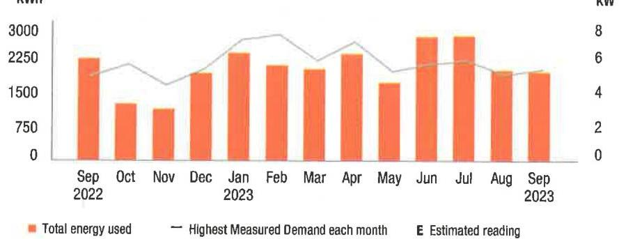

The image is a bar and line chart.

- **Chart Type**: Combination of bar and line chart.
- **X-Axis**: Months from September 2022 to September 2023.
- **Y-Axis (Left)**: kWh, ranging from 0 to 3000.
- **Y-Axis (Right)**: kW, ranging from 0 to 8.
- **Legend Entries**:
  - Orange bars represent "Total energy used."
  - A gray line represents "Highest Measured Demand each month."
  - "E" indicates "Estimated reading."
- **Data Points**:
  - The orange bars show monthly energy usage in kWh.
  - The gray line shows the highest measured demand in kW for each month.
- **Yearly Usage Breakdown (Monthly-Based)**: The chart provides a monthly breakdown of energy usage and demand over a year.
- **Styling**: Orange bars for energy usage, gray line for demand, with estimated readings marked by "E."

Visit MyAccount for more details regarding your energy usage.

## MEASURED DEMAND

Demand kW
Measurement is the maximum use of electricity at any time during a monthly time period, as measured by your meter.

## BILLED DEMAND

Annual Demand kW
5.10

Summer Demand kW
5.10

## SUPPLY CAPACITY

| Generation kW | 4,120 |
| :-- | :-- |
| Transmission kW | 3,721 |

Supply capacity is required to serve the system's annual peak usage. It represents your share of these facilities, in kilowatts (kW). It is calculated based on your peak usage from the previous summer. Supply capacity values are updated periodically throughout the year and are prorated based on your service period.

## Price to compare

If you want to consider getting your electric supply from another supplier, compare their price with ours. This month, your cost for energy supply is $\$ 184.73$. This price to compare varies month to month, depending on your usage.

Your PoD ID is: PE000010959991058492 Your PoD ID is your Point of Delivery identification within PSE\&G's system. You will need this number if you are considering enrolling with another supplier.

la.popag.|10|aball.|.|pag.|40.202309222117 .coy-137115-000040828

## Your energy bill

## Message Center

This bill reflects a BPU-approved change in the Supply portion of your electric bill effective on and after September 1, 2023. The increase in the Supply portion of your bill is due to a change in the Transmission rate. The overall impact for business customers will vary by individual customer usage. Tariff information may also be found by visiting pseg.com.

The success of your business is important to us. We are working hard to make it easier to do business with us. To learn more about how we can help, visit pseg.com/Business.
J.D. Power named PSE\&G \#1 in customer satisfaction for both Residential Electric and Natural Gas Service in the East among Large Utilities. On behalf of the more than 12,000 PSEG employees who work hard every day, we thank you for rating us as a top utilities provider. For J.D. Power 2022 award information, visit jdpower.com/awards.

## (2) NEXT METER READING October 20, 2023

## How to contact us

## 1-855-BIZ-PSEG (249-7734)

Customer Service: 8am to 5:30pm Mon to Fri,
Closed on weekends and holidays
Emergencies / Outages / WorryFree Services: 24/7
TTY for the hearing impaired: 1-800-225-0072
Visit pseg.com/myaccount to access your account anytime
Text us. Register for MyAlerts by texting REG to 4PSEG(47734)
$>$ Text OUT to report an outage.
facebook.com/pseg
twitter.com/psegdelivers

## PSEG

We make change work for you.

## PAY YOUR WAY, 24/7

We offer a variety of methods that make it easy to pay your bill. See reverse side for more information.

By checking this box, i authority PSE\&G to enroll me in paperless billing at this email address:

068556000040827
|||||||||||||||||||||||||||||||||||||||||||||||||||||||||||||||||||| 10000000001
PSE\&G CO
PO BOX 14444
NEW BRUNSWICK NJ 08906-4444

## Message Center (Continued from page 1)

Si desea recibir en español una notificación de desconexión del servicio, llame al 1-800-357-2262.

Stay connected during hurricane season! Sign up for My Alerts to report power outages via text message, as well as receive outage updates by text and email. For more information, visit pseg.com/myalerts.

PSE\&G is installing smart meters that will provide electric customers with a number of benefits. These include more detailed electric-use information, near real-time power outage detection, and the elimination of almost all estimated electric bills. To learn more, visit pseg.com/smartmeters.

If you've ever misplaced your bill or had a due date slip your mind, it's time to sign up for Paperless Billing! Instead of receiving a paper bill each month, you'll get a monthly email showing your bill amount and due date, with the ability to view/print your current and past bills 24/7. To sign up, log in to My Account at pseg.com, and select "Paperless Billing."

At PSE\&G, we are committed to supporting your business needs. That's why we created a dedicated, toll-free phone number to address your energy questions and concerns. PSE\&G's Business Solutions Center is available Monday-Friday, 7:00 a.m. -5:30 p.m. at 1-855-249-7734 (1-855-BIZ-PSEG).

## Don't miss your meter reading

If you'll be away on your meter reading day, use our mobile app to upload a picture of your meter or enter your reading manually, or call 1-800-622-0197.

## Electric \& Gas Rate Information

For news about PSE\&G's rate filing and upcoming public hearings visit www.pseg.com/pseandgfilings. Under applicable tax law, the State Sales and Use Tax and corporate business tax are imposed upon the energy you have used.

# IT'S YOUR BILL. HOW YOU PAY IS YOUR CHOICE. 

## 1.1) My Account

Make a payment anytime from a checking or savings account stored in My Account. Visit pseg.com/ myaccount

Mobile: Download our Mobile App "PSE\&G"
Pay by text: Text PAY to -6P\&G (47734)

Voice: Ask Aissa ur use Google Assistant.

## 2 Automatic BillPay

Automatic payments from your bank. Skip checks and startups. Never worry about due dates.

## Enroll at:

pseg.com/outopay

## 3 Credit Card

Pay your bill with a credit card online or by phone. Because we don't use customer rates to subsidize the cost of this service, there is a fee.

## My Account:

pseg.com/myaccount

Phone:
1-803-277-8710

## Phone

Bank Account: 1-800-553-7734

## Credit Card:

1-803-277-8710

## 4 In Person

Payments are accepted at any customer service center or authorized location.

## Locations can be

found at:
pseg.com/csc

|  | Details of your electric charges |
| :--: | :--: |
| 11 | Your rate: General Lighting \& Power (GLP) |
| Meter \# 316021234 | Usage |
| Actual reading Sep 21, 2023 | 71877 |
| Less | 65936 |
| Total electric you used in 30 days | 5,941 kWh |

## Delivery charges

| Monthly service charge | $\$ 5.04$ |
| :--: | :--: |
| Charges for delivering electric to you: |  |
| Annual Demand | 18,100 kW x \$5.302762 |
| The highest Measured Demand in any time period in the current month. | \$95.98 |
| Summer Demand 18.100 kW x \$10.038122 | \$181.69 |
| The Measured Demand (excluding off-peak) in each billing month of June through September. |  |
| kWh charges 5,941 kWh x \$0.011146 | \$66.22 |
| Societal Benefits 5,941 kWh x \$0.010412 | \$61.86 |
| This charge recovers the cost of government mandated programs designed to achieve public policy goals, such as energy conservation. |  |
| Total electric delivery charges | $\$ 410.79$ |
| Supply charges |  |
| BGS Capacity |  |
| Generation 17.661 kW x \$1.741125 | $\$ 30.75$ |
| Transmission 15.953 kW x \$13.293424 | \$212.07 |
| Cost of electric supplied by PSE\&G: |  |
| Charges |  |
| For the first 1,782 kWh x \$0.073249 | \$130.53 |
| For the next 4,159 kWh x \$0.064564 | \$268.52 |
| Total electric supply charges | $\$ 641.87$ |
|  |  |
| Total electric charges | $\$ 1,052.66$ |

## Your monthly electric use

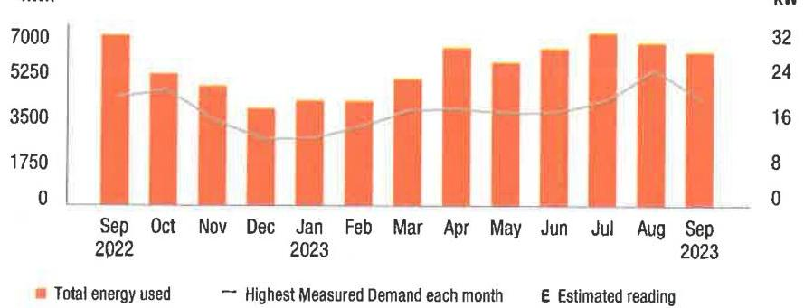

The image is a bar and line chart showing a **yearly usage breakdown (monthly-based)** of electricity consumption and demand from September 2022 to September 2023.

- **Chart Type**: Bar and line chart
- **X-axis**: Months from Sep 2022 to Sep 2023
- **Y-axis (left)**: kWh ranging from 0 to 7000
- **Y-axis (right)**: kW ranging from 0 to 32
- **Legend**:
  - Orange bars represent "Total energy used"
  - A gray line represents "Highest Measured Demand each month"
  - A symbol (not clearly visible) indicates "Estimated reading"

- **Data Points**:
  - Bars show varying energy usage each month, with peaks around September 2022 and July 2023.
  - The line shows the highest measured demand each month, with a noticeable peak around July 2023.

- **Styling**:
  - Orange bars for energy usage
  - Gray line for demand
  - The chart uses a dual-axis to represent both kWh and kW.

Visit MyAccount for more details regarding your energy usage.

## MEASURED DEMAND

Demand kW
18.10

Measured Demand is the maximum use of electricity at any time during a monthly time period, as measured by your meter.

## BILLED DEMAND

Annual Demand kW
18.10

Summer Demand kW
18.10

## SUPPLY CAPACITY

Generation kW
17.661

Transmission kW
15.953

Supply capacity is required to serve the system's annual peak usage. It represents your share of these facilities, in kilowatts (kW). It is calculated based on your peak usage from the previous summer. Supply capacity values are updated periodically throughout the year and are prorated based on your service period.

## Price to compare

If you want to consider getting your electric supply from another supplier, compare their price with ours. This month, your cost for energy supply is $\$ 641.87$. This price to compare varies month to month, depending on your usage.

Your PoD ID is: PE000009012753158492 -
Your PoD ID is your Point of Delivery identification within PSE\&G's system. You will need this number if you are considering enrolling with another supplier.

la.pnqnqj|10\&fed1.1.pegblll.202309222117.ctv=137114-030040827

## Your energy bill

## Message Center

This bill reflects a BPU-approved change in the Supply portion of your electric bill effective on and after September 1, 2023. The increase in the Supply portion of your bill is due to a change in the Transmission rate. The overall impact for business customers will vary by individual customer usage. Tariff information may also be found by visiting pseg.com.

The success of your business is important to us. We are working hard to make it easier to do business with us. To learn more about how we can help, visit pseg.com/Business.
J.D. Power named PSE\&G \#1 in customer satisfaction for both Residential Electric and Natural Gas Service in the East among Large Utilities. On behalf of the more than 12,000 PSEG employees who work hard every day, we thank you for rating us as a top utilities provider. For J.D. Power 2022 award information, visit jdpower.com/awards.

## (2) NEXT METER READING October 20, 2023

## How to contact us

## 1-855-BIZ-PSEG (249-7734)

Customer Service: 8am to 5.30pm Mon to Fri,
Closed on weekends and holidays
Emergencies / Outages / WorryFree Services: 24/7
TTY for the hearing impaired: 1-800-225-0072
Visit pseg.com/myaccount to access your account anytime
Text us. Register for MyAlerts by texting REG to 4PSEG(47734)
$>$ Text OUT to report an outage.
facebook.com/pseg
twitter.com/psegdeilvers

## PSEG

We make change work for you.

## PAY YOUR WAY, 24/7

We offer a variety of methods that make it easy to pay your bill. See reverse side for more information.

By checking this box, I authorize PSE\&G to enroll me in paperless billing at this email address:

068558000040826
$\left.\mathrm{J}^{1} \mathrm{~J}\left[\left|\int_{1} \mathrm{HJ}\left(\mathrm{J}^{1} \mathrm{HJ}\left[\mathrm{JHJ}\left[\mathrm{HJ}\right] \mathrm{HJ}\left[\mathrm{J}^{1} \mathrm{HJ}\left[\mathrm{J}^{1} \mathrm{HJ}\left[\mathrm{J}^{1} \mathrm{HJ}\left[\mathrm{JHJ}\right] \mathrm{HJ}\right] \mathrm{HJ}\right] \mathrm{HJ}\right] \mathrm{HJ}\right] \mathrm{HJ}\right] \mathrm{HJ}\right]$ HOTEL WOODBRIDGE LLC
120 WOOD AVE S
ISELIN NJ 08830-2736

## TOTAL amount due

You do not need to make a payment.
Bilts automatic bill payment. We thdebit your bank account on Oct 10, 2023

Bill date: September 25, 2023
For the period: August 23, 2023 to September 21, 2023

## HOTEL WOODBRIDGE LLC

ACCOUNT NUMBER
7222167706

## SERVICE ADDRESS

120 WOOD AVE S BLG-55 WOODBRIDGE TWP NJ 08830-2711

## Your billing summary

Balance remaining from your last bill
PSE\&G balance from last bill \$136.87
Lose Payment received September 8, 2023 - thank you! - \$136.87
Balance remaining from your last bill \$0.00

This month's charges and credits
Electric charges - PSE\&G \$132.49
This month's charges and credits \$132.49
Total amount we'll debit your \$132.49
account on Oct 10, 2023

Account number
7222167706
Automatic bill payment - do not pay

## Amount enclosed

$\mathrm{J}^{1} \mathrm{~J}\left[\left|\int_{1} \mathrm{HJ}\left(\mathrm{J}^{1} \mathrm{HJ}\left[\mathrm{JHJ}\left[\mathrm{HJ}\right] \mathrm{HJ}\left[\mathrm{J}^{1} \mathrm{HJ}\left[\mathrm{J}^{1} \mathrm{HJ}\left[\mathrm{J}^{1} \mathrm{HJ}\left[\mathrm{JHJ}\right] \mathrm{HJ}\right] \mathrm{HJ}\right] \mathrm{HJ}\right] \mathrm{HJ}\right] \mathrm{HJ}\right] \mathrm{HJ}\right]$
HOTEL WOODBRIDGE LLC
120 WOOD AVE S
ISELIN NJ 08830-2736

## Message Center (Continued from page 1)

Si desea recibir en español una notificación de desconexión del servicio, llame al 1-800-357-2262.

Stay connected during hurricane season! Sign up for My Alerts to report power outages via text message, as well as receive outage updates by text and email. For more information, visit pseg.com/myalerts.

PSE\&G is installing smart meters that will provide electric customers with a number of benefits. These include more detailed electric-use information, near real-time power outage detection, and the elimination of almost all estimated electric bills. To learn more, visit pseg.com/smartmeters.

If you've ever misplaced your bill or had a due date slip your mind, it's time to sign up for Paperless Billing! Instead of receiving a paper bill each month, you'll get a monthly email showing your bill amount and due date, with the ability to view/print your current and past bills 24/7. To sign up, log in to My Account at pseg.com, and select "Paperless Billing."

At PSE\&G, we are committed to supporting your business needs. That's why we created a dedicated, toll-free phone number to address your energy questions and concerns. PSE\&G's Business Solutions Center is available Monday-Friday, 7:00 a.m. -5:30 p.m. at 1-855-249-7734 (1-855-BiZ-PSEG).

## Don't miss your meter reading

If you'll be away on your meter reading day, use our mobile app to upload a picture of your meter or enter your reading manually, or call 1-800-622-0197.

## Electric \& Gas Rate Information

For news about PSE\&G's rate filing and upcoming public hearings visit www.peeg.com/pseandgfilings. Under applicable tax law, the State Sales and Use Tax and corporate business tax are imposed upon the energy you have used.

# IT'S YOUR BILL. HOW YOU PAY IS YOUR CHOICE. 

## My Account

Make a payment anytime from a checking or savings account stored in My Account. Visit pseg.com/ myaccount

Mobile: Download our Mobile App "PSE\&G"
Pay by text: Text PAY to 4PSEG (47734)

Voice: Ask Alena or use Google Assistant.

## Automatic BillPay

Automatic payments from your bank. Skip checks and stamps. Never worry about due dates.

Enroll at:
pseg.com/autopay

## Credit Card

Pay your bill with a credit card online or by phone. Because we don't use customer rates to subsidize the cost of this service, there is a fee.

## My Account:

pseg.com/myaccount

Phone:
1-833-277-8710

## Phone

Bank Account:
1-800-553-7734
Credit Card:
1-833-277-8710

## $>$ My Mail

Make your check payable to PSE\&G and write your account number on your check.

When you pay by check, you authorize PSE\&G to make a one-time electronic fund transfer from your account, in the amount of your check. If you prefer not to authorize us, call 1-800-436-PSEG

## In Person

Payments are accepted at any customer service center or authorized location

Locations can be found at: pseg.com/csc

Details of your electric charges Your rate: General Lighting \& Power (GLP)

| Meter \# 316021180 | Usage |
| :--: | :--: |
| Actual reading Sep 21, 2023 | 32847 |
|  | 32441 |
| Total electric you used in 30 days | 406 kWh |

## Delivery charges

| Monthly service charge | $\$ 5.04$ |
| :--: | :--: |
| Charges for delivering electric to you: |  |
| Annual Demand | 1.000 kW x $\$ 5.300000$ |
| The highest Measured Demand in any time period in the current month. | $\$ 5.30$ |
| Summer Demand | 1.000 kW x $\$ 10.040000$ |
| The Measured Demand (excluding off-peak) in each billing month of June through September. |  |
| kWh charges | 406 kWh x $\$ 0.011158$ |
| Societal Benefits | 406 kWh x $\$ 0.010419$ |
| This charge recovers the cost of government mandated programs designed to achieve public policy goals, such as energy conservation. | $\$ 4.53$ |
| Total electric delivery charges | $\$ 29.14$ |
| Supply charges |  |
| BGS Capacity |  |
| Generation | 5.535 kW x $\$ 1.741644$ |
| Transmission | 4.999 kW x $\$ 13.292659$ |
| Cost of electric supplied by PSE\&G: |  |
| Charges |  |
| For the first | 121 kWh x $\$ 0.073223$ |
| For the next | 285 kWh x $\$ 0.064561$ |
| Total electric supply charges | $\$ 103.35$ |

## Total electric charges

\$132.49

## Your monthly electric use

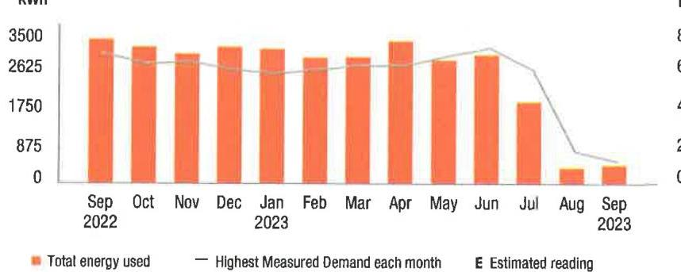

The image is a bar chart showing a **yearly usage breakdown (monthly-based)** of electricity consumption from September 2022 to September 2023. 

- **Chart Type**: Bar chart
- **Y-Axis Title**: kWh
- **Y-Axis Units**: 0 to 3500 in increments of 875
- **X-Axis Labels**: Sep 2022, Oct, Nov, Dec, Jan 2023, Feb, Mar, Apr, May, Jun, Jul, Aug, Sep 2023
- **Legend Entries**:
  - Orange bars: Total energy used
  - Grey line: Highest Measured Demand each month
  - "E": Estimated reading

The chart shows consistent energy usage from September 2022 to May 2023, with a noticeable decrease from June to September 2023. The highest measured demand line fluctuates slightly but generally follows the pattern of the energy usage bars.

Visit MyAccount for more details regarding your energy usage.

## MEASURED DEMAND

Demand kW
1.00

Measured Demand is the maximum use of electricity at any time during a monthly time period, as measured by your meter.

## BILLED DEMAND

Annual Demand kW
1.00

Summer Demand kW
1.00

## SUPPLY CAPACITY

Generation kW
5.535

Transmission kW
4.999

Supply capacity is required to serve the system's annual peak usage. It represents your share of these facilities, in kilowatts (kW). It is calculated based on your peak usage from the previous summer. Supply capacity values are updated periodically throughout the year and are prorated based on your service period.

## Price to compare

If you want to consider getting your electric supply from another supplier, compare their price with ours. This month, your cost for energy supply is $\$ 103.35$. This price to compare varies month to month, depending on your usage.

Your PoD ID is: PE000010959988658492 Your PoD ID is your Point of Delivery identification within PSE\&G's system. You will need this number if you are considering enrolling with another supplier.

le.pnpeg.il/ds8a01/pegb0l.202309222117.rav-137:19-050040638

## (1) PSEG

We make things work for you.

## Your energy bill

## (1) Message Center

This bill reflects a BPU-approved change in the Supply portion of your electric bill effective on and after September 1, 2023. The increase in the Supply portion of your bill is due to a change in the Transmission rate. The overall impact for business customers will vary by individual customer usage. Tariff information may also be found by visiting pseg.com.

The success of your business is important to us. We are working hard to make it easier to do business with us. To learn more about how we can help, visit pseg.com/Business.
J.D. Power named PSE\&G \#1 in customer satisfaction for both Residential Electric and Natural Gas Service in the East among Large Utilities. On behalf of the more than 12,000 PSEG employees who work hard every day, we thank you for rating us as a top utilities provider. For J.D. Power 2022 award information, visit jdpower.com/awards.

## (2) NEXT METER READING October 20, 2023

## How to contact us

## 1-855-BIZ-PSEG (249-7734)

Customer Service: 8am to 5:30pm Mon to Fri,
Closed on weekends and holidays
Emergencies / Outages / WorryFree Services: 24/7
TTY for the hearing impaired: 1-800-225-0072
Visit pseg.com/myaccount to access your account anytime
Text us. Register for MyAlerts by texting REG to 4PSEG(47734)
$>$ Text OUT to report an outage.
facebook.com/pseg
twitter.com/psegdellvers

## PSEG

We make things work for you.

## PAY YOUR WAY, 24/7

We offer a variety of methods that make it easy to pay your bill. See reverse side for more information.

By checking this box, I authorize PSE\&G to enroll me in paperless billing at this email address:

068560000040825
$\left.\mathrm{I}_{\mathrm{I}} \mathrm{I}_{\mathrm{I}} \mathrm{I}_{\mathrm{I}} \mathrm{I}_{\mathrm{I}} \mathrm{I}_{\mathrm{I}} \mathrm{I}_{\mathrm{I}} \mathrm{I}_{\mathrm{I}} \mathrm{I}_{\mathrm{I}} \mathrm{I}_{\mathrm{I}} \mathrm{I}_{\mathrm{I}} \mathrm{I}_{\mathrm{I}} \mathrm{I}_{\mathrm{I}} \mathrm{I}_{\mathrm{I}} \mathrm{I}_{\mathrm{I}} \mathrm{I}_{\mathrm{I}} \mathrm{I}_{\mathrm{I}} \mathrm{I}_{\mathrm{I}} \mathrm{I}_{\mathrm{I}} \mathrm{I}_{\mathrm{I}} \mathrm{I}_{\mathrm{I}} \mathrm{I}_{\mathrm{I}} \mathrm{I}_{\mathrm{I}} \mathrm{I}_{\mathrm{I}} \mathrm{I}_{\mathrm{I}} \mathrm{I}_{\mathrm{I}} \mathrm{I}_{\mathrm{I}} \mathrm{I}_{\mathrm{I}} \mathrm{I}_{\mathrm{I}} \mathrm{I}_{\mathrm{I}} \mathrm{I}_{\mathrm{I}} \mathrm{I}_{\mathrm{I}} \mathrm{I}_{\mathrm{I}} \mathrm{I}_{\mathrm{I}} \mathrm{I}_{\mathrm{I}} \mathrm{I}_{\mathrm{I}} \mathrm{I}_{\mathrm{I}} \mathrm{I} \mathrm{I}_{\mathrm{I}} \mathrm{I} \mathrm{I} \mathrm{I} \mathrm{I} \mathrm{I} \mathrm{I} \mathrm{I} \mathrm{I} \mathrm{I} \mathrm{I} \mathrm{I} \mathrm{I} \mathrm{I} \mathrm{I} \mathrm{I} \mathrm{I} \mathrm{I} \mathrm{I} \mathrm{I} \mathrm{I} \mathrm{I} \mathrm{I} \mathrm{I} \mathrm{I} \mathrm{I} \mathrm{I} \mathrm{I} \mathrm{I} \mathrm{I} \mathrm{I} \mathrm{I} \mathrm{I} \mathrm{I} \mathrm{I} \mathrm{I} \mathrm{I} \mathrm{I} \mathrm{I} \mathrm{I} \mathrm{I} \mathrm{I} \mathrm{I} \mathrm{I} \mathrm{I} \mathrm{I} \mathrm{I} \mathrm{I} \mathrm{I} \mathrm{I} \mathrm{I}

## Message Center (Continued from page 1)

Si desea recibir en español una notificación de desconexión del servicio, llame al 1-800-357-2262.

Stay connected during hurricane season! Sign up for My Alerts to report power outages via text message, as well as receive outage updates by text and email. For more information, visit pseg.com/myalerts.

PSE\&G is installing smart meters that will provide electric customers with a number of benefits. These include more detailed electric-use information, near real-time power outage detection, and the elimination of almost all estimated electric bills. To learn more, visit pseg.com/smartmeters.

If you've ever misplaced your bill or had a due date slip your mind, it's time to sign up for Paperless Billing! Instead of receiving a paper bill each month, you'll get a monthly email showing your bill amount and due date, with the ability to view/print your current and past bills 24/7. To sign up, log in to My Account at pseg.com, and select "Paperless Billing."

At PSE\&G, we are committed to supporting your business needs. That's why we created a dedicated, toll-free phone number to address your energy questions and concerns. PSE\&G's Business Solutions Center is available Monday-Friday, 7:00 a.m. -5:30 p.m. at 1-855-249-7734 (1-855-BIZ-PSE6).

## Don't miss your meter reading

If you'll be away on your meter reading day, use our mobile app to upload a picture of your meter or enter your reading manually, or call 1-800-622-0197.

## Electric \& Gas Rate Information

For news about PSE\&G's rate filing and upcoming public hearings visit www.pseg.com/pseandgfilings. Under applicable tax law, the State Sales and Use Tax and corporate business tax are imposed upon the energy you have used.

# IT'S YOUR BILL. HOW YOU PAY IS YOUR CHOICE. 

## 1.1) My Account

Make a payment anytime from a checking or savings account stored in My Account. Visit pseg.com/ myaccount

Mobile: Download on Mobile App "PSE\&G"
Pay by text: Text PAY to -IPSEG (47734)

Voice: Ask Alena or use Google Assistant

## 2 Automatic BillPay

Automatic payments from your bank. Skip checks and stamps. Never worry about due dates.

## Enroll at:

pseg.com/autopay

## 3 Credit Card

Pay your bill with a credit card online or by phone. Because we don't use customer rates to subsidize the cost of this service, there is a fee.

## My Account:

pseg.com/myaccount

Phone:
1-833-277-8710

## Phone

Bank Account: 1-800-553-7734

## Credit Card:

1-833-277-8710

## 4.1 By Mail

Make your check payable to PSE\&G and write your account number on your check.

When you pay by check, you authorize PSE\&G to make a one-time electronic fund transfer from your account, in the amount of your check. If you prefer not to authorize us, call 1-800-436-PSEG

## 5 In Person

Payments are accepted at any customer service center or authorized location.

Locations can be found at: pseg.com/csc

| Details of your electric charges |  |
| :--: | :--: |
| Your rate: General Lighting \& Power (GLP) |  |
| Meter \# 316021182 | Usage |
| Actual reading Sep 21, 2023 | 42703 |
| Less Actual reading Aug 22, 2023 | 39397 |
| Total electric you used in 30 days | 3,306 kWh |

## Delivery charges

| Monthly service charge | $\$ 5.04$ |
| :--: | :--: |
| Charges for delivering electric to you: |  |
| Annual Demand | $13,400 \mathrm{~kW} \times \$ 5.302985$ |
| The highest Measured Demand in any time period in the current month. |  |
| Summer Demand | $13,400 \mathrm{~kW} \times \$ 10.037313$ |
| The Measured Demand (excluding off-peak) in each billing month of June through September. |  |
| kWh charges | 3,306 kWh $\times \$ 0.011146$ |
| Socielal Benefits | 3,306 kWh $\times \$ 0.010414$ |
| This charge recovers the cost of government mandated programs designed to achieve public policy goals, such as energy conservation. |  |
| Total electric delivery charges | $\$ 281.88$ |
| Supply charges |  |
| BGS Capacity |  |
| Generation | $5,319 \mathrm{~kW} \times \$ 1.740929$ |
| Transmission | $4,804 \mathrm{~kW} \times \$ 13.295171$ |
| Cost of electric supplied by PSE\&G: |  |
| Charges |  |
| For the first | $991 \mathrm{kWh} \times \$ 0.073249$ |
| For the next | $2,315 \mathrm{kWh} \times \$ 0.064562$ |
| Total electric supply charges | $\$ 295.18$ |

## Total electric charges

$\$ 577.06$

## Your monthly electric use

kWh
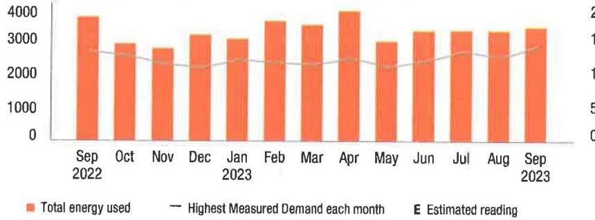

The image is a bar chart showing the "Total energy used" from September 2022 to September 2023. The x-axis represents the months, while the y-axis represents energy usage in kWh, ranging from 0 to 4000. Each bar corresponds to a month's total energy usage, with a line indicating the "Highest Measured Demand each month." There is also a legend indicating that an "E" would represent an estimated reading, though no such markings are visible on the chart. The chart provides a yearly usage breakdown (monthly-based) with consistent energy usage across the months, with slight variations.

Visit MyAccount for more details regarding your energy usage.

## MEASURED DEMAND

Demand kW
13,40
Measured Demand is the maximum use of electricity at any time during a monthly time period, as measured by your meter.

## BILLED DEMAND

Annual Demand kW
13,40
Summer Demand kW
13,40

## SUPPLY CAPACITY

| Generation kW | 5,319 |
| :-- | --: |
| Transmission kW | 4,804 |

Supply capacity is required to serve the system's annual peak usage. It represents your share of these facilities, in kilowatts (kW). It is calculated based on your peak usage from the previous summer. Supply capacity values are updated periodically throughout the year and are prorated based on your service period.

## Price to compare

If you want to consider getting your electric supply from another supplier, compare their price with ours. This month, your cost for energy supply is $\$ 295.18$. This price to compare varies month to month, depending on your usage.

Your PoD ID is: PE000008769505258492 Your PoD ID is your Point of Delivery identification within PSE\&G's system. You will need this number if you are considering enrolling with another supplier.

la.popag.il066a013.peg0d8 2023080321117.000-137122-050040825

## (1) PSE\&G

We make things work for you.

## Your energy bill

## (1) Message Center

This bill reflects a BPU-approved change in the Supply portion of your electric bill effective on and after September 1, 2023. The increase in the Supply portion of your bill is due to a change in the Transmission rate. The overall impact for business customers will vary by individual customer usage. Tariff information may also be found by visiting pseg.com.

The success of your business is important to us. We are working hard to make it easier to do business with us. To learn more about how we can help, visit pseg.com/Business.
J.D. Power named PSE\&G \#1 in customer satisfaction for both Residential Electric and Natural Gas Service in the East among Large Utilities. On behalf of the more than 12,000 PSEG employees who work hard every day, we thank you for rating us as a top utilities provider. For J.D. Power 2022 award information, visit jdpower.com/awards.

## NEXT METER READING October 20, 2023

## How to contact us

## 1-855-BIZ-PSEG (249-7734)

Customer Service: 8am to 5:30pm Mon to Fri,
Closed on weekends and holidays
Emergencies / Outages / WorryFree Services: 24/7
TTY for the hearing impaired: 1-800-225-0072
Visit pseg.com/myaccount to access your account anytime
Text us. Register for MyAlerts by texting REG to 4PSEG(47734)
$>$ Text OUT to report an outage.
facebook.com/pseg
twitter.com/psegdelivers

## PSE\&G

We make things work for you.

## PAY YOUR WAY, 24/7

We offer a variety of methods that make it easy to pay your bill. See reverse side for more information.

By checking this box, I authorize PSE\&G to enroll me in paperless billing at this email address:

068564000040823
$\left.{ }^{\prime}\right|\| \|_{1}\|_{\|}\|_{\|}| | \mid| | \mid| | \mid| | \mid| | \mid| | \mid| | \mid| | \mid| | \mid| | \mid| | \mid| | \mid| | \mid| | \mid| | \mid| | \mid| | \mid| | \mid| | \mid| | \mid| | \mid| | \mid| | \mid| | \mid| | \mid| | \mid| | \mid| | \mid| | \mid| | \mid| | \mid| | \mid| | \mid| | \mid| | \mid| | \mid| | \mid| | \mid| | \mid| | \mid| | \mid| | \mid| | \mid| | \mid| | \mid| | \mid| | \mid| | \mid| | \mid| | \mid|

## Message Center (Continued from page 1)

Si desea recibir en español una notificación de desconexión del servicio, llame al 1-800-357-2262.

Stay connected during hurricane season! Sign up for My Alerts to report power outages via text message, as well as receive outage updates by text and email. For more information, visit pseg.com/myalerts.

PSE\&G is installing smart meters that will provide electric customers with a number of benefits. These include more detailed electric-use information, near real-time power outage detection, and the elimination of almost all estimated electric bills. To learn more, visit pseg.com/smartmeters.

If you've ever misplaced your bill or had a due date slip your mind, it's time to sign up for Paperless Billing! Instead of receiving a paper bill each month, you'll get a monthly email showing your bill amount and due date, with the ability to view/print your current and past bills 24/7. To sign up, log in to My Account at pseg.com, and select "Paperless Billing."

At PSE\&G, we are committed to supporting your business needs. That's why we created a dedicated, toll-free phone number to address your energy questions and concerns. PSE\&G's Business Solutions Center is available Monday-Friday, 7:00 a.m. -5:30 p.m. at 1-855-249-7734 (1-855-BIZ-PSEG).

## Don't miss your meter reading

If you'll be away on your meter reading day, use our mobile app to upload a picture of your meter or enter your reading manually, or call 1-800-622-0197.

## Electric \& Gas Rate Information

For news about PSE\&G's rate filing and upcoming public hearings visit www.pseg.com/pseandgfilings. Under applicable tax law, the State Sales and Use Tax and corporate business tax are imposed upon the energy you have used.

# IT'S YOUR BILL. HOW YOU PAY IS YOUR CHOICE. 

## My Account

Make a payment anytone from a checking or savings account stored in My Account. Visit pseg.com/ myaccount

Mobile: Download our Mobile App "PSE\&G"
Pay by text: Text PAY to 4PSEG (47734)

Voice: Ask Alena of the Google Assistant

## Automatic BillPay

Automatic payments from your bank. Skip checks and stamps. Never worry about due dates.

Enroll at:
pseg.com/autopay

## Credit Card

Pay your bill with a credit card online or by phone. Because we don't use customer rates to subsidize the cost of this service, there is a fee.

## My Account:

pseg.com/myaccount

Phone:
1-803-277-8710

## Phone

Bank Account:
1-800-553-7734
Credit Card:
1-803-277-8710

## $>$ By Mail

Make your check payable to PSE\&G and write your account number on your check.

When you pay by check, you authorize PSE\&G to make a one-time electronic fund transfer from your account, in the amount of your check. If you prefer not to authorize us, call 1-800-436-PSEG.

## In Person

Payments are accepted at any customer service center or authorized location.

Locations can be found at: pseg.com/csc

Details of your electric charges Your rate: General Lighting \& Power (GLP)

| Meter \# 316021183 | Usage |
| :--: | :--: |
| Actual reading Sep 21, 2023 | 21500 |
| Less Actual reading Aug 22, 2023 | 18859 |
| Total electric you used in 30 days | 2,641 kWh |

## Delivery charges

| Monthly service charge | $\$ 5.04$ |
| :-- | --: |
| Charges for delivering electric to you: | $\$ 44.54$ |
| Annual Demand |  |
| The highest Measured Demand in any time period in the |  |
| current month. | $\$ 84.32$ |
| Summer Demand |  |
| The Measured Demand (excluding off-peak) in each billing |  |
| month of June through September. | $\$ 29.44$ |
| kWh charges | $2,641 \mathrm{kWh} \times \$ 0.011147$ |
| Societal Benefits | 2,641 kWh $\times \$ 0.010413$ |
| This charge recovers the cost of government mandated |  |
| programs designed to achieve public policy goals, such as |  |
| energy conservation. |  |

Total electric delivery charges
Supply charges
BGS Capacity
Generation
Transmission
Cost of electric supplied by PSE\&G:
Charges
For the first
For the next
Total electric supply charges
Total electric charges
\$190.84
\$14.10
\$97.23
\$58.01
\$119.38
\$288.72

## 4

## Your monthly electric use

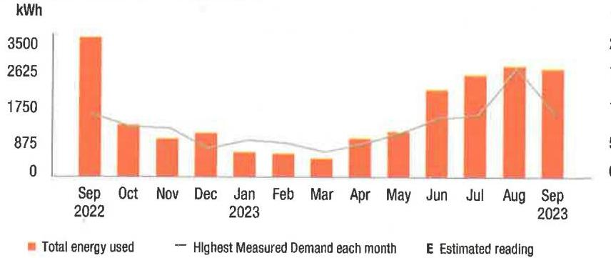

The image is a bar and line chart.

- **Chart Type**: Combination of bar and line chart.
- **X-Axis**: Time period from September 2022 to September 2023, labeled with months.
- **Y-Axis**: kWh (kilowatt-hours), with values ranging from 0 to 3500.
- **Legend Entries**:
  - Orange bars represent "Total energy used."
  - A gray line represents "Highest Measured Demand each month."
  - "E" indicates "Estimated reading."
- **Data Points**:
  - **Total Energy Used**: 
    - Sep 2022: Approximately 3500 kWh
    - Oct 2022: Approximately 1750 kWh
    - Nov 2022: Approximately 1750 kWh
    - Dec 2022: Approximately 875 kWh
    - Jan 2023: Approximately 875 kWh
    - Feb 2023: Approximately 875 kWh
    - Mar 2023: Approximately 875 kWh
    - Apr 2023: Approximately 875 kWh
    - May 2023: Approximately 1750 kWh
    - Jun 2023: Approximately 1750 kWh
    - Jul 2023: Approximately 2625 kWh
    - Aug 2023: Approximately 2625 kWh
    - Sep 2023: Approximately 2625 kWh
  - **Highest Measured Demand**: 
    - Fluctuates slightly each month, with a peak around August 2023.
- **Yearly Usage Breakdown (Monthly-Based)**: The chart provides a visual representation of monthly energy usage and demand over the course of a year, highlighting seasonal variations.

Visit MyAccount for more details regarding your energy usage.

## MEASURED DEMAND

## Demand kW

Measured Demand is the maximum use of electricity at any time during a monthly time period, as measured by your meter.

## BILLED DEMAND

Annual Demand kW
Summer Demand kW
8.40

## SUPPLY CAPACITY

Generation kW
8.098

Transmission kW
7.314

Supply capacity is required to serve the system's annual peak usage. It represents your share of these facilities, in kilowatts (kW). It is calculated based on your peak usage from the previous summer. Supply capacity values are updated periodically throughout the year and are prorated based on your service period.

## Price to compare

If you want to consider getting your electric supply from another supplier, compare their price with ours. This month, your cost for energy supply is $\$ 288.72$. This price to compare varies month to month, depending on your usage.

Your PoD ID is: PE000009499470458492 Your PoD ID is your Point of Delivery identification within PSE\&G's system. You will need this number if you are considering enrolling with another supplier.

la.popag.110abef11.1@gmail.212309222117.rxv-137130-000040823

## Your energy bill

## Message Center

This bill reflects a BPU-approved change in the Supply portion of your electric bill effective on and after September 1, 2023. The increase in the Supply portion of your bill is due to a change in the Transmission rate. The overall impact for business customers will vary by individual customer usage. Tariff information may also be found by visiting pseg.com.

The success of your business is important to us. We are working hard to make it easier to do business with us. To learn more about how we can help, visit pseg.com/Business.
J.D. Power named PSE\&G \#1 in customer satisfaction for both Residential Electric and Natural Gas Service in the East among Large Utilities. On behalf of the more than 12,000 PSEG employees who work hard every day, we thank you for rating us as a top utilities provider. For J.D. Power 2022 award information, visit jdpower.com/awards.

## (3) NEXT METER READING October 20, 2023

## How to contact us

## 1-855-8IZ-PSEG (249-7734)

Customer Service: 8am to 5:30pm Mon to Fri,
Closed on weekends and holidays
Emergencies / Outages / WorryFree Services: 24/7
TTY for the hearing impaired: 1-800-225-0072
Visit pseg.com/myaccount to access your account anytime
Text us. Register for MyAlerts by texting REG to 4PSEG(47734)
$>$ Text OUT to report an outage.
facebook.com/pseg
twitter.com/psegdeilvers

## PSEG

We make things work for you.

## PAY YOUR WAY, 24/7

We offer a variety of methods that make it easy to pay your bill. See reverse side for more information.

By checking this box, I authorize PSE\&G to enroll me in paperless billing at this email address:

068562000040824
loldn|j|j|h|j|j|j|j|h|h|j|h|j|j|j|j|j|j|j|j|j|j|j|j|j|j|j|j|j|j|j|j|j|j|j|j|j|j|j|j|j|j|j|j|j|j|j|j|j|j|j|j|j|j|j|j|j|j|j|j|j|j|j|j|j|j|j|j|j|j|j|j|j|j|j|j|j|j|j|j|j|j|j|j|j|j|j|j|j|j|j|j|j|j|j|j|j|j|j|j|j|j|j|j|j|j|j|j|j|j|j|j

## (1) Message Center (Continued from page 1)

Si desea recibir en español una notificación de desconexión del servicio, llame al 1-800-357-2262.

Stay connected during hurricane season! Sign up for My Alerts to report power outages via text message, as well as receive outage updates by text and email. For more information, visit pseg.com/myalerts.

PSE\&G is installing smart meters that will provide electric customers with a number of benefits. These include more detailed electric-use information, near real-time power outage detection, and the elimination of almost all estimated electric bills. To learn more, visit pseg.com/smartmeters.

If you've ever misplaced your bill or had a due date slip your mind, it's time to sign up for Paperless Billing! Instead of receiving a paper bill each month, you'll get a monthly email showing your bill amount and due date, with the ability to view/print your current and past bills 24/7. To sign up, log in to My Account at pseg.com, and select "Paperless Billing."

At PSE\&G, we are committed to supporting your business needs. That's why we created a dedicated, toll-free phone number to address your energy questions and concerns. PSE\&G's Business Solutions Center is available Monday-Friday, 7:00 a.m. -5:30 p.m. at 1-855-249-7734 (1-855-BIZ-PSEG).

## Don't miss your meter reading

If you'll be away on your meter reading day, use our mobile app to upload a picture of your meter or enter your reading manually, or call 1-800-622-0197.

## Electric \& Gas Rate Information

For news about PSE\&G's rate filing and upcoming public hearings visit www.pseg.com/pseandgfilings. Under applicable tax law, the State Sales and Use Tax and corporate business tax are imposed upon the energy you have used.

# IT'S YOUR BILL. HOW YOU PAY IS YOUR CHOICE. 

## 1.1) My Account

Make a payment anytime from a checking or savings account stored in My Account. Visit pseg.com/ myaccount

Mobile: Download our Mobile App "PSE\&G"

Pay by text: Text PAY to 4PSEG (47734)

Voice: Ask Alexa or use Google Assistant:

## 2 Automatic BillPay

Automatic payments from your bank. Skip checks and stamps. Never worry about due dates.

Enroll at:
pseg.com/Godspay

## Credit Card

Pay your bill with a credit card online or by phone. Because we don't use customer rates to subsidize the cost of this service, there is a fee.

## My Account:

pseg.com/myaccount

Phone:
1-833-277-8710

## Phone

Bank Account: 1-800-553-7734

Credit Card:
1-833-277-8710

## 3 By Mail

Make your check payable to PSE\&G and write your account number on your check.

When you pay by check, you authorize PSE\&G to make a one-time electronic fund transfer from your account, in the amount of your check. If you prefer not to authorize us, call 1-800-436-PSEG.

## 4 In Person

Payments are accepted at any customer service center or authorized location.

Locations can be found at: pseg.com/csc

Details of your electric charges Your rate: General Lighting \& Power (GLP)

| Meter \# 316021255 | Usage |
| :--: | :--: |
| Actual reading Sep 21, 2023 | 21233 |
| Less Actual reading Aug 22, 2023 | 20700 |
| Total electric you used in 30 days | 533 kWh |

## Delivery charges

| Monthly service charge | $\$ 5.04$ |
| :--: | :--: |
| Charges for delivering electric to you: |  |
| Annual Demand | $4,600 \mathrm{~kW} \times \$ 5.304348$ |
| The highest Measured Demand in any time period in the current month. |  |
| Summer Demand | $4,600 \mathrm{~kW} \times \$ 10.036957$ |
| The Measured Demand (excluding off-peak) in each billing month of June through September. |  |
| kWh charges | $533 \mathrm{kWh} \times \$ 0.011144$ |
| Societal Benefits | 533 kWh $\times \$ 0.010413$ |
| This charge recovers the cost of government mandated programs designed to achieve public policy goals, such as energy conservation. |  |
| Total electric delivery charges | $\$ 87.10$ |
| Supply charges |  |
| BGS Capacity |  |
| Generation | $10.443 \mathrm{~kW} \times \$ 1.740879$ |
| Transmission | $9.432 \mathrm{~kW} \times \$ 13.294105$ |
| Cost of electric supplied by PSE\&G: |  |
| Charges |  |
| For the first | $159 \mathrm{kWh} \times \$ 0.073270$ |
| For the next | $374 \mathrm{kWh} \times \$ 0.064572$ |
| Total electric supply charges | $\$ 179.37$ |
| Total electric charges | $\$ 266.47$ |

## Your monthly electric use

kWh
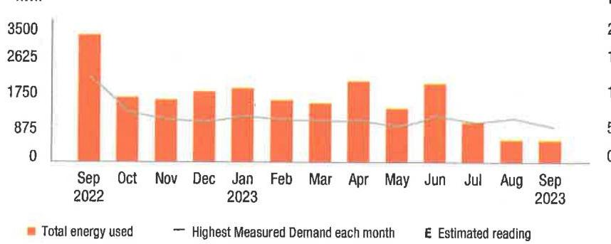

The image is a bar chart with a line graph overlay.

- **Chart Type**: Bar chart with a line graph.
- **X-axis**: Months from September 2022 to September 2023.
- **Y-axis**: Values ranging from 0 to 3500.
- **Legend**:
  - Orange bars represent "Total energy used."
  - A gray line represents "Highest Measured Demand each month."
  - "E" indicates "Estimated reading."
- **Data Points**:
  - The bars show varying heights, with the highest around September 2022 and April 2023.
  - The line graph shows fluctuations in demand, generally trending downward.
- **Yearly Usage Breakdown (monthly-based)**: The chart provides a visual representation of monthly energy usage and demand over a year.
- **Styling**: Orange bars and a gray line are used for differentiation.

Visit MyAccount for more details regarding your energy usage.

## MEASURED DEMAND

Demand kW
4.60

Measured Demand is the maximum use of electricity at any time during a monthly time period, as measured by your meter.

## BILLED DEMAND

Annual Demand kW
4.60

Summer Demand kW
4.60

## SUPPLY CAPACITY

| Generation kW | 10.443 |
| :-- | --: |
| Transmission kW | 9.432 |

Supply capacity is required to serve the system's annual peak usage. It represents your share of these facilities, in kilowatts (kW). It is calculated based on your peak usage from the previous summer. Supply capacity values are updated periodically throughout the year and are prorated based on your service period.

## Price to compare

If you want to consider getting your electric supply from another supplier, compare their price with ours. This month, your cost for energy supply is $\$ 179.37$. This price to compare varies month to month, depending on your usage.

Your PoD ID is: PE000008042405458492 Your PoD ID is your Point of Delivery identification within PSE\&G's system. You will need this number if you are considering enrolling with another supplier.

la.pnqnq.(10d4a01.1)mgb01 202309222117.rav-137128-000040824

## (1) PSEG

We make things work for you.

## Your energy bill

## (1) Message Center

This bill reflects a BPU-approved change in the Supply portion of your electric bill effective on and after September 1, 2023. The increase in the Supply portion of your bill is due to a change in the Transmission rate. The overall impact for business customers will vary by individual customer usage. Tariff information may also be found by visiting pseg.com.

The success of your business is important to us. We are working hard to make it easier to do business with us. To learn more about how we can help, visit pseg.com/Business.
J.D. Power named PSE\&G \#1 in customer satisfaction for both Residential Electric and Natural Gas Service in the East among Large Utilities. On behalf of the more than 12,000 PSEG employees who work hard every day, we thank you for rating us as a top utilities provider. For J.D. Power 2022 award information, visit jdpower.com/awards.

## (2) NEXT METER READING

October 20, 2023

## How to contact us

## 1-855-8IZ-PSEG (248-7734)

Customer Service: 8am to 5:30pm Mon to Fri,
Closed on weekends and holidays
Emergencies / Outages / WorryFree Services: 24/7
TTY for the hearing impaired: 1-800-225-0072
Visit pseg.com/myaccount to access your account anytime
Text us. Register for MyAlerts by texting REG to 4PSEG(47734)
$>$ Text OUT to report an outage.
facebook.com/pseg
twitter.com/psegdelivers

## PSEG

We make things work for you.

## PAY YOUR WAY, 24/7

We offer a variety of methods that make it easy to pay your bill. See reverse side for more information.

By checking this box, I authorize PSE\&G to enroll me in paperless billing at this email address:

068566000040822
$\left.{ }^{\prime} \mid \mid{ }^{\prime} \mid \mid{ }^{\prime}\right|^{\prime} \mid \mid \mid \mid \mid \mid \mid \mid \mid \mid \mid \mid \mid \mid \mid \mid \mid \mid \mid \mid \mid \mid \mid \mid \mid \mid \mid \mid \mid$
HOTEL WOODBRIDGE LLC
120 WOOD AVE S
ISELIN NJ 08830-2736

## Total amount due

You do not need to make a payment.
With automatic bill payment, we'll debit your bank account on Oct 10, 2023

Bill date: September 25, 2023
For the period: August 23, 2023 to September 21, 2023

## - HOTEL WOODBRIDGE LLC

ACCOUNT NUMBER
7222166602

## SERVICE ADDRESS

120 WOOD AVE S BLG3NE WOODBRIDGE TWP NJ 08830-2711

## Your billing summary

Balance remaining from your last bill
PSE\&G balance from last bill
\$1,203.05
Lase Payment received September 8, 2023 - thank you! - \$1,203.05
Balance remaining from your last bill
\$0.00

This month's charges and credits
Electric charges - PSE\&G
This month's charges and credits
Total amount we'll debit your
$\$ 1,172.22$
account on Oct 10, 2023

Account number
7222166602
Automatic bill payment - do not pay

## Amount enclosed

$\mathrm{I}^{\prime} \mathrm{I} \mid \mathrm{I} \mid \mathrm{I} \mid \mathrm{I} \mid \mathrm{I} \mid \mathrm{I} \mid \mathrm{I} \mid \mathrm{I} \mid \mathrm{I} \mid \mathrm{I} \mid \mathrm{I} \mid \mathrm{I} \mid \mathrm{I} \mid \mathrm{I} \mid \mathrm{I} \mid \mathrm{I} \mid \mathrm{I} \mid \mathrm{I} \mid \mathrm{I} \mid \mathrm{I} \mid \mathrm{I} \mid \mathrm{I} \mid$
HOTEL WOODBRIDGE LLC
120 WOOD AVE S
NEW BRUNSWICK NJ 08906-4444

## Message Center (Continued from page 1)

Si desea recibir en español una notificación de desconexión del servicio, llame al 1-800-357-2262.

Stay connected during hurricane season! Sign up for My Alerts to report power outages via text message, as well as receive outage updates by text and email. For more information, visit pseg.com/myalerts.

PSE\&G is installing smart meters that will provide electric customers with a number of benefits. These include more detailed electric-use information, near real-time power outage detection, and the elimination of almost all estimated electric bills. To learn more, visit pseg.com/smartmeters.

If you've ever misplaced your bill or had a due date slip your mind, it's time to sign up for Paperless Billing! Instead of receiving a paper bill each month, you'll get a monthly email showing your bill amount and due date, with the ability to view/print your current and past bills 24/7. To sign up, log in to My Account at pseg.com, and select "Paperless Billing."

At PSE\&G, we are committed to supporting your business needs. That's why we created a dedicated, toll-free phone number to address your energy questions and concerns. PSE\&G's Business Solutions Center is available Monday-Friday, 7:00 a.m. -5:30 p.m. at 1-855-249-7734 (1-855-BIZ-PSEG).

## Don't miss your meter reading

If you'll be away on your meter reading day, use our mobile app to upload a picture of your meter or enter your reading manually, or call 1-800-622-0197.

## Electric \& Gas Rate Information

For news about PSE\&G's rate filing and upcoming public hearings visit www.pseg.com/pseandgtillings. Under applicable tax law, the State Sales and Use Tax and corporate business tax are imposed upon the energy you have used.

# IT'S YOUR BILL. HOW YOU PAY IS YOUR CHOICE. 

## 1. My Account

Make a payment anytime from a checking or savings account stored in My Account. Visit pseg.com/ myaccount

Mobile: Download our Mobile App "PSE\&G"
Pay by text: Text PAY to 4PSEG (47734)

Voice: Ask Alexa or use Google Assistant.

## 2 Automatic BillPay

Automatic payments from your bank. Skip checks and stamps. Never worry about due dates.

Enroll at:
pseg.com/autopay

## Credit Card

Pay your bill with a credit card online or by phone. Because we don't use customer rates to subsidize the cost of this service, there is a fee.

## My Account:

pseg.com/myaccount

Phone:
$1-833-277-8710$

## Phone

Bank Account:
1-800-553-7734
Credit Card:
$1-833-277-8710$

## $>$ My Account:

Payments are accepted at any customer service center or authorized location.

Locations can be found at: pseg.com/csc

Details of your electric charges
Your rate: General Lighting \& Power (GLP)

| Meter \# 316021204 | Usage |
| :--: | :--: |
| Actual reading Sep 21, 2023 | 95481 |
| Less Actual reading Aug 22, 2023 | 88209 |
| Total electric you used in 30 days | 7,272 kWh |

## Delivery charges

| Monthly service charge | $\$ 5.04$ |
| :-- | --: |
| Charges for delivering electric to you: | $\$ 11.189$ |
| Annual Demand |  |
| The highest Measured Demand in any time period in the | 21.100 kW x \$5.302844 |
| current month. | $\$ 11.89$ |
| Summer Demand | 21.100 kW x \$10.037915 |
| The Measured Demand (excluding off-peak) in each billing |  |
| month of June through September. | $\$ 211.80$ |
| kWh charges | 7,272 kWh x \$0.011147 |
| Societal Benefits | 7,272 kWh x \$0.010413 |
| This charge recovers the cost of government mandated | $\$ 75.72$ |
| programs designed to achieve public policy goals, such as |  |
| energy consumption. |  |

Total electric delivery charges
Supply charges
BGS Capacity
Generation
Transmission
Cost of electric supplied by PSE\&G:
Charges
For the first
For the next
Total electric supply charges
Total electric charges
\$485.51

| 14.421 kW x \$1.741211 | $\$ 25.11$ |
| :-- | --: |
| 13.026 kW x \$13.293413 | $\$ 173.16$ |

## $2,181 \mathrm{kWh} \times \$ 0.073246$

5,091 kWh x \$0.064563
Total electric supply charges
\$686.71

## 4 Total electric charges

\$1,172.22

Your monthly electric use
kWh
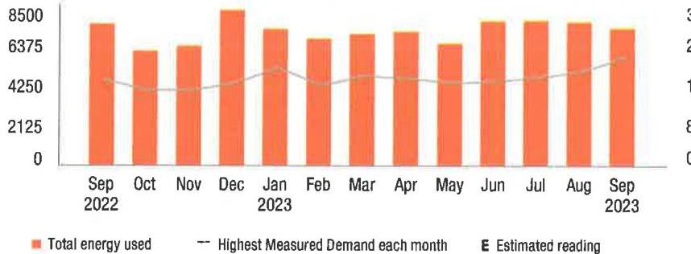

The image is a bar chart.

- **Chart Type**: Bar chart
- **X-Axis**: Months from September 2022 to September 2023
- **Y-Axis**: Energy usage in kWh, ranging from 0 to 8500
- **Legend Entries**:
  - Orange bars represent "Total energy used"
  - A line represents "Highest Measured Demand each month"
  - "E" indicates "Estimated reading"
- **Data Points**: Each month from September 2022 to September 2023 has an orange bar indicating energy usage, with a line showing the highest measured demand.
- **Yearly usage breakdown (monthly-based)**: The chart shows monthly energy usage over a year, with variations in bar heights indicating changes in energy consumption.
- **Styling**: Orange bars are used for energy usage, and a line is used to indicate the highest measured demand.

Visit MyAccount for more details regarding your energy usage.

## MEASURED DEMAND

Demand kW
Measured Demand is the maximum use of electricity at any time during a monthly time period, as measured by your meter.

## BILLED DEMAND

Annual Demand kW
21.10

Summer Demand kW
21.10

## SUPPLY CAPACITY

Generation kW
Tranemission kW
14.421

13.026

Supply capacity is required to serve the system's annual peak usage. It represents your share of these facilities, in kilowatts (kW). It is calculated based on your peak usage from the previous summer. Supply capacity values are updated periodically throughout the year and are prorated based on your service period.

## Price to compare

If you want to consider getting your electric supply from another supplier, compare their price with ours. This month, your cost for energy supply is $\$ 686.71$. This price to compare varies month to month, depending on your usage.

Your PoD ID is: PE000008769506058492 Your PoD ID is your Point of Delivery identification within PSE\&G's system. You will need this number if you are considering enrolling with another supplier.

la.pnqnq.j10s8a611.1gwgh0l 202309222117.rav-137134-000040822

## Your energy bill

## Message Center

This bill reflects a BPU-approved change in the Supply portion of your electric bill effective on and after September 1, 2023. The increase in the Supply portion of your bill is due to a change in the Transmission rate. The overall impact for business customers will vary by individual customer usage. Tariff information may also be found by visiting pseg.com.

The success of your business is important to us. We are working hard to make it easier to do business with us. To learn more about how we can help, visit pseg.com/Business.
J.D. Power named PSE\&G \#1 in customer satisfaction for both Residential Electric and Natural Gas Service in the East among Large Utilities. On behalf of the more than 12,000 PSEG employees who work hard every day, we thank you for rating us as a top utilities provider. For J.D. Power 2022 award information, visit jdpower.com/awards.

## (3) NEXT METER READING October 20, 2023

## How to contact us

## 1-855-BIZ-PSEG (249-7734)

Customer Service: 8am to 5:30pm Mon to Fri,
Closed on weekends and holidays
Emergencies / Outages / WorryFree Services: 24/7
TTY for the hearing impaired: 1-800-225-0072
Visit pseg.com/myaccount to access your account anytime
Text us. Register for MyAlerts by texting REG to 4PSEG(47734)
$>$ Text OUT to report an outage.
facebook.com/pseg
twitter.com/psegdelivers

## PSEG

We offer a variety of methods that make it easy to pay your bill. See reverse side for more information.

By checking this box, I authorize PSE\&G to enroll me in paperless billing at this email address:

068568000040821
I|m|I|m|m|m|m|I|m|I|m|I|m|I|m|I|m|I|m|I||
HOTEL WOODBRIDGE LLC
ACCOUNT NUMBER
7222121404
SERVICE ADDRESS
120 WOOD AVE S B4SE WOODBRIDGE TWP NJ 08830-2711

## Your billing summary

Balance remaining from your last bill
PSE\&G balance from last bill
\$765.38
Less Payment received September 8, 2023 - thank you!
\$765.38
Balance remaining from your last bill
\$0.00

This month's charges and credits
Electric charges - PSE\&G
This month's charges and credits
Total amount we'll debit your
\$787.62
account on Oct 10, 2023

Account number
7222121404
Automatic bill payment - do not pay

Amount enclosed
$\left.\begin{array}{l}\text { I } \cdot \text { I } \mid \text { II } \\ \text { II } \\ \text { III }\end{array}\right\rvert\, \begin{aligned} & \text { I } \\ & \text { II } \\ & \text { III }\end{aligned} \begin{aligned} & \text { II } \\ & \text { III } \\ & \text { III }\end{aligned} \begin{aligned} & \text { II } \\ & \text { II } \\ & \text { III }\end{aligned} \begin{aligned} & \text { II } \\ & \text { II } \\ & \text { III }\end{aligned} \begin{aligned} & \text { II } \\ & \text { II } \\ & \text { III }\end{aligned} \begin{aligned} & \text { II } \\ & \text { II } \\ & \text { III }\end{aligned} \begin{aligned} & \text { II } \\ & \text { II } \\ & \text { III }\end{aligned} \begin{aligned} & \text { II } \\ & \text { II } \\ & \text { III }\end{aligned} \begin{aligned} & \text { II } \\ & \text { II } \\ & \text { III }\end{aligned} \begin{aligned} & \text { II } \\ & \text { II } \\ & \text { III }\end{aligned} \begin{aligned} & \text { II } \\ & \text { II } \\ & \text { III }\end{aligned} \begin{aligned} & \text { II } \\ & \text { II } \\ & \text { III }\end{aligned} \begin{aligned} & \text { II } \\ & \text { II } \\ & \text { III }\end{aligned} \begin{aligned} & \text { II } \\ & \text { II } \\ & \text { III }\end{aligned} \begin{aligned} & \text { II } \\ & \text { II } \\ & \text { III }\end{aligned} \begin{aligned} & \text { II } \\ & \text { II } \\ & \text { III }\end{aligned} \begin{aligned} & \text { II } \\ & \text { II } \\ & \text { III }\end{aligned} \begin{aligned} & \text { II } \\ & \text { II } \\ & \text { III }\end{aligned} \begin{aligned} & \text { II } \\ & \text { II } \\ & \text { III }\end{aligned} \begin{aligned} & \text { II } \\ & \text { II } \\ & \text { III }\end{aligned} \begin{aligned} & \text { II } \\ & \text { II } \\ & \text { III }\end{aligned} \begin{aligned} & \text { II } \\ & \text { II } \\ & \text { III }\end{aligned} \begin{aligned} & \text { II } \\ & \text { II } \\ & \text { III }\end{aligned} \begin{aligned} & \text { II } \\ & \text { II } \\ & \text { III }\end{aligned} \begin{aligned} & \text { II } \\ & \text { II } \\ & \text { III }\end{aligned} \begin{aligned} & \text { II } \\ & \text { II } \\ & \text { III }\end{aligned} \begin{aligned} & \text { II } \\ & \text { II } \\ & \text { III }\end{aligned} \begin{aligned} & \text { II } \\ & \text { II } \\ & \text { III }\end{aligned} \begin{aligned} & \text { II } \\ & \text { II } \\ & \text { III }\end{aligned} \begin{aligned} & \text { II } \\ & \text { II } \\ & \text { III }\end{aligned} \begin{aligned} & \text { II } \\ & \text { II } \\ & \text { III }\end{aligned} \begin{aligned} & \text { II } \\ & \text { II } \\ & \text { III }\end{aligned} \begin{aligned} & \text { II } \\ & \text { II } \\ & \text { III }\end{aligned} \begin{aligned} & \text { II } \\ & \text { II } \\ & \text { III }\end{aligned} \begin{aligned} & \text { II } \\ & \text { II } \\ & \text { III }\end{aligned} \begin{aligned} & \text { II } \\ & \text { II } \\ & \text { III }\end{aligned} \begin{aligned} & \text { II } \\ & \text { II } \\ & \text { III }\end{aligned} \begin{aligned} & \text { II } \\ & \text { II } \\ & \text { III }\end{aligned} \begin{aligned} & \text { II } \\ & \text { II } \\ & \text { III }\end{aligned} \begin{aligned} & \text { II } \\ & \text { II } \\ & \text { III }\end{aligned} \begin{aligned} & \text { II } \\ & \text { II } \\ & \text { III }\end{aligned} \begin{aligned} & \text { II } \\ & \text { II } \\ & \text { III }\end{aligned} \begin{aligned} & \text { II } \\ & \text { II } \\ & \text { III }\end{aligned} \begin{aligned} & \text { II } \\ & \text { II } \\ & \text { III }\end{aligned} \begin{aligned} & \text { II } \\ & \text { II } \\ & \text { III }\end{aligned} \begin{aligned} & \text { II } \\ & \text { II } \\ & \text { III }\end{aligned} \begin{aligned} & \text { II } \\ & \text { II } \\ & \text { III }\end{aligned} \begin{aligned} & \text { II } \\ & \text { II } \\ & \text { III }\end{aligned} \begin{aligned} & \text { II } \\ & \text { II } \\ & \text { III }\end{aligned} \begin{aligned} & \text { II } \\ & \text { II } \\ & \text { III }\end{aligned} \begin{aligned} & \text { II } \\ & \text { II } \\ & \text { III }\end{aligned} \begin{aligned} & \text { II } \\ & \text { II } \\ & \text { III }\end{aligned} \begin{aligned} & \text { II } \\ & \text { II } \\ & \text { III }\end{aligned} \begin{aligned} & \text { II } \\ & \text { II } \\ & \text { III }\end{aligned} \begin{aligned} & \text { II } \\ & \text { II } \\ & \text { III }\end{aligned} \begin{aligned} & \text { II } \\ & \text { II } \\ & \text { III }\end{aligned} \begin{aligned} & \text { II } \\ & \text { II } \\ & \text { III }\end{aligned} \begin{aligned} & \text { II } \\ & \text { II } \\ & \text { III }\end{aligned} \begin{aligned} & \text { II } \\ & \text { II } \\ & \text { III }\end{aligned} \begin{aligned} & \text { II } \\ & \text { II } \\ & \text { III }\end{aligned} \begin{aligned} & \text { II } \\ & \text { II } \\ & \text { III }\end{aligned} \begin{aligned} & \text { II } \\ & \text { II } \\ & \text { III }\end{aligned} \begin{aligned} & \text { II } \\ & \text { II } \\ & \text { III }\end{aligned} \begin{aligned} & \text { II } \\ & \text { II } \\ & \text { III }\end{aligned} \begin{aligned} & \text { II } \\ & \text { II } \\ & \text { III }\end{aligned} \begin{aligned} & \text { II } \\ & \text { II } \\ & \text { III }\end{aligned} \begin{aligned} & \text { II } \\ & \text { II } \\ & \text { III }\end{aligned} \begin{aligned} & \text { II } \\ & \text { II } \\ & \text { III }\end{aligned} \begin{aligned} & \text { II } \\ & \text { II } \\ & \text { III }\end{aligned} \begin{aligned} & \text { II } \\ & \text { II } \\ & \text { III }\end{aligned} \begin{aligned} & \text { II } \\ & \text { II } \\ & \text { III }\end{aligned} \begin{aligned} & \text { II } \\ & \text { II } \\ & \text { III }\end{aligned} \begin{aligned} & \text { II } \\ & \text { II } \\ & \text { III }\end{aligned} \begin{aligned} & \text { II } \\ & \text { II } \\ & \text { III }\end{aligned} \begin{aligned} & \text { II } \\ & \text { II } \\ & \text { III }\end{aligned} \begin{aligned} & \text { II } \\ & \text { II } \\ & \text { III }\end{aligned} \begin{aligned} & \text { II } \\ & \text { II } \\ & \text { III }\end{aligned} \begin{aligned} & \text { II } \\ & \text { II } \\ & \text { III }\end{aligned} \begin{aligned} & \text { II } \\ & \text { II } \\ & \text { III }\end{aligned} \begin{aligned} & \text { II } \\ & \text { II } \\ & \text { III }\end{aligned} \begin{aligned} & \text { II } \\ & \text { II } \\ & \text { III }\end{aligned} \begin{aligned} & \text { II } \\ & \text { II } \\ & \text { III }\end{aligned} \begin{aligned} & \text { II } \\ & \text { II } \\ & \text { III }\end{aligned} \begin{aligned} & \text { II } \\ & \text { II } \\ & \text { III }\end{aligned} \begin{aligned} & \text { II } \\ & \text { II } \\ & \text { III }\end{aligned} \begin{aligned} & \text { II } \\ & \text { II } \\ & \text { III }\end{aligned} \begin{aligned} & \text { II } \\ & \text { II } \\ & \text { III }\end{aligned} \begin{aligned} & \text { II } \\ & \text { II } \\ & \text { III }\end{aligned} \begin{aligned} & \text { II } \\ & \text { II } \\ & \text { III }\end{aligned} \begin{aligned} & \text { II } \\ & \text { II } \\ & \text { III }\end{aligned} \begin{aligned} & \text { II } \\ & \text { II } \\ & \text { III }\end{aligned} \begin{aligned} & \text { II } \\ & \text { II } \\ & \text { III }\end{aligned} \begin{aligned} & \text { II } \\ & \text { II } \\ & \text { III }\end{aligned} \begin{aligned} & \text { II } \\ & \text { II } \\ & \text { III }\end{aligned} \begin{aligned} & \text { II } \\ & \text { II } \\ & \text { III }\end{aligned} \begin{aligned} & \text { II } \\ & \text { II } \\ & \text { III }\end{aligned} \begin{aligned} & \text { II } \\ & \text { II } \\ & \text { III }\end{aligned} \begin{aligned} & \text { II } \\ & \text { II } \\ & \text { III }\end{aligned} \begin{aligned} & \text { II } \\ & \text { II } \\ & \text { III }\end{aligned} \begin{aligned} & \text { II } \\ & \text { II } \\ & \text { III }\end{aligned} \begin{aligned} & \text { II } \\ & \text { II } \\ & \text { III }\end{aligned} \begin{aligned} & \text { II } \\ & \text { II } \\ & \text { III }\end{aligned} \begin{aligned} & \text { II } \\ & \text { II } \\ & \text { III }\end{aligned} \begin{aligned} & \text { II } \\ & \text { II } \\ & \text { III }\end{aligned} \begin{aligned} & \text { II } \\ & \text { II } \\ & \text { III }\end{aligned} \begin{aligned} & \text { II } \\ & \text { II } \\ & \text { III }\end{aligned} \begin{aligned} & \text { II } \\ & \text { II } \\ & \text { III }\end{aligned} \begin{aligned} & \text { II } \\ & \text { II } \\ & \text { III }\end{aligned} \begin{aligned} & \text { II } \\ & \text { II } \\ & \text { III }\end{aligned} \begin{aligned} & \text { II } \\ & \text { II } \\ & \text { III }\end{aligned} \begin{aligned} & \text { II } \\ & \text { II } \\ & \text { III }\end{aligned} \begin{aligned} & \text { II } \\ & \text { II } \\ & \text { III }\end{aligned} \begin{aligned} & \text { II } \\ & \text { II } \\ & \text { III }\end{aligned} \begin{aligned} & \text { II } \\ & \text { II } \\ & \text { III }\end{aligned} \begin{aligned} & \text { II } \\ & \text { II } \\ & \text { III }\end{aligned} \begin{aligned} & \text { II } \\ & \text { II } \\ & \text { III }\end{aligned} \begin{aligned} & \text { II } \\ & \text { II } \\ & \text { III }\end{aligned} \begin{aligned} & \text { II } \\ & \text { II } \\ & \text { III }\end{aligned} \begin{aligned} & \text { II } \\ & \text { II } \\ & \text { III }\end{aligned} \begin{aligned} & \text { II } \\ & \text { II } \\ & \text { III }\end{aligned} \begin{aligned} & \text { II } \\ & \text { II } \\ & \text { III }\end{aligned} \begin{aligned} & \text { II } \\ & \text { II } \\ & \text { III }\end{aligned} \begin{aligned} & \text { II } \\ & \text { II } \\ & \text { III }\end{aligned} \begin{aligned} & \text { II } \\ & \text { II } \\ & \text { III }\end{aligned} \begin{aligned} & \text { II } \\ & \text { II } \\ & \text { III }\end{aligned} \begin{aligned} & \text { II } \\ & \text { II } \\ & \text { III }\end{aligned} \begin{aligned} & \text { II } \\ & \text { II } \\ & \text { III }\end{aligned} \begin{aligned} & \text { II } \\ & \text { II } \\ & \text { III }\end{aligned} \begin{aligned} & \text { II } \\ & \text { III } \\ & \text { III }\end{aligned} \begin{aligned} & \text { II } \\ & \text { III } \\ & \text { III }\end{aligned} \begin{aligned} & \text { II } \\ & \text { III } \\ & \text { III }\end{aligned} \begin{aligned} & \text { II } \\ & \text { III } \\ & \text { III }\end{aligned} \begin{aligned} & \text { II } \\ & \text { III } \\ & \text { III }\end{aligned} \begin{aligned} & \text { II } \\ & \text { III } \\ & \text { III }\end{aligned} \begin{aligned} & \text { II } \\ & \text { III } \\ & \text { III }\end{aligned} \begin{aligned} & \text { II } \\ & \text { III } \\ & \text { III }\end{aligned} \begin{aligned} & \text { II } \\ & \text { III } \\ & \text { III }\end{aligned} \begin{aligned} & \text { II } \\ & \text { III } \\ & \text { III }\end{aligned} \begin{aligned} & \text { II } \\ & \text { III } \\ & \text { III }\end{aligned} \begin{aligned} & \text { II } \\ & \text { III } \\ & \text { III }\end{aligned} \begin{aligned} & \text { II } \\ & \text { III } \\ & \text { III }\end{aligned} \begin{aligned} & \text { II } \\ & \text { III } \\ & \text { III }\end{aligned} \begin{aligned} & \text { II } \\ & \text { III } \\ & \text { III }\end{aligned} \begin{aligned} & \text { II } \\ & \text { III } \\ & \text { III }\end{aligned} \begin{aligned} & \text { II } \\ & \text { III } \\ & \text { III }\end{aligned} \begin{aligned} & \text { II } \\ & \text { III } \\ & \text { III }\end{aligned} \begin{aligned} & \text { II } \\ & \text { III } \\ & \text { III }\end{aligned} \begin{aligned} & \text { II } \\ & \text { III } \\ & \text { III }\end{aligned} \begin{aligned} & \text { II } \\ & \text { III } \\ & \text { III }\end{aligned} \begin{aligned} & \text { II } \\ & \text { III } \\ & \text { III }\end{aligned} \begin{aligned} & \text { II } \\ & \text { III } \\ & \text { III }\end{aligned} \begin{aligned} & \text { II } \\ & \text { III } \\ & \text { III }\end{aligned} \begin{aligned} & \text { II } \\ & \text { III } \\ & \text { III }\end{aligned} \begin{aligned} & \text { II } \\ & \text { III } \\ & \text { III }\end{aligned} \begin{aligned} & \text { II } \\ & \text { III } \\ & \text { III }\end{aligned} \begin{aligned} & \text { II } \\ & \text { III } \\ & \text { III }\end{aligned} \begin{aligned} & \text { II } \\ & \text { III } \\ & \text { III }\end{aligned} \begin{aligned} & \text { II } \\ & \text { III } \\ & \text { III }\end{aligned} \begin{aligned} & \text { II } \\ & \text { III } \\ & \text { III }\end{aligned} \begin{aligned} & \text { II } \\ & \text { III } \\ & \text { III }\end{aligned} \begin{aligned} & \text { II } \\ & \text { III } \\ & \text { III }\end{aligned} \begin{aligned} & \text { II } \\ & \text { III } \\ & \text { III }\end{aligned} \begin{aligned} & \text { II } \\ & \text { III } \\ & \text { III }\end{aligned} \begin{aligned} & \text { II } \\ & \text { III } \\ & \text { III }\end{aligned} \begin{aligned} & \text { II } \\ & \text { III } \\ & \text { III }\end{aligned} \begin{aligned} & \text { II } \\ & \text { III } \\ & \text { III }\end{aligned} \begin{aligned} & \text { II } \\ & \text { III } \\ & \text { III }\end{aligned} \begin{aligned} & \text { II } \\ & \text { III } \\ & \text { III }\end{aligned} \begin{aligned} & \text { II } \\ & \text { III } \\ & \text { III }\end{aligned} \begin{aligned} & \text { II } \\ & \text { III } \\ & \text { III }\end{aligned} \begin{aligned} & \text { II } \\ & \text { III } \\ & \text { III }\end{aligned} \begin{aligned} & \text { II } \\ & \text { III } \\ & \text { III }\end{aligned} \begin{aligned} & \text { II } \\ & \text { III } \\ & \text { III }\end{aligned} \begin{aligned} & \text { II } \\ & \text { III } \\ & \text { III }\end{aligned} \begin{aligned} & \text { II } \\ & \text { III } \\ & \text { III }\end{aligned} \begin{aligned} & \text { II } \\ & \text { III } \\ & \text { III }\end{aligned} \begin{aligned} & \text { II } \\ & \text { III } \\ & \text { III }\end{aligned} \begin{aligned} & \text { II } \\ & \text { III } \\ & \text { III }\end{aligned} \begin{aligned} & \text { II } \\ & \text { III } \\ & \text { III }\end{aligned} \begin{aligned} & \text { II } \\ & \text { III } \\ & \text { III }\end{aligned} \begin{aligned} & \text { II } \\ & \text { III } \\ & \text { III }\end{aligned} \begin{aligned} & \text { II } \\ & \text { III } \\ & \text { III }\end{aligned} \begin{aligned} & \text { II } \\ & \text { III } \\ & \text { III }\end{aligned} \begin{aligned} & \text { II } \\ & \text { III } \\ & \text { III }\end{aligned} \begin{aligned} & \text { II } \\ & \text { III } \\ & \text { III }\end{aligned} \begin{aligned} & \text { II } \\ & \text { III } \\ & \text { III }\end{aligned} \begin{aligned} & \text { II } \\ & \text { III } \\ & \text { III }\end{aligned} \begin{aligned} & \text { II } \\ & \text { III } \\ & \text { III }\end{aligned} \begin{aligned} & \text { II } \\ & \text { III } \\ & \text { III }\end{aligned} \begin{aligned} & \text { II } \\ & \text { III } \\ & \text { III }\end{aligned} \begin{aligned} & \text { II } \\ & \text { III } \\ & \text { III }\end{aligned} \begin{aligned} & \text { II } \\ & \text { III } \\ & \text { III }\end{aligned} \begin{aligned} & \text { II } \\ & \text { III } \\ & \text { III }\end{aligned} \begin{aligned} & \text { II } \\ & \text { III } \\ & \text { III }\end{aligned} \begin{aligned} & \text { II } \\ & \text { III } \\ & \text { III }\end{aligned} \begin{aligned} & \text { II } \\ & \text { III } \\ & \text { III }\end{aligned} \begin{aligned} & \text { II } \\ & \text { III } \\ & \text { III }\end{aligned} \begin{aligned} & \text { II } \\ & \text { III } \\ & \text { III }\end{aligned} \begin{aligned} & \text { II } \\ & \text { III } \\ & \text { III }\end{aligned} \begin{aligned} & \text { II } \\ & \text { III } \\ & \text { III }\end{aligned} \begin{aligned} & \text { II } \\ & \text { III } \\ & \text { III }\end{aligned} \begin{aligned} & \text { II } \\ & \text { III } \\ & \text { III }\end{aligned} \begin{aligned} & \text { II } \\ & \text { III } \\ & \text { III }\end{aligned} \begin{aligned} & \text { II } \\ & \text { III } \\ & \text { III }\end{aligned} \begin{aligned} & \text { II } \\ & \text { III } \\ & \text { III }\end{aligned} \begin{aligned} & \text { II } \\ & \text { III } \\ & \text { III }\end{aligned} \begin{aligned} & \text { II } \\ & \text { III } \\ & \text { III }\end{aligned} \begin{aligned} & \text { II } \\ & \text { III } \\ & \text { III }\end{aligned} \begin{aligned} & \text { II } \\ & \text { III } \\ & \text { III }\end{aligned} \begin{aligned} & \text { II } \\ & \text { III } \\ & \text { III }\end{aligned} \begin{aligned} & \text { II } \\ & \text { III } \\ & \text { III }\end{aligned} \begin{aligned} & \text { II } \\ & \text { III } \\ & \text { III }\end{aligned} \begin{aligned} & \text { II } \\ & \text { III } \\ & \text { III }\end{aligned} \begin{aligned} & \text { II } \\ & \text { III } \\ & \text { III }\end{aligned} \begin{aligned} & \text { II } \\ & \text { III } \\ & \text { III }\end{aligned} \begin{aligned} & \text { II } \\ & \text { III } \\ & \text { III }\end{aligned} \begin{aligned} & \text { II } \\ & \text { III } \\ & \text { III }\end{aligned} \begin{aligned} & \text { II } \\ & \text { III } \\ & \text { III }\end{aligned} \begin{aligned} & \text { II } \\ & \text { III } \\ & \text { III }\end{aligned} \begin{aligned} & \text { II } \\ & \text { III } \\ & \text { III }\end{aligned} \begin{aligned} & \text { II } \\ & \text { III } \\ & \text { III }\end{aligned} \begin{aligned} & \text { II } \\ & \text { III } \\ & \text { III }\end{aligned} \begin{aligned} & \text { II } \\ & \text { III } \\ & \text { III }\end{aligned} \begin{aligned} & \text { II } \\ & \text { III } \\ & \text { III }\end{aligned} \begin{aligned} & \text { II } \\ & \text { III } \\ & \text { III }\end{aligned} \begin{aligned} & \text { II } \\ & \text { III } \\ & \text { III }\end{aligned} \begin{aligned} & \text { II } \\ & \text { III } \\ & \text { III }\end{aligned} \begin{aligned} & \text { II } \\ & \text { III } \\ & \text { III }\end{aligned} \begin{aligned} & \text { II } \\ & \text { III } \\ & \text { III }\end{aligned} \begin{aligned} & \text { II } \\ & \text { III } \\ & \text { III }\end{aligned} \begin{aligned} & \text { II } \\ & \text { III } \\ & \text { III }\end{aligned} \begin{aligned} & \text { II } \\ & \text { III } \\ & \text { III }\end{aligned} \begin{aligned} & \text { II } \\ & \text { III } \\ & \text { III }\end{aligned} \begin{aligned} & \text { II } \\ & \text { III } \\ & \text { III }\end{aligned} \begin{aligned} & \text { II } \\ & \text { III } \\ & \text { III }\end{aligned} \begin{aligned} & \text { II } \\ & \text { III } \\ & \text { III }\end{aligned} \begin{aligned} & \text { II } \\ & \text { III } \\ & \text { III }\end{aligned} \begin{aligned} & \text { II } \\ & \text { III } \\ & \text { III }\end{aligned} \begin{aligned} & \text { II } \\ & \text { III } \\ & \text { III }\end{aligned} \begin{aligned} & \text { II } \\ & \text { III } \\ & \text { III }\end{aligned} \begin{aligned} & \text { II } \\ & \text { III } \\ & \text { III }\end{aligned} \begin{aligned} & \text { II } \\ & \text { III } \\ & \text { III }\end{aligned} \begin{aligned} & \text { II } \\ & \text { III } \\ & \text { III }\end{aligned} \begin{aligned} & \text { II } \\ & \text { III } \\ & \text { III }\end{aligned} \begin{aligned} & \text { II } \\ & \text { III } \\ & \text { III }\end{aligned} \begin{aligned} & \text { II } \\ & \text { III } \\ & \text { III }\end{aligned} \begin{aligned} & \text { II } \\ & \text { III } \\ & \text { III }\end{aligned} \begin{aligned} & \text { II } \\ & \text { III } \\ & \text { III }\end{aligned} \begin{aligned} & \text { II } \\ & \text { III } \\ & \text { III }\end{aligned} \begin{aligned} & \text { II } \\ & \text { III } \\ & \text { III }\end{aligned} \begin{aligned} & \text { II } \\ & \text { III } \\ & \text { III }\end{aligned} \begin{aligned} & \text { II } \\ & \text { III } \\ & \text { III }\end{aligned} \begin{aligned} & \text { II } \\ & \text { III } \\ & \text { III }\end{aligned} \begin{aligned} & \text { II } \\ & \text { III } \\ & \text { III }\end{aligned} \begin{aligned} & \text { II } \\ & \text { III } \\ & \text { III }\end{aligned} \begin{aligned} & \text { II } \\ & \text { III } \\ & \text { III }\end{aligned} \begin{aligned} & \text { II } \\ & \text { III } \\ & \text { III }\end{aligned} \begin{aligned} & \text { II } \\ & \text { III } \\ & \text { III }\end{aligned} \begin{aligned} & \text { II } \\ & \text { III } \\ & \text { III }\end{aligned} \begin{aligned} & \text { II } \\ & \text { III } \\ & \text { III }\end{aligned} \begin{aligned} & \text { II } \\ & \text { III } \\ & \text { III }\end{aligned} \begin{aligned} & \text { II } \\ & \text { III } \\ & \text { III }\end{aligned} \begin{aligned} & \text { II } \\ & \text { III } \\ & \text { III }\end{aligned} \begin{aligned} & \text { II } \\ & \text { III } \\ & \text { III }\end{aligned} \begin{aligned} & \text { II } \\ & \text { III } \\ & \text { III }\end{aligned} \begin{aligned} & \text { II } \\ & \text { III } \\ & \text { III }\end{aligned} \begin{aligned} & \text { II } \\ & \text { III } \\ & \text { III }\end{aligned} \begin{aligned} & \text { II } \\ & \text { III } \\ & \text { III }\end{aligned} \begin{aligned} & \text { II } \\ & \text { III } \\ & \text { III }\end{aligned} \begin{aligned} & \text { II } \\ & \text { III } \\ & \text { III }\end{aligned} \begin{aligned} & \text { II } \\ & \text { III } \\ & \text { III }\end{aligned} \begin{aligned} & \text { II } \\ & \text { III } \\ & \text { III }\end{aligned} \begin{aligned} & \text { II } \\ & \text { III } \\ & \text { III }\end{aligned} \begin{aligned} & \text { II } \\ & \text { III } \\ & \text { III }\end{aligned} \begin{aligned} & \text { II } \\ & \text { III } \\ & \text { III }\end{aligned} \begin{aligned} & \text { II } \\ & \text { III } \\ & \text { III }\end{aligned} \begin{aligned} & \text { II } \\ & \text { III } \\ & \text { III }\end{aligned} \begin{aligned} & \text { II } \\ & \text { III } \\ & \text { III }\end{aligned} \begin{aligned} & \text { II } \\ & \text { III } \\ & \text { III }\end{aligned} \begin{aligned} & \text { II } \\ & \text { III } \\ & \text { III }\end{aligned} \begin{aligned} & \text { II } \\ & \text { III } \\ & \text { III }\end{aligned} \begin{aligned} & \text { II } \\ & \text { III } \\ & \text { III }\end{aligned} \begin{aligned} & \text { II } \\ & \text { III } \\ & \text { III }\end{aligned} \begin{aligned} & \text { II } \\ & \text { III } \\ & \text { III }\end{aligned} \begin{aligned} & \text { II } \\ & \text { III } \\ & \text { III }\end{aligned} \begin{aligned} & \text { II } \\ & \text { III } \\ & \text { III }\end{aligned} \begin{aligned} & \text { II } \\ & \text { III } \\ & \text { III }\end{aligned} \begin{aligned} & \text { II } \\ & \text { III } \\ & \text { III }\end{aligned} \begin{aligned} & \text { II } \\ & \text { III } \\ & \text { III }\end{aligned} \begin{aligned} & \text { II } \\ & \text { III } \\ & \text { III }\end{aligned} \begin{aligned} & \text { II } \\ & \text { III } \\ & \text { III }\end{aligned} \begin{aligned} & \text { II } \\ & \text { III } \\ & \text { III }\end{aligned} \begin{aligned} & \text { II } \\ & \text { III } \\ & \text { III }\end{aligned} \begin{aligned} & \text { II } \\ & \text { III } \\ & \text { III }\end{aligned} \begin{aligned} & \text { II } \\ & \text { III } \\ & \text { III }\end{aligned} \begin{aligned} & \text { II } \\ & \text { III } \\ & \text { III }\end{aligned} \begin{aligned} & \text { II } \\ & \text { III } \\ & \text { III }\end{aligned} \begin{aligned} & \text { II } \\ & \text { III } \\ & \text { III }\end{aligned} \begin{aligned} & \text { II } \\ & \text { III } \\ & \text { III }\end{aligned} \begin{aligned} & \text { II } \\ & \text { III } \\ & \text { III }\end{aligned} \begin{aligned} & \text { II } \\ & \text { III } \\ & \text { III }\end{aligned} \begin{aligned} & \text { II } \\ & \text { III } \\ & \text { III }\end{aligned} \begin{aligned} & \text { II } \\ & \text { III } \\ & \text { III }\end{aligned} \begin{aligned} & \text { II } \\ & \text { III } \\ & \text { III }\end{aligned} \begin{aligned} & \text { II } \\ & \text { III } \\ & \text { III }\end{aligned} \begin{aligned} & \text { II } \\ & \text { III } \\ & \text { III }\end{aligned} \begin{aligned} & \text { II } \\ & \text { III } \\ & \text { III }\end{aligned} \begin{aligned} & \text { II } \\ & \text { III } \\ & \text { III }\end{aligned} \begin{aligned} & \text { II } \\ & \text { III } \\ & \text { III }\end{aligned} \begin{aligned} & \text { II } \\ & \text { III } \\ & \text { III }\end{aligned} \begin{aligned} & \text { II } \\ & \text { III } \\ & \text { III }\end{aligned} \begin{aligned} & \text { II } \\ & \text { III } \\ & \text { III }\end{aligned} \begin{aligned} & \text { II } \\ & \text { III } \\ & \text { III }\end{aligned} \begin{aligned} & \text { II } \\ & \text { III } \\ & \text { III }\end{aligned} \begin{aligned} & \text { II } \\ & \text { III } \\ & \text { III }\end{aligned} \begin{aligned} & \text { II } \\ & \text { III } \\ & \text { III }\end{aligned} \begin{aligned} & \text { II } \\ & \text { III } \\ & \text { III }\end{aligned} \begin{aligned} & \text { II } \\ & \text { III } \\ & \text { III }\end{aligned} \begin{aligned} & \text { II } \\ & \text { III } \\ & \text { III }\end{aligned} \begin{aligned} & \text { II } \\ & \text { III } \\ & \text { III }\end{aligned} \begin{aligned} & \text { II } \\ & \text { III } \\ & \text { III }\end{aligned} \begin{aligned} & \text { II } \\ & \text { III } \\ & \text { III }\end{aligned} \begin{aligned} & \text { II } \\ & \text { III } \\ & \text { III }\end{aligned} \begin{aligned} & \text { II } \\ & \text { III } \\ & \text { III }\end{aligned} \begin{aligned} & \text { II } \\ & \text { III } \\ & \text { III }\end{aligned} \begin{aligned} & \text { II } \\ & \text { III } \\ & \text { III }\end{aligned} \begin{aligned} & \text { II } \\ & \text { III } \\ & \text { III }\end{aligned} \begin{aligned} & \text { II } \\ & \text { III } \\ & \text { III }\end{aligned} \begin{aligned} & \text { II } \\ & \text { III } \\ & \text { III }\end{aligned} \begin{aligned} & \text { II } \\ & \text { III } \\ & \text { III }\end{aligned} \begin{aligned} & \text { II } \\ & \text { III } \\ & \text { III }\end{aligned} \begin{aligned} & \text { II } \\ & \text { III } \\ & \text { III }\end{aligned} \begin{aligned} & \text { II } \\ & \text { III } \\ & \text { III }\end{aligned} \begin{aligned} & \text { II } \\ & \text { III } \\ & \text { III }\end{aligned} \begin{aligned} & \text { II } \\ & \text { III } \\ & \text { III }\end{aligned} \begin{aligned} & \text { II } \\ & \text { III } \\ & \text { III }\end{aligned} \begin{aligned} & \text { II } \\ & \text { III } \\ & \text { III }\end{aligned} \begin{aligned} & \text { II } \\ & \text { III } \\ & \text { III }\end{aligned} \begin{aligned} & \text { II } \\ & \text { III } \\ & \text { III }\end{aligned} \begin{aligned} & \text { II } \\ & \text { III } \\ & \text { III }\end{aligned} \begin{aligned} & \text { II } \\ & \text { III } \\ & \text { III }\end{aligned} \begin{aligned} & \text { II } \\ & \text { III } \\ & \text { III }\end{aligned} \begin{aligned} & \text { II } \\ & \text { III } \\ & \text { III }\end{aligned} \begin{aligned} & \text { II } \\ & \text { III } \\ & \text { III }\end{aligned} \begin{aligned} & \text { II } \\ & \text { III } \\ & \text { III }\end{aligned} \begin{aligned} & \text { II } \\ & \text { III } \\ & \text { III }\end{aligned} \begin{aligned} & \text { II } \\ & \text { III } \\ & \text { III }\end{aligned} \begin{aligned} & \text { II } \\ & \text { III } \\ & \text { III }\end{aligned} \begin{aligned} & \text { II } \\ & \text { III } \\ & \text { III }\end{aligned} \begin{aligned} & \text { II } \\ & \text { III } \\ & \text { III }\end{aligned} \begin{aligned} & \text { II } \\ & \text { III } \\ & \text { III }\end{aligned} \begin{aligned} & \text { II } \\ & \text { III } \\ & \text { III }\end{aligned} \begin{aligned} & \text { II } \\ & \text { III } \\ & \text { III }\end{aligned} \begin{aligned} & \text { II } \\ & \text { III } \\ & \text { III }\end{aligned} \begin{aligned} \text { II } \\ & \text { III } \\ & \text { III }\end{aligned} \begin{aligned} \text { II } \\ & \text { III } \\ & \text { III }\end{aligned} \begin{aligned} \text { II } \\ & \text { III } \\ & \text { III }\end{aligned} \begin{aligned} \text { II } \\ & \text { III } \\ & \text { III }\end{aligned} \begin{aligned} \text { II } \\ & \text { III } \\ & \text { III }\end{aligned} \begin{aligned} \text { II } \\ & \text { III } \\ & \text { III }\end{aligned} \begin{aligned} \text { II } \\ & \text { III } \\ & \text { III }\end{aligned} \begin{aligned} \text { II } \\ & \text { III } \\ & \text { III }\end{aligned} \begin{aligned} \text { II } \\ & \text { III } \\ & \text { III }\end{aligned} \begin{aligned} \text { II } \\ & \text { III } \\ & \text { III }\end{aligned} \begin{aligned} \text { II } \\ & \text { III } \\ & \text { III }\end{aligned} \begin{aligned} \text { II } \\ & \text { III } \\ & \text { III }\end{aligned} \begin{aligned} \text { II } \\ & \text { III } \\ & \text { III }\end{aligned} \begin{aligned} \text { II } \\ & \text { III } \\ & \text { III }\end{aligned} \begin{aligned} \text { II } \\ & \text { III } \\ & \text { III }\end{aligned} \begin{aligned} \text { II } \\ & \text { III } \\ & \text { III }\end{aligned} \begin{aligned} \text { II } \\ & \text { III } \\ & \text { III }\end{aligned} \begin{aligned} \text { II } \\ & \text { III } \\ & \text { III }\end{aligned} \begin{aligned} \text { II } \\ & \text { III } \\ & \text { III }\end{aligned} \begin{aligned} \text { II } \\ & \text { III } \\ & \text { III }\end{aligned} \begin{aligned} \text { II } \\ & \text { III } \\ & \text { III }\end{aligned} \begin{aligned} \text { II } \\ & \text { III } \\ & \text { III }\end{aligned} \begin{aligned} \text { II } \\ & \text { III } \\ & \text { III }\end{aligned} \begin{aligned} \text { II } \\ & \text { III } \\ & \text { III }\end{aligned} \begin{aligned} \text { II } \\ & \text { III } \\ & \text { III }\end{aligned} \begin{aligned} \text { II } \\ & \text { III } \\ & \text { III }\end{aligned} \begin{aligned} \text { II } \\ & \text { III } \\ & \text { III }\end{aligned} \begin{aligned} \text { II } \\ & \text { III } \\ & \text { III }\end{aligned} \begin{aligned} \text { II } \\ & \text { III } \\ & \text { III }\end{aligned} \begin{aligned} \text { II } \\ & \text { III } \\ & \text { III }\end{aligned} \begin{aligned} \text { II } \\ & \text { III } \\ & \text { III }\end{aligned} \begin{aligned} \text { II } \\ & \text { III } \\ & \text { III }\end{aligned} \begin{aligned} \text { II } \\ & \text { III } \\ & \text { III }\end{aligned} \begin{aligned} \text { II } \\ & \text { III } \\ & \text { III }\end{aligned} \begin{aligned} \text { II } \\ & \text { III } \\ & \text { III }\end{aligned} \begin{aligned} \text { II } \\ & \text { III } \\ & \text { III }\end{aligned} \begin{aligned} \text { II } \\ & \text { III } \\ & \text { III }\end{aligned} \begin{aligned} \text { II } \\ & \text { III } \\ & \text { III }\end{aligned} \begin{aligned} \text { II } \\ & \text { III } \\ & \text { III }\end{aligned} \begin{aligned} \text { II } \\ & \text { III } \\ & \text { III }\end{aligned} \begin{aligned} \text { II } \\ & \text { III } \\ & \text { III }\end{aligned} \begin{aligned} \text { II } \\ & \text { III } \\ & \text { III }\end{aligned} \begin{aligned} \text { II } \\ & \text { III } \\ & \text { III }\end{aligned} \begin{aligned} \text { II } \\ & \text { III } \\ & \text { III }\end{aligned} \begin{aligned} \text { II } \\ & \text { III } \\ & \text { III }\end{aligned} \begin{aligned} \text { II } \\ & \text { III } \\ & \text { III }\end{aligned} \begin{aligned} \text { II } \\ & \text { III } \\ & \text { III }\end{aligned} \begin{aligned} \text { II } \\ & \text { III } \\ & \text { III }\end{aligned} \begin{aligned} \text { II } \\ & \text { III } \\ & \text { III }\end{aligned} \begin{aligned} \text { II } \\ & \text { III } \\ & \text { III }\end{aligned} \begin{aligned} \text { II } \\ & \text { III } \\ & \text { III }\end{aligned} \begin{aligned} \text { II } \\ & \text { III } \\ & \text { III }\end{aligned} \begin{aligned} \text { II } \\ & \text { III } \\ & \text { III }\end{aligned} \begin{aligned} \text { II } \\ & \text { III } \\ & \text { III }\end{aligned} \begin{aligned} \text { II } \\ & \text { III } \\ & \text { III }\end{aligned} \begin{aligned} \text { II } \\ & \text { III } \\ & \text { III }\end{aligned} \begin{aligned} \text { II } \\ & \text { III } \\ & \text { III }\end{aligned} \begin{aligned} \text { II } \\ & \text { III } \\ & \text { III }\end{aligned} \begin{aligned} \text { II } \\ & \text { III } \\ & \text { III }\end{aligned} \begin{aligned} \text { II } \\ & \text { III } \\ & \text { III }\end{aligned} \begin{aligned} \text { II } \\ & \text { III } \\ & \text { III }\end{aligned} \begin{aligned} \text { II } \\ & \text { III } \\ & \text { III }\end{aligned} \begin{aligned} \text { II } \\ & \text { III } \\ & \text { III }\end{aligned} \begin{aligned} \text { II } \\ & \text { III } \\ & \text { III }\end{aligned} \begin{aligned} \text { II } \\ & \text { III } \\ & \text { III }\end{aligned} \begin{aligned} \text { II } \\ & \text { III } \\ & \text { III }\end{aligned} \begin{aligned} \text { II } \\ & \text { III } \\ & \text { III }\end{aligned} \begin{aligned} \text { II } \\ & \text { III } \\ & \text { III }\end{aligned} \begin{aligned} \text { II } \\ & \text { III } \\ & \text { III }\end{aligned} \begin{aligned} \text { II } \\ & \text { III } \\ & \text { III }\end{aligned} \begin{aligned} \text { II } \\ & \text { III } \\ & \text { III }\end{aligned} \begin{aligned} \text { II } \\ & \text { III } \\ & \text { III }\end{aligned} \begin{aligned} \text { II } \\ & \text { III } \\ & \text { III }\end{aligned} \begin{aligned} \text { II } \\ & \text { III } \\ & \text { III }\end{aligned} \begin{aligned} \text { II } \\ & \text { III } \\ & \text { III }\end{aligned} \begin{aligned} \text {

## Message Center (Continued from page 1)

Si desea recibir en español una notificación de desconexión del servicio, llame al 1-800-357-2262.

Stay connected during hurricane season! Sign up for My Alerts to report power outages via text message, as well as receive outage updates by text and email. For more information, visit pseg.com/myalerts.

PSE\&G is installing smart meters that will provide electric customers with a number of benefits. These include more detailed electric-use information, near real-time power outage detection, and the elimination of almost all estimated electric bills. To learn more, visit pseg.com/smartmeters.

If you've ever misplaced your bill or had a due date slip your mind, it's time to sign up for Paperless Billing! Instead of receiving a paper bill each month, you'll get a monthly email showing your bill amount and due date, with the ability to view/print your current and past bills 24/7. To sign up, log in to My Account at pseg.com, and select "Paperless Billing."

At PSE\&G, we are committed to supporting your business needs. That's why we created a dedicated, toll-free phone number to address your energy questions and concerns. PSE\&G's Business Solutions Center is available Monday-Friday, 7:00 a.m. -5:30 p.m. at 1-855-249-7734 (1-855-BIZ-PSEG).

## Don't miss your meter reading

If you'll be away on your meter reading day, use our mobile app to upload a picture of your meter or enter your reading manually, or call 1-800-622-0197.

## Electric \& Gas Rate Information

For news about PSE\&G's rate filing and upcoming public hearings visit www.pseg.com/pseandgfilings. Under applicable tax law, the State Sales and Use Tax and corporate business tax are imposed upon the energy you have used.

# IT'S YOUR BILL. HOW YOU PAY IS YOUR CHOICE. 

## My Account

Make a payment anytime from a checking or savings account stored in My Account. Visit pseg.com/ myaccount

Mobile: Download our Mobile App "PSE\&G"
Pay by text: Text PAY to 4PSEG (47734)

Voice: Ask Alexa or use Google Assistant.

## ㅇ

## Automatic BillPay

Automatic payments from your bank. Skip checks and stamps. Never worry about due dates.

Enroll at:
pseg.com/autopay

## Credit Card

Pay your bill with a credit card online or by phone. Because we don't use customer rates to subsidize the cost of this service, there is a fee.

## My Account:

pseg.com/myaccount

Phone:
1-803-277-8710

## Phone

Bank Account: 1-800-553-7734 Credit Card: 1-803-277-8710

## $>$ By Mail

Make your check payable to PSE\&G and write your account number on your check.

When you pay by check, you authorize PSE\&G to make a one-time electronic fund transfer from your account, in the amount of your check. If you prefer not to authorize us, call 1-800-436-PSEG.

## In Person

Payments are accepted at any customer service center or authorized location.

Locations can be found at: pseg.com/csc

Details of your electric charges Your rate: General Lighting \& Power (GLP)

| Meter \# 316021232 | Usage |
| :--: | :--: |
| Actual reading Sep 21, 2023 | 52121 |
| Less Actual reading Aug 22, 2023 | 46761 |
| Total electric you used in 30 days | 5,360 kWh |

## Delivery charges

| Monthly service charge | $\$ 5.04$ |
| :--: | :--: |
| Charges for delivering electric to you: |  |
| Annual Demand | 15,900 kW x \$5.302516 |
| The highest Measured Demand in any time period in the current month. |  |
| Summer Demand 15,900 kW x \$10.037736 | $\$ 159.60$ |
| The Measured Demand (excluding off-peak) in each billing month of June through September. |  |
| kWh charges 5,360 kWh x \$0.011147 | \$59.75 |
| Societal Benefits 5,360 kWh x \$0.010412 | \$55.81 |
| This charge recovers the cost of government mandated programs designed to achieve public policy goals, such as energy conservation. |  |
| Total electric delivery charges | $\$ 364.51$ |
| Supply charges |  |
| BGS Capacity |  |
| Generation 4.589 kW x \$1.741120 | $\$ 7.99$ |
| Transmission 4.146 kW x \$13.289918 | \$55.10 |
| Cost of electric supplied by PSE\&G: Charges |  |
| For the first 1,608 kWh x \$0.073246 | \$117.78 |
| For the next 3,752 kWh x \$0.064563 | \$242.24 |
| Total electric supply charges | $\$ 423.11$ |
| Total electric charges | \$787.62 |

## Your monthly electric use

kWh
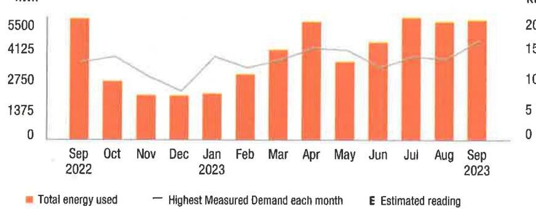

The image is a bar and line chart showing a **yearly usage breakdown (monthly-based)** of electricity consumption and demand.

- **Chart Type**: Combination of bar and line chart.
- **X-Axis**: Months from September 2022 to September 2023.
- **Y-Axis (Left)**: kWh, ranging from 0 to 5500.
- **Y-Axis (Right)**: Demand scale, ranging from 0 to 15.
- **Bars**: Represent "Total energy used" each month.
- **Line**: Represents "Highest Measured Demand each month."
- **Legend**:
  - Orange bars: Total energy used
  - Grey line: Highest Measured Demand each month
  - "E" indicates an Estimated reading

The bars show varying levels of energy usage across the months, with peaks in September 2022, April 2023, and July 2023. The line indicates the highest measured demand, which fluctuates throughout the year.

Visit MyAccount for more details regarding your energy usage.

## MEASURED DEMAND

Demand kW
15.90

Measured Demand is the maximum use of electricity at any time during a monthly time period, as measured by your meter.

## BILLED DEMAND

| Annual Demand kW | 15.90 |
| :-- | --: |
| Summer Demand kW | 15.90 |

## SUPPLY CAPACITY

| Generation kW | 4,589 |
| :-- | --: |
| Transmission kW | 4,145 |

Supply capacity is required to serve the system's annual peak usage. It represents your share of these facilities, in kilowatts (kW). It is calculated based on your peak usage from the previous summer. Supply capacity values are updated periodically throughout the year and are prorated based on your service period.

## Price to compare

If you want to consider getting your electric supply from another supplier, compare their price with ours. This month, your cost for energy supply is $\$ 423.11$. This price to compare varies month to month, depending on your usage.

Your PoD ID is: PE000010959992858492 -
Your PoD ID is your Point of Delivery identification within PSE\&G's system. You will need this number if you are considering enrolling with another supplier.

la.papag.il0ebelj 1.1pagidil 202309222117 .coo-137138-000040821

## Your energy bill

## Message Center

This bill reflects a BPU-approved change in the Supply portion of your electric bill effective on and after September 1, 2023. The increase in the Supply portion of your bill is due to a change in the Transmission rate. The overall impact for business customers will vary by individual customer usage. Tariff information may also be found by visiting pseg.com.

The success of your business is important to us. We are working hard to make it easier to do business with us. To learn more about how we can help, visit pseg.com/Business.
J.D. Power named PSE\&G \#1 in customer satisfaction for both Residential Electric and Natural Gas Service in the East among Large Utilities. On behalf of the more than 12,000 PSEG employees who work hard every day, we thank you for rating us as a top utilities provider. For J.D. Power 2022 award information, visit jdpower.com/awards.

## NEXT METER READING October 20, 2023

## How to contact us

## 1-855-BIZ-PSEG (249-7734)

Customer Service: 8am to 5:30pm Mon to Fri,
Closed on weekends and holidays
Emergencies / Outages / WorryFree Services: 24/7
TTY for the hearing impaired: 1-800-225-0072
Visit pseg.com/myaccount to access your account anytime
Text us. Register for MyAlerts by texting REG to 4PSEG(47734)
$>$ Text OUT to report an outage.
facebook.com/pseg
twitter.com/psegdelivers

## PAY YOUR WAY, 24/7

We offer a variety of methods that make it easy to pay your bill. See reverse side for more information.

By checking this box, I authorize PSE\&G to enroll me in paperless billing at this email address:

068570000040820
$\lg \llbracket \log \log \log \log \log \log \log \log \log \log \log \log \log \log \log \log \log \log \lg \log \lg \log \lg \log \log \log \log \log \log \log \log \log \log \log \log \log \log \log \log \log \log \log \log \log \log \log \log \log \log \log \log \log \log \log \log \log \log \log \log \log \log \log \log \log \log \log \log \log \log \log \log \log \log \log \log \log \log \log \log \log \log \log \log \log \log \log \log \log \log \log \log \log \log \log \log \log \log \log \log \log \log \log \log \log \log \log \log \log \log \log \log \log \log \log \log \log \log \log \log \log \log \log \log

## Message Center (Continued from page 1)

Si desea recibir en español una notificación de desconexión del servicio, llame al 1-800-357-2262.

Stay connected during hurricane season! Sign up for My Alerts to report power outages via text message, as well as receive outage updates by text and email. For more information, visit pseg.com/myalerts.

PSE\&G is installing smart meters that will provide electric customers with a number of benefits. These include more detailed electric-use information, near real-time power outage detection, and the elimination of almost all estimated electric bills. To learn more, visit pseg.com/smartmeters.

If you've ever misplaced your bill or had a due date slip your mind, it's time to sign up for Paperless Billing! Instead of receiving a paper bill each month, you'll get a monthly email showing your bill amount and due date, with the ability to view/print your current and past bills 24/7. To sign up, log in to My Account at pseg.com, and select "Paperless Billing."

At PSE\&G, we are committed to supporting your business needs. That's why we created a dedicated, toll-free phone number to address your energy questions and concerns. PSE\&G's Business Solutions Center is available Monday-Friday, 7:00 a.m. -5:30 p.m. at 1-855-249-7734 (1-855-BIZ-PSEG).

## Don't miss your meter reading

If you'll be away on your meter reading day, use our mobile app to upload a picture of your meter or enter your reading manually, or call 1-800-622-0197.

## Electric \& Gas Rate Information

For news about PSE\&G's rate filing and upcoming public hearings visit www.pseg.com/pseandgfilings. Under applicable tax law, the State Sales and Use Tax and corporate business tax are imposed upon the energy you have used.

# IT'S YOUR BILL. HOW YOU PAY IS YOUR CHOICE. 

## 1.15 My Account

Make a payment anytime from a checking or savings account stored in My Account Visit pseg.com/ myaccount

Mobile: Download our Mobile App "PSE\&G"
Pay by text: Text PAY to 4PSEG (47734)

Voice: Ask Alexa or use Google Assistant.

## 2 Automatic BillPay

Automatic payments from your bank. Skip checks and stamps. Never worry about due dates.

Enroll at:
pseg.com/autopay

Credit Card
Pay your bill with a credit card online or by phone. Because we don't use customer rates to subsidize the cost of this service, there is a fee.

My Account:
pseg.com/myaccount
Phone:
$1-833-277-8710$

## Phone

Bank Account: 1-800-553-7734
Credit Card:
$1-833-277-8710$

## 3 By Mail

Make your check payable to PSE\&G and write your account number on your check.

When you pay by check, you authorize PSE\&G to make a one-time electronic fund transfer from your account, in the amount of your check. If you prefer not to authorize us, call 1-800-436-PSEG.

## 4 In Person

Payments are accepted at any customer service center or authorized location

Locations can be found at:
pseg.com/csc

Details of your electric charges
Your rate: General Lighting \& Power (GLP)

| Meter \# 316021181 | Usage |
| :--: | :--: |
| Actual reading Sep 21, 2023 | 50682 |
| Less Actual reading Aug 22, 2023 | 43118 |
| Total electric you used in 30 days | 7,564 kWh |

## Delivery charges

| Monthly service charge | $\$ 5.04$ |
| :--: | :--: |
| Charges for delivering electric to you: |  |
| Annual Demand | 23,200 kW x $\$ 5.303017$ |
| The highest Measured Demand in any time period in the current month. | $\$ 123.03$ |
| Summer Demand | 23,200 kW x $\$ 10.037500$ |
| The Measured Demand (excluding off-peak) in each billing month of June through September. |  |
| kWh charges | 7,564 kWh x $\$ 0.011148$ |
| Societal Benefits | 7,564 kWh x $\$ 0.010412$ |
| This charge recovers the cost of government mandated programs designed to achieve public policy goals, such as energy conservation. | $\$ 78.76$ |
| Total electric delivery charges | $\$ 524.02$ |
| Supply charges |  |
| BGS Capacity |  |
| Generation | 14,474 kW x $\$ 1.741053$ |
| Transmission | 13,073 kW x $\$ 13.293812$ |
| Cost of electric supplied by PSE\&G: |  |
| Charges |  |
| For the first | 2,269 kWh x $\$ 0.073248$ |
| For the next | 5,295 kWh x $\$ 0.064563$ |
| Total electric supply charges | $\$ 707.05$ |

Total electric charges
$\$ 1,231.07$

Your monthly electric use
kWh
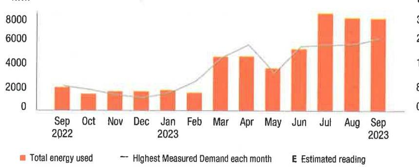

The image is a bar and line chart depicting a **yearly usage breakdown (monthly-based)** of electricity from September 2022 to September 2023.

- **X-axis**: Months from Sep 2022 to Sep 2023.
- **Y-axis**: Energy usage in kWh, ranging from 0 to 8000.
- **Legend**:
  - Orange bars represent "Total energy used."
  - A gray line represents "Highest Measured Demand each month."
  - "E" indicates "Estimated reading."

**Data Points**:
- Sep 2022: Approximately 2000 kWh
- Oct 2022: Approximately 2000 kWh
- Nov 2022: Approximately 2000 kWh
- Dec 2022: Approximately 3000 kWh
- Jan 2023: Approximately 3000 kWh
- Feb 2023: Approximately 2000 kWh
- Mar 2023: Approximately 3000 kWh
- Apr 2023: Approximately 4000 kWh
- May 2023: Approximately 5000 kWh
- Jun 2023: Approximately 6000 kWh
- Jul 2023: Approximately 7000 kWh
- Aug 2023: Approximately 7500 kWh
- Sep 2023: Approximately 7500 kWh

The chart shows a general increase in energy usage over the year, with peaks in the summer months.

Visit MyAccount for more details regarding your energy usage.

## MEASURED DEMAND

Demand kW
23.20

Measured Demand is the maximum use of electricity at any time during a monthly time period, as measured by your meter.

## BILLED DEMAND

Annual Demand kW
23.20

Summer Demand kW
23.20

## SUPPLY CAPACITY

Generation kW
14,474
Transmission kW
13.073

Supply capacity is required to serve the system's annual peak usage. It represents your share of these facilities, in kilowatts (kW). It is calculated based on your peak usage from the previous summer. Supply capacity values are updated periodically throughout the year and are proroted based on your service period.

## Price to compare

If you want to consider getting your electric supply from another supplier, compare their price with ours. This month, your cost for energy supply is $\$ 707.05$. This price to compare varies month to month, depending on your usage.

Your PoD ID is: PE000010959989458492 Your PoD ID is your Point of Delivery identification within PSE\&G's system. You will need this number if you are considering enrolling with another supplier.

le pnpag j10eb601.1@gmail.202308222117.rwv-137142-000040820

## Your energy bill

## Message Center

This bill reflects a BPU-approved change in the Supply portion of your electric bill effective on and after September 1, 2023. The increase in the Supply portion of your bill is due to a change in the Transmission rate. The overall impact for business customers will vary by individual customer usage. Tariff information may also be found by visiting pseg.com.

The success of your business is important to us. We are working hard to make it easier to do business with us. To learn more about how we can help, visit pseg.com/Business.
J.D. Power named PSE\&G \#1 in customer satisfaction for both Residential Electric and Natural Gas Service in the East among Large Utilities. On behalf of the more than 12,000 PSEG employees who work hard every day, we thank you for rating us as a top utilities provider. For J.D. Power 2022 award information, visit jdpower.com/awards.

## (2) NEXT METER READING October 20, 2023

## How to contact us

## 1-855-8IZ-PSEG (249-7734)

Customer Service: 8am to 5:30pm Mon to Fri,
Closed on weekends and holidays
Emergencies / Outages / WorryFree Services: 24/7
TTY for the hearing impaired: 1-800-225-0072
Visit pseg.com/myaccount to access your account anytime
Text us. Register for MyAlerts by texting REG to 4PSEG(47734)
$>$ Text OUT to report an outage.
facebook.com/pseg
twitter.com/psegdeilvers

## PAY YOUR WAY, 24/7

We offer a variety of methods that make it easy to pay your bill. See reverse side for more information.

By checking this box, I authorize PSE\&G to enroll me in paperless billing at this email address:

068572000040819
$\left.{ }^{\text {dIIII } I I I I I I I I I I I I I I I I I I I I I I I I I I I I I I I I I I I I I I I I I I I I I I I I I I I I I I I I I I I I I I I I I I I I I I I I I I I I I I I I I I I I I I I I I I I I I I I I I I I I I I I I I I I I I I I I I I I I I I I I I I
HOTEL WOODBRIDGE LLC
120 WOOD AVE S
ISELIN NJ 08830-2736

## Total amount due

You do not need to make a payment.
With automatic bill payment, we'll debit your bank account on Oct 10, 2023

Bill date: September 25, 2023
For the period: August 23, 2023 to September 21, 2023

## - HOTEL WOODBRIDGE LLC

ACCOUNT NUMBER
7222033807
SERVICE ADDRESS
120 WOOD AVE S BLL-6N WOODBRIDGE TWP NJ 08830-2711

## Your billing summary

Balance remaining from your last bill
PSE\&G balance from last bill
\$257.88
Less Payment received September 8, 2023 - thank you! -\$257.88
Balance remaining from your last bill
This month's charges and credits
Electric charges - PSE\&G
This month's charges and credits
Total amount we'll debit your
\$309.71
account on Oct 10, 2023

Account number
7222033807
Automatic bill payment - do not pay

## Amount enclosed

$\mathrm{I}^{\mathrm{I}} \mathrm{I}^{\mathrm{I}} \mathrm{I}^{\mathrm{I}} \mathrm{I}^{\mathrm{I}} \mathrm{I}^{\mathrm{I}} \mathrm{I} \mathrm{I}^{\mathrm{I}} \mathrm{I}^{\mathrm{I}} \mathrm{I}^{\mathrm{I}} \mathrm{I}^{\mathrm{I}} \mathrm{I}^{\mathrm{I}} \mathrm{I}^{\mathrm{I}} \mathrm{I}^{\mathrm{I}} \mathrm{I}^{\mathrm{I}} \mathrm{I}^{\mathrm{I}} \mathrm{I}^{\mathrm{I}} \mathrm{I}^{\mathrm{I}} \mathrm{I}^{\mathrm{I}} \mathrm{I}^{\mathrm{I}} \mathrm{I}^{\mathrm{I}} \mathrm{I}^{\mathrm{I}} \mathrm{I}^{\mathrm{I}} \mathrm{I}^{\mathrm{I}} \mathrm{I}^{\mathrm{I}} \mathrm{I}^{\mathrm{I}} \mathrm{I}^{\mathrm{I}} \mathrm{I}^{\mathrm{I}} \mathrm{I}^{\mathrm{I}} \mathrm{I}^{\mathrm{I}} \mathrm{I}^{\mathrm{I}} \mathrm{I}^{\mathrm{I}} \mathrm{I}^{\mathrm{I}} \mathrm{I}^{\mathrm{I}} \mathrm{I}^{\mathrm{I}} \mathrm{I}^{\mathrm{I}} \mathrm{I}^{\mathrm{I}} \mathrm{I}^{\mathrm{I}} \mathrm{I}^{\mathrm{I}} \mathrm{I}^{\mathrm{I}} \mathrm{I}^{\mathrm{I}} \mathrm{I}^{\mathrm{I}} \mathrm{I}^{\mathrm{I}} \mathrm{I}^{\mathrm{I}} \mathrm{I}^{\mathrm{I}} \mathrm{I}^{\mathrm{I}} \mathrm{I}^{\mathrm{I}} \mathrm{I}^{\mathrm{I}} \mathrm{I}^{\mathrm{I}} \mathrm{I}^{\mathrm{I}} \mathrm{I}^{\mathrm{I}} \mathrm{I}^{\mathrm{I}} \mathrm{I}^{\mathrm{I}} \mathrm{I}^{\mathrm{I}} \mathrm{I}^{\mathrm{I}} \mathrm{I}^{\mathrm{I}} \mathrm{I}^{\mathrm{I}} \mathrm{I}^{\mathrm{I}} \mathrm{I}^{\mathrm{I}} \mathrm{I}^{\mathrm{I}} \mathrm{I}^{\mathrm{I}} \mathrm{I}^{\mathrm{I}} \mathrm{I}^{\mathrm{I}} \mathrm{I}^{\mathrm{I}} \mathrm{I}^{\mathrm{I}} \mathrm{I}^{\mathrm{I}} \mathrm{I}^{\mathrm{I}} \mathrm{I}^{\mathrm{I}} \mathrm{I}^{\mathrm{I}} \mathrm{I}^{\mathrm{I}} \mathrm{I}^{\mathrm{I}} \mathrm{I}^{\mathrm{I}} \mathrm{I}^{\mathrm{I}} \mathrm{I}^{\mathrm{I}} \mathrm{I}^{\mathrm{I}} \mathrm{I}^{\mathrm{I}} \mathrm{I}^{\mathrm{I}} \mathrm{I}^{\mathrm{I}} \mathrm{I}^{\mathrm{I}} \mathrm{I}^{\mathrm{I}} \mathrm{I}^{\mathrm{I}} \mathrm{I}^{\mathrm{I}} \mathrm{I}^{\mathrm{I}} \mathrm{I}^{\mathrm{I}} \mathrm{I}^{\mathrm{I}} \mathrm{I}^{\mathrm{I}} \mathrm{I}^{\mathrm{I}} \mathrm{I}^{\mathrm{I}} \mathrm{I}^{\mathrm{I}} \mathrm{I}^{\mathrm{I}} \mathrm{I}^{\mathrm{I}} \mathrm{I}^{\mathrm{I}} \mathrm{I}^{\mathrm{I}} \mathrm{I}^{\mathrm{I}} \mathrm{I}^{\mathrm{I}} \mathrm{I}^{\mathrm{I}} \mathrm{I}^{\mathrm{I}} \mathrm{I}^{\mathrm{I}} \mathrm{I}^{\mathrm{I}} \mathrm{I}^{\mathrm{I}} \mathrm{I}^{\mathrm{I}} \mathrm{I}^{\mathrm{I}} \mathrm{I}^{\mathrm{I}} \mathrm{I}^{\mathrm{I}} \mathrm{I}^{\mathrm{I}} \mathrm{I}^{\mathrm{I}} \mathrm{I}^{\mathrm{I}} \mathrm{I}^{\mathrm{I}} \mathrm{I}^{\mathrm{I}} \mathrm{I}^{\mathrm{I}} \mathrm{I}^{\mathrm{I}} \mathrm{I}^{\mathrm{I}} \mathrm{I}^{\mathrm{I}} \mathrm{I}^{\mathrm{I}} \mathrm{I}^{\mathrm{I}} \mathrm{I}^{\mathrm{I}} \mathrm{I}^{\mathrm{I}} \mathrm{I}^{\mathrm{I}} \mathrm{I}^{\mathrm{I}} \mathrm{I}^{\mathrm{I}} \mathrm{I}^{\mathrm{I}} \mathrm{I}^{\mathrm{I}} \mathrm{I}^{\mathrm{I}} \mathrm{I}^{\mathrm{I}} \mathrm{I}^{\mathrm{I}} \mathrm{I}^{\mathrm{I}} \mathrm{I}^{\mathrm{I}} \mathrm{I}^{\mathrm{I}} \mathrm{I}^{\mathrm{I}} \mathrm{I}^{\mathrm{I}} \mathrm{I}^{\mathrm{I}} \mathrm{I}^{\mathrm{I}} \mathrm{I}^{\mathrm{I}} \mathrm{I}^{\mathrm{I}} \mathrm{I}^{\mathrm{I}} \mathrm{I}^{\mathrm{I}} \mathrm{I}^{\mathrm{I}} \mathrm{I}^{\mathrm{I}} \mathrm{I}^{\mathrm{I}} \mathrm{I}^{\mathrm{I}} \mathrm{I}^{\mathrm{I}} \mathrm{I}^{\mathrm{I}} \mathrm{I}^{\mathrm{I}} \mathrm{I}^{\mathrm{I}} \mathrm{I}^{\mathrm{I}} \mathrm{I}^{\mathrm{I}} \mathrm{I}^{\mathrm{I}} \mathrm{I}^{\mathrm{I}} \mathrm{I}^{\mathrm{I}} \mathrm{I}^{\mathrm{I}} \mathrm{I}^{\mathrm{I}} \mathrm{I}^{\mathrm{I}} \mathrm{I}^{\mathrm{I}} \mathrm{I}^{\mathrm{I}} \mathrm{I}^{\mathrm{I}} \mathrm{I}^{\mathrm{I}} \mathrm{I}^{\mathrm{I}} \mathrm{I}^{\mathrm{I}} \mathrm{I}^{\mathrm{I}} \mathrm{I}^{\mathrm{I}} \mathrm{I}^{\mathrm{I}} \mathrm{I}^{\mathrm{I}} \mathrm{I}^{\mathrm{I}} \mathrm{I}^{\mathrm{I}} \mathrm{I}^{\mathrm{I}} \mathrm{I}^{\mathrm{I}} \mathrm{I}^{\mathrm{I}} \mathrm{I}^{\mathrm{I}} \mathrm{I}^{\mathrm{I}} \mathrm{I}^{\mathrm{I}} \mathrm{I}^{\mathrm{I}} \mathrm{I}^{\mathrm{I}} \mathrm{I}^{\mathrm{I}} \mathrm{I}^{\mathrm{I}} \mathrm{I}^{\mathrm{I}} \mathrm{I}^{\mathrm{I}} \mathrm{I}^{\mathrm{I}} \mathrm{I}^{\mathrm{I}} \mathrm{I}^{\mathrm{I}} \mathrm{I}^{\mathrm{I}} \mathrm{I}^{\mathrm{I}} \mathrm{I}^{\mathrm{I}} \mathrm{I}^{\mathrm{I}} \mathrm{I}^{\mathrm{I}} \mathrm{I}^{\mathrm{I}} \mathrm{I}^{\mathrm{I}} \mathrm{I}^{\mathrm{I}} \mathrm{I}^{\mathrm{I}} \mathrm{I}^{\mathrm{I}} \mathrm{I}^{\mathrm{I}} \mathrm{I}^{\mathrm{I}} \mathrm{I}^{\mathrm{I}} \mathrm{I}^{\mathrm{I}} \mathrm{I}^{\mathrm{I}} \mathrm{I}^{\mathrm{I}} \mathrm{I}^{\mathrm{I}} \mathrm{I}^{\mathrm{I}} \mathrm{I}^{\mathrm{I}} \mathrm{I}^{\mathrm{I}} \mathrm{I}^{\mathrm{I}} \mathrm{I}^{\mathrm{I}} \mathrm{I}^{\mathrm{I}} \mathrm{I}^{\mathrm{I}} \mathrm{I}^{\mathrm{I}} \mathrm{I}^{\mathrm{I}} \mathrm{I}^{\mathrm{I}} \mathrm{I}^{\mathrm{I}} \mathrm{I}^{\mathrm{I}} \mathrm{I}^{\mathrm{I}} \mathrm{I}^{\mathrm{I}} \mathrm{I}^{\mathrm{I}} \mathrm{I}^{\mathrm{I}} \mathrm{I}^{\mathrm{I}} \mathrm{I}^{\mathrm{I}} \mathrm{I}^{\mathrm{I}} \mathrm{I}^{\mathrm{I}} \mathrm{I}^{\mathrm{I}} \mathrm{I}^{\mathrm{I}} \mathrm{I}^{\mathrm{I}} \mathrm{I}^{\mathrm{I}} \mathrm{I}^{\mathrm{I}} \mathrm{I}^{\mathrm{I}} \mathrm{I}^{\mathrm{I}} \mathrm{I}^{\mathrm{I}} \mathrm{I}^{\mathrm{I}} \mathrm{I}^{\mathrm{I}} \mathrm{I}^{\mathrm{I}} \mathrm{I}^{\mathrm{I}} \mathrm{I}^{\mathrm{I}} \mathrm{I}^{\mathrm{I}} \mathrm{I}^{\mathrm{I}} \mathrm{I}^{\mathrm{I}} \mathrm{I}^{\mathrm{I}} \mathrm{I}^{\mathrm{I}} \mathrm{I}^{\mathrm{I}} \mathrm{I}^{\mathrm{I}} \mathrm{I}^{\mathrm{I}} \mathrm{I}^{\mathrm{I}} \mathrm{I}^{\mathrm{I}} \mathrm{I}^{\mathrm{I}} \mathrm{I}^{\mathrm{I}} \mathrm{I}^{\mathrm{I}} \mathrm{I}^{\mathrm{I}} \mathrm{I}^{\mathrm{I}} \mathrm{I}^{\mathrm{I}} \mathrm{I}^{\mathrm{I}} \mathrm{I}^{\mathrm{I}} \mathrm{I}^{\mathrm{I}} \mathrm{I}^{\mathrm{I}} \mathrm{I}^{\mathrm{I}} \mathrm{I}^{\mathrm{I}} \mathrm{I}^{\mathrm{I}} \mathrm{I}^{\mathrm{I}} \mathrm{I}^{\mathrm{I}} \mathrm{I}^{\mathrm{I}} \mathrm{I}^{\mathrm{I}} \mathrm{I}^{\mathrm{I}} \mathrm{I}^{\mathrm{I}} \mathrm{I}^{\mathrm{I}} \mathrm{I}^{\mathrm{I}} \mathrm{I}^{\mathrm{I}} \mathrm{I}^{\mathrm{I}} \mathrm{I}^{\mathrm{I}} \mathrm{I}^{\mathrm{I}} \mathrm{I}^{\mathrm{I}} \mathrm{I}^{\mathrm{I}} \mathrm{I}^{\mathrm{I}} \mathrm{I}^{\mathrm{I}} \mathrm{I}^{\mathrm{I}} \mathrm{I}^{\mathrm{I}} \mathrm{I}^{\mathrm{I}} \mathrm{I}^{\mathrm{I}} \mathrm{I}^{\mathrm{I}} \mathrm{I}^{\mathrm{I}} \mathrm{I}^{\mathrm{I}} \mathrm{I}^{\mathrm{I}} \mathrm{I}^{\mathrm{I}} \mathrm{I}^{\mathrm{I}} \mathrm{I}^{\mathrm{I}} \mathrm{I}^{\mathrm{I}} \mathrm{I}^{\mathrm{I}} \mathrm{I}^{\mathrm{I}} \mathrm{I}^{\mathrm{I}} \mathrm{I}^{\mathrm{I}} \mathrm{I}^{\mathrm{I}} \mathrm{I}^{\mathrm{I}} \mathrm{I}^{\mathrm{I}} \mathrm{I}^{\mathrm{I}} \mathrm{I}^{\mathrm{I}} \mathrm{I}^{\mathrm{I}} \mathrm{I}^{\mathrm{I}} \mathrm{I}^{\mathrm{I}} \mathrm{I}^{\mathrm{I}} \mathrm{I}^{\mathrm{I}} \mathrm{I}^{\mathrm{I}} \mathrm{I}^{\mathrm{I}} \mathrm{I}^{\mathrm{I}} \mathrm{I}^{\mathrm{I}} \mathrm{I}^{\mathrm{I}} \mathrm{I}^{\mathrm{I}} \mathrm{I}^{\mathrm{I}} \mathrm{I}^{\mathrm{I}} \mathrm{I}^{\mathrm{I}} \mathrm{I}^{\mathrm{I}} \mathrm{I}^{\mathrm{I}} \mathrm{I}^{\mathrm{I}} \mathrm{I}^{\mathrm{I}} \mathrm{I}^{\mathrm{I}} \mathrm{I}^{\mathrm{I}} \mathrm{I}^{\mathrm{I}} \mathrm{I}^{\mathrm{I}} \mathrm{I}^{\mathrm{I}} \mathrm{I}^{\mathrm{I}} \mathrm{I}^{\mathrm{I}} \mathrm{I}^{\mathrm{I}} \mathrm{I}^{\mathrm{I}} \mathrm{I}^{\mathrm{I}} \mathrm{I}^{\mathrm{I}} \mathrm{I}^{\mathrm{I}} \mathrm{I}^{\mathrm{I}} \mathrm{I}^{\mathrm{I}} \mathrm{I}^{\mathrm{I}} \mathrm{I}^{\mathrm{I}} \mathrm{I}^{\mathrm{I}} \mathrm{I}^{\mathrm{I}} \mathrm{I}^{\mathrm{I}} \mathrm{I}^{\mathrm{I}} \mathrm{I}^{\mathrm{I}} \mathrm{I}^{\mathrm{I}} \mathrm{I}^{\mathrm{I}} \mathrm{I}^{\mathrm{I}} \mathrm{I}^{\mathrm{I}} \mathrm{I}^{\mathrm{I}} \mathrm{I}^{\mathrm{I}} \mathrm{I}^{\mathrm{I}} \mathrm{I}^{\mathrm{I}} \mathrm{I}^{\mathrm{I}} \mathrm{I}^{\mathrm{I}} \mathrm{I}^{\mathrm{I}} \mathrm{I}^{\mathrm{I}} \mathrm{I}^{\mathrm{I}} \mathrm{I}^{\mathrm{I}} \mathrm{I}^{\mathrm{I}} \mathrm{I}^{\mathrm{I}} \mathrm{I}^{\mathrm{I}} \mathrm{I}^{\mathrm{I}} \mathrm{I}^{\mathrm{I}} \mathrm{I}^{\mathrm{I}} \mathrm{I}^{\mathrm{I}} \mathrm{I}^{\mathrm{I}} \mathrm{I}^{\mathrm{I}} \mathrm{I}^{\mathrm{I}} \mathrm{I}^{\mathrm{I}} \mathrm{I}^{\mathrm{I}} \mathrm{I}^{\mathrm{I}} \mathrm{I}^{\mathrm{I}} \mathrm{I}^{\mathrm{I}} \mathrm{I}^{\mathrm{I}} \mathrm{I}^{\mathrm{I}} \mathrm{I}^{\mathrm{I}} \mathrm{I}^{\mathrm{I}} \mathrm{I}^{\mathrm{I}} \mathrm{I}^{\mathrm{I}} \mathrm{I}^{\mathrm{I}} \mathrm{I}^{\mathrm{I}} \mathrm{I}^{\mathrm{I}} \mathrm{I}^{\mathrm{I}} \mathrm{I}^{\mathrm{I}} \mathrm{I}^{\mathrm{I}} \mathrm{I}^{\mathrm{I}} \mathrm{I}^{\mathrm{I}} \mathrm{I}^{\mathrm{I}} \mathrm{I}^{\mathrm{I}} \mathrm{I}^{\mathrm{I}} \mathrm{I}^{\mathrm{I}} \mathrm{I}^{\mathrm{I}} \mathrm{I}^{\mathrm{I}} \mathrm{I}^{\mathrm{I}} \mathrm{I}^{\mathrm{I}} \mathrm{I}^{\mathrm{I}} \mathrm{I}^{\mathrm{I}} \mathrm{I}^{\mathrm{I}} \mathrm{I}^{\mathrm{I}} \mathrm{I}^{\mathrm{I}} \mathrm{I}^{\mathrm{I}} \mathrm{I}^{\mathrm{I}} \mathrm{I}^{\mathrm{I}} \mathrm{I}^{\mathrm{I}} \mathrm{I}^{\mathrm{I}} \mathrm{I}^{\mathrm{I}} \mathrm{I}^{\mathrm{I}} \mathrm{I}^{\mathrm{I}} \mathrm{I}^{\mathrm{I}} \mathrm{I}^{\mathrm{I}} \mathrm{I}^{\mathrm{I}} \mathrm{I}^{\mathrm{I}} \mathrm{I}^{\mathrm{I}} \mathrm{I}^{\mathrm{I}} \mathrm{I}^{\mathrm{I}} \mathrm{I}^{\mathrm{I}} \mathrm{I}^{\mathrm{I}} \mathrm{I}^{\mathrm{I}} \mathrm{I}^{\mathrm{I}} \mathrm{I}^{\mathrm{I}} \mathrm{I}^{\mathrm{I}} \mathrm{I}^{\mathrm{I}} \mathrm{I}^{\mathrm{I}} \mathrm{I}^{\mathrm{I}} \mathrm{I}^{\mathrm{I}} \mathrm{I}^{\mathrm{I}} \mathrm{I}^{\mathrm{I}} \mathrm{I}^{\mathrm{I}} \mathrm{I}^{\mathrm{I}} \mathrm{I}^{\mathrm{I}} \mathrm{I}^{\mathrm{I}} \mathrm{I}^{\mathrm{I}} \mathrm{I}^{\mathrm{I}} \mathrm{I}^{\mathrm{I}} \mathrm{I}^{\mathrm{I}} \mathrm{I}^{\mathrm{I}} \mathrm{I}^{\mathrm{I}} \mathrm{I}^{\mathrm{I}} \mathrm{I}^{\mathrm{I}} \mathrm{I}^{\mathrm{I}} \mathrm{I}^{\mathrm{I}} \mathrm{I}^{\mathrm{I}} \mathrm{I}^{\mathrm{I}} \mathrm{I}^{\mathrm{I}} \mathrm{I}^{\mathrm{I}} \mathrm{I}^{\mathrm{I}} \mathrm{I}^{\mathrm{I}} \mathrm{I}^{\mathrm{I}} \mathrm{I}^{\mathrm{I}} \mathrm{I}^{\mathrm{I}} \mathrm{I}^{\mathrm{I}} \mathrm{I}^{\mathrm{I}} \mathrm{I}^{\mathrm{I}} \mathrm{I}^{\mathrm{I}} \mathrm{I}^{\mathrm{I}} \mathrm{I}^{\mathrm{I}} \mathrm{I}^{\mathrm{I}} \mathrm{I}^{\mathrm{I}} \mathrm{I}^{\mathrm{I}} \mathrm{I}^{\mathrm{I}} \mathrm{I}^{\mathrm{I}} \mathrm{I}^{\mathrm{I}} \mathrm{I}^{\mathrm{I}} \mathrm{I}^{\mathrm{I}} \mathrm{I}^{\mathrm{I}} \mathrm{I}^{\mathrm{I}} \mathrm{I}^{\mathrm{I}} \mathrm{I}^{\mathrm{I}} \mathrm{I}^{\mathrm{I}} \mathrm{I}^{\mathrm{I}} \mathrm{I}^{\mathrm{I}} \mathrm{I}^{\mathrm{I}} \mathrm{I}^{\mathrm{I}} \mathrm{I}^{\mathrm{I}} \mathrm{I}^{\mathrm{I}} \mathrm{I}^{\mathrm{I}} \mathrm{I}^{\mathrm{I}} \mathrm{I}^{\mathrm{I}} \mathrm{I}^{\mathrm{I}} \mathrm{I}^{\mathrm{I}} \mathrm{I}^{\mathrm{I}} \mathrm{I}^{\mathrm{I}} \mathrm{I}^{\mathrm{I}} \mathrm{I}^{\mathrm{I}} \mathrm{I}^{\mathrm{I}} \mathrm{I}^{\mathrm{I}} \mathrm{I}^{\mathrm{I}} \mathrm{I}^{\mathrm{I}} \mathrm{I}^{\mathrm{I}} \mathrm{I}^{\mathrm{I}} \mathrm{I}^{\mathrm{I}} \mathrm{I}^{\mathrm{I}} \mathrm{I}^{\mathrm{I}} \mathrm{I}^{\mathrm{I}} \mathrm{I}^{\mathrm{I}} \mathrm{I}^{\mathrm{I}} \mathrm{I}^{\mathrm{I}} \mathrm{I}^{\mathrm{I}} \mathrm{I}^{\mathrm{I}} \mathrm{I}^{\mathrm{I}} \mathrm{I}^{\mathrm{I}} \mathrm{I}^{\mathrm{I}} \mathrm{I}^{\mathrm{I}} \mathrm{I}^{\mathrm{I}} \mathrm{I}^{\mathrm{I}} \mathrm{I}^{\mathrm{I}} \mathrm{I}^{\mathrm{I}} \mathrm{I}^{\mathrm{I}} \mathrm{I}^{\mathrm{I}} \mathrm{I}^{\mathrm{I}} \mathrm{I}^{\mathrm{I}} \mathrm{I}^{\mathrm{I}} \mathrm{I}^{\mathrm{I}} \mathrm{I}^{\mathrm{I}} \mathrm{I}^{\mathrm{I}} \mathrm{I}^{\mathrm{I}} \mathrm{I}^{\mathrm{I}} \mathrm{I}^{\mathrm{I}} \mathrm{I}^{\mathrm{I}} \mathrm{I}^{\mathrm{I}} \mathrm{I}^{\mathrm{I}} \mathrm{I}^{\mathrm{I}} \mathrm{I}^{\mathrm{I}} \mathrm{I}^{\mathrm{I}} \mathrm{I}^{\mathrm{I}} \mathrm{I}^{\mathrm{I}} \mathrm{I}^{\mathrm{I}} \mathrm{I}^{\mathrm{I}} \mathrm{I}^{\mathrm{I}} \mathrm{I}^{\mathrm{I}} \mathrm{I}^{\mathrm{I}} \mathrm{I}^{\mathrm{I}} \mathrm{I}^{\mathrm{I}} \mathrm{I}^{\mathrm{I}} \mathrm{I}^{\mathrm{I}} \mathrm{I}^{\mathrm{I}} \mathrm{I}^{\mathrm{I}} \mathrm{I}^{\mathrm{I}} \mathrm{I}^{\mathrm{I}} \mathrm{I}^{\mathrm{I}} \mathrm{I}^{\mathrm{I}} \mathrm{I}^{\mathrm{I}} \mathrm{I}^{\mathrm{I}} \mathrm{I}^{\mathrm{I}} \mathrm{I}^{\mathrm{I}} \mathrm{I}^{\mathrm{I}} \mathrm{I}^{\mathrm{I}} \mathrm{I}^{\mathrm{I}} \mathrm{I}^{\mathrm{I}} \mathrm{I}^{\mathrm{I}} \mathrm{I}^{\mathrm{I}} \mathrm{I}^{\mathrm{I}} \mathrm{I}^{\mathrm{I}} \mathrm{I}^{\mathrm{I}} \mathrm{I}^{\mathrm{I}} \mathrm{I}^{\mathrm{I}} \mathrm{I}^{\mathrm{I}} \mathrm{I}^{\mathrm{I}} \mathrm{I}^{\mathrm{I}} \mathrm{I}^{\mathrm{I}} \mathrm{I}^{\mathrm{I}} \mathrm{I}^{\mathrm{I}} \mathrm{I}^{\mathrm{I}} \mathrm{I}^{\mathrm{I}} \mathrm{I}^{\mathrm{I}} \mathrm{I}^{\mathrm{I}} \mathrm{I}^{\mathrm{I}} \mathrm{I}^{\mathrm{I}} \mathrm{I}^{\mathrm{I}} \mathrm{I}^{\mathrm{I}} \mathrm{I}^{\mathrm{I}} \mathrm{I}^{\mathrm{I}} \mathrm{I}^{\mathrm{I}} \mathrm{I}^{\mathrm{I}} \mathrm{I}^{\mathrm{I}} \mathrm{I}^{\mathrm{I}} \mathrm{I}^{\mathrm{I}} \mathrm{I}^{\mathrm{I}} \mathrm{I}^{\mathrm{I}} \mathrm{I}^{\mathrm{I}} \mathrm{I}^{\mathrm{I}} \mathrm{I}^{\mathrm{I}} \mathrm{I}^{\mathrm{I}} \mathrm{I}^{\mathrm{I}} \mathrm{I}^{\mathrm{I}} \mathrm{I}^{\mathrm{I}} \mathrm{I}^{\mathrm{I}} \mathrm{I}^{\mathrm{I}} \mathrm{I}^{\mathrm{I}} \mathrm{I}^{\mathrm{I}} \mathrm{I}^{\mathrm{I}} \mathrm{I}^{\mathrm{I}} \mathrm{I}^{\mathrm{I}} \mathrm{I}^{\mathrm{I}} \mathrm{I}^{\mathrm{I}} \mathrm{I}^{\mathrm{I}} \mathrm{I}^{\mathrm{I}} \mathrm{I}^{\mathrm{I}} \mathrm{I}^{\mathrm{I}} \mathrm{I}^{\mathrm{I}} \mathrm{I}^{\mathrm{I}} \mathrm{I}^{\mathrm{I}} \mathrm{I}^{\mathrm{I}} \mathrm{I}^{\mathrm{I}} \mathrm{I}^{\mathrm{I}} \mathrm{I}^{\mathrm{I}} \mathrm{I}^{\mathrm{I}} \mathrm{I}^{\mathrm{I}} \mathrm{I}^{\mathrm{I}} \mathrm{I}^{\mathrm{I}} \mathrm{I}^{\mathrm{I}} \mathrm{I}^{\mathrm{I}} \mathrm{I}^{\mathrm{I}} \mathrm{I}^{\mathrm{I}} \mathrm{I}^{\mathrm{I}} \mathrm{I}^{\mathrm{I}} \mathrm{I}^{\mathrm{I}} \mathrm{I}^{\mathrm{I}} \mathrm{I}^{\mathrm{I}} \mathrm{I}^{\mathrm{I}} \mathrm{I}^{\mathrm{I}} \mathrm{I}^{\mathrm{I}} \mathrm{I}^{\mathrm{I}} \mathrm{I}^{\mathrm{I}} \mathrm{I}^{\mathrm{I}} \mathrm{I}^{\mathrm{I}} \mathrm{I}^{\mathrm{I}} \mathrm{I}^{\mathrm{I}} \mathrm{I}^{\mathrm{I}} \mathrm{I}^{\mathrm{I}} \mathrm{I}^{\mathrm{I}} \mathrm{I}^{\mathrm{I}} \mathrm{I}^{\mathrm{I}} \mathrm{I}^{\mathrm{I}} \mathrm{I}^{\mathrm{I}} \mathrm{I}^{\mathrm{I}} \mathrm{I}^{\mathrm{I}} \mathrm{I}^{\mathrm{I}} \mathrm{I}^{\mathrm{I}} \mathrm{I}^{\mathrm{I}} \mathrm{I}^{\mathrm{I}} \mathrm{I}^{\mathrm{I}} \mathrm{I}^{\mathrm{I}} \mathrm{I}^{\mathrm{I}} \mathrm{I}^{\mathrm{I}} \mathrm{I}^{\mathrm{I}} \mathrm{I}^{\mathrm{I}} \mathrm{I}^{\mathrm{I}} \mathrm{I}^{\mathrm{I}} \mathrm{I}^{\mathrm{I}} \mathrm{I}^{\mathrm{I}} \mathrm{I}^{\mathrm{I}} \mathrm{I}^{\mathrm{I}} \mathrm{I}^{\mathrm{I}} \mathrm{I}^{\mathrm{I}} \mathrm{I}^{\mathrm{I}} \mathrm{I}^{\mathrm{I}} \mathrm{I}^{\mathrm{I}} \mathrm{I}^{\mathrm{I}} \mathrm{I}^{\mathrm{I}} \mathrm{I}^{\mathrm{I}} \mathrm{I}^{\mathrm{I}} \mathrm{I}^{\mathrm{I}} \mathrm{I}^{\mathrm{I}} \mathrm{I}^{\mathrm{I}} \mathrm{I}^{\mathrm{I}} \mathrm{I}^{\mathrm{I}} \mathrm{I}^{\mathrm{I}} \mathrm{I}^{\mathrm{I}} \mathrm{I}^{\mathrm{I}} \mathrm{I}^{\mathrm{I}} \mathrm{I}^{\mathrm{I}} \mathrm{I}^{\mathrm{I}} \mathrm{I}^{\mathrm{I}} \mathrm{I}^{\mathrm{I}} \mathrm{I}^{\mathrm{I}} \mathrm{I}^{\mathrm{I}} \mathrm{I}^{\mathrm{I}} \mathrm{I}^{\mathrm{I}} \mathrm{I}^{\mathrm{I}} \mathrm{I}^{\mathrm{I}} \mathrm{I}^{\mathrm{I}} \mathrm{I}^{\mathrm{I}} \mathrm{I}^{\mathrm{I}} \mathrm{I}^{\mathrm{I}} \mathrm{I}^{\mathrm{I}} \mathrm{I}^{\mathrm{I}} \mathrm{I}^{\mathrm{I}} \mathrm{I}^{\mathrm{I}} \mathrm{I}^{\mathrm{I}} \mathrm{I}^{\mathrm{I}} \mathrm{I}^{\mathrm{I}} \mathrm{I}^{\mathrm{I}} \mathrm{I}^{\mathrm{I}} \mathrm{I}^{\mathrm{I}} \mathrm{I}^{\mathrm{I}} \mathrm{I}^{\mathrm{I}} \mathrm{I}^{\mathrm{I}} \mathrm{I}^{\mathrm{I}} \mathrm{I}^{\mathrm{I}} \mathrm{I}^{\mathrm{I}} \mathrm{I}^{\mathrm{I}} \mathrm{I}^{\mathrm{I}} \mathrm{I}^{\mathrm{I}} \mathrm{I}^{\mathrm{I}} \mathrm{I}^{\mathrm{I}} \mathrm{I}^{\mathrm{I}} \mathrm{I}^{\mathrm{I}} \mathrm{I}^{\mathrm{I}} \mathrm{I}^{\mathrm{I}} \mathrm{I}^{\mathrm{I}} \mathrm{I}^{\mathrm{I}} \mathrm{I}^{\mathrm{I}} \mathrm{I}^{\mathrm{I}} \mathrm{I}^{\mathrm{I}} \mathrm{I}^{\mathrm{I}} \mathrm{I}^{\mathrm{I}} \mathrm{I}^{\mathrm{I}} \mathrm{I}^{\mathrm{I}} \mathrm{I}^{\mathrm{I}} \mathrm{I}^{\mathrm{I}} \mathrm{I}^{\mathrm{I}} \mathrm{I}^{\mathrm{I}} \mathrm{I}^{\mathrm{I}} \mathrm{I}^{\mathrm{I}} \mathrm{I}^{\mathrm{I}} \mathrm{I}^{\mathrm{I}} \mathrm{I}^{\mathrm{I}} \mathrm{I}^{\mathrm{I}} \mathrm{I}^{\mathrm{I}} \mathrm{I}^{\mathrm{I}} \mathrm{I}^{\mathrm{I}} \mathrm{I}^{\mathrm{I}} \mathrm{I}^{\mathrm{I}} \mathrm{I}^{\mathrm{I}} \mathrm{I}^{\mathrm{I}} \mathrm{I}^{\mathrm{I}} \mathrm{I}^{\mathrm{I}} \mathrm{I}^{\mathrm{I}} \mathrm{I}^{\mathrm{I}} \mathrm{I}^{\mathrm{I}} \mathrm{I}^{\mathrm{I}} \mathrm{I}^{\mathrm{I}} \mathrm{I}^{\mathrm{I}} \mathrm{I}^{\mathrm{I}} \mathrm{I}^{\mathrm{I}} \mathrm{I}^{\mathrm{I}} \mathrm{I}^{\mathrm{I}} \mathrm{I}^{\mathrm{I}} \mathrm{I}^{\mathrm{I}} \mathrm{I}^{\mathrm{I}} \mathrm{I}^{\mathrm{I}} \mathrm{I}^{\mathrm{I}} \mathrm{I}^{\mathrm{I}} \mathrm{I}^{\mathrm{I}} \mathrm{I}^{\mathrm{I}} \mathrm{I}^{\mathrm{I}} \mathrm{I}^{\mathrm{I}} \mathrm{I}^{\mathrm{I}} \mathrm{I}^{\mathrm{I}} \mathrm{I}^{\mathrm{I}} \mathrm{I}^{\mathrm{I}} \mathrm{I}^{\mathrm{I}} \mathrm{I}^{\mathrm{I}} \mathrm{I}^{\mathrm{I}} \mathrm{I}^{\mathrm{I}} \mathrm{I}^{\mathrm{I}} \mathrm{I}^{\mathrm{I}} \mathrm{I}^{\mathrm{I}} \mathrm{I}^{\mathrm{I}} \mathrm{I}^{\mathrm{I}} \mathrm{I}^{\mathrm{I}} \mathrm{I}^{\mathrm{I}} \mathrm{I}^{\mathrm{I}} \mathrm{I}^{\mathrm{I}} \mathrm{I}^{\mathrm{I}} \mathrm{I}^{\mathrm{I}} \mathrm{I}^{\mathrm{I}} \mathrm{I}^{\mathrm{I}} \mathrm{I}^{\mathrm{I}} \mathrm{I}^{\mathrm{I}} \mathrm{I}^{\mathrm{I}} \mathrm{I}^{\mathrm{I}} \mathrm{I}^{\mathrm{I}} \mathrm{I}^{\mathrm{I}} \mathrm{I}^{\mathrm{I}} \mathrm{I}^{\mathrm{I}} \mathrm{I}^{\mathrm{I}} \mathrm{I}^{\mathrm{I}} \mathrm{I}^{\mathrm{I}} \mathrm{I}^{\mathrm{I}} \mathrm{I}^{\mathrm{I}} \mathrm{I}^{\mathrm{I}} \mathrm{I}^{\mathrm{I}} \mathrm{I}^{\mathrm{I}} \mathrm{I}^{\mathrm{I}} \mathrm{I}^{\mathrm{I}} \mathrm{I}^{\mathrm{I}} \mathrm{I}^{\mathrm{I}} \mathrm{I}^{\mathrm{I}} \mathrm{I}^{\mathrm{I}} \mathrm{I}^{\mathrm{I}} \mathrm{I}^{\mathrm{I}} \mathrm{I}^{\mathrm{I}} \mathrm{I}^{\mathrm{I}} \mathrm{I}^{\mathrm{I}} \mathrm{I}^{\mathrm{I}} \mathrm{I}^{\mathrm{I}} \mathrm{I}^{\mathrm{I}} \mathrm{I}^{\mathrm{I}} \mathrm{I}^{\mathrm{I}} \mathrm{I}^{\mathrm{I}} \mathrm{I}^{\mathrm{I}} \mathrm{I}^{\mathrm{I}} \mathrm{I}^{\mathrm{I}} \mathrm{I}^{\mathrm{I}} \mathrm{I}^{\mathrm{I}} \mathrm{I}^{\mathrm{I}} \mathrm{I}^{\mathrm{I}} \mathrm{I}^{\mathrm{I}} \mathrm{I}^{\mathrm{I}} \mathrm{I}^{\mathrm{I}} \mathrm{I}^{\mathrm{I}} \mathrm{I}^{\mathrm{I}} \mathrm{I}^{\mathrm{I}} \mathrm{I}^{\mathrm{I}} \mathrm{I}^{\mathrm{I}} \mathrm{I}^{\mathrm{I}} \mathrm{I}^{\mathrm{I}} \mathrm{I}^{\mathrm{I}} \mathrm{I}^{\mathrm{I}} \mathrm{I}^{\mathrm{I}} \mathrm{I}^{\mathrm{I}} \mathrm{I}^{\mathrm{I}} \mathrm{I}^{\mathrm{I}} \mathrm{I}^{\mathrm{I}} \mathrm{I}^{\mathrm{I}} \mathrm{I}^{\mathrm{I}} \mathrm{I}^{\mathrm{I}} \mathrm{I}^{\mathrm{I}} \mathrm{I}^{\mathrm{I}} \mathrm{I}^{\mathrm{I}} \mathrm{I}^{\mathrm{I}} \mathrm{I}^{\mathrm{I}} \mathrm{I}^{\mathrm{I}} \mathrm{I}^{\mathrm{I}} \mathrm{I}^{\mathrm{I}} \mathrm{I}^{\mathrm{I}} \mathrm{I}^{\mathrm{I}} \mathrm{I}^{\mathrm{I}} \mathrm{I}^{\mathrm{I}} \mathrm{I}^{\mathrm{I}} \mathrm{I}^{\mathrm{I}} \mathrm{I}^{\mathrm{I}} \mathrm{I}^{\mathrm{I}} \mathrm{I}^{\mathrm{I}} \mathrm{I}^{\mathrm{I}} \mathrm{I}^{\mathrm{I}} \mathrm{I}^{\mathrm{I}} \mathrm{I}^{\mathrm{I}} \mathrm{I}^{\mathrm{I}} \mathrm{I}^{\mathrm{I}} \mathrm{I}^{\mathrm{I}} \mathrm{I}^{\mathrm{I}} \mathrm{I}^{\mathrm{I}} \mathrm{I}^{\mathrm{I}} \mathrm{I}^{\mathrm{I}} \mathrm{I}^{\mathrm{I}} \mathrm{I}^{\mathrm{I}} \mathrm{I}^{\mathrm{I}} \mathrm{I}^{\mathrm{I}} \mathrm{I}^{\mathrm{I}} \mathrm{I}^{\mathrm{I}} \mathrm{I}^{\mathrm{I}} \mathrm{I}^{\mathrm{I}} \mathrm{I}^{\mathrm{I}} \mathrm{I}^{\mathrm{I}} \mathrm{I}^{\mathrm{I}} \mathrm{I}^{\mathrm{I}} \mathrm{I}^{\mathrm{I}} \mathrm{I}^{\mathrm{I}} \mathrm{I}^{\mathrm{I}} \mathrm{I}^{\mathrm{I}} \mathrm{I}^{\mathrm{I}} \mathrm{I}^{\mathrm{I}} \mathrm{I}^{\mathrm{I}} \mathrm{I}^{\mathrm{I}} \mathrm{I}^{\mathrm{I}} \mathrm{I}^{\mathrm{I}} \mathrm{I}^{\mathrm{I}} \mathrm{I}^{\mathrm{I}} \mathrm{I}^{\mathrm{I}} \mathrm{I}^{\mathrm{I}} \mathrm{I}^{\mathrm{I}} \mathrm{I}^{\mathrm{I}} \mathrm{I}^{\mathrm{I}} \mathrm{I}^{\mathrm{I}} \mathrm{I}^{\mathrm{I}} \mathrm{I}^{\mathrm{I}} \mathrm{I}^{\mathrm{I}} \mathrm{I}^{\mathrm{I}} \mathrm{I}^{\mathrm{I}} \mathrm{I}^{\mathrm{I}} \mathrm{I}^{\mathrm{I}} \mathrm{I}^{\mathrm{I}} \mathrm{I}^{\mathrm{I}} \mathrm{I}^{\mathrm{I}} \mathrm{I}^{\mathrm{I}} \mathrm{I}^{\mathrm{I}} \mathrm{I}^{\mathrm{I}} \mathrm{I}^{\mathrm{I}} \mathrm{I}^{\mathrm{I}} \mathrm{I}^{\mathrm{I}} \mathrm{I}^{\mathrm{I}} \mathrm{I}^{\mathrm{I}} \mathrm{I}^{\mathrm{I}} \mathrm{I}^{\mathrm{I}} \mathrm{I}^{\mathrm{I}} \mathrm{I}^{\mathrm{I}} \mathrm{I}^{\mathrm{I}} \mathrm{I}^{\mathrm{I}} \mathrm{I}^{\mathrm{I}} \mathrm{I}^{\mathrm{I}} \mathrm{I}^{\mathrm{I}} \mathrm{I}^{\mathrm{I}} \mathrm{I}^{\mathrm{I}} \mathrm{I}^{\mathrm{I}} \mathrm{I}^{\mathrm{I}} \mathrm{I}^{\mathrm{I}} \mathrm{I}^{\mathrm{I}} \mathrm{I}^{\mathrm{I}} \mathrm{I}^{\mathrm{I}} \mathrm{I}^{\mathrm{I}} \mathrm{I}^{\mathrm{I}} \mathrm{I}^{\mathrm{I}} \mathrm{I}^{\mathrm{I}} \mathrm{I}^{\mathrm{I}} \mathrm{I}^{\mathrm{I}} \mathrm{I}^{\mathrm{I}} \mathrm{I}^{\mathrm{I}} \mathrm{I}^{\mathrm{I}} \mathrm{I}^{\mathrm{I}} \mathrm{I}^{\mathrm{I}} \mathrm{I}^{\mathrm{I}} \mathrm{I}^{\mathrm{I}} \mathrm{I}^{\mathrm{I}} \mathrm{I}^{\mathrm{I}} \mathrm{I}^{\mathrm{I}} \mathrm{I}^{\mathrm{I}} \mathrm{I}^{\mathrm{I}} \mathrm{I}^{\mathrm{I}} \mathrm{I}^{\mathrm{I}} \mathrm{I}^{\mathrm{I}} \mathrm{I}^{\mathrm{I}} \mathrm{I}^{\mathrm{I}} \mathrm{I}^{\mathrm{I}} \mathrm{I}^{\mathrm{I}} \mathrm{I}^{\mathrm{I}} \mathrm{I}^{\mathrm{I}} \mathrm{I}^{\mathrm{I}} \mathrm{I}^{\mathrm{I}} \mathrm{I}^{\mathrm{I}} \mathrm{I}^{\mathrm{I}} \mathrm{I}^{\mathrm{I}} \mathrm{I}^{\mathrm{I}} \mathrm{I}^{\mathrm{I}} \mathrm{I}^{\mathrm{I}} \mathrm{I}^{\mathrm{I}} \mathrm{I}^{\mathrm{I}} \mathrm{I}^{\mathrm{I}} \mathrm{I}^{\mathrm{I}} \mathrm{I}^{\mathrm{I}} \mathrm{I}^{\mathrm{I}} \mathrm{I}^{\mathrm{I}} \mathrm{I}^{\mathrm{I}} \mathrm{I}^{\mathrm{I}} \mathrm{I}^{\mathrm{I}} \mathrm{I}^{\mathrm{I}} \mathrm{I}^{\mathrm{I}} \mathrm{I}^{\mathrm{I}} \mathrm{I}^{\mathrm{I}} \mathrm{I}^{\mathrm{I}} \mathrm{I}^{\mathrm{I}} \mathrm{I}^{\mathrm{I}} \mathrm{I}^{\mathrm{I}} \mathrm{I}^{\mathrm{I}} \mathrm{I}^{\mathrm{I}} \mathrm{I}^{\mathrm{I}} \mathrm{I}^{\mathrm{I}} \mathrm{I}^{\mathrm{I}} \mathrm{I}^{\mathrm{I}} \mathrm{I}^{\mathrm{I}} \mathrm{I}^{\mathrm{I}} \mathrm{I}^{\mathrm{I}} \mathrm{I}^{\mathrm{I}} \mathrm{I}^{\mathrm{I}} \mathrm{I}^{\mathrm{I}} \mathrm{I}^{\mathrm{I}} \mathrm{I}^{\mathrm{I}} \mathrm{I}^{\mathrm{I}} \mathrm{I}^{\mathrm{I}} \mathrm{I}^{\mathrm{I}} \mathrm{I}^{\mathrm{I}} \mathrm{I}^{\mathrm{I}} \mathrm{I}^{\mathrm{I}} \mathrm{I}^{\mathrm{I}} \mathrm{I}^{\mathrm{I}} \mathrm{I}^{\mathrm{I}} \mathrm{I}^{\mathrm{I}} \mathrm{I}^{\mathrm{I}} \mathrm{I}^{\mathrm{I}} \mathrm{I}^{\mathrm{I}} \mathrm{I}^{\mathrm{I}} \mathrm{I}^{\mathrm{I}} \mathrm{I}^{\mathrm{I}} \mathrm{I}^{\mathrm{I}} \mathrm{I}^{\mathrm{I}} \mathrm{I}^{\mathrm{I}} \mathrm{I}^{\mathrm{I}} \mathrm{I}^{\mathrm{I}} \mathrm{I}^{\mathrm{I}} \mathrm{I}^{\mathrm{I}} \mathrm{I}^{\mathrm{I}} \mathrm{I}^{\mathrm{I}} \mathrm{I}^{\mathrm{I}} \mathrm{I}^{\mathrm{I}} \mathrm{I}^{\mathrm{I}} \mathrm{I}^{\mathrm{I}} \mathrm{I}^{\mathrm{I}} \mathrm{I}^{\mathrm{I}} \mathrm{I}^{\mathrm{I}} \mathrm{I}^{\mathrm{I}} \mathrm{I}^{\mathrm{I}} \mathrm{I}^{\mathrm{I}} \mathrm{I}^{\mathrm{I}} \mathrm{I}^{\mathrm{I}} \mathrm{I}^{\mathrm{I}} \mathrm{I}^{\mathrm{I}} \mathrm{I}^{\mathrm{I}} \mathrm{I}^{\mathrm{I}} \mathrm{I}^{\mathrm{I}} \mathrm{I}^{\mathrm{I}} \mathrm{I}^{\mathrm{I}} \mathrm{I}^{\mathrm{I}} \mathrm{I}^{\mathrm{I}} \mathrm{I}^{\mathrm{I}} \mathrm{I}^{\mathrm{I}} \mathrm{I}^{\mathrm{I}} \mathrm{I}^{\mathrm{I}} \mathrm{I}^{\mathrm{I}} \mathrm{I}^{\mathrm{I}} \mathrm{I}^{\mathrm{I}} \mathrm{I}^{\mathrm{I}} \mathrm{I}^{\mathrm{I}} \mathrm{I}^{\mathrm{I}} \mathrm{I}^{\mathrm{I}} \mathrm{I}^{\mathrm{I}} \mathrm{I}^{\mathrm{I}} \mathrm{I}^{\mathrm{I}} \mathrm{I}^{\mathrm{I}} \mathrm{I}^{\mathrm{I}} \mathrm{I}^{\mathrm{I}} \mathrm{I}^{\mathrm{I}} \mathrm{I}^{\mathrm{I}} \mathrm{I}^{\mathrm{I}} \mathrm{I}^{\mathrm{I}} \mathrm{I}^{\mathrm{I}} \mathrm{I}^{\mathrm{I}} \mathrm{I}^{\mathrm{I}} \mathrm{I}^{\mathrm{I}} \mathrm{I}^{\mathrm{I}} \mathrm{I}^{\mathrm{I}} \mathrm{I}^{\mathrm{I}} \mathrm{I}^{\mathrm{I}} \mathrm{I}^{\mathrm{I}} \mathrm{I}^{\mathrm{I}} \mathrm{I}^{\mathrm{I}} \mathrm{I}^{\mathrm{I}} \mathrm{I}^{\mathrm{I}} \mathrm{I}^{\mathrm{I}} \mathrm{I}^{\mathrm{I}} \mathrm{I}^{\mathrm{I}} \mathrm{I}^{\mathrm{I}} \mathrm{I}^{\mathrm{I}} \mathrm{I}^{\mathrm{I}} \mathrm{I}^{\mathrm{I}} \mathrm{I}^{\mathrm{I}} \mathrm{I}^{\mathrm{I}} \mathrm{I}^{\mathrm{I}} \mathrm{I}^{\mathrm{I}} \mathrm{I}^{\mathrm{I}} \mathrm{I}^{\mathrm{I}} \mathrm{I}^{\mathrm{I}} \mathrm{I}^{\mathrm{I}} \mathrm{I}^{\mathrm{I}} \mathrm{I}^{\mathrm{I}} \mathrm{I}^{\mathrm{I}} \mathrm{I}^{\mathrm{I}} \mathrm{I}^{\mathrm{I}} \mathrm{I}^{\mathrm{I}} \mathrm{I}^{\mathrm{I}} \mathrm{I}^{\mathrm{I}} \mathrm{I}^{\mathrm{I}} \mathrm{I}^{\mathrm{I}} \mathrm{I}^{\mathrm{I}} \mathrm{I}^{\mathrm{I}} \mathrm{I}^{\mathrm{I}} \mathrm{I}^{\mathrm{I}} \mathrm{I}^{\mathrm{I}} \mathrm{I}^{\mathrm{I}} \mathrm{I}^{\mathrm{I}} \mathrm{I}^{\mathrm{I}} \mathrm{I}^{\mathrm{I}} \mathrm{I}^{\mathrm{I}} \mathrm{I}^{\mathrm{I}} \mathrm{I}^{\mathrm{I}} \mathrm{I}^{\mathrm{I}} \mathrm{I}^{\mathrm{I}} \mathrm{I}^{\mathrm{I}} \mathrm{I}^{\mathrm{I}} \mathrm{I}^{\mathrm{I}} \mathrm{I}^{\mathrm{I}} \mathrm{I}^{\mathrm{I}} \mathrm{I}^{\mathrm{I}} \mathrm{I}^{\mathrm{I}} \mathrm{I}^{\mathrm{I}} \mathrm{I}^{\mathrm{I}} \mathrm{I}^{\mathrm{I}} \mathrm{I}^{\mathrm{I}} \mathrm{I}^{\mathrm{I}} \mathrm{I}^{\mathrm{I}} \mathrm{I}^{\mathrm{I}} \mathrm{I}^{\mathrm{I}} \mathrm{I}^{\mathrm{I}} \mathrm{I}^{\mathrm{I}} \mathrm{I}^{\mathrm{I}} \mathrm{I}^{\mathrm{I}} \mathrm{I}^{\mathrm{I}} \mathrm{I}^{\mathrm{I}} \mathrm{I}^{\mathrm{I}} \mathrm{I}^{\mathrm{I}} \mathrm{I}^{\mathrm{I}} \mathrm{I}^{\mathrm{I}} \mathrm{I}^{\mathrm{I}} \mathrm{I}^{\mathrm{I}} \mathrm{I}^{\mathrm{I}} \mathrm{I}^{\mathrm{I}} \mathrm{I}^{\mathrm{I}} \mathrm{I}^{\mathrm{I}} \mathrm{I}^{\mathrm{I}} \mathrm{I}^{\mathrm{I}} \mathrm{I}^{\mathrm{I}} \mathrm{I}^{\mathrm{I}} \mathrm{I}^{\mathrm{I}} \mathrm{I}^{\mathrm{I}} \mathrm{I}^{\mathrm{I}} \mathrm{I}^{\mathrm{I}} \mathrm{I}^{\mathrm{I}} \mathrm{I}^{\mathrm{I}} \mathrm{I}^{\mathrm{I}} \mathrm{I}^{\mathrm{I}} \mathrm{I}^{\mathrm{I}} \mathrm{I}^{\mathrm{I}} \mathrm{I}^{\mathrm{I}} \mathrm{I}^{\mathrm{I}} \mathrm{I}^{\mathrm{I}} \mathrm{I}^{\mathrm{I}} \mathrm{I}^{\mathrm{I}} \mathrm{I}^{\mathrm{I}} \mathrm{I}^{\mathrm{I}} \mathrm{I}^{\mathrm{I}} \mathrm{I}^{\mathrm{I}} \mathrm{I}^{\mathrm{I}} \mathrm{I}^{\mathrm{I}} \mathrm{I}^{\mathrm{I}} \mathrm{I}^{\mathrm{I}} \mathrm{I}^{\mathrm{I}} \mathrm{I}^{\mathrm{I}} \mathrm{I}^{\mathrm{I}} \mathrm{I}^{\mathrm{I}} \mathrm{I}^{\mathrm{I}} \mathrm{I}^{\mathrm{I}} \mathrm{I}^{\mathrm{I}} \mathrm{I}^{\mathrm{I}} \mathrm{I}^{\mathrm{I}} \mathrm{I}^{\mathrm{I}} \mathrm{I}^{\mathrm{I}} \mathrm{I}^{\mathrm{I}} \mathrm{I}^{\mathrm{I}} \mathrm{I}^{\mathrm{I}} \mathrm{I}^{\mathrm{I}} \mathrm{I}^{\mathrm{I}} \mathrm{I}^{\mathrm{I}} \mathrm{I}^{\mathrm{I}} \mathrm{I}^{\mathrm{I}} \mathrm{I}^{\mathrm{I}} \mathrm{I}^{\mathrm{I}} \mathrm{I}^{\mathrm{I}} \mathrm{I}^{\mathrm{I}} \mathrm{I}^{\mathrm{I}} \mathrm{I}^{\mathrm{I}} \mathrm{I}^{\mathrm{I}} \mathrm{I}^{\mathrm{I}} \mathrm{I}^{\mathrm{I}} \mathrm{I}^{\mathrm{I}} \mathrm{I}^{\mathrm{I}} \mathrm{I}^{\mathrm{I}} \mathrm{I}^{\mathrm{I}} \mathrm{I}^{\mathrm{I}} \mathrm{I}^{\mathrm{I}} \mathrm{I}^{\mathrm{I}} \mathrm{I}^{\mathrm{I}} \mathrm{I}^{\mathrm{I}} \mathrm{I}^{\mathrm{I}} \mathrm{I}^{\mathrm{I}} \mathrm{I}^{\mathrm{I}} \mathrm{I}^{\mathrm{I}} \mathrm{I}^{\mathrm{I}} \mathrm{I}^{\mathrm{I}} \mathrm{I}^{\mathrm{I}} \mathrm{I}^{\mathrm{I}} \mathrm{I}^{\mathrm{I}} \mathrm{I}^{\mathrm{I}} \mathrm{I}^{\mathrm{I}} \mathrm{I}^{\mathrm{I}} \mathrm{I}^{\mathrm{I}} \mathrm{I}^{\mathrm{I}} \mathrm{I}^{\mathrm{I}} \mathrm{I}^{\mathrm{I}} \mathrm{I}^{\mathrm{I}} \mathrm{I}^{\mathrm{I}} \mathrm{I}^{\mathrm{I}} \mathrm{I}^{\mathrm{I}} \mathrm{I}^{\mathrm{I}} \mathrm{I}^{\mathrm{I}} \mathrm{I}^{\mathrm{I}} \mathrm{I}^{\mathrm{I}} \mathrm{I}^{\mathrm{I}} \mathrm{I}^{\mathrm{I}} \mathrm{I}^{\mathrm{I}} \mathrm{I}^{\mathrm{I}} \mathrm{I}^{\mathrm{I}} \mathrm{I}^{\mathrm{I}} \mathrm{I}^{\mathrm{I}} \mathrm{I}^{\mathrm{I}} \mathrm{I}^{\mathrm{I}} \mathrm{I}^{\mathrm{I}} \mathrm{I}^{\mathrm{I}} \mathrm{I}^{\mathrm{I}} \mathrm{I}^{\mathrm{I}} \mathrm{I}^{\mathrm{I}} \mathrm{I}^{\mathrm{I}} \mathrm{I}^{\mathrm{I}} \mathrm{I}^{\mathrm{I}} \mathrm{I}^{\mathrm{I}} \mathrm{I}^{\mathrm{I}} \mathrm{I}^{\mathrm{I}} \mathrm{I}^{\mathrm{I}} \mathrm{I}^{\mathrm{I}} \mathrm{I}^{\mathrm{I}} \mathrm{I}^{\mathrm{I}} \mathrm{I}^{\mathrm{I}} \mathrm{I}^{\mathrm{I}} \mathrm{I}^{\mathrm{I}} \mathrm{I}^{\mathrm{I}} \mathrm{I}^{\mathrm{I}} \mathrm{I}^{\mathrm{I}} \mathrm{I}^{\mathrm{I}} \mathrm{I}^{\mathrm{I}} \mathrm{I}^{\mathrm{I}} \mathrm{I}^{\mathrm{I}} \mathrm{I}^{\mathrm{I}} \mathrm{I}^{\mathrm{I}} \mathrm{I}^{\mathrm{I}} \mathrm{I}^{\mathrm{I}} \mathrm{I}^{\mathrm{I}} \mathrm{I}^{\mathrm{I}} \mathrm{I}^{\mathrm{I}} \mathrm{I}^{\mathrm{I}} \mathrm{I}^{\mathrm{I}} \mathrm{I}^{\mathrm{I}} \mathrm{I}^{\mathrm{I}} \mathrm{I}^{\mathrm{I}} \mathrm{I}^{\mathrm{I}} \mathrm{I}^{\mathrm{I}} \mathrm{I}^{\mathrm{I}} \mathrm{I}^{\mathrm{I}} \mathrm{I}^{\mathrm{I}} \mathrm{I}^{\mathrm{I}} \mathrm{I}^{\mathrm{I}} \mathrm{I}^{\mathrm{I}} \mathrm{I}^{\mathrm{I}} \mathrm{I}^{\mathrm{I}} \mathrm{I}^{\mathrm{I}} \mathrm{I}^{\mathrm{I}} \mathrm{I}^{\mathrm{I}} \mathrm{I}^{\mathrm{I}} \mathrm{I}^{\mathrm{I}} \mathrm{I}^{\mathrm{I}} \mathrm{I}^{\mathrm{I}} \mathrm{I}^{\mathrm{I}} \mathrm{I}^{\mathrm{I}} \mathrm{I}^{\mathrm{I}} \mathrm{I}^{\mathrm{I}} \mathrm{I}^{\mathrm{I}} \mathrm{I}^{\mathrm{I}} \mathrm{I}^{\mathrm{I}} \mathrm{I}^{\mathrm{I}} \mathrm{I}^{\mathrm{I}} \mathrm{I}^{\mathrm{I}} \mathrm{I}^{\mathrm{I}} \mathrm{I}^{\mathrm{I}} \mathrm{I}^{\mathrm{I}} \mathrm{I}^{\mathrm{I}} \mathrm{I}^{\mathrm{I}} \mathrm{I}^{\mathrm{I}} \mathrm{I}^{\mathrm{I}} \mathrm{I}^{\mathrm{I}} \mathrm{I}^{\mathrm{I}} \mathrm{I}^{\mathrm{I}} \mathrm{I}^{\mathrm{I}} \mathrm{I}^{\mathrm{I}} \mathrm{I}^{\mathrm{I}} \mathrm{I}^{\mathrm{I}} \mathrm{I}^{\mathrm{I}} \mathrm{I}^{\mathrm{I}} \mathrm{I}^{\mathrm{I}} \mathrm{I}^{\mathrm{I}} \mathrm{I}^{\mathrm{I}} \mathrm{I}^{\mathrm{I}} \mathrm{I}^{\mathrm{I}} \mathrm{I}^{\mathrm{I}} \mathrm{I}^{\mathrm{I}} \mathrm{I}^{\mathrm{I}} \mathrm{I}^{\mathrm{I}} \mathrm{I}^{\mathrm{I}} \mathrm{I}^{\mathrm{I}} \mathrm{I}^{\mathrm{I}} \mathrm{I}^{\mathrm{I}} \mathrm{I}^{\mathrm{I}} \mathrm{I}^{\mathrm{I}} \mathrm{I}^{\mathrm{I}} \mathrm{I}^{\mathrm{I}} \mathrm{I}^{\mathrm{I}} \mathrm{I}^{\mathrm{I}} \mathrm{I}^{\mathrm{I}} \mathrm{I}^{\mathrm{I}} \mathrm{I}^{\mathrm{I}} \mathrm{I}^{\mathrm{I}} \mathrm{I}^{\mathrm{I}} \mathrm{I}^{\mathrm{I}} \mathrm{I}^{\mathrm{I}} \mathrm{I}^{\mathrm{I}} \mathrm{I}^{\mathrm{I}} \mathrm{I}^{\mathrm{I}} \mathrm{I}^{\mathrm{I}} \mathrm{I}^{\mathrm{I}} \mathrm{I}^{\mathrm{I}} \mathrm{I}^{\mathrm{I}} \mathrm{I}^{\mathrm{I}} \mathrm{I}^{\mathrm{I}} \mathrm{I}^{\mathrm{I}} \mathrm{I}^{\mathrm{I}} \mathrm{I}^{\mathrm{I}} \mathrm{I}^{\mathrm{I}} \mathrm{I}^{\mathrm{I}} \mathrm{I}^{\mathrm{I}} \mathrm{I}^{\mathrm{I}} \mathrm{I}^{\mathrm{I}} \mathrm{I}^{\mathrm{I}} \mathrm{I}^{\mathrm{I}} \mathrm{I}^{\mathrm{I}} \mathrm{I}^{\mathrm{I}} \mathrm{I}^{\mathrm{I}} \mathrm{I}^{\mathrm{I}} \mathrm{I}^{\mathrm{I}} \mathrm{I}^{\mathrm{I}} \mathrm{I}^{\mathrm{I}} \mathrm{I}^{\mathrm{I}} \mathrm{I}^{\mathrm{I}} \mathrm{I}^{\mathrm{I}} \mathrm{I}^{\mathrm{I}} \mathrm{I}^{\mathrm{I}} \mathrm{I}^{\mathrm{I}} \mathrm{I}^{\mathrm{I}} \mathrm{I}^{\mathrm{I}} \mathrm{I}^{\mathrm{I}} \mathrm{I}^{\mathrm{I}} \mathrm{I}^{\mathrm{I}} \mathrm{I}^{\mathrm{I}} \mathrm{I}^{\mathrm{I}} \mathrm{I}^{\mathrm{I}} \mathrm{I}^{\mathrm{I}} \mathrm{I}^{\mathrm{I}} \mathrm{I}^{\mathrm{I}} \mathrm{I}^{\mathrm{I}} \mathrm{I}^{\mathrm{I}} \mathrm{I}^{\mathrm{I}} \mathrm{I}^{\mathrm{I}} \mathrm{I}^{\mathrm{I}} \mathrm{I}^{\mathrm{I}} \mathrm{I}^{\mathrm{I}} \mathrm{I}^{\mathrm{I}} \mathrm{I}^{\mathrm{I}} \mathrm{I}^{\mathrm{I}} \mathrm{I}^{\mathrm{I}} \mathrm{I}^{\mathrm{I}} \mathrm{I}^{\mathrm{I}} \mathrm{I}^{\mathrm{I}} \mathrm{I}^{\mathrm{I}} \mathrm{I}^{\mathrm{I}} \mathrm{I}^{\mathrm{I}} \mathrm{I}^{\mathrm{I}} \mathrm{I}^{\mathrm{I}} \mathrm{I}^{\mathrm{I}} \mathrm{I}^{\mathrm{I}} \mathrm{I}^{\mathrm{I}} \mathrm{I}^{\mathrm{I}} \mathrm{I}^{\mathrm{I}} \mathrm{I}^{\mathrm{I}} \mathrm{I}^{\mathrm{I}} \mathrm{I}^{\mathrm{I}} \mathrm{I}^{\mathrm{I}} \mathrm{I}^{\mathrm{I}} \mathrm{I}^{\mathrm{I}} \mathrm{I}^{\mathrm{I}} \mathrm{I}^{\mathrm{I}} \mathrm{I}^{\mathrm{I}} \mathrm{I}^{\mathrm{I}} \mathrm{I}^{\mathrm{I}} \mathrm{I}^{\mathrm{I}} \mathrm{I}^{\mathrm{I}} \mathrm{I}^{\mathrm{I}} \mathrm{I}^{\mathrm{I}} \mathrm{I}^{\mathrm{I}} \mathrm{I}^{\mathrm{I}} \mathrm{I}^{\mathrm{I}} \mathrm{I}^{\mathrm{I}} \mathrm{I}^{\mathrm{I}} \mathrm{I}^{\mathrm{I}} \mathrm{I}^{\mathrm{I}} \mathrm{I}^{\mathrm{I}} \mathrm{I}^{\mathrm{I}} \mathrm{I}^{\mathrm{I}} \mathrm{I}^{\mathrm{I}} \mathrm{I}^{\mathrm{I}} \mathrm{I}^{\mathrm{I}} \mathrm{I}^{\mathrm{I}} \mathrm{I}^{\mathrm{I}} \mathrm{I}^{\mathrm{I}} \mathrm{I}^{\mathrm{I}} \mathrm{I}^{\mathrm{I}} \mathrm{I}^{\mathrm{I}} \mathrm{I}^{\mathrm{I}} \mathrm{I}^{\mathrm{I}} \mathrm{I}^{\mathrm{I}} \mathrm{I}^{\mathrm{I}} \mathrm{I}^{\mathrm{I}} \mathrm{I}^{\mathrm{I}} \mathrm{I}^{\mathrm{I}} \mathrm{I}^{\mathrm{I}} \mathrm{I}^{\mathrm{I}} \mathrm{I}^{\mathrm{I}} \mathrm{I}^{\mathrm{I}} \mathrm{I}^{\mathrm{I}} \mathrm{I}^{\mathrm{I}} \mathrm{I}^{\mathrm{I}} \mathrm{I}^{\mathrm{I}} \mathrm{I}^{\mathrm{I}} \mathrm{I}^{\mathrm{I}} \mathrm{I}^{\mathrm{I}} \mathrm{I}^{\mathrm{I}} \mathrm{I}^{\mathrm{I}} \mathrm{I}^{\mathrm{I}} \mathrm{I}^{\mathrm{I}} \mathrm{I}^{\mathrm{I}} \mathrm{I}^{\mathrm{I}} \mathrm{I}^{\mathrm{I}} \mathrm{I}^{\mathrm{I}} \mathrm{I}^{\mathrm{I}} \mathrm{I}^{\mathrm{I}} \mathrm{I}^{\mathrm{I}} \mathrm{I}^{\mathrm{I}} \mathrm{I}^{\mathrm{I}} \mathrm{I}^{\mathrm{I}} \mathrm{I}^{\mathrm{I}} \mathrm{I}^{\mathrm{I}} \mathrm{I}^{\mathrm{I}} \mathrm{I}^{\mathrm{I}} \mathrm{I}^{\mathrm{I}} \mathrm{I}^{\mathrm{I}} \mathrm{I}^{\mathrm{I}} \mathrm{I}^{\mathrm{I}} \mathrm{I}^{\mathrm{I}} \mathrm{I}^{\mathrm{I}} \mathrm{I}^{\mathrm{I}} \mathrm{I}^{\mathrm{I}} \mathrm{I}^{\mathrm{I}} \mathrm{I}^{\mathrm{I}} \mathrm{I}^{\mathrm{I}} \mathrm{I}^{\mathrm{I}} \mathrm{I}^{\mathrm{I}} \mathrm{I}^{\mathrm{I}} \mathrm{I}^{\mathrm{I}} \mathrm{I}^{\mathrm{I}} \mathrm{I}^{\mathrm{I}} \mathrm{I}^{\mathrm{I}} \mathrm{I}^{\mathrm{I}} \mathrm{I}^{\mathrm{I}} \mathrm{I}^{\mathrm{I}} \mathrm{I}^{\mathrm{I}} \mathrm{I}^{\mathrm{I}} \mathrm{I}^{\mathrm{I}} \mathrm{I}^{\mathrm{I}} \mathrm{I}^{\mathrm{I}} \mathrm{I}^{\mathrm{I}} \mathrm{I}^{\mathrm{I}} \mathrm{I}^{\mathrm{I}} \mathrm{I}^{\mathrm{I}} \mathrm{I}^{\mathrm{I}} \mathrm{I}^{\mathrm{I}} \mathrm{I}^{\mathrm{I}} \mathrm{I}^{\mathrm{I}} \mathrm{I}^{\mathrm{I}} \mathrm{I}^{\mathrm{I}} \mathrm{I}^{\mathrm{I}} \mathrm{I}^{\mathrm{I}} \mathrm{I}^{\mathrm{I}} \mathrm{I}^{\mathrm{I}} \mathrm{I}^{\mathrm{I}} \mathrm{I}^{\mathrm{I}} \mathrm{I}^{\mathrm{I}} \mathrm{I}^{\mathrm{I}} \mathrm{I}^{\mathrm{I}} \mathrm{I}^{\mathrm{I}} \mathrm{I}^{\mathrm{I}} \mathrm{I}^{\mathrm{I}} \mathrm{I}^{\mathrm{I}} \mathrm{I}^{\mathrm{I}} \mathrm{I}^{\mathrm{I}} \mathrm{I}^{\mathrm{I}} \mathrm{I}^{\mathrm{I}} \mathrm{I}^{\mathrm{I}} \mathrm{I}^{\mathrm{I}} \mathrm{I}^{\mathrm{I}} \mathrm{I}^{\mathrm{I}} \mathrm{I}^{\mathrm{I}} \mathrm{I}^{\mathrm{I}} \mathrm{I}^{\mathrm{I}} \mathrm{I}^{\mathrm{I}} \mathrm{I}^{\mathrm{I}} \mathrm{I}^{\mathrm{I}} \mathrm{I}^{\mathrm{I}} \mathrm{I}^{\mathrm{I}} \mathrm{I}^{\mathrm{I}} \mathrm{I}^{\mathrm{I}} \mathrm{I}^{\mathrm{I}} \mathrm{I}^{\mathrm{I}} \mathrm{I}^{\mathrm{I}} \mathrm{I}^{\mathrm{I}} \mathrm{I}^{\mathrm{I}} \mathrm{I}^{\mathrm{I}} \mathrm{I}^{\mathrm{I}} \mathrm{I}^{\mathrm{I}} \mathrm{I}^{\mathrm{I}} \mathrm{I}^{\mathrm{I}} \mathrm{I}^{\mathrm{I}} \mathrm{I}^{\mathrm{I}} \mathrm{I}^{\mathrm{I}} \mathrm{I}^{\mathrm{I}} \mathrm{I}^{\mathrm{I}} \mathrm{I}^{\mathrm{I}} \mathrm{I}^{\mathrm{I}} \mathrm{I}^{\mathrm{I}} \mathrm{I}^{\mathrm{I}} \mathrm{I}^{\mathrm{I}} \mathrm{I}^{\mathrm{I}} \mathrm{I}^{\mathrm{I}} \mathrm{I}^{\mathrm{I}} \mathrm{I}^{\mathrm{I}} \mathrm{I}^{\mathrm{I}} \mathrm{I}^{\mathrm{I}} \mathrm{I}^{\mathrm{I}} \mathrm{I}^{\mathrm{I}} \mathrm{I}^{\mathrm{I}} \mathrm{I}^{\mathrm{I}} \mathrm{I}^{\mathrm{I}} \mathrm{I}^{\mathrm{I}} \mathrm{I}^{\mathrm{I}} \mathrm{I}^{\mathrm{I}} \mathrm{I}^{\mathrm{I}} \mathrm{I}^{\mathrm{I}} \mathrm{I}^{\mathrm{I}} \mathrm{I}^{\mathrm{I}} \mathrm{I}^{\mathrm{I}} \mathrm{I}^{\mathrm{I}} \mathrm{I}^{\mathrm{I}} \mathrm{I}^{\mathrm{I}} \mathrm{I}^{\mathrm{I}} \mathrm{I}^{\mathrm{I}} \mathrm{I}^{\mathrm{I}} \mathrm{I}^{\mathrm{I}} \mathrm{I}^{\mathrm{I}} \mathrm{I}^{\mathrm{I}} \mathrm{I}^{\mathrm{I}} \mathrm{I}^{\mathrm{I}} \mathrm{I}^{\mathrm{I}} \mathrm{I}^{\mathrm{I}} \mathrm{I}^{\mathrm{I}} \mathrm{I}^{\mathrm{I}} \mathrm{I}^{\mathrm{I}} \mathrm{I}^{\mathrm{I}} \mathrm{I}^{\mathrm{I}} \mathrm{I}^{\mathrm{I}} \mathrm{I}^{\mathrm{I}} \mathrm{I}^{\mathrm{I}} \mathrm{I}^{\mathrm{I}} \mathrm{I}^{\mathrm{I}} \mathrm{I}^{\mathrm{I}} \mathrm{I}^{\mathrm{I}} \mathrm{I}^{\mathrm{I}} \mathrm{I}^{\mathrm{I}} \mathrm{I}^{\mathrm{I}} \mathrm{I}^{\mathrm{I}} \mathrm{I}^{\mathrm{I}} \mathrm{I}^{\mathrm{I}} \mathrm{I}^{\mathrm{I}} \mathrm{I}^{\mathrm{I}} \mathrm{I}^{\mathrm{I}} \mathrm{I}^{\mathrm{I}} \mathrm{I}^{\mathrm{I}} \mathrm{I}^{\mathrm{I}} \mathrm{I}^{\mathrm{I}} \mathrm{I}^{\mathrm{I}} \mathrm{I}^{\mathrm{I}} \mathrm{I}^{\mathrm{I}} \mathrm{I}^{\mathrm{I}} \mathrm{I}^{\mathrm{I}} \mathrm{I}^{\mathrm{I}} \mathrm{I}^{\mathrm{I}} \mathrm{I}^{\mathrm{I}} \mathrm{I}^{\mathrm{I}} \mathrm{I}^{\mathrm{I}} \mathrm{I}^{\mathrm{I}} \mathrm{I}^{\mathrm{I}} \mathrm{I}^{\mathrm{I}} \mathrm{I}^{\mathrm{I}} \mathrm{I}^{\mathrm{I}} \mathrm{I}^{\mathrm{I}} \mathrm{I}^{\mathrm{I}} \mathrm{I}^{\mathrm{I}} \mathrm{I}^{\mathrm{I}} \mathrm{I}^{\mathrm{I}} \mathrm{I}^{\mathrm{I}} \mathrm{I}^{\mathrm{I}} \mathrm{I}^{\mathrm{I}} \mathrm{I}^{\mathrm{I}} \mathrm{I}^{\mathrm{I}} \mathrm{I}^{\mathrm{I}} \mathrm{I}^{\mathrm{I}} \mathrm{I}^{\mathrm{I}} \mathrm{I}^{\mathrm{I}} \mathrm{I}^{\mathrm{I}} \mathrm{I}^{\mathrm{I}} \mathrm{I}^{\mathrm{I}} \mathrm{I}^{\mathrm{I}} \mathrm{I}^{\mathrm{I}} \mathrm{I}^{\mathrm{I}} \mathrm{I}^{\mathrm{I}} \mathrm{I}^{\mathrm{I}} \mathrm{I}^{\mathrm{I}} \mathrm{I}^{\mathrm{I}} \mathrm{I}^{\mathrm{I}} \mathrm{I}^{\mathrm{I}} \mathrm{I}^{\mathrm{I}} \mathrm{I}^{\mathrm{I}} \mathrm{I}^{\mathrm{I}} \mathrm{I}^{\mathrm{I}} \mathrm{I}^{\mathrm{I}} \mathrm{I}^{\mathrm{I}} \mathrm{I}^{\mathrm{I}} \mathrm{I}^{\mathrm{I}} \mathrm{I}^{\mathrm{I}} \mathrm{I}^{\mathrm{I}} \mathrm{I}^{\mathrm{I}} \mathrm{I}^{\mathrm{I}} \mathrm{I}^{\mathrm{I}} \mathrm{I}^{\mathrm{I}} \mathrm{I}^{\mathrm{I}} \mathrm{I}^{\mathrm{I}} \mathrm{I}^{\mathrm{I}} \mathrm{I}^{\mathrm{I}} \mathrm{I}^{\mathrm{I}} \mathrm{I}^{\mathrm{I}} \mathrm{I}^{\mathrm{I}} \mathrm{I}^{\mathrm{I}} \mathrm{I}^{\mathrm{I}} \mathrm{I}^{\mathrm{I}} \mathrm{I}^{\mathrm{I}} \mathrm{I}^{\mathrm{I}} \mathrm{I}^{\mathrm{I}} \mathrm{I}^{\mathrm{I}} \mathrm{I}^{\mathrm{I}} \mathrm{I}^{\mathrm{I}} \mathrm{I}^{\mathrm{I}} \mathrm{I}^{\mathrm{I}} \mathrm{I}^{\mathrm{I}} \mathrm{I}^{\mathrm{I}} \mathrm{I}^{\mathrm{I}} \mathrm{I}^{\mathrm{I}} \mathrm{I}^{\mathrm{I}} \mathrm{I}^{\mathrm{I}} \mathrm{I}^{\mathrm{I}} \mathrm{I}^{\mathrm{I}} \mathrm{I}^{\mathrm{I}} \mathrm{I}^{\mathrm{I}} \mathrm{I}^{\mathrm{I}} \mathrm{I}^{\mathrm{I}} \mathrm{I}^{\mathrm{I}} \mathrm{I}^{\mathrm{I}} \mathrm{I}^{\mathrm{I}} \mathrm{I}^{\mathrm{I}} \mathrm{I}^{\mathrm{I}} \mathrm{I}^{\mathrm{I}} \mathrm{I}^{\mathrm{I}} \mathrm{I}^{\mathrm{I}} \mathrm{I}^{\mathrm{I}} \mathrm{I}^{\mathrm{I}} \mathrm{I}^{\mathrm{I}} \mathrm{I}^{\mathrm{I}} \mathrm{I}^{\mathrm{I}} \mathrm{I}^{\mathrm{I}} \mathrm{I}^{\mathrm{I}} \mathrm{I}^{\mathrm{I}} \mathrm{I}^{\mathrm{I}} \mathrm{I}^{\mathrm{I}} \mathrm{I}^{\mathrm{I}} \mathrm{I}^{\mathrm{I}} \mathrm{I}^{\mathrm{I}} \mathrm{I}^{\mathrm{I}} \mathrm{I}^{\mathrm{I}} \mathrm{I}^{\mathrm{I}} \mathrm{I}^{\mathrm{I}} \mathrm{I}^{\mathrm{I}} \mathrm{I}^{\mathrm{I}} \mathrm{I}^{\mathrm{I}} \mathrm{I}^{\mathrm{I}} \mathrm{I}^{\mathrm{I}} \mathrm{I}^{\mathrm{I}} \mathrm{I}^{\mathrm{I}} \mathrm{I}^{\mathrm{I}} \mathrm{I}^{\mathrm{I}} \mathrm{I}^{\mathrm{I}} \mathrm{I}^{\mathrm{I}} \mathrm{I}^{\mathrm{I}} \mathrm{I}^{\mathrm{I}} \mathrm{I}} \mathrm{I}^{\mathrm{I}} \mathrm{I}^{\mathrm{I}} \mathrm{I}^{\mathrm{I}} \mathrm{I}} \mathrm{I}^{\mathrm

## (1) Message Center (Continued from page 1)

Si desea recibir en español una notificación de desconexión del servicio, llame al 1-800-357-2262.

Stay connected during hurricane season! Sign up for My Alerts to report power outages via text message, as well as receive outage updates by text and email. For more information, visit pseg.com/myalerts.

PSE\&G is installing smart meters that will provide electric customers with a number of benefits. These include more detailed electric-use information, near real-time power outage detection, and the elimination of almost all estimated electric bills. To learn more, visit pseg.com/smartmeters.

If you've ever misplaced your bill or had a due date slip your mind, it's time to sign up for Paperless Billing! Instead of receiving a paper bill each month, you'll get a monthly email showing your bill amount asd due date, with the ability to view/print your current and past bills 24/7. To sign up, log in to My Account at pseg.com, and select "Paperless Billing."

At PSE\&G, we are committed to supporting your business needs. That's why we created a dedicated, toll-free phone number to address your energy questions and concerns. PSE\&G's Business Solutions Center is available Monday-Friday, 7:00 a.m. -5:30 p.m. at 1-855-249-7734 (1-855-BIZ-PSEG).

## Don't miss your meter reading

If you'll be away on your meter reading day, use our mobile app to upload a picture of your meter or enter your reading manually, or call 1-800-622-0197.

## Electric \& Gas Rate Information

For news about PSE\&G's rate filing and upcoming public hearings visit www.pseg.com/pseandgfilings. Under applicable tax law, the State Sales and Use Tax and corporate business tax are imposed upon the energy you have used.

# IT'S YOUR BILL. HOW YOU PAY IS YOUR CHOICE. 

## 1.1) My Account

Make a payment anytime from a checking or savings account stored in My Account. Visit pseg.com/ myaccount

Mobile: Download our Mobile App "PSE\&G"

Pay by text: Text PAY to 4PSEG (47734)

Voice: Ask Alexa or use Google Assistant

## 2 Automatic BillPay

Automatic payments from your bank. Skip checks and stamps. Never every about due dates.

## Enroll at:

pseg.com/autopay

## 3 Credit Card

Pay your bill with a credit card online or by phone. Because we don't use customer rates to subsidize the cost of this service, there is a fee.

## My Account:

pseg.com/myaccount
Phone:
1-803-277-8710

## Phone

Bank Account: 1-800-553-7734

## Credit Card:

1-803-277-8710

## 4.1 By Mail

Make your check payable to PSE\&G and write your account number on your check.

When you pay by check, you authorize PSE\&G to make a one-time electronic fund transfer from your account, in the amount of your check. If you prefer not to authorize us, call 1-800-436-PSEG.

## 5 In Person

Payments are accepted at any customer service center or authorized location.

Locations can be found at: pseg.com/csc

Details of your electric charges
Your rate: General Lighting \& Power (GLP)

| Meter \# 316021252 | Usage |
| :--: | :--: |
| Actual reading Sep 21, 2023 | 14589 |
| Less Actual reading Aug 22, 2023 | 13411 |
| Total electric you used in 30 days | 1,178 kWh |

## Delivery charges

| Monthly service charge | $\$ 5.04$ |
| :--: | :--: |
| Charges for delivering electric to you: |  |
| Annual Demand | $6.900 \mathrm{~kW} \times \$ 5.302899$ |
| The highest Measured Demand in any time period in the current month. |  |
| Summer Demand   The Measured Demand (excluding off-peak) in each billing month of June through September. | $\$ 69.26$ |
| kWh charges | $1,178 \mathrm{kWh} \times \$ 0.011146$ |
| Societal Benefits | $1,178 \mathrm{kWh} \times \$ 0.010416$ |
| This charge recovers the cost of government mandated programs designed to achieve public policy goals, such as energy conservation. | $\$ 12.27$ |
| Total electric delivery charges | $\$ 136.29$ |
| Supply charges |  |
| BGS Capacity |  |
| Generation | $6.859 \mathrm{~kW} \times \$ 1.740779$ |
| Transmission | $6.196 \mathrm{~kW} \times \$ 13.292447$ |
| Cost of electric supplied by PSE\&G: |  |
| Charges |  |
| For the first | $353 \mathrm{kWh} \times \$ 0.073258$ |
| For the next | $825 \mathrm{kWh} \times \$ 0.064558$ |
| Total electric supply charges | $\$ 173.42$ |
| Total electric charges | $\$ 309.71$ |

## Your monthly electric use

kWh
2500
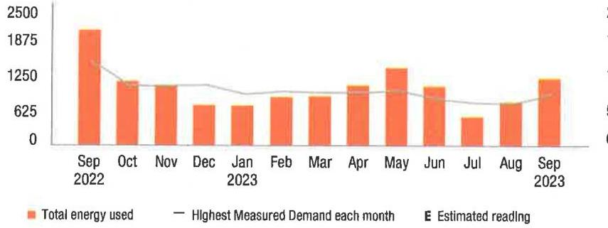

The image is a bar and line chart representing a **yearly usage breakdown (monthly-based)**. 

- **Chart Type**: Combination of bar and line chart.
- **X-Axis**: Months from September 2022 to September 2023.
- **Y-Axis**: kWh (ranging from 0 to 2500).
- **Legend**:
  - Orange bars: Total energy used
  - Gray line: Highest Measured Demand each month
  - "E": Estimated reading
- **Data Points**:
  - September 2022: Highest bar, around 2000 kWh
  - October 2022: Slightly lower than September 2022
  - November 2022 to February 2023: Lower, consistent usage
  - March 2023 to May 2023: Gradual increase, peaking in May
  - June 2023: Significant drop
  - July 2023 to September 2023: Increase, with September 2023 showing a notable rise
- **Styling**: Orange bars for energy usage, gray line for demand, with estimated readings marked by "E".

Visit MyAccount for more details regarding your energy usage.

## MEASURED DEMAND

Demand kW
Measured Demand is the maximum use of electricity at any time during a monthly time period, as measured by your meter.

## BILLED DEMAND

Annual Demand kW
Summer Demand kW
5.00

## SUPPLY CAPACITY

Generation kW
6.859

Transmission kW
5.196

Supply capacity is required to serve the system's annual peak usage. It represents your share of these facilities, in kilowatts (kW). It is calculated based on your peak usage from the previous summer. Supply capacity values are updated periodically throughout the year and are prorated based on your service period.

## Price to compare

If you want to consider getting your electric supply from another supplier, compare their price with ours. This month, your cost for energy supply is $\$ 173.42$. This price to compare varies month to month, depending on your usage.

Your PoD ID is: PE000010229520158492 -
Your PoD ID is your Point of Delivery identification within PSE\&G's system. You will need this number if you are considering enrolling with another supplier.

la.popng.il0ebet1.1@gmail.202309222117;rav-137:148-000040818

## Your energy bill

## Message Center

This bill reflects a BPU-approved change in the Supply portion of your electric bill effective on and after September 1, 2023. The increase in the Supply portion of your bill is due to a change in the Transmission rate. The overall impact for business customers will vary by individual customer usage. Tariff information may also be found by visiting pseg.com.

The success of your business is important to us. We are working hard to make it easier to do business with us. To learn more about how we can help, visit pseg.com/Business.
J.D. Power named PSE\&G \#1 in customer satisfaction for both Residential Electric and Natural Gas Service in the East among Large Utilities. On behalf of the more than 12,000 PSEG employees who work hard every day, we thank you for rating us as a top utilities provider. For J.D. Power 2022 award information, visit jdpower.com/awards.

## (2) NEXT METER READING October 20, 2023

## How to contact us

## 1-855-BIZ-PSEG (249-7734)

Customer Service: 8am to 5:30pm Mon to Fri,
Closed on weekends and holidays
Emergencies / Outages / WorryFree Services: 24/7
TTY for the hearing impaired: 1-800-225-0072
Visit pseg.com/myaccount to access your account anytime
Text us. Register for MyAlerts by texting REG to 4PSEG(47734)
$>$ Text OUT to report an outage.
facebook.com/pseg
twitter.com/psegdelivers

## PSEG

We make change work for you.

## PAY YOUR WAY, 24/7

We offer a variety of methods that make it easy to pay your bill. See reverse side for more information.

By checking this box, I authorize PSE\&G to enroll me in paperless billing at this email address:

068574000040818
||o||o||j|j|j|o||j|j|j||j|j|o||o||j|o||j|j|j|j|j|j|j|j|j|j|j|j|j|j|j|j|j|j|j|j|j|j|j|j|j|j|j|j|j|j|j|j|j|j|j|j|j|j|j|j|j|j|j|j|j|j|j|j|j|j|j|j|j|j|j|j|j|j|j|j|j|j|j|j|j|j|j|j|j|j|j|j|j|j|j|j|j|j|j|j|j|j|j|j|j|j|j|j|j|j|j|j|j|j|j|j|j|j|j|j|

## Message Center (Continued from page 1)

Si desea recibir en español una notificación de desconexión del servicio, llame al 1-800-357-2262.

Stay connected during hurricane season! Sign up for My Alerts to report power outages via text message, as well as receive outage updates by text and email. For more information, visit pseg.com/myalerts.

PSE\&G is installing smart meters that will provide electric customers with a number of benefits. These include more detailed electric-use information, near real-time power outage detection, and the elimination of almost all estimated electric bills. To learn more, visit pseg.com/smartmeters.

If you've ever misplaced your bill or had a due date slip your mind, it's time to sign up for Paperless Billing! Instead of receiving a paper bill each month, you'll get a monthly email showing your bill amount and due date, with the ability to view/print your current and past bills 24/7. To sign up, log in to My Account at pseg.com, and select "Paperless Billing."

At PSE\&G, we are committed to supporting your business needs. That's why we created a dedicated, toll-free phone number to address your energy questions and concerns. PSE\&G's Business Solutions Center is available Monday-Friday, 7:00 a.m. -5:30 p.m. at 1-855-249-7734 (1-855-BIZ-PSEG).

## Don't miss your meter reading

If you'll be away on your meter reading day, use our mobile app to upload a picture of your meter or enter your reading manually, or call 1-800-622-0197.

## Electric \& Gas Rate Information

For news about PSE\&G's rate filing and upcoming public hearings visit www.pseg.com/pseandgfilings. Under applicable tax law, the State Sales and Use Tax and corporate business tax are imposed upon the energy you have used.

# IT'S YOUR BILL. HOW YOU PAY IS YOUR CHOICE. 

## 1.1) My Account

Make a payment anytime from a checking is savings account stored in My Account. Visit pseg.com/ myaccount

Mobile: Download our Mobile App "PSE\&G"
Pay by text: Text PAY to -iPSEG (47734)

Voice: Ask Alena or use Google Assistant.

## 2 Automatic BillPay

Automatic payments from your bank. Skip checks and stamps. Never worry about due dates.

## Enroll at:

pseg.com/adatpay

## 3 Credit Card

Pay your bill with a credit card online or by phone. Because we don't use customer rates to subsidize the cost of this service, there is a fee.

## My Account:

pseg.com/myaccount

## Phone:

1-803-277-8710

## 4 Phone

Bank Account: 1-800-553-7734

## Credit Card:

1-803-277-8710

## 5 By Mail

Make your check payable to PSE\&G and write your account number on your check.

When you pay by check, you authorize PSE\&G to make a one-time electronic fund transfer from your account, in the amount of your check. If you prefer not to authorize us, call 1-800-436-PSEG

## 6 In Person

Payments are accepted at any customer service center or authorized location.

## Locations can be

found at:
pseg.com/csc

Details of your electric charges
Your rate: General Lighting \& Power (GLP)

| Meter \# 316021206 | Usage |
| :--: | :--: |
| Actual reading Sep 21, 2023 | 7620 |
| Less Actual reading Aug 22, 2023 | 7178 |
| Total electric you used in 30 days | 442 kWh |

## Delivery charges

| Monthly service charge | $\$ 5.04$ |
| :--: | :--: |
| Charges for delivering electric to you: |  |
| Annual Demand | $1.400 \mathrm{~kW} \times \$ 5.307143$ |
| The highest Measured Demand in any time period in the current month. |  |
| Summer Demand | $1.400 \mathrm{~kW} \times \$ 10.042857$ |
| The Measured Demand (excluding off-peak) in each billing month of June through September. |  |
| kWh charges | 442 kWh $\times \$ 0.011154$ |
| Societal Benefits | 442 kWh $\times \$ 0.010407$ |
| This charge recovers the cost of government mandated programs designed to achieve public policy goals, such as energy conservation. | $\$ 4.93$ |
| Total electric delivery charges | $\$ 36.06$ |
| Supply charges |  |
| BGS Capacity |  |
| Generation | $1.978 \mathrm{~kW} \times \$ 1.739130$ |
| Transmission | $1.787 \mathrm{~kW} \times \$ 13.290431$ |
| Cost of electric supplied by PSE\&G: |  |
| Charges |  |
| For the first | $132 \mathrm{kWh} \times \$ 0.073258$ |
| For the next | $310 \mathrm{kWh} \times \$ 0.064548$ |
| Total electric supply charges | $\$ 56.87$ |

Total electric charges
\$92.93

Your monthly electric use
kWh
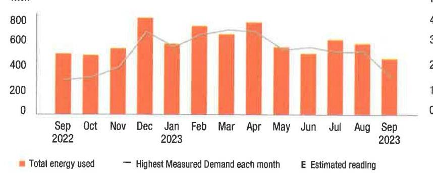

The image is a bar and line chart.

- **Chart Type**: Bar and line chart.
- **X-Axis**: Displays months from September 2022 to September 2023.
- **Y-Axis**: Labeled "kWh" with values ranging from 0 to 800.
- **Legend Entries**:
  - Orange bars represent "Total energy used."
  - A gray line represents "Highest Measured Demand each month."
  - "E" indicates "Estimated reading."
- **Data Points**:
  - The orange bars show varying heights, indicating different levels of energy usage each month.
  - The gray line fluctuates, showing the highest measured demand for each month.
- **Yearly Usage Breakdown (Monthly-Based)**: The chart provides a monthly breakdown of energy usage and demand over the course of a year.
- **Styling**: Orange is used for the bars, and gray is used for the line, with a clear legend for interpretation.

Visit MyAccount for more details regarding your energy usage.

## MEASURED DEMAND

Demand kW
Measurement
1.40

Measured Demand is the maximum use of electricity at any time during a monthly time period, as measured by your meter.

## BILLED DEMAND

Annual Demand kW
1.40

Summer Demand kW
1.40

## SUPPLY CAPACITY

Generation kW
1.978

Transmission kW
1.787

Supply capacity is required to serve the system's annual peak usage. It represents your share of these facilities, in kilowatts (kW). It is calculated based on your peak usage from the previous summer. Supply capacity values are updated periodically throughout the year and are prorated based on your service period.

## Price to compare

If you want to consider getting your electric supply from another supplier, compare their price with ours. This month, your cost for energy supply is $\$ 56.87$. This price to compare varies month to month, depending on your usage.

Your PoD ID is: PE000008526394558492 Your PoD ID is your Point of Delivery identification within PSE\&G's system. You will need this number if you are considering enrolling with another supplier.

la pnqmg j10s8a01 jmgbhl 202309222117 .rev-137190-000040818

## Your energy bill

## Message Center

This bill reflects a BPU-approved change in the Supply portion of your electric bill effective on and after September 1, 2023. The increase in the Supply portion of your bill is due to a change in the Transmission rate. The overall impact for business customers will vary by individual customer usage. Tariff information may also be found by visiting pseg.com.

The success of your business is important to us. We are working hard to make it easier to do business with us. To learn more about how we can help, visit pseg.com/Business.
J.D. Power named PSE\&G \#1 in customer satisfaction for both Residential Electric and Natural Gas Service in the East among Large Utilities. On behalf of the more than 12,000 PSEG employees who work hard every day, we thank you for rating us as a top utilities provider. For J.D. Power 2022 award information, visit jdpower.com/awards.

NEXT METER READING October 20, 2023

## How to contact us

## 1-855-BIZ-PSEG (249-7734)

Customer Service: 8am to 5:30pm Mon to Fri,
Closed on weekends and holidays
Emergencies / Outages / WorryFree Services: 24/7
TTY for the hearing impaired: 1-800-225-0072
Visit pseg.com/myaccount to access your account anytime
Text us. Register for MyAlerts by texting REG to 4PSEG(47734)
$>$ Text OUT to report an outage.
facebook.com/pseg
twitter.com/psegstellvers

## PSEG

We offer a variety of methods that make it easy to pay your bill. See reverse side for more information.

By checking this box, i authority PSE\&G to enroll me in paperless billing at this email address:

068536000040837
$\left[\omega \mid \omega_{1}\right.$ H|H| $\left.\mu \mu^{\prime}\right| \mu^{\prime} \mu^{\prime} \mu^{\prime} \mu^{\prime} \mu^{\prime} \mu^{\prime} \mu^{\prime} \mu^{\prime} \mu^{\prime} \mu^{\prime} \mu^{\prime} \mu^{\prime} \mu^{\prime} \mu^{\prime} \mu^{\prime} \mu^{\prime} \mu^{\prime} \mu^{\prime} \mu^{\prime}$
HOTEL WOODBRIDGE LLC
ACCOUNT NUMBER
7207398409
SERVICE ADDRESS
120 WOOD AVE 5 BLDG WOODBRIDGE TWP NJ 08830-2711

## Your billing summary

Balance remaining from your last bill
PSE\&G balance from last bill
\$7.64
Lose Payment received September 8, 2023 - thank you! -$- \$ 7.64$
Balance remaining from your last bill
\$0.00

This month's charges and credits
Electric charges - PSE\&G
This month's charges and credits
Total amount we'll debit your
\$7.65
account on Oct 10, 2023

Account number
7207398409
Automatic bill payment - do not pay

Amount enclosed
$\mu^{\prime}\left[\mathrm{H}_{1}\right.$ H|H|H| $\left.\mu^{\prime}\right| \mu^{\prime} \mu^{\prime} \mu^{\prime} \mu^{\prime} \mu^{\prime} \mu^{\prime} \mu^{\prime} \mu^{\prime} \mu^{\prime} \mu^{\prime} \mu^{\prime} \mu^{\prime} \mu^{\prime} \mu^{\prime} \mu^{\prime} \mu^{\prime} \mu^{\prime} \mu^{\prime} \mu^{\prime} \mu^{\prime} \mu^{\prime}$
HOTEL WOODBRIDGE LLC
120 WOOD AVE S
ISELIN NJ 08830-2736

## Message Center (Continued from page 1)

Si desea recibir en español una notificación de desconexión del servicio, llame al 1-800-357-2262.

Stay connected during hurricane season! Sign up for My Alerts to report power outages via text message, as well as receive outage updates by text and email. For more information, visit pseg.com/myalerts.

PSE\&G is installing smart meters that will provide electric customers with a number of benefits. These include more detailed electric-use information, near real-time power outage detection, and the elimination of almost all estimated electric bills. To learn more, visit pseg.com/smartmeters.

If you've ever misplaced your bill or had a due date slip your mind, it's time to sign up for Paperless Billing! Instead of receiving a paper bill each month, you'll get a monthly email showing your bill amount and due date, with the ability to view/print your current and past bills 24/7. To sign up, log in to My Account at pseg.com, and select "Paperless Billing."

At PSE\&G, we are committed to supporting your business needs. That's why we created a dedicated, toll-free phone number to address your energy questions and concerns. PSE\&G's Business Solutions Center is available Monday-Friday, 7:00 a.m. -5:30 p.m. at 1-855-249-7734 (1-855-BIZ-PSEG).

## Don't miss your meter reading

If you'll be away on your meter reading day, use our mobile app to upload a picture of your meter or enter your reading manually, or call 1-800-622-0197.

## Electric \& Gas Rate Information

For news about PSE\&G's rate filing and upcoming public hearings visit www.pseg.com/pseandgfilings. Under applicable tax law, the State Sales and Use Tax and corporate business tax are imposed upon the energy you have used.

# IT'S YOUR BILL. HOW YOU PAY IS YOUR CHOICE. 

## My Account

Make a payment anytime from a checking or savings account stored in My Account. Visit pseg.com/ myaccount

Mobile: Download our Mobile App "PSE\&G"

Pay by text: Text PHY to 4PSEG (47734)

Voice: Ask Alena or use Google Assistant.

## Automatic BillPay

Automatic payments from your bank. Ship checks and stamps. Never worry about due dates.

## Enroll at:

pseg.com/autopay

## Credit Card

Pay your bill with a credit card online or by phone. Because we don't use customer rates to subsidize the cost of this service, there is a fee.

## My Account:

pseg.com/myaccount

Phone:
1-833-277-8710

## Phone

Bank Account: 1-800-553-7734

## Credit Card:

1-833-277-8710

## $>$ My Mail

Make your check payable to PSE\&G and write your account number on your check.

When you pay by check, you authorize PSE\&G to make a one-time electronic fund transfer from your account, in the amount of your check. If you prefer not to authorize us, call 1-800-436-PSEG.

## In Person

Payments are accepted at any customer service center or authorized location

Locations can be found at: pseg.com/csc

Details of your electric charges
Your rate: General Lighting \& Power (GLP)

| Meter \# 316016483 | Usage |
| :--: | :--: |
| Actual reading Sep 21, 2023 | 196 |
| Less Actual reading Aug 22, 2023 | 184 |
| Total electric you used in 30 days | 12 kWh |

## Delivery charges

| Monthly service charge | $\$ 5.04$ |
| :-- | --: |
| Charges for delivering electric to you: | $\$ 0.53$ |
| Annual Demand |  |
| The highest Measured Demand in any time period in the |  |
| current month. | $\$ 1.00 \mathrm{~kW} \times \$ 10.000000$ |
| Summer Demand | 12 kWh $\times \$ 0.010833$ |
| The Measured Demand (excluding off-peak) in each billing | $\$ 0.13$ |
| month of June through September. |  |
| kWh charges | 12 kWh $\times \$ 0.010833$ |
| Societal Benefits | 12 kWh $\times \$ 0.010000$ |
| This charge recovers the cost of government mandated |  |
| programs designed to achieve public policy goals, such as |  |
| energy conservation. |  |

Total electric delivery charges
Supply charges
BGS Capacity
Transmission
Cost of electric supplied by PSE\&G:
Charges

| For the first | 3 kWh $\times \$ 0.073333$ |
| :-- | --: |
| For the next | 9 kWh $\times \$ 0.064444$ |
| Total electric supply charges |  |

## Total electric charges

Your monthly electric use
kWh
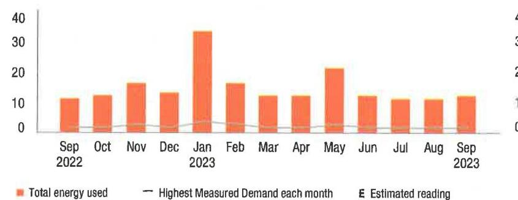

The image is a bar chart.

- **Chart Type**: Bar chart
- **X-Axis**: Months from Sep 2022 to Sep 2023
- **Y-Axis**: Energy usage scale from 0 to 40
- **Legend Entries**:
  - Orange bars represent "Total energy used"
  - A line represents "Highest Measured Demand each month"
  - "E" indicates "Estimated reading"
- **Data Points**:
  - Sep 2022: ~10
  - Oct 2022: ~10
  - Nov 2022: ~20
  - Dec 2022: ~25
  - Jan 2023: ~35
  - Feb 2023: ~20
  - Mar 2023: ~15
  - Apr 2023: ~10
  - May 2023: ~30
  - Jun 2023: ~15
  - Jul 2023: ~15
  - Aug 2023: ~15
  - Sep 2023: ~15
- **Notable Styling**: The bars are in orange, and the line indicating the highest measured demand is a thin line running across the chart.
- **Yearly Usage Breakdown (Monthly-Based)**: The chart provides a monthly breakdown of energy usage over a year.

Visit MyAccount for more details regarding your energy usage.

## MEASURED DEMAND

Demand kW
0.10

Measured Demand is the maximum use of electricity at any time during a monthly time period, as measured by your meter.

## BILLED DEMAND

Annual Demand kW
Summer Demand kW
0.10

## SUPPLY CAPACITY

Generation kW
0.002

Transmission kW
0.002

Supply capacity is required to serve the system's annual peak usage. It represents your share of these facilities, in kilowatts (kW). It is calculated based on your peak usage from the previous summer. Supply capacity values are updated periodically throughout the year and are prorated based on your service period.

## Price to compare

If you want to consider getting your electric supply from another supplier, compare their price with ours. This month, your cost for energy supply is $\$ 0.83$. This price to compare varies month to month, depending on your usage.

Your PoD ID is: PE000010472729258492 -
Your PoD ID is your Point of Delivery identification within PSE\&G's system. You will need this number if you are considering enrolling with another supplier.

la.pcgkg. [10ebv01.pag001202309222117.rav-137074-000049837

## Your energy bill

## Message Center

This bill reflects a BPU-approved change in the Supply portion of your electric bill effective on and after September 1, 2023. The increase in the Supply portion of your bill is due to a change in the Transmission rate. The overall impact for business customers will vary by individual customer usage. Tariff information may also be found by visiting pseg.com.

The success of your business is important to us. We are working hard to make it easier to do business with us. To learn more about how we can help, visit pseg.com/Business.
J.D. Power named PSE\&G \#1 in customer satisfaction for both Residential Electric and Natural Gas Service in the East among Large Utilities. On behalf of the more than 12,000 PSEG employees who work hard every day, we thank you for rating us as a top utilities provider. For J.D. Power 2022 award information, visit jdpower.com/awards.

## NEXT METER READING October 20, 2023

## How to contact us

## 1-855-BIZ-PSEG (249-7734)

Customer Service: 8am to 5:30pm Mon to Fri,
Closed on weekends and holidays
Emergencies / Outages / WorryFree Services: 24/7
TTY for the hearing impaired: 1-800-225-0072
Visit pseg.com/myaccount to access your account anytime
Text us. Register for MyAlerts by texting REG to 4PSEG(47734)
$>$ Text OUT to report an outage.
facebook.com/pseg
twitter.com/psegdelivers

## PSEG

We make change work for you.

## PAY YOUR WAY, 24/7

We offer a variety of methods that make it easy to pay your bill. See reverse side for more information.

By checking this box, I authorize PSE\&G to enroll me in paperless billing at this email address:

068540000040835
$\left.\left.{ }^{\prime}\right|^{\prime}\right|_{1} \mid\left|^{\prime}\right|^{\prime}\left|^{\prime}\right|^{\prime}\left|^{\prime}\right|^{\prime}\left|^{\prime}\right| \mid\left|^{\prime}\right|^{\prime}\left|^{\prime}\right| \mid\left|^{\prime}\right|^{\prime}\left|^{\prime}\right| \mid\left|^{\prime}\right| \mid\left|^{\prime}\right| \mid\left|^{\prime}\right|$ HOTEL WOODBRIDGE LLC
120 WOOD AVE S BLG3SE WOODBRIDGE TWP NJ 08830-2711

## Your billing summary

Balance remaining from your last bill
PSE\&G balance from last bill
$\$ 5.05$
Less Payment received September 8, 2023 - thank you! - $\$ 5.05$
Balance remaining from your last bill
$\$ 0.00$

This month's charges and credits
Electric charges - PSE\&G
This month's charges and credits
Total amount we'll debit your
account on Oct 10, 2023

Account number
7222450602
Automatic bill payment - do not pay

## Amount enclosed

$\left.{ }^{\prime}\right|_{1}\left|^{\prime}\right|_{1}\left|^{\prime}\right|^{\prime}\left|^{\prime}\right| \mid\left|^{\prime}\right| \mid\left|^{\prime}\right| \mid\left|^{\prime}\right| \mid\left|^{\prime}\right| \mid\left|^{\prime}\right| \mid\left|^{\prime}\right| \mid\left|^{\prime}\right| \mid\left|^{\prime}\right| \mid\left|^{\prime}\right|$ PSE\&G CO
PO BOX 14444
NEW BRUNSWICK NJ 08906-4444

## (1) Message Center (Continued from page 1)

Si desea recibir en español una notificación de desconexión del servicio, llame al 1-800-357-2262.

Stay connected during hurricane season! Sign up for My Alerts to report power outages via text message, as well as receive outage updates by text and email. For more information, visit pseg.com/myalerts.

PSE\&G is installing smart meters that will provide electric customers with a number of benefits. These include more detailed electric-use information, near real-time power outage detection, and the elimination of almost all estimated electric bills. To learn more, visit pseg.com/smartmeters.

If you've ever misplaced your bill or had a due date slip your mind, it's time to sign up for Paperless Billing! Instead of receiving a paper bill each month, you'll get a monthly email showing your bill amount and due date, with the ability to view/print your current and past bills 24/7. To sign up, log in to My Account at pseg.com, and select "Paperless Billing."

At PSE\&G, we are committed to supporting your business needs. That's why we created a dedicated, toll-free phone number to address your energy questions and concerns. PSE\&G's Business Solutions Center is available Monday-Friday, 7:00 a.m. -5:30 p.m. at 1-855-249-7734 (1-855-BIZ-PSEG).

## Don't miss your meter reading

If you'll be away on your meter reading day, use our mobile app to upload a picture of your meter or enter your reading manually, or call 1-800-622-0197.

## Electric \& Gas Rate Information

For news about PSE\&G's rate filing and upcoming public hearings visit www.pseg.com/pseandgfilings. Under applicable tax law, the State Sales and Use Tax and corporate business tax are imposed upon the energy you have used.

# IT'S YOUR BILL. HOW YOU PAY IS YOUR CHOICE. 

## 1.1) My Account

Make a payment anytime from a checking or savings account stored in My Account. Visit pseg.com/ myaccount

Mobile: Download our Mobile App "PSE\&G"
Pay by text: Text P+IT to 4PSEG (47734)

Voice: Ask Alexa or use Google Assistant

## 2 Automatic BillPay

Automatic payments from your bank. Skip checks and stamps. Never worry about due dates.

Enroll at:
pseg.com/autopay

## Credit Card

Pay your bill with a credit card online or by phone. Because we don't use customer rates to subsidize the cost of this service, there is a fee.

## My Account:

pseg.com/myaccount

Phone:
1-803-277-8710

## Phone

Bank Account:
1-800-553-7734
Credit Card:
1-833-277-8710

## $=$   $=$ By Mail

Make your check payable to PSE\&G and write your account number on your check.

When you pay by check, you authorize PSE\&G to make a one-time electronic fund transfer from your account, in the amount of your check. If you prefer not to authorize us, call 1-800-436-PSEG.

## 3 In Person

Payments are accepted at any customer service center or authorized location.

Locations can be found at:
pseg.com/csc

|  | Details of your electric charges Your rate: General Lighting \& Power (GLP) |  |
| :--: | :--: | :--: |
| Meter \# 316016481 |  | Usage |
|  | Actual reading Sep 21, 2023 | 0 |
| Less | Actual reading Aug 22, 2023 | 0 |
|  | Total electric you used in 30 days | 0 kWh |
| Delivery charges |  |  |
| Monthly service charge |  | $\$ 5.04$ |
| Total electric delivery charges |  | \$5.04 |
| Supply charges |  |  |
| BGS Capacity |  |  |
| Transmission | $0.001 \mathrm{~kW} \times \$ 10.000000$ | $\$ 0.01$ |
| Total electric supply charges |  | $\$ 0.01$ |
|  | Total electric charges | $\$ 5.05$ |
| Your monthly electric use |  |  |
| kWh |  |  |
| 4 |  | 4 |
| 3 |  | 3 |
| 2 |  | 2 |
| 1 |  | 1 |
| 0 |  | 0 |
|  | Sep Oct   2022 | Nov Dec Jan Feb Mar Apr May Jun Jul Aug Sep 2023 |  |
|  |  |  |  |
|  | Total energy used | Highest Measured Demand each month | E Estimated reading |

Visit MyAccount for more details regarding your energy usage.

## MEASURED DEMAND

Demand kW
0.00

Measured Demand is the maximum use of electricity at any time during a monthly time period, as measured by your meter.

## SUPPLY CAPACITY

Generation kW
0.001

Transmission kW
0.001

Supply capacity is required to serve the system's annual peak usage. It represents your share of these facilities, in kilowatts (kW). It is calculated based on your peak usage from the previous summer. Supply capacity values are updated periodically throughout the year and are prorated based on your service period.

## Price to compare

If you want to consider getting your electric supply from another supplier, compare their price with ours. This month, your cost for energy supply is $\$ 0.00$. This price to compare varies month to month, depending on your usage.

Your PoD ID is: PE000011449248158492 -
Your PoD ID is your Point of Delivery identification within PSE\&G's system. You will need this number if you are considering enrolling with another supplier.

le.pnang.il008601.1/peg06202309222117.cov-137082-000040839

## (1) PSEG

We make things work for you.

## Your energy bill

## Message Center

This bill reflects a BPU-approved change in the Supply portion of your electric bill effective on and after September 1, 2023. The increase in the Supply portion of your bill is due to a change in the Transmission rate. The overall impact for business customers will vary by individual customer usage. Tariff information may also be found by visiting pseg.com.

The success of your business is important to us. We are working hard to make it easier to do business with us. To learn more about how we can help, visit pseg.com/Business.
J.D. Power named PSE\&G \#1 in customer satisfaction for both Residential Electric and Natural Gas Service in the East among Large Utilities. On behalf of the more than 12,000 PSEG employees who work hard every day, we thank you for rating us as a top utilities provider. For J.D. Power 2022 award information, visit jdpower.com/awards.

## (2) NEXT METER READING October 20, 2023

## How to contact us

## 1-855-BIZ-PSEG (249-7734)

Customer Service: 8am to 5:30pm Mon to Fri,
Closed on weekends and holidays
Emergencies / Outages / WorryFree Services: 24/7
TTY for the hearing impaired: 1-800-225-0072
Visit pseg.com/myaccount to access your account anytime
Text us. Register for MyAlerts by texting REG to 4PSEG(47734)
$>$ Text OUT to report an outage.
facebook.com/pseg
twitter.com/psegdelivers

## Total amount due

You do not need to make a payment.
With automatic bill payment, we'll debit you bank account on Oct 11, 2023

Bill date: September 26, 2023
For the period: August 23, 2023 to September 21, 2023

## - HOTEL WOODBRIDGE LLC

ACCOUNT NUMBER
7208060207
SERVICE ADDRESS
120 WOOD AVE 5 BLG-2N
WOODBRIDGE TWP NJ 08830-2711

## Your billing summary

Balance remaining from your last bill
PSE\&G balance from last bill
\$2,286.97
Less Payment received September 11, 2023 - thank you!
\$2,286.97
Balance remaining from your last bill
\$0.00

This month's charges and credits
Electric charges - PSE\&G
\$610.57
PloS Electric supply charges - HUDSON ENERGY
\$1,274.95
SERVICES, LLC
This month's charges and credits
Total amount we'll debit your
\$1,885.52
account on Oct 11, 2023

## COMPUT

$7208060207$
Automatic bill payment - do not pay

## Amount enclosed

HOTEL WOODBRIDGE LLC
120 WOOD AVE, SOUTH
ISELIN NJ 08830-1542

## PSE\&G CO

PO BOX 14444
NEW BRUNSWICK NJ 08906-4444

## Message Center (Continued from page 1)

Si desea recibir en español una notificación de desconexión del servicio, llame al 1-800-357-2262.

Stay connected during hurricane season! Sign up for My Alerts to report power outages via text message, as well as receive outage updates by text and email. For more information, visit pseg.com/myalerts.

PSE\&G is installing smart meters that will provide electric customers with a number of benefits. These include more detailed electric-use information, near real-time power outage detection, and the elimination of almost all estimated electric bills. To learn more, visit pseg.com/smartmeters.

If you've ever misplaced your bill or had a due date slip your mind, it's time to sign up for Paperless Billing! Instead of receiving a paper bill each month, you'll get a monthly email showing your bill amount and due date, with the ability to view/print your current and past bills 24/7. To sign up, log in to My Account at pseg.com, and select "Paperless Billing."

At PSE\&G, we are committed to supporting your business needs. That's why we created a dedicated, toll-free phone number to address your energy questions and concerns. PSE\&G's Business Solutions Center is available Monday-Friday, 7:00 a.m. -5:30 p.m. at 1-855-249-7734 (1-855-BIZ-PSEG).

## Don't miss your meter reading

If you'll be away on your meter reading day, use our mobile app to upload a picture of your meter or enter your reading manually, or call 1-800-622-0197.

## Electric \& Gas Rate Information

For news about PSE\&G's rate filing and upcoming public hearings visit www.pseg.com/pseandgfilings. Under applicable tax law, the State Sales and Use Tax and corporate business tax are imposed upon the energy you have used.

# IT'S YOUR BILL. HOW YOU PAY IS YOUR CHOICE. 

## My Account

Make a payment anytime from a checking or savings account stored in My Account. Visit pseg.com/ myaccount

Mobile: Download our Mobile App "PSE\&G"

Pay by text: Text PAY to 4PSEG (47734)

Voice: Ask Alexa or use Google Assistant.

## Automatic Bill Pay

Automatic payments from your bank. Skip checks and stamps. Never worry about due dates.

## Enroll at:

pseg.com/autopay

## Credit Card

Pay your bill with a credit card online or by phone. Because we don't use customer rates to subsidize the cost of this service, there is a fee.

## My Account:

pseg.com/myaccount
Phone:
$1-833-277-8710$

## Phone

Bank Account: 1-800-553-7734

Credit Card:
$1-833-277-8710$

## $m$ By Mail

Make your check payable to PSE\&G and write your account number on your check.

When you pay by check, you authorize PSE\&G to make a one-time electronic fund transfer from your account, in the amount of your check. If you prefer not to authorize us, call 1-800-436-PSEG.

## In Person

Payments are accepted at any customer service center or authorized location.

Locations can be found at: pseg.com/csc

The image is a photo or illustration showing two intersecting lines on a white background. The lines appear to form an angle, with one line extending diagonally from the top left to the bottom right, and the other line intersecting it from the left side. There is no text or additional context visible in the image.

## Details of your electric charges

Your rate: General Lighting \& Power (GLP)

| Meter \# 316021242 | Usage |
| :--: | :--: |
| Actual reading Sep 21, 2023 | 15633 |
| Less Actual reading Aug 22, 2023 | 4909 |
| Total electric you used in 30 days | $10,724 \mathrm{kWh}$ |

## Delivery charges

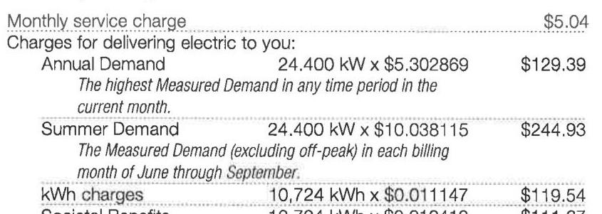

The image is a photo of a section of an electric bill detailing charges. It includes the following text:

- Monthly service charge: $5.04
- Charges for delivering electric to you:
  - Annual Demand: 24.400 kW x $5.302869 = $129.39
    - "The highest Measured Demand in any time period in the current month."
  - Summer Demand: 24.400 kW x $10.038115 = $244.93
    - "The Measured Demand (excluding off-peak) in each billing month of June through September."
  - kWh charges: 10,724 kWh x $0.011147 = $119.54
  - Societal Benefit: 10,724 kWh x $0.010413 = $111.87

The Measured Demand (excluding off-peak) in each billing month of June through September.
kWh charges
$10,724 \mathrm{kWh} \times \$ 0.011147$
$119.54$
Societal Benefits
$10,724 \mathrm{kWh} \times \$ 0.010413$
This charge recovers the cost of government mandated programs designed to achieve public policy goals, such as energy conservation.
Total electric delivery charges
\$610.57
Total electric charges
\$610.57

Your monthly electric use
kWh
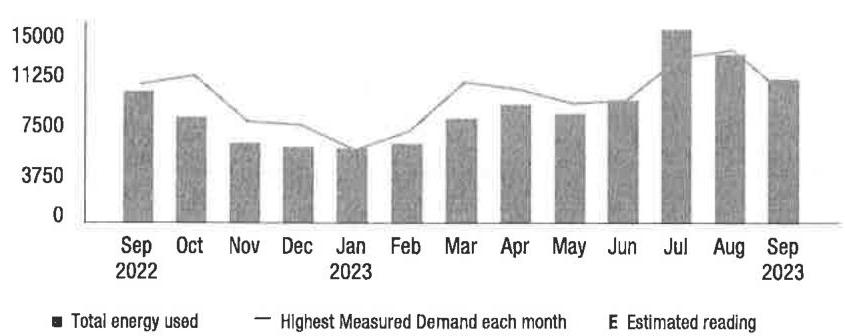

The image is a bar chart with a line graph overlay. It represents a **yearly usage breakdown (monthly-based)** for electric energy usage and demand from September 2022 to September 2023.

- **X-axis**: Months from Sep 2022 to Sep 2023.
- **Y-axis**: Energy usage in kWh, ranging from 0 to 15,000.
- **Legend**:
  - Solid bars represent "Total energy used."
  - A line represents the "Highest Measured Demand each month."
  - "E" indicates an "Estimated reading."

The chart shows variations in energy usage and demand across the months, with notable peaks in July and August 2023.

Visit MyAccount for more details regarding your energy usage.

## MEASURED DEMAND

Demand kW
24.40

Measured Demand is the maximum use of electricity at any time during a monthly time period, as measured by your meter.

## BILLED DEMAND

| Annual Demand kW | 24.40 |
| :-- | --: |
| Summer Demand kW | 24.40 |

## SUPPLY CAPACITY

| Generation kW | 22.236 |
| :-- | --: |
| Transmission kW | 20.085 |

Supply capacity is required to serve the system's annual peak usage. It represents your share of these facilities, in kilowatts (kW). It is calculated based on your peak usage from the previous summer. Supply capacity values are updated periodically throughout the year and are prorated based on your service period.

## Price to compare

You are currently buying your electricity from another supplier. If you had been purchasing your electric supply from PSE\&G, your cost would be $\$ 1,026.03$. This is your price to compare. It varies from month to month depending on your usage.

Your PoD ID is: PE000011205152958492 Your PoD ID is your Point of Delivery identification within PSE\&G's system.

# Electric supply charges - HUDSON ENERGY SERVICES, LLC 

Through the CHOICE Program, you have chosen to purchase electricity from HUDSON ENERGY SERVICES, LLC. If you have any questions about the electric supply charges below, please contact them directly at (877) 483-7669.

| Adjustments | $\$ 0.00$ |
| :-- | --: |
| Current charges | $\$ 1,274.95$ |

$\stackrel{\text { A }}{ }$| Total HUDSON ENERGY SERVICES, | $\$ 1,274.95$ |
| :-- | --: |

LLC Charges

ENERGY CHARGE-10724KH@0.1115000 PER KH

The image is a simple illustration consisting of two intersecting lines forming an "X" shape. The lines are thin and appear to be hand-drawn, with one line slightly curved at the end. There is no embedded text or additional elements present in the image.

