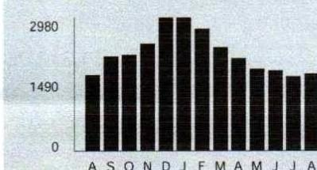
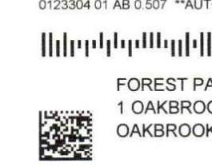
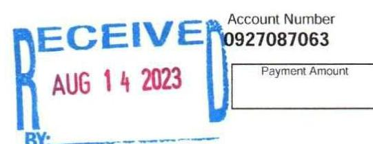

## Unit ComEd.com

Customer Service / Power Outage English
1.877.4COMED1 (1.877.426.6331)

## Español

1.800.95.LUCES (1.800.955.8237)

Hearing/Speech Impaired
1.800.572.5789 (TTY)

Your Usage Profile 13-Month Usage (Total kWh)


The image is a bar chart.

- **Chart Type**: Bar chart
- **Axes Titles and Units**:
  - Y-axis: No title visible, but numerical values are shown (0, 1490, 2980).
  - X-axis: Labeled with months (A, S, O, N, D, J, F, M, A, M, J, J, A).
- **Legend Entries**: None visible.
- **Data Points**:
  - The bars represent monthly kWh usage.
  - The highest bar reaches just below 2980 kWh.
  - The lowest bar is above 1490 kWh.
- **Yearly Usage Breakdown (Monthly-Based)**: The chart shows monthly electricity usage over a 13-month period.
- **Styling**: Bars are uniformly colored in black.

Electric Usage

| Month | kWh |
| :-- | :-- |
| Aug-22 | 1713 |
| Sep-22 | 2117 |
| Oct-22 | 2153 |
| Nov-22 | 2405 |
| Dec-22 | 2974 |
| Jan-23 | 2974 |
| Feb-23 | 2723 |
| Mar-23 | 2316 |
| Apr-23 | 2072 |
| May-23 | 1846 |
| Jun-23 | 1805 |
| Jul-23 | 1672 |
| Aug-23 | 1731 |


|  | Average Daily |  |  |  |  |  |  |  |
| :--: | :--: | :--: | :--: | :--: | :--: | :--: | :--: | :--: |
| Month Billed |  | Meter Number |  |  |  |  |  |  |
| Last Year | 59.1 |  | 73 |  |  |  |  |  |
| Last Month | 55.7 |  | 70 |  |  |  |  |  |
| Current Month | 59.7 |  | 71 |  |  |  |  |  |


| Bill Summary |  |
| :--: | :--: |
| Previous Balance | \$2,605.75 |
| Total Payments - Thank You | \$2,605.75 |
| Amount Due on August 25, 2023 | \$1,322.05 |

Issue Date August 10, 2023

| Meter Information |  |  |  |  |  |  |  |  |
| :--: | :--: | :--: | :--: | :--: | :--: | :--: | :--: | :--: |
| Read <br> Dates | Meter <br> Number |  |  |  |  |  |  |  |
| $\begin{aligned} & \text { 7/12- } \\ & \text { 8/10 } \end{aligned}$ | 230075602 | General Service | Total kWh | Actual |  |  |  | 1731 |
| $\begin{aligned} & \text { 7/12- } \\ & \text { 8/10 } \end{aligned}$ | 230075602 | General Service | On Pk kW | Actual | Actual |  |  | 2.20 |
| $\begin{aligned} & \text { 7/12- } \\ & \text { 8/10 } \end{aligned}$ | 230314750 | General Service | Total kWh | Actual | Actual |  |  | 0 |
| $\begin{aligned} & \text { 7/12- } \\ & \text { 8/10 } \end{aligned}$ | 230314750 | General Service | On Pk kW | Actual | Actual |  |  | 0.00 |

Service from 7/12/2023 to 8/10/2023 - 29 Days
Retail Delivery Service - 0 to 100 kW

Delivery Services - ComEd
\$1,219.10

| Customer Charge |  |  |  |  | 16.8 |
| :--: | :--: | :--: | :--: | :--: | :--: |
| Standard Metering Charge |  |  |  |  | 6.2 |
| Distribution Facilities Charge |  | 2.20 kW | X | 8.59000 | 18.9 |
| IL Electricity Distribution Charge |  | 1.731 kWh | X | 0.00131 | 2.2 |
| Meter Lease |  |  |  |  | 5.51 |
| Nonstandard Facilities Charge |  |  |  |  | 1.169.2 |
| Taxes and Other |  |  |  |  | \$83.45 |
| Environmental Cost Recovery Adj |  | 1.731 kWh | X | 0.00052 | 0.9 |
| Renewable Portfolio Standard |  | 1.731 kWh | X | 0.00502 | 8.6 |
| Zero Emission Standard |  | 1.731 kWh | X | 0.00195 | 3.3 |
| Carbon-Free Energy Resource Adj |  | 1.731 kWh | X | 0.01241 | 21.4 |
| Energy Efficiency Programs |  | 1.731 kWh | X | 0.00461 | 7.9 |
| Energy Transition Assistance |  | 1.731 kWh | X | 0.00072 | 1.2 |
| Franchise Cost |  | \$1,214.51 | X | 2.00700\% | 24.3 |
| State Tax |  |  |  |  | 5.71 |

For Electric Supply Choices visit
pluginillinois.org.
(continued on next page
Return only this portion with your check made payable to ComEd. Please write your account number on your check.

# ComEd 

To pay by phone call 1-800-588-9477.
A convenience fee will apply.


The image is a photo showing a section of a document with a barcode and QR code. Below the codes, there is text that reads:

```
FOREST PA
1 OAKBROOK
OAKBROOK
```

The text is aligned to the right of the codes.

## Account Number

0927087063


The image is a photo showing a section of a document with a stamp and text. 

- The stamp reads "RECEIVED AUG 14 2023" in blue and red ink.
- To the right, there is text that reads "Account Number 0927087063" with a box labeled "Payment Amount" below it.

Please pay this
amount by $8 / 25 / 2023$
\$1,322.05
$\mathrm{t}_{\mathrm{H}}\left[\mathrm{H}_{\mathrm{H}}\right.$ | $\mathrm{H}_{\mathrm{H}}\left[\mathrm{H}_{\mathrm{H}}\right.$ | $\mathrm{H}_{\mathrm{H}}\left[\mathrm{H}_{\mathrm{H}}\right.$ | $\mathrm{H}_{\mathrm{H}}\left[\mathrm{H}_{\mathrm{H}}\right.$ | $\mathrm{H}_{\mathrm{H}}\left[\mathrm{H}_{\mathrm{H}}\right.$ | COMPD
PO BOX 6111
CAROL STREAM, IL 60197-6111
$0927087063$

# Total Current Charges 

## Miscellaneous

Current late payment charge (s) - electric

## Thank you for your payment of $\$ 1,300.56$ on August 4, 2023

Thank you for your payment of \$1,305.19 on July 24, 2023

## Total Amount Due

## Message Center

## ComEd

- THE SUPPORT TO STOP A SCAM: The ability to send money through mobile-pay apps like QuickPay, Zellie and Venmo makes it easier to fall for scam attempts. These apps have higher limits and are often linked to your personal bank account or credit card. Scammers claim they didn't see the transaction and ask it to be sent again - scamming you twice. Take steps to protect yourself from energy fraud. We can help with tips and hints to recognize potential scams and legitimate ComEd employees. Learn more: ComEd.Com/ScamAlert
- MYLAR BALLOONS \& POWER LINES DON'T MIX! Every year, thousands of residents across Northern Illinois are affected by power outages caused by foil balloons. If a foil or Mylar balloon touches a power line, it can cause power surges or service interruptions. Keep balloons tied securely while outside! If you see a balloon, or any object, caught in a power line, do not attempt to retrieve it. Call ComEd at 1-800-EDISON-1.
- WAYS TO PAY: Looking for ways to pay your bill? Visit ComEd.com/PAY
- RESOLVING DISPUTES: The Illinois Commerce Commission Consumer Division is available at 800-524-0795 to help resolve disputes with ComEd. However, customers should contact ComEd before seeking assistance from the ICC.

