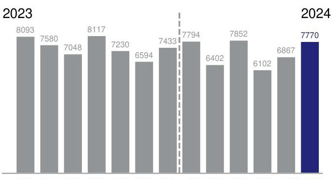
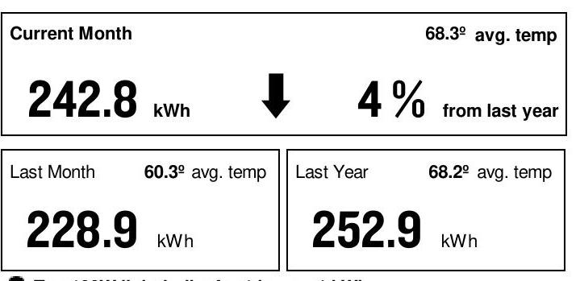

AN EXELON COMPANY

## SERVICE FROM 5/9/24 THROUGH 6/IO/24 (32 DAYS)

Retail Delivery Service - 0 to 100 kW

Hampton Social Burrridge LLC
715 Village-Center Dr
Burr Ridge, IL 60527
(847) 525-8452

## TOTAL USAGE (kWh)

The image is a bar chart showing electricity usage over time, with a yearly usage breakdown (monthly-based).

- **Chart Type**: Bar chart
- **X-Axis**: Months from June 2023 to June 2024
- **Y-Axis**: Not labeled, but represents electricity usage in kWh
- **Legend/Labels**: 
  - 2023: 
    - June: 8093
    - July: 7580
    - August: 7048
    - September: 8117
    - October: 7230
    - November: 6594
    - December: 7433
  - 2024:
    - January: 7794
    - February: 6402
    - March: 7852
    - April: 6102
    - May: 6867
    - June: 7770
- **Styling**: The bar for June 2024 is highlighted in blue, while all other bars are in gray.

JUN JUL AUG SEP OCT NOV DEC JAN FEB MAR APR MAY JUN Current month's reading is Actual.

## Payment Deducted on 6/26/24

Thank you for your payments totaling \$952.25.

## AVERAGE DAILY USE (monthly usage/days in period)

The image is a photo/illustration showing a summary of electricity usage.

- **Current Month**: 
  - Usage: 242.8 kWh
  - Average Temperature: 68.3° avg. temp
  - Change: 4% decrease from last year

- **Last Month**: 
  - Usage: 228.9 kWh
  - Average Temperature: 60.3° avg. temp

- **Last Year**: 
  - Usage: 252.9 kWh
  - Average Temperature: 68.2° avg. temp

There is a downward arrow indicating a decrease in usage compared to last year. The layout shows the current month at the top, with last month and last year below it.

Ten 100W light bulbs for 1 hour $=1 \mathrm{kWh}$

## CURRENT CHARGES SUMMARY

See reverse side for details

## SUPPLY

\$377.79

AEP Energy, Inc provides your energy.
1.866.258.3782

For Electric Supply Choices visit pluginillinois.org

## DELIVERY

\$221.68

ComEd delivers electricity to your business.
ComEd.com
1.800.334.7661

TAXES \& FEES \$248.15

Return only this portion with your check made payable to ComEd. Please write your account number on your check.

# comed 

AN EXELON COMPANY

0118979 01 AB 0.547 **AUTO T3 01125 60654-442199 -C06-00-P00000-I 2
$\left.\mathrm{I}_{\mathrm{I}}\right|_{\mathrm{I}}|_{\mathrm{I}}|_{\mathrm{I}}|_{\mathrm{I}}|_{\mathrm{I}}|_{\mathrm{I}}|_{\mathrm{I}}|_{\mathrm{I}}|_{\mathrm{I}}|_{\mathrm{I}}|_{\mathrm{I}}|_{\mathrm{I}}|_{\mathrm{I}}|_{\mathrm{I}}|_{\mathrm{I}}|_{\mathrm{I}}|_{\mathrm{I}}|_{\mathrm{I}}|_{\mathrm{I}}|_{\mathrm{I}}|_{\mathrm{I}}|_{\mathrm{I}}|_{\mathrm{I}}|_{\mathrm{I}}|_{\mathrm{I}}|_{\mathrm{I}}|_{\mathrm{I}}|_{\mathrm{I}}|_{\mathrm{I}}|_{\mathrm{I}}|_{\mathrm{I}}|_{\mathrm{I}}|_{\mathrm{I}}|_{\mathrm{I}}|_{\mathrm{I}}|_{\mathrm{I}}|_{\mathrm{I}}|_{\mathrm{I}}|_{\mathrm{I}}|_{\mathrm{I}}

## For Questions, Support, and Outages visit ComEd.com

English
Español
Hearing/Speech Impaired
Federal Video Relay Services (VRS)
I.877.4COMEDI (I.877.426.633I)
I.800.95.LUCES (I.800.955.8237)
I.800.572.5789 (TTY)

Fedvrs.us/session/new

## 1

SERVICE ADDRESS 715 Village-Center Dr Burr Ridge, IL 60527

Electric Choice ID: 7234154576

## 2

## METER INFORMATION

| Read Dates | Meter Number | Load Type | Reading Type | Previous |  | Present |  | Difference | Multiplier | Usage |
| :--: | :--: | :--: | :--: | :--: | :--: | :--: | :--: | :--: | :--: | :--: |
| 5/9-6/10 | 230189040 | General Service | Off Pk kW | 0.00 | Actual | 16.33 | Actual | 16.33 | $\times 1$ | 16.33 |
| 5/9-6/10 | 230189040 | General Service | On Pk kW | 0.00 | Actual | 15.89 | Actual | 15.89 | $\times 1$ | 15.89 |
| 5/9-6/10 | 230189040 | General Service | Total kWh | 36680 | Actual | 44450 | Actual | 7770 | $\times 1$ | 7770 |

## CHARGE DETAILS

Retail Delivery Service - 0 to 100 kW 5/9/24 - 6/10/24 (32 Days)

## SUPPLY - AEP ENERGY, INC

SUPPLIER ENERGY CHARGES 7,770 KWH X 0.04862

## 1 DELIVERY - ComEd

Customer Charge
Standard Metering Charge
Distribution Facility Charge
IL Electricity Distribution Charge

## TAXES \& FEES

Environmental Cost Recovery Adj
Renewable Portfolio Standard
Zero Emission Standard
Carbon-Free Energy Resource Adj
Energy Efficiency Programs
Energy Transition Assistance
Franchise Cost
State Tax
Municipal Tax
$\$ 377.79$
\$377.79
\$221.68
\$19.34
\$6.55
\$186.23
\$9.56
\$248.15
\$2.56
7,770 kWh X 0.00033
7,770 kWh X 0.00502
7,770 kWh X 0.00195
7,770 kWh X 0.00880
7,770 kWh X 0.00691
7,770 kWh X 0.00072
\$213.55 X 1.30600\%

## MISCELLANEOUS

Charges/Credits from previous bill
Thank You for Your Payment of \$952.25 on May 28, 2024
Total Amount Due
UPDATES
ComEd

- The amount of this bill will be automatically deducted from your bank account on June 26, 2024.

## A VARIETY OF METHODS TO PAY YOUR BILL

Visit ComEd.com/PAY for more information including applicable fees for some transactions.

## Online

Set up an automatic payment, enroll in paperless billing, or make a convenience payment at ComEd.com/Pay.

## Mobile App

Download the ComEd mobile app on your Apple® or Android ${ }^{\text {TM }}$ device to view and pay your bill, or manage your account.

## Phone

Call us to make a convenience payment with a credit card, ATM card, or your bank account: 1.800.588.9477.

## In-Person

Pay your bill in-person at many ComEd authorized agents located throughout the region. Visit ComEd.com/Pay for details.

- POWERLINE SAFETY: Water and electricity don't mix - that's why it's important to be aware of your surroundings and watch out for electrical hazards when working or playing around water recreation areas. Look for overhead power lines before performing activities such as casting a fishing line, using a pool skimming tool or raising a boat mast, and NEVER swim around docks with electrical equipment or boats plugged into shore power. Always keep yourself or any conductive material a minimum of 10 feet away from any power line. Call 1-800-Edison-1 before working near power lines. Learn more at ComEd.com/Safety.
- THE SUPPORT TO STOP A SCAM: The ability to send money through mobile-pay apps linked to your personal bank account or credit card like QuickPay, Zelle and Venmo make it easier to fall for scam attempts. Scammers claim they didn't see the transaction and ask it to be sent again - scamming you twice. Take steps to protect yourself from energy fraud. We can help with tips and hints to recognize potential scams and legitimate ComEd employees. Learn more: ComEd.Com/ScamAlert
- WAYS TO PAY: Looking for ways to pay your bill? Visit ComEd.com/PAY
- ILLINOIS COMMERCE COMMISSION CONSUMER DIVISION: The Consumer Services Division is available at 800-524-0795 to help resolve disputes with ComEd. However, customers should contact ComEd before seeking assistance from the ICC.

