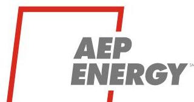
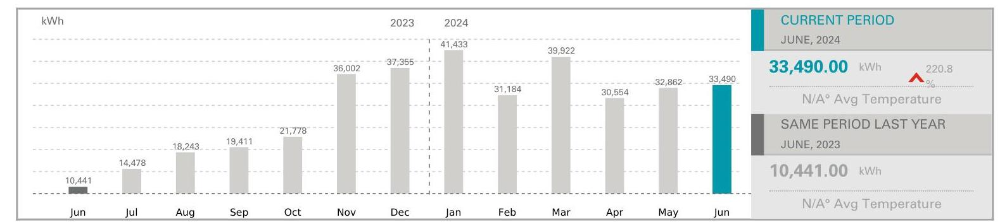
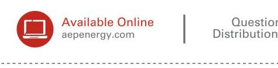
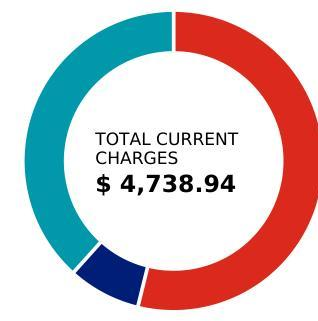

The image is a logo for "AEP ENERGY" with a stylized red outline of a square or rectangle partially enclosing the text. The letters "AEP" are in bold, with "ENERGY" written below it in a slightly smaller font. The logo is simple and uses a red and gray color scheme.

An AEP Company

# Fulton Property LLC 1017 N Hooker St Chicago, IL 60642 

## Your AEP Energy Bill Summary

From 05/06/2024 to 06/05/2024 (30 days) Issued on 06/06/2024

| AEP Energy Account Number | Utility Account Number |
| :-- | :-- |
| 3023364266 | 6055304215 |
| Location Name | Utility Company (17) |
| Fulton Property LLC | ComEd |

Service Address
850 W Fulton Market St Chicago, COOK, IL 60607
DGE DATE
June 20, 2024
TOTAL AMOUNT
$\$ 14,609.04$
If you are paying your bill after 06/20/2024 please pay $\$ 14,828.18$

## USAGE INFORMATION

The image is a bar chart.

- **Chart Type**: Bar chart
- **X-Axis**: Months from June 2023 to June 2024
- **Y-Axis**: kWh (kilowatt-hours)
- **Yearly Usage Breakdown (Monthly-Based)**:
  - June 2023: 10,441 kWh
  - July 2023: 14,478 kWh
  - August 2023: 18,243 kWh
  - September 2023: 19,411 kWh
  - October 2023: 21,778 kWh
  - November 2023: 36,002 kWh
  - December 2023: 37,355 kWh
  - January 2024: 41,433 kWh
  - February 2024: 31,184 kWh
  - March 2024: 39,922 kWh
  - April 2024: 30,554 kWh
  - May 2024: 32,862 kWh
  - June 2024: 33,490 kWh

- **Styling**:
  - The bar for June 2024 is highlighted in a different color (blue) compared to the other bars (gray).
  
- **Additional Information**:
  - Current Period (June 2024): 33,490.00 kWh
  - Increase of 220.8% compared to the same period last year
  - Same Period Last Year (June 2023): 10,441.00 kWh

(4) METER INFORMATION

| Meter | Read Date | Type | Role | Demand (kW) ${ }^{(2)}$ | Period | Previous   Measure | Current   Measure | Difference | Multiplier ${ }^{(1)}$ | Usage   (kWh) |
| :--: | :--: | :--: | :--: | :--: | :--: | :--: | :--: | :--: | :--: | :--: |
| 230118974 | 06/05 | Delivery   Service | Additive | 64.34 | Total | 0.00 | 0.00 | 0.00 | $\times$ | 1 | 15,665.13 | Total |
|  |  |  |  |  | Off Peak | N/A | N/A | N/A | $\times$ | 1 | N/A | Off Peak |
| 230159429 | 06/05 | Delivery   Service | Additive | 96.70 | Total | 0.00 | 0.00 | 0.00 | $\times$ | 1 | 17,825.77 | Total |
|  |  |  |  |  | Off Peak | N/A | N/A | N/A | $\times$ | 1 | N/A | Off Peak |

Questions about your bill?

The image is a section of a document or bill with a focus on online availability and contact information. It features:

- A red circular icon with a stylized computer screen.
- Text next to the icon: "Available Online aepenergy.com"
- A vertical line separating the sections.
- Partial text on the right: "Questions Distribution"

The design uses a red and gray color scheme.

AEP Energy
PO Box 6329
Carol Stream, IL 60197-
6329

For your payment options check the back side
TOTAL AMOUNT DUE ON 06/20/2024
\$ 14,609.04
AMOUNT ENCLOSED

The image is a photo/illustration of a circular chart (donut chart) displaying financial information. The chart is divided into three segments with different colors: red, teal, and blue. In the center of the chart, the text reads:

"TOTAL CURRENT CHARGES
$ 4,738.94"

Name
AEP ENERGY CHARGES
ENERGY CHARGES
SINGLE BILL OPTION DEBIT
Total

| Description | Amount |
| :--: | :--: |
| 33,491 kWh $\times 0.07616$ | $\$ 2,550.67$ |
| 33491 kWh $\times 0.00502$ | $\$ 0.73$ |
| 33491 kWh $\times 0.00195$ | $\$ 05.31$ |
| 33491 kWh $\times 0.00691$ | $\$ 231.42$ |
| 33491 kWh $\times 0.0088$ | $\$ 294.72$ |
| 5 | $\$ 6.55$ |
| 33491 kWh $\times 0.00123$ | $\$ 4.97$ |
| 81.17 kW $\times 11.72$ | $\$ 41.19$ |
| 81.17 kW $\times 11.72$ | $\$ 951.31$ |
|  | $\$ 270.18$ |

# DELIVERY CHARGES by ComEd 

| Retail Delivery Service - 0 to 100 kW |  |
| :--: | :--: |
| ENVIRONMENTAL COST RECOVERY ADJ | 33491 kWh $\times 0.00033$ |
| ENERGY TRANSITION ASSISTANCE | 33491 kWh $\times 0.00072$ |
| RENEWABLE PORTFOLIO STANDARD | 33491 kWh $\times 0.00502$ |
| ZERO EMISSION STANDARD | 33491 kWh $\times 0.00195$ |
| ENERGY EFFICIENCY PROGRAMS | 33491 kWh $\times 0.00691$ |
| CARBON-FREE ENERGY RESOURCE ADJ | 33491 kWh $\times 0.0088$ |
| STANDARD METERING CHARGE |  |
| SINGLE BILL OPTION CREDIT | $\$ 6.55$ |
| METER LEASE |  |
| ILELECTRICITY DISTRIBUTION CHARGE | 33491 kWh $\times 0.00123$ |
| DISTRIBUTION FACILITY CHARGE | 81.17 kW $\times 11.72$ |
| CUSTOMER CHARGE |  |
| Total | \$ 1,817.30 |

TAXES \& FRANCHISE COST FEES (15)
MUNICIPAL TAX
\$ 142.30

FRANCHISE COST
\$ 120.82

STATE TAX
Total
\$ 270.18

TOTAL CURRENT CHARGES
\$ 4,730.54

PREVIOUS BALANCE
05/26/2024 - AEP ENERGY LATE PAYMENT INTEREST CHARGE(BILL PERIOD: 04/05/24
$-05 / 06 / 24)$
05/26/2024 - AEP ENERGY LATE PAYMENT INTEREST CHARGE(BILL PERIOD: 03/08/24
$-04 / 05 / 24)$

- Please do not mail any correspondence with your payment. You can view your bills online at www.AEPenergy.com
- Questions about your bill? You may call us toll free at 866-258-3782.
- To report a power outage, please call ComEd at 800 334-7661

TOTAL AMOUNT DUE

# AEP ENERGY 

## (7) METER DEFINITIONS

${ }^{(1)}$ Constant "multix" (Meter Multiplier)
A multiplier applied to metered usage to obtain actual usage. This is only used for certain meter types.
${ }^{(2)}$ Kilowatt (kW)
A unit for measuring the rate at which electricity is used, equal to 1000 watts. Ten 100-watt light bulbs turned on at the same time use electricity at a rate of 1 kilowatt (kW).

## (3) CHARGES DEFINITIONS

## ${ }^{(5)}$ Capacity Charge

A charge that recovers costs associated with system capacity needed to meet peak system demand. The charge is typically based on the customer's peak demand, and may also be called Demand Charge or Resource Adequacy Charge.

## ${ }^{(6)}$ Customer Charge

Typically a fixed monthly charge assessed by the local Electric Distribution Company (EDC). The Customer Charge is one of the Distribution Charges included when AEP Energy provides EDC charges on the bill.

## ${ }^{(7)}$ Distribution Charges

Distribution Charges are included on the bill when AEP Energy customers select the "Single Bill" option. These charges are billed by the local Electric Distribution Company (EDC) and provided to AEP Energy. They can include the standard monthly Customer Charge, Metering Charges, Distribution Facilities Charges, and various add-ons for Environmental Clean-up Costs, Energy Efficiency Programs, Smart Metering Programs, state and local taxes and other miscellaneous items. AEP Energy always bills these charges exactly as received from the EDC.

## ${ }^{(8)}$ Energy Charge (Generation Charge)

The charge, normally per kWh , for electricity used during the bill period. The charge per kWh may vary between summer and non-summer months, between peak and off-peak hours or by the total number of kWhs used.

## ${ }^{(9)}$ Energy Efficiency Program Charge

A Distribution Charge levied by some EDCs to recover costs related to conservation and energy efficiency or demand response programs.

## ${ }^{(10)}$ Energy Losses Charge

Energy Losses Charge recovers costs of energy associated with losses as the electricity is transmitted across power lines.

## ${ }^{(3)}$ Kilowatt-hour (kWh)

A unit for measuring how much electricity is used, equal to one kW for one hour. One kWh lights a 100-watt bulb for 10 hours, or operates a 1,000 watt appliance for one hour.
${ }^{(4)}$ Meter reading
Measures the amount of electricity used, typically in kWh . The meter reading may be Actual (ACT), Estimated (EST) or Customer-Provided (CUS).

## ${ }^{(11)}$ Late Payment Charge

Late payment charges are typically applied to bill balances unpaid after the due date.

## ${ }^{(12)}$ Settlement Charge

A charge or credit associated with select Regional Transmission Organizations (RTOs) used to reconcile costs related to delivering electricity to and across the RTO facilities.

## ${ }^{(13)}$ Single Bill Credit/Debit

A monthly credit or debit applicable to customers of select Electric Distribution Companies. The credit/debit relates to billings services provided by AEP Enrergy via the "Single Bill" option and never results in a net charge to the customer.

## ${ }^{(14)}$ Standard Metering Charge

A Distribution Charge assessed by some EDCs to recover the costs of meter reading and other standard metering services.

## ${ }^{(15)}$ Taxes

Your electric bill typically includes various state and local taxes, as well as municipal franchise charges. These taxes will be included, as appropriate, in the energy supply section of your bill as well as in the Distribution Charges section of your bill.

## ${ }^{(16)}$ Transmission (and Ancillary) Charge

A charge for delivering electricity over network lines and equipment from the supply source to the customer's point of delivery.

## 0

${ }^{(17)}$ Electric Distribution Company (EDC/LDC)
The company that owns the local power lines and physical equipment necessary to deliver electricity to a customer's home or business.

## OUR PAYMENT METHODS

## (10) Self-Pay via Bank Account

Self-Pay is an "on-demand" payment method available to Amaren, ComEd and PPL customers that allows payment directly through a bank's electronic banking service or by logging on to www.wepenergy.com.

## AutoPay

Autopay is our direct payment plan that allows customers who receive invoices from AEP Energy to pay their bills automatically. The service is free of charge and you'll never have to worry about missing a payment. With Autopay your monthly payment is deducted from your checking or savings account on the due date.

## (11) Check Payments by Mail

We also accept paper checks to the address found on this detachable ticket. Please allow at least 5 days for mail service and be sure to enclose your payment stub(s)

## Phone Payment

You can call 866-259-3782 to make a payment between the hours of 7 a.m. and 6 p.m. (CST). Monday through Friday. There are no fees for processing payments by phone.

