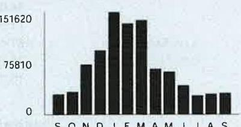
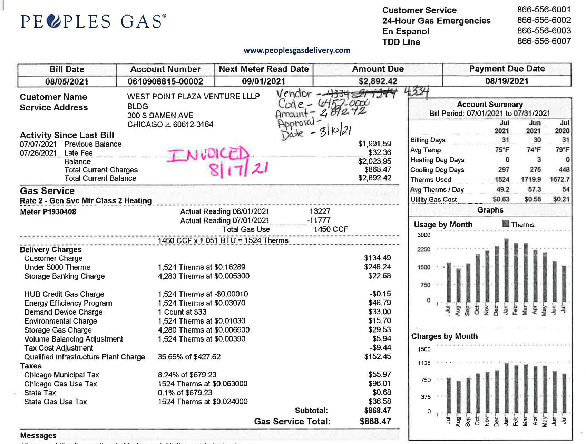

# West Point Plaza

## Visit ComEd.com

Customer Service / Power Outage English
1.877.4COMED1 (1.877.426.6331)

## Español

1.800.95.LUCES (1.800.955.8237)

Hearing/Speech Impaired 1.800.572.5789 (TTY)

Your Usage Profile 13-Month Usage (Total kWh)

The image is a bar chart.

- **Chart Type**: Bar chart
- **Y-Axis**: The numbers 0, 75810, and 151620 are visible, likely representing kWh usage.
- **X-Axis**: The labels appear to be letters "S O N D J F M A M J J A S," which likely correspond to months (September to September).
- **Data Representation**: Each bar represents the kWh usage for a specific month.
- **Styling**: The bars are uniformly black, with varying heights indicating different usage levels.
- **Yearly Usage Breakdown (Monthly-Based)**: The chart visually represents the monthly kWh usage over a year, with the highest usage appearing in the middle months, likely winter, and lower usage in the summer months.

Electric Usage

| Month | kWh |
| :-- | --: |
| Sep-20 | 30204 |
| Oct-20 | 33700 |
| Nov-20 | 73981 |
| Dec-20 | 94757 |
| Jan-21 | 151611 |
| Feb-21 | 134740 |
| Mar-21 | 139202 |
| Apr-21 | 67396 |
| May-21 | 63588 |
| Jun-21 | 42837 |
| Jul-21 | 28413 |
| Aug-21 | 30598 |
| Sep-21 | 31744 |

Month Billed
Last Year
Last Month
Current Month
$1024.0 \quad 76$

Page 1 of 3
Account Number 5976464002
Name
THE HABITAT CO
Service Location 300 S DAMEN AVE BDCHICAGO Phone Number 312-733-1500

## ENVOICED 9/18/21

Issue Date
August 31, 2021

## Bill Summary

Previous Balance
Total Payments
Amount Due on September 15, 2021
\$0.00
\$0.00

## Meter information

| Read   Dates | Meter   Number | Load   Type | Reading   Type | Previous | Meter Reading   Present | Difference | Multiplier   $\times$ | Usage |
| :--: | :--: | :--: | :--: | :--: | :--: | :--: | :--: | :--: |
| 7/30-   8/30 | 230131502 | General Service | Total kWh | Actual | Actual |  |  | 9291 |
| 7/30-   8/30 | 230131502 | General Service | On Pk kW | Actual | Actual |  |  | 17.42 |
| $\begin{aligned} & 7/30- \\ & 8 / 30 \end{aligned}$ | 230131504 | General Service | Total kWh | Actual | Actual |  |  | 9355 |
| $\begin{aligned} & 7/30- \\ & 8 / 30 \end{aligned}$ | 230131504 | General Service | On Pk kW | Actual | Actual |  |  | 12.74 |
| $\begin{aligned} & 7/30- \\ & 8 / 30 \end{aligned}$ | 230148155 | General Service | Total kWh | Actual | Actual |  |  | 19 |
| $\begin{aligned} & 7/30- \\ & 8 / 30 \end{aligned}$ | 230148155 | General Service | On Pk kW | Actual | Actual |  |  | 0.03 |
| $\begin{aligned} & 7/30- \\ & 8 / 30 \end{aligned}$ | 271245548 | General Service | Total kWh | Actual | Actual |  |  | 3301 |
| $\begin{aligned} & 7/30- \\ & 8 / 30 \end{aligned}$ | 271245548 | General Service | On Pk kW | Actual | Actual |  |  | 5.39 |
| $\begin{aligned} & 7/30- \\ & 8 / 30 \end{aligned}$ | 271245550 | General Service | Total kWh | Actual | Actual |  |  | 2159 |
| $\begin{aligned} & 7/30- \\ & 8 / 30 \end{aligned}$ | 271245550 | General Service | On Pk kW | Actual | Actual |  |  | 2.55 |
| $\begin{aligned} & 7/30- \\ & 8 / 30 \end{aligned}$ | 271245551 | General Service | Total kWh | Actual | Actual |  |  | 2832 |
| $\begin{aligned} & 7/30- \\ & 8 / 30 \end{aligned}$ | 271245551 | General Service | On Pk kW | Actual | Actual |  |  | 3.64 |
| $\begin{aligned} & 7/30- \\ & 8 / 30 \end{aligned}$ | 271245596 | General Service | Total kWh | Actual | Actual |  |  | 2632 |
| $\begin{aligned} & 7/30- \\ & 8 / 30 \end{aligned}$ | 271245596 | General Service | On Pk kW | Actual | Actual |  |  | 3.51 |
| $\begin{aligned} & 7/30- \\ & 8 / 30 \end{aligned}$ | 272148424 | General Service | Total kWh | Actual | Actual |  |  | 2157 |
| $\begin{aligned} & 7/30- \\ & 8 / 30 \end{aligned}$ | 272148424 | General Service | On Pk kW | Actual | Actual |  |  | 14.96 |

| 010566201 AV 0.423 **AUTO | 190117360612-318499 | -C05-00-P05667-012 08 |
| :--: | :--: | :--: |
| $1111 j j j j j j j j j j j j j j j j j j j j j j j j j j j j j j j j j j j j j j j j j j j j j$ |  |  |

To pay by phone call 1-800-588-9477.
A convenience fee will apply.

Account Number
5976464002
Payments Amount

Please pay this
amount by $9 / 15 / 2021$
\$6,174.79
$110 j j j j j j j j j j j j j j j j j j j j j j j j j j j j j j j j j j j j j j j$
COMED
PO BOX 6111
CAROL STREAM, IL 60197-6111
597646400200061747912586174790

| Table | Number of |  |  |  |
| :--: | :--: | :--: | :--: | :--: |
| Service from 7/30/2021 to 8/30/2021 - 31 Days | Commercial Hourly - 100 kW to 400 kW |  |  |  |
| Electricity Supply Services |  |  |  | \$2,058.85 |
| Electricity Supply Charge | 31,744 kWh |  |  | 1,423.67 |
| Capacity Charge | 63.41 kW | $X$ | 6.09233 | 386.31 |
| Transmission Services Charge | 31,744 kWh | $X$ | 0.00866 | 274.90 |
| Misc Procurement Component Chg | 31,744 kWh | $X$ | 0.00092 | 29.20 |
| Purchased Electricity Adjustment |  |  |  | -55.23 |
| Delivery Services - ComEd |  |  |  | \$578.14 |
| Customer Charge |  |  |  | 26.41 |
| Standard Metering Charge |  |  |  | 11.51 |
| Distribution Facilities Charge | 60.24 kW | $X$ | 7.56000 | 461.44 |
| II, Electricity Distribution Charge | 31,744 kWh | $X$ | 0.00122 | 38.73 |
| Meter Lease |  |  |  | 40.05 |
| Taxes and Other |  |  |  | \$468.10 |
| Environmental Cost Recovery Adj | 31,744 kWh | $X$ | 0.00022 | 6.98 |
| Renewable Portfolio Standard | 31,744 kWh | $X$ | $-0.00109$ | $-34.60$ |
| Zero Emission Standard | 31,744 kWh | $X$ | 0.00195 | 61.90 |
| Energy Efficiency Programs | 31,744 kWh | $X$ | 0.00260 | 82.53 |
| Franchise Cost |  |  |  | 114.70 |
| State Tax |  |  |  | 101.48 |
| Municipal Tax |  |  |  | 135.11 |
| Total Current Charges |  |  |  | \$3,105.09 |
| Miscellaneous |  |  |  | \$3,069.70 |
| Charges from previous bill |  |  |  | 2,925.39 |
| Current late payment charge (s) - electric |  |  |  | 45.36 |
| Previous late payment charge (s) - electric |  |  |  | 98.95 |

(continued on next page)

## Visit ComEd.com

Customer Service / Power Outage
English
1.877.4COMED1 (1.877.426.6331)

## Español

1.800.95.LUCES (1.800.955.8237)

Hearing/Speech Impaired
1.800.572.5789 (TTY)

## Message Center

## ComEd

- THE SUPPORT TO STOP A SCAM: Sometimes knowing someone is in your corner is all you need for a little boost of confidence. If you're worried about energy scams, we have tips to keep you protected and hints on how to recognize scammers. Learn more: ComEd.com/ScamAlert.
- MYLAR BALLOONS \& POWER LINES DON'T MIX! Every year, thousands of residents across northern Illinois are affected by power outages caused by foil balloons. If a foil or Mylar balloon touches a power line, it can cause power surges or service interruptions. Keep balloons tied securely while outside! If you see a balloon, or any object, caught in a power line, do not attempt to retrieve it. Call ComEd at 1-800-EDISON-1.
- WAYS TO PAY: Looking for ways to pay your bill? Visit ComEd.com/PAY
- RESOLVING DISPUTES: The Illinois Commerce Commission Consumer Division is available at 800-524-0795 to help resolve disputes with ComEd. However, customers should contact ComEd before seeking assistance from the ICC.

The image is a photo of a utility bill from Peoples Gas. It includes detailed billing information and a graph.

- **Text and Details:**
  - **Header:**
    - "PEOPLES GAS"
    - "www.peoplesgasdelivery.com"
    - Customer Service numbers: 866-556-6001, 866-556-6002, 866-556-6003, 866-556-6007
  - **Bill Details:**
    - Bill Date: 08/05/2021
    - Account Number: 0610908815-00002
    - Next Meter Read Date: 09/01/2021
    - Amount Due: $2,892.42
    - Payment Due Date: 08/19/2021
  - **Customer Information:**
    - Name: WEST POINT PLAZA VENTURE LLLP
    - Address: 300 S DAMEN AVE, CHICAGO IL 60612-3164
  - **Activity Since Last Bill:**
    - Previous Balance: $1,991.59
    - Late Fee: $32.36
    - Balance: $2,023.95
    - Total Current Charges: $868.47
    - Total Current Balance: $2,892.42
  - **Gas Service:**
    - Meter: P1930408
    - Actual Reading 08/01/2021: 13227
    - Actual Reading 07/01/2021: -11777
    - Total Gas Use: 1450 CCF x 1.051 BTU = 1524 Therms
  - **Delivery Charges:**
    - Customer Charge: $134.49
    - Under 5000 Therms: $248.24
    - Storage Banking Charge: $22.68
    - HUB Credit Gas Charge: -$0.15
    - Energy Efficiency Program: $46.79
    - Demand Device Charge: $33.00
    - Environmental Charge: $15.70
    - Storage Gas Charge: $29.53
    - Volume Balancing Adjustment: $5.94
    - Tax Cost Adjustment: -$9.44
    - Qualified Infrastructure Plant Charge: $152.45
  - **Taxes:**
    - Chicago Municipal Tax: $55.97
    - Chicago Gas Use Tax: $96.01
    - State Tax: $0.68
    - State Gas Use Tax: $36.58
    - Subtotal: $868.47
    - Total Service Total: $868.47
  - **Account Summary:**
    - Bill Period: 07/01/2021 to 07/31/2021
    - Billing Days: 31 (July)
    - Avg Temp: 75°F (July)
    - Heating Deg Days: 3 (July)
    - Cooling Deg Days: 448 (July)
    - Therms Used: 1672.7 (July)
    - Avg Therms / Day: 54 (July)
    - Utility Gas Cost: $0.21 (July)

- **Graph:**
  - **Type:** Bar graph
  - **Title:** "Usage by Month"
  - **Y-axis:** Therms
  - **X-axis:** Months (July 2020 to July 2021)
  - **Data:** Bars represent therms usage for each month, with July 2021 showing the highest usage.

- **Annotations:**
  - "INVOICED 8/17/21" handwritten in pink ink.
  - "Vendor - 433" and "Amount - 2,892.42" handwritten in black ink.

# Messages 

View your bill online anytime in My Account. Visit our website to sign up.
Your account has a past-due balance. Please send full payment by the payment due date.

ACCOUNT NUMBER: 0610908815-00002
INVOICE: 3805643041
Page 1 of 1
WEC_AFP_PGL_Out
15146
$18,000
PEOPELES GAS*
Please return this stub with your payment.

ACCOUNT NUMBER: 0610908815-00002
68083
$1,5000,000,000,000,000,000,000,000,000,000,000,000,000,000,000,000,000,000,000,000,000,000,000,000,000,000,000,000,000,000,000,000,000,000,000,000,000,000,000,000,000,000,000,000,000,000,000,000,000,000,

