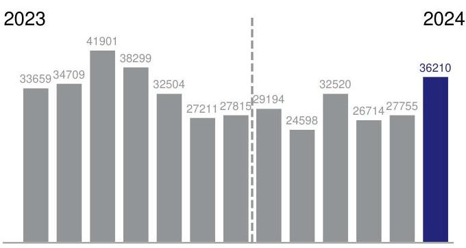
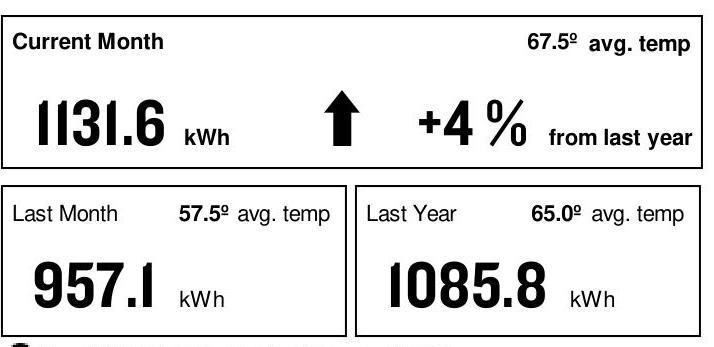

AN EXELON COMPANY

## SERVICE FROM 5/3/24 THROUGH 6/4/24 (32 DAYS)

Retail Delivery Service - 100 kW to 400 kW

Hampton Social Skokie LLC
4999 Oldorchard *Unit C22
Skokie, IL 60077

## TOTAL USAGE (kWh)

The image is a bar chart showing a **yearly usage breakdown (monthly-based)** of electricity consumption from 2023 to 2024. 

- **X-axis**: Months from June 2023 to June 2024.
- **Y-axis**: Electricity usage in kWh.
- **Data Points**:
  - June 2023: 33,659 kWh
  - July 2023: 34,709 kWh
  - August 2023: 41,901 kWh
  - September 2023: 38,299 kWh
  - October 2023: 32,504 kWh
  - November 2023: 27,211 kWh
  - December 2023: 27,815 kWh
  - January 2024: 29,194 kWh
  - February 2024: 24,598 kWh
  - March 2024: 32,520 kWh
  - April 2024: 26,714 kWh
  - May 2024: 27,755 kWh
  - June 2024: 36,210 kWh

The chart features a vertical dashed line separating the years 2023 and 2024. The bar for June 2024 is highlighted in blue, indicating the current month's reading.

JUN JUL AUG SEP OCT NOV DEC JAN FEB MAR APR MAY JUN Current month's reading is Actual.

## OVERAGE DAILY USE (monthly usage/days in period)

The image is a photo/illustration displaying electricity usage data.

- **Current Month**: 1131.6 kWh, 67.5º avg. temp, with an upward arrow indicating an increase of +4% from last year.
- **Last Month**: 957.1 kWh, 57.5º avg. temp.
- **Last Year**: 1085.8 kWh, 65.0º avg. temp.

The layout features the current month's data prominently at the top, with last month's and last year's data below it. The upward arrow and percentage indicate a comparison to the previous year.

Ten 100W light bulbs for 1 hour $=1 \mathrm{kWh}$

## CURRENT CHARGES SUMMARY

See reverse side for details

## SUPPLY

\$3,366.33

## Freepoint Energy Solutions provides

your energy.
1.713.239.8000

For Electric Supply Choices visit pluginillinois.org

## DELIVERY

\$1,307.37

ComEd delivers electricity to your business.
ComEd.com
1.800.334.7661

TAXES \& FEES \$1,156.37

Return only this portion with your check made payable to ComEd. Please write your account number on your check.

## Comed

AN EXELON COMPANY

0110816 01 AV 0.507 **AUTO TO 01122 60642-430517 -C05-00-P00000-I 2
||-|-|-|-|-|-|-|-|-|-|-|-|-|-|-|-|-|-|-|-|-|-|-|-|-|-|-|-|-|-|-|-|-|
HAMPTON SOCIAL SKOKIE LLC
1017 NORTH HOOKER STREET
CHICAGO, IL 60642-4305

Pay your bill online, by phone or by mail.
See reverse side for more info Account \# 7676009000

Payment Dedicated on 6/21/24 \$5,830.07

Payment Amount:

For Questions, Support, and Outages visit ComEd.com

English
Español
Hearing/Speech Impaired
Federal Video Relay Services (VRS)
I.877.4COMEDI (I.877.426.633I)
I.800.95.LUCES (I.800.955.8237)
I.800.572.5789 (TTY)

Fedvrs.us/session/new

## 1

SERVICE ADDRESS

## 4999 Oldorchard *Unit C22 Skokie, IL 60077

Electric Choice ID: 7673150506 Electric Choice ID: 7673188482

## METER INFORMATION

| Read Dates | Meter Number | Load Type | Reading Type | Previous | Present | Difference | Multiplier | Usage |
| :--: | :--: | :--: | :--: | :--: | :--: | :--: | :--: | :--: |
| 5/3-6/4 | 230230425 | General Service | Off Pk kW | Actual | Actual |  |  | 105.60 |
| 5/3-6/4 | 230230425 | General Service | On Pk kW | Actual | Actual |  |  | 101.80 |
| 5/3-6/4 | 230230425 | General Service | Total kWh | Actual | Actual |  |  | 36210 |
| CHARGE DETAILS |  |  |  | Municipal Tax |  |  |  | \$153.51 |
| Retail Delivery Service - 100 kW to 400 kW 5/3/24 - 6/4/24 |  |  |  | Service Period Total |  |  |  | \$5,830.07 |
| SUPPLY - FREEPOINT ENERGY SOLUTIONS |  | \$3,366.33 |  | MISCELLANEOUS |  |  |  | \$0.00 |
| ENERGY CHAR: 36210@.0899 PER KWH |  |  | \$3,253.47 | Charges/Credits from previous bill |  |  |  | \$4,648.52 |
| TRANSMISSION CHARGE |  |  | \$112.86 | Thank You for Your Payment of \$4,648.52 on May 21, 2024 |  |  |  |  |
| DELIVERY - ComEd |  |  | \$1,307.37 | Total Amount Due |  |  |  | \$5,830.07 |
| Customer Charge |  |  | \$28.90 | UPDATES |  |  |  |  |
| Standard Metering Charge |  |  | \$11.31 |  |  |  |  |  |
| Distribution Facility Charge |  | 101.80 kW X 12.01000 | \$1,222.62 |  |  |  |  |  |
| IL Electricity Distribution Charge |  | 36,210 kWh X 0.00123 | \$44.54 |  |  |  |  |  |
| TAXES \& FEES |  |  | \$1,156.37 |  |  |  |  |  |
| Environmental Cost Recovery Adj |  | 36,210 kWh X 0.00033 | \$11.95 |  |  |  |  |  |
| Renewable Portfolio Standard |  | 36,210 kWh X 0.00502 | \$181.77 |  |  |  |  |  |
| Zero Emission Standard |  | 36,210 kWh X 0.00195 | \$70.61 |  |  |  |  |  |
| Carbon-Free Energy Resource Adj |  | 36,210 kWh X 0.00880 | \$318.65 |  |  |  |  |  |
| Energy Efficiency Programs |  | 36,210 kWh X 0.00691 | \$250.21 |  |  |  |  |  |
| Energy Transition Assistance |  | 36,210 kWh X 0.00072 | \$26.07 |  |  |  |  |  |
| Franchise Cost |  | \$1,284.55 X 2.17000\% | \$27.87 |  |  |  |  |  |
| State Tax |  |  | \$115.73 |  |  |  |  |  |

(continued on next page)

# A VARIETY OF METHODS TO PAY YOUR BILL 

Visit ComEd.com/PAY for more information including applicable fees for some transactions.

## Online

Set up an automatic payment, enroll in paperless billing, or make a convenience payment at ComEd.com/Pay.

## Mobile App

Download the ComEd mobile app on your Appleffi or Android ${ }^{\text {TM }}$ device to view and pay your bill, or manage your account.

## Phone

Call us to make a convenience payment with a credit card, ATM card, or your bank account: 1.800.588.9477.

## In-Person

Pay your bill in-person at many ComEd authorized agents located throughout the region. Visit ComEd.com/Pay for details.

- POWERLINE SAFETY: Water and electricity don't mix - that's why it's important to be aware of your surroundings and watch out for electrical hazards when working or playing around water recreation areas. Look for overhead power lines before performing activities such as casting a fishing line, using a pool skimming tool or raising a boat mast, and NEVER swim around docks with electrical equipment or boats plugged into shore power. Always keep yourself or any conductive material a minimum of 10 feet away from any power line. Call 1-800-Edison-1 before working near power lines. Learn more at ComEd.com/Safety.
- THE SUPPORT TO STOP A SCAM: The ability to send money through mobile-pay apps linked to your personal bank account or credit card like QuickPay, Zelle and Venmo make it easier to fall for scam attempts. Scammers claim they didn't see the transaction and ask it to be sent again - scamming you twice. Take steps to protect yourself from energy fraud. We can help with tips and hints to recognize potential scams and legitimate ComEd employees. Learn more: ComEd.Com/ScamAlert
- WAYS TO PAY: Looking for ways to pay your bill? Visit ComEd.com/PAY
- ILLINOIS COMMERCE COMMISSION CONSUMER DIVISION: The Consumer Services Division is available at 800-524-0795 to help resolve disputes with ComEd. However, customers should contact ComEd before seeking assistance from the ICC.

