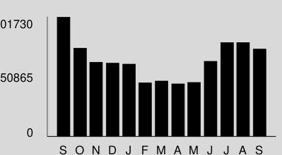

## Visit ComEd.com

Customer Service / Power Outage English
1.877.4COMED1 (1.877.426.6331)

## Español

1.800.95.LUCES (1.800.955.8237)

Hearing/Speech Impaired
1.800.572.5789 (TTY)

Your Usage Profile 13-Month Usage (Total kWh)

The image is a bar chart displaying electricity usage over a 13-month period. 

- **Chart Type**: Bar chart
- **X-Axis**: Labeled with the months of the year, starting from September (S), October (O), November (N), December (D), January (J), February (F), March (M), April (A), May (M), June (J), July (J), August (A), September (S).
- **Y-Axis**: Displays numerical values with two major ticks labeled as 0, 50865, and 101730.
- **Data Representation**: Each bar represents the total kWh usage for each month.
- **Yearly Usage Breakdown (Monthly-Based)**: The chart visually represents the electricity consumption for each month, with varying bar heights indicating different levels of usage.

## Electric Usage

| Month | kWh |
| :-- | :--: |
| Sep-16 | 101721 |
| Oct-16 | 75239 |
| Nov-16 | 63093 |
| Dec-16 | 62549 |
| Jan-17 | 61455 |
| Feb-17 | 45649 |
| Mar-17 | 47328 |
| Apr-17 | 45001 |
| May-17 | 46130 |
| Jun-17 | 64032 |
| Jul-17 | 79914 |
| Aug-17 | 79967 |
| Sep-17 | 74486 |

## Month Billed

Last Year
Last Month
Current Month
Average Daily
kWh Temp
3390.7 75

| 0010149 | SL | H | 117760624 | $-076-81-P 00000-1$ |
| :--: | :--: | :--: | :--: | :--: |

EAST PARK APTS
ATTN MGMT OFFICE
3300 W MAYPOLE AVE
CHICAGO, IL 60624

| Bill Summary |  |
| :--: | :--: |
| Previous Balance | \$13,689.92 |
| Total Payments - Thank You | \$13,689.92 |
| Amount Due on September 20, 2017 | \$5,912.37 |

Issue Date
September 5, 2017

| Meter Information |  |  |  |  |  |  |  |  |
| :--: | :--: | :--: | :--: | :--: | :--: | :--: | :--: | :--: |
| Read   Dates | Meter   Number | Load   Type | Reading   Type | Previous | Meter Reading   Present | Difference | Multiplier   $X$ | Usage |
| $8/3-$ | 230151761 | General Service | Total kWh | Actual | Actual |  |  | 4251 |
| $8 / 3-$ | 230151761 | General Service | On Pk kW | Actual | Actual |  |  | 5.89 |
| $8 / 3-$ | 230182184 | General Service | Total kWh | Actual | Actual |  |  | 70235 |
| $8 / 3-$ | 230182184 | General Service | On Pk kW | Actual | Actual |  |  | 160.90 |

Service from 8/3/2017 to 9/1/2017 - 29 Days
Commercial Hourly - 100 kW to 400 kW

Electricity Supply Services
Electricity Supply Charge
Transmission Services Charge
Capacity Charge
Purchased Electricity Adjustment
Misc Procurement Component Chg
$74,486 \mathrm{kWh} \quad \mathrm{X}$
$0.00843$
627.92
$260.37 \mathrm{~kW} \quad \mathrm{X}$
$4.69146$
$-317.31$
$-317.31$
$74,486 \mathrm{kWh} \quad \mathrm{X}$
$0.00110$
$81.93$

Delivery Services - ComEd
Customer Charge
Standard Metering Charge
Distribution Facilities Charge
IL Electricity Distribution Charge
Nonstandard Facilities Charge
$166.78 \mathrm{~kW} \quad \mathrm{X}$
$74,486 \mathrm{kWh} \quad \mathrm{X}$
$6.79000$
$1,132.44$
$86.40$
(continued on next page)
Return only this portion with your check made payable to ComEd. Please write your account number on your check.

To pay by phone call 1-800-588-9477.
A convenience fee will apply.

Account Number
4635623008
Payment Amount

Please pay this
amount by $9 / 20 / 2017$
\$5,912.37
$\int\|x\||\mid||\mid||\mid||\mid||\mid||\mid||\mid||\mid||\mid||\mid||\mid$
COMED
PO BOX 6111
CAROL STREAM, IL 60197-6111
$463562300800059123772635912379$

| Taxes and Other |  |  |  | \$1,008.57 |
| :--: | :--: | :--: | :--: | :--: |
| Environmental Cost Recovery Adj | 74,486 kWh | $X$ | 0.00005 | 3.72 |
| Renewable Portfolio Standard | 74,486 kWh | $X$ | 0.00094 | 70.02 |
| Zero Emission Standard | 74,486 kWh | $X$ | 0.00195 | 145.25 |
| Franchise Cost |  |  |  | 254.51 |
| State Tax |  |  |  | 233.91 |
| Municipal Tax |  |  |  | 301.16 |

# Total Current Charges 

$\$ 5,912.37$

Thank you for your payment of \$13,689.92 on August 23, 2017

## Total Amount Due

$\$ 5,912.37$

## Message Center

## ComEd

- BUSINESS ENERGY SAVINGS: When is the last time you had your rooftop unit performance checked? Schedule your appointment to get your unit optimized. Call 855.433.2700.
- BEST TIMES TO CALL: Experience shorter wait times by contacting us from Tuesday to Friday between 11:00am and 4:00pm. Longer wait times can be expected on Mondays, the first business day after a holiday, and the first business day of the month. Visit us at www.ComEd.com to learn more.
- WAYS TO PAY: Looking for ways to pay your bill? Visit ComEd.com/Pay.
- ILLINOIS COMMERCE COMMISSION CONSUMER DIVISION: (800-524-0795): The Consumer Services Division is available to help resolve disputes with ComEd. However, customers should contact ComEd first before seeking assistance from the ICC.

