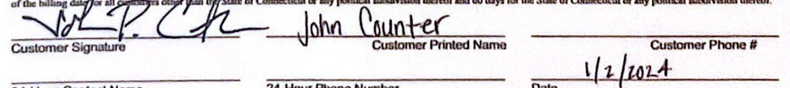

The image is a photo of a document header. It contains the following text:

- "NRG Business Marketing LLC"
- "804 Carnegie Center,"
- "Princeton, NJ, 08540"
- "1.844.737.6742"
- "nrg.com"
- "Date: 01/03/2024"
- "Time: 05:02 PM"
- "Proposal Id: 68611341"
- "Marketer Name: Kopala, Jeffrey"

The text is organized in a structured format with the company information on the left and the date, time, proposal ID, and marketer name on the right. The background is primarily white with a blue section labeled "CUSTOMER INFORMATION" at the bottom.

## CUSTOMER INFORMATION

Customer Name: West Haven Hsg Authority
Contact Name:
Address: 15 Glade Street, WEST HAVEN, CT 06516 US

Telephone: Fax:

Type: New
Billing Contact:
Billing Address:
Telephone: Fax:

Email:

# NATURAL GAS TRANSACTION CONFIRMATION 

This Transaction Confirmation confirms the terms of the Gas Transaction entered into between NRG Business Marketing LLC ("Seller"), and the customer above ("Buyer" or "Customer") pursuant to the terms of the Commodity Master Agreement ("CMA") between Buyer and Seller dated January 03, 2024 as may be amended. The Purchase Price excludes Utility distribution charges and Taxes that are or may be the responsibility of Buyer. Gas volumes will be adjusted for Utility line loss, where applicable. The prices listed below are based on market conditions as of the time, stated above, that this Transaction Confirmation was issued and may be adjusted by Seller to reflect market conditions as of the date it is executed and returned by Buyer. THIS TRANSACTION CONFIRMATION WILL NOT BE EFFECTIVE UNTIL SIGNED BY BOTH PARTIES.

## SERVICE LOCATIONS

(Additional pages may be attached if necessary)

| Service Address | Utility Account Number | Rate |
| :--: | :--: | :--: |
| 39 Coleman St | 5000000607047 | Firm A |
| 39 Coleman St | 5000000607049 | FIRM |
| 39 Coleman St | 5000000607051 | FIRM |
| 39 Coleman St | 5000000607050 | Firm A |
| 39 Coleman St | 5000000607048 | Firm A |

Payment Terms: [15] days
Late Fee: [1.50]\% or, if lower, the maximum amount permitted by law.

## DELIVERY PERIOD

Begin: 02/01/2024
End: 01/31/2026
The service start date hereunder will be the date that the Utility enrolls Customer for Seller's service. Seller will request the Utility to enroll Customer on the first meter read date within the Delivery Period.
Upon the expiration of the Delivery Period, this Transaction shall continue for successive one month terms (collectively the "Renewal Term") until either Party notifies the other Party in writing of its intention to terminate, at least 15 days prior to (1) the end of the Delivery Period or (2) during the Renewal Term, the earlier of the end of each successive month Renewal Term or the next cycle read date. After notice is given as contemplated in the previous sentence, the date of termination ("Termination Date") shall be the next effective drop date permitted by the Utility. The Purchase Price for delivery to the Delivery Point during the Renewal Term or for any period outside of the Delivery Period, shall be the then Market Price for delivery to the Delivery Point, unless otherwise agreed to in writing.

## DELIVERY POINT

Southern Connecticut Gas Company / SO CT POOL 1 AGT

# CONTRACT QUANTITY (MMBTU) 

Buyer and Seller agree that the Contract Quantity purchased and received means a positive volume up to or greater than the estimated quantities listed below, provided, that for purposes of determining whether a Material Deviation has occurred and for purposes of calculating Contract Quantities remaining to be delivered under the Remedies section of the CMA, Contract Quantity shall be determined by reference to the applicable estimated quantity(ies) listed below.

| Volume Type : | Monthly |  |  |
| :--: | :--: | :--: | :--: |
| February | 398 | August | 44 |
| March | 346 | September | 56 |
| April | 236 | October | 150 |
| May | 135 | November | 300 |
| June | 54 | December | 391 |
| July | 44 | January | 456 |

## PURCHASE PRICE

Fixed Price : $\$ 8.661 /$ MMBTU

## BILL TYPE

Dual

## SPECIAL PROVISIONS

Change in Utility Account Numbers:
The account number for a Service Location shall be the Utility Account Number set forth in the Service Locations section above or as attached, as applicable, or any replacement account number issued by the Utility from time to time.
Fixed Price: The Purchase Price for the Contract Quantity, unless otherwise specified in this Transaction Confirmation is $\$ 8.661$ / MMBTU
Buyer acknowledges that it is acting for its own account, and that it has made its own independent decisions with respect to this Transaction Confirmation and that Seller is not acting as a fiduciary, financial, investment or commodity trading advisor for it in connection with the negotiation and execution of this Transaction Confirmation.
Full Plant Requirement - No GSA
TAX EXEMPTION STATUS - If exempt, must attach certificate
In order to ensure accurate billing, tax status indication is required. Please check the appropriate status below:
[] Non-Exempt
[ ] Exempt (e.g. Residential, Non-Profit Organization, Manufacturing, Small Business, Agricultural, Resale, etc.)
Buyer: West Haven Hsg Authority

The image is a photo of a signed document section. It includes:

- A signature above the text fields.
- The text fields are labeled as follows:
  - "Name :" with the handwritten entry "John Counter"
  - "Title :" with the handwritten entry "Executive Director"
  - "Date :" with the handwritten entry "1/2/2024"

Seller: NRG Business Marketing LLC

By :
Name :
Title :
Date : $\qquad$
$\qquad$
$\qquad$

Page 3 of 3

The image is a photo of a document header containing the following text:

- "NRG Business Marketing LLC"
- "804 Carnegie Center,"
- "Princeton, NJ, 08540"
- "1.844.737.6742"
- "nrg.com"
- "Date: 01/03/2024"
- "Time: 05:02 PM"
- "Proposal Id: 68611340"
- "Marketer Name: Kopala, Jeffrey"
- "CUSTOMER INFORMATION"

# CUSTOMER INFORMATION 

Customer Name: West Haven Hsg Authority
Contact Name:
Address: 15 Glade Street, WEST HAVEN, CT 06516 US
Telephone: $\quad$ Fax: $\quad$ Telephone: $\quad$ Fax:

Email:

## NATURAL GAS TRANSACTION CONFIRMATION

This Transaction Confirmation confirms the terms of the Gas Transaction entered into between NRG Business Marketing LLC ("Seller"), and the customer above ("Buyer" or "Customer") pursuant to the terms of the Commodity Master Agreement ("CMA") between Buyer and Seller dated January 03, 2024 as may be amended. The Purchase Price excludes Utility distribution charges and Taxes that are or may be the responsibility of Buyer. Gas volumes will be adjusted for Utility line loss, where applicable. The prices listed below are based on market conditions as of the time, stated above, that this Transaction Confirmation was issued and may be adjusted by Seller to reflect market conditions as of the date it is executed and returned by Buyer. THIS TRANSACTION CONFIRMATION WILL NOT BE EFFECTIVE UNTIL SIGNED BY BOTH PARTIES.

## SERVICE LOCATIONS

(Additional pages may be attached if necessary)

| Service Address | Utility Account Number | Rate |
| :--: | :--: | :--: |
| 1187 Campbell Ave | 5000000057807 | FIRM |
| Jones Hill Rd 1B | 5000000069768 | FIRM |
| Jones Hill Rd 3D | 5000000069770 | FIRM |
| Jones Hill Rd 2C | 5000000069769 | FIRM |
| Jones Hill Rd 4E | 5000000069771 | FIRM |
| 29 Glade St H | 5000000058098 | FIRM |
| 27 Glade St K | 5000000058099 | FIRM |
| 33 Glade St J | 5000000058100 | FIRM |
| 21 Glade St L | 5000000058097 | FIRM |
| 10 Glade St D | 5000000058095 | FIRM |
| 200 Oak St | 5000000088600 | FIRM |
| 200 Oak St | 5000000088601 | FIRM |
| 14 Glade St E | 5000000058096 | FIRM |
| 174 Center St | 5000000060238 | FIRM |
| 39 Coleman St A | 5000000058093 | FIRM |
| 200 Oak St | 5000000000418 | FIRM |
| 397 Meadowbrook Ct | 5000000068509 | Firm A |
| 397 Meadowbrook Ct | 5000000068547 | Firm A |
| 397 Meadowbrook Ct | 5000000122008 | Firm A |
| 15 Glade St | 5000000126033 | Firm A |

| 33 Glade St | $5000000126139$ | Firm A |
| :-- | :-- | :-- | :-- |

# Payment Terms: [15] days 

Late Fee: [1.50]\% or, if lower, the maximum amount permitted by law.

## DELIVERY PERIOD

Begin: 02/01/2024
End: 01/31/2026
The service start date hereunder will be the date that the Utility enrolls Customer for Seller's service. Seller will request the Utility to enroll Customer on the first meter read date within the Delivery Period.
Upon the expiration of the Delivery Period, this Transaction shall continue for successive one month terms (collectively the "Renewal Term") until either Party notifies the other Party in writing of its intention to terminate, at least 15 days prior to (1) the end of the Delivery Period or (2) during the Renewal Term, the earlier of the end of each successive month Renewal Term or the next cycle read date. After notice is given as contemplated in the previous sentence, the date of termination ("Termination Date") shall be the next effective drop date permitted by the Utility. The Purchase Price for delivery to the Delivery Point during the Renewal Term or for any period outside of the Delivery Period, shall be the then Market Price for delivery to the Delivery Point, unless otherwise agreed to in writing.

## DELIVERY POINT

## Southern Connecticut Gas Company / SO CT POOL 1 AGT

## CONTRACT QUANTITY (MMBTU)

Buyer and Seller agree that the Contract Quantity purchased and received means a positive volume up to or greater than the estimated quantities listed below, provided, that for purposes of determining whether a Material Deviation has occurred and for purposes of calculating Contract Quantities remaining to be delivered under the Remedies section of the CMA, Contract Quantity shall be determined by reference to the applicable estimated quantity(ies) listed below.

| Volume Type : | Monthly |  |  |
| :--: | :--: | :--: | :--: |
| February | 4,300 | August | 400 |
| March | 3,501 | September | 650 |
| April | 2,750 | October | 1,696 |
| May | 1,575 | November | 2,958 |
| June | 641 | December | 3,650 |
| July | 440 | January | 4,564 |

## PURCHASE PRICE

Fixed Price : $\$ 8.661 /$ MMBTU

## BILL TYPE

Dual

## SPECIAL PROVISIONS

Change in Utility Account Numbers:
The account number for a Service Location shall be the Utility Account Number set forth in the Service Locations section above or as attached, as applicable, or any replacement account number issued by the Utility from time to time.
Fixed Price: The Purchase Price for the Contract Quantity, unless otherwise specified in this Transaction Confirmation is $\$ 8.661$ / MMBTU

Buyer acknowledges that it is acting for its own account, and that it has made its own independent decisions with respect to this Transaction Confirmation and that Seller is not acting as a fiduciary, financial, investment or commodity trading advisor for it in connection with the negotiation and execution of this Transaction Confirmation.
Full Plant Requirement - No GSA
TAX EXEMPTION STATUS - If exempt, must attach certificate
In order to ensure accurate billing, tax status indication is required. Please check the appropriate status below:
$\llbracket$ Non-Exempt
$\square$ Exempt (e.g. Residential, Non-Profit Organization, Manufacturing, Small Business, Agricultural, Resale, etc.
Buyer: West Haven Hsg Authority
Seller: NRG Business Marketing LLC

By :
Name :
Title :
Date :

The image is a photo of a handwritten signature section on a document. It includes the following text:

- "Cynthia Gunter, Executive Director"
- "11/2/2024"

The text is written in cursive and appears to be part of a signature line, with "Cynthia Gunter, Executive Director" above the date "11/2/2024".

By :
Name :
Title :
Date : $\qquad$

# nrg. 

This Commodity Master Agreement ("CMA") between NRG Business Marketing LLC, and Direct Energy Business, LLC d/b/a NRG Business, each a Delaware limited liability company (collectively "Seller" or "NRG"), and West Haven Hsg Authority ("Customer") (each a "Party" and collectively, the "Parties") is entered into and effective as of January 03, 2024.

1. Transactions: This CMA applies to all end-use sales of electric power and/or natural gas as applicable (each a "Commodity" and collectively, the "Commodities"), by the applicable Seller to Customer (each sale a "Transaction"). Transactions will be memorialized in a transaction confirmation signed by Customer and Seller (each a "Transaction Confirmation"). Each Transaction Confirmation sets forth the applicable Seller providing the service to Customer. This CMA, any amendments to this CMA and related Transaction Confirmation(s) (together, a single integrated, "Agreement") is the entire understanding between Parties with respect to the Commodities and supersedes all other communication and prior writings with respect thereto; no oral statements are effective.
2. Performance: Customer is obligated to purchase and receive, and Seller is obligated to sell and provide, the Contract Quantity of Commodity. Customer's estimated monthly Contract Quantity is specified in the applicable Transaction Confirmation. Customer will only use the Commodity at the Service Location(s) listed in the applicable Transaction Confirmation and must not resell the Commodity.
3. Term: This CMA shall remain in effect until terminated by either Party pursuant to Section 14 or for convenience upon at least 30 days' prior written notice; except that this CMA will remain in effect with respect to Transaction Confirmations entered into prior to the effective date of the termination until both Parties have fulfilled all outstanding obligations. Each Transaction Confirmation sets forth the Initial Term which together with any Renewal Term constitutes the Delivery Period.
4. Purchase Price: Customer will pay the Purchase Price stated in each Transaction Confirmation, subject to Sections 5 and 10. If the Purchase Price incorporates an index and the index is not announced or published on any day for any reason or if the Seller reasonably determines that a material change in the formula for or the method of determining the Purchase Price has occurred, then the Parties will use a commercially reasonable replacement price calculated by the Seller.
5. Changes to Purchase Price: If there is a new or modified tariff, law, order, rule, tax, regulation, transmission rate, or a change by any LDC, EDC or ISO to supplier obligations to serve, which increase Seller's costs, Seller may allocate the increased costs to Customer in the form of an adjusted Purchase Price or a separate line item on Customer's invoice.
6. Billing and Payment: Seller will invoice Customer and Customer will pay for the Actual Quantity of Commodity and any other amounts that are Customer's responsibility under this Agreement. Unless otherwise set forth on a Transaction Confirmation, payment is due within 15 days of the date of the invoice, and late fees will be accrued at $1.50 \%$ per month or, if lower, the maximum rate permitted by law. If Seller cannot verify the Actual Quantity when an invoice is issued, Seller will estimate the Actual Quantity. Seller will adjust Customer's account following (i) confirmation of the Actual Quantity, (ii) any Utility adjustment, or (iii) any other corrections or adjustments, including adjustments to, or re-calculation of Taxes. Customer is also responsible for all costs and fees, including reasonable attorney's fees, incurred in collecting any amounts owed to Seller and any fee charged to Seller for Customer's insufficient funds. "Actual Quantity" means the quantity of Commodity that is either delivered or metered, as applicable, to Customer's account. "Utility" means a state regulated entity engaged in the distribution of the applicable Commodity.
7. Taxes: The Purchase Price does not include Taxes that are or may be the responsibility of the Customer, unless such inclusion is required by law. Customer will reimburse Seller for any Taxes that Seller is required to collect and pay on Customer's behalf and will indemnify, defend and hold Seller harmless from any liability against all Taxes for which Customer is responsible. It is Customer's responsibility to provide Seller with any applicable Tax exemption documentation and Customer will be liable for any Taxes assessed against Seller because of Customer's failure to timely provide or properly complete any such documentation. "Taxes" means all applicable federal, state and local taxes, including any associated penalties and interest and any new taxes imposed in the future during the term of this Agreement. Liabilities imposed in this Section will survive the termination or expiration of this Agreement.

on-disputing Party in writing and pay the undisputed amount by the payment due date. The Parties will have 15 Business Days to negotiate a resolution. If such dispute is not resolved, the disputing Party will immediately pay the balance of the original invoice, plus late fees from the original due date, and either Party may exercise any remedy available to it at law or equity. "Business Day" means any day on which banks are open for commercial business in New York, New York; any reference to "day(s)" means calendar days.
9. Title and Risk of Loss: Title to, possession of and risk of loss to the Commodity will pass to Customer at the Delivery Point specified in the applicable Transaction Confirmation.
10. Material Deviation: Seller may in its sole discretion pass through to Customer any losses and/or costs incurred by Seller related to a deviation of $+1-25 \%$ from Contract Quantity (or, as applicable, estimated Contract Quantities) stated in the applicable Transaction Confirmation (which is not caused by weather).
11. Force Majeure: Other than payment obligations, a Party claiming Force Majeure will be excused from its obligations only if it provides prompt notice of the Force Majeure event, uses due diligence to remove its cause and resumes performance as promptly as reasonably possible. During a Force Majeure event, Customer will not be excused from its responsibility to pay for natural gas balancing charges nor from its responsibility to pay for Commodity received. "Force Majeure" means a material, unavoidable occurrence beyond a Party's control, and does not include inability to pay, an increase or decrease in Taxes or the cost of Commodity, the economic hardships of a Party, or the full or partial closure of Customer's facilities, unless such closure itself is due to Force Majeure.
12. Financial Responsibility: Seller's entry into this Agreement and each Transaction is conditioned on Customer, its parent, any guarantor or any successor maintaining its creditworthiness during the Delivery Period. When Seller has reasonable grounds for insecurity regarding Customer's ability or willingness to perform all of its outstanding obligations under any Transaction Confirmation between the Parties, Seller may require Customer to provide adequate assurance, which may include, in Seller's discretion, security in the form of cash deposits, letters of credit or other guaranty of payment or performance ("Credit Assurance").
13. Default: "Default" means: (i) failure of either Party to make payment by the applicable due date and the payment is not made within 3 Business Days of Seller's demand; (ii) failure of Customer to provide Credit Assurance within 2 Business Days of Seller's demand; (iii) any representation or warranty made by a Party in this Agreement proves to have been false or misleading in any material respect when made or ceases to remain true and such breach is not cured within 15 Business Days after written notice; (iv) a secured party has taken possession of all or any substantial portion of its assets or is dissolved or has a resolution passed for its winding-up, official management or liquidation (other than pursuant to a consolidation or merger where the surviving entity has assumed all of the respective obligations of such Party under this Agreement); (v) failure of a Party to fulfill any of its obligations in this Agreement (except as otherwise provided in subsections (i), (ii) (iii) and (iv) hereof) and such failure is not cured within 15 Business Days after written notice; provided that no cure period or demand for cure applies to an early termination of a Transaction Confirmation by Customer or due to a default under Section 15(A)(iii).
14. Remedies: In the event of a Default, the non-defaulting Party may: (i) withhold any payments or suspend performance; (ii) accelerate any amounts owing between the Parties and terminate any or all Service Locations under any or all Transactions and/or this CMA between the Parties; (iii) calculate a settlement amount by calculating all amounts due to Seller for Actual Quantity and the Close-out Value for each terminated Service Location under the Transaction Confirmation(s) being terminated; and/or (iv) net or aggregate all settlement amounts and all other amounts owing between (a) the non-defaulting Party and its affiliates and (b) the defaulting Party under this Agreement and any other Commodity agreements, whether or not due and whether or not subject to any contingencies, plus costs, into one single amount ("Net Settlement Amount"). Any Net Settlement Amount due from the defaulting Party to the non-defaulting Party will be paid within 3 Business Days of written notice from the non-defaulting Party. A late fee on any unpaid portion of the Net Settlement Amount will accrue at the rate identified on the Transaction Confirmation.
"Close-out Value" is the sum of (a) the amount owed to the non-defaulting Party for the Contract Quantities (or, as applicable, estimated Contract Quantities) remaining to be delivered as stated in the applicable Transaction Confirmation(s) during the remaining Initial Term or, if applicable, the current Renewal Term, calculated by determining the difference between the Purchase Price and the Market Price for those quantities; and (b) without duplication, any net losses or costs incurred by the non-defaulting Party for terminating the Transaction (s), including costs of obtaining, maintaining and/or liquidating commercially reasonable hedges, natural gas balancing charges, and/or transaction costs.

"Market Price" means the price for similar quantities of Commodity at the Delivery Point during the remaining Initial Term or, if applicable, the current Renewal Term. For purposes of determining Close-out Value, Market Price may be established by Seller through information available to Seller internally or through third parties. The Parties agree that Close-out Value constitutes a reasonable approximation of damages and is not a penalty or punitive in any respect. Physical liquidation of a Transaction or entering into a replacement transaction is not required to determine Close-out Value or Net Settlement Amount. The defaulting Party is responsible for all costs and fees incurred for collection of Net Settlement Amount, including, reasonable attorney's fees and expert witness fees.
15. Representations, Warranties and Covenants: Each of the following are deemed to be repeated each time a Transaction Confirmation is entered into and during the Delivery Period:
A. Each Party represents that: (i) it is duly organized, validly existing and in good standing under the laws of the jurisdiction of its formation and is qualified to conduct its business in those jurisdictions necessary to perform to this Agreement; (ii) the execution of this Agreement is within its powers, has been duly authorized and does not violate any of the terms or conditions in its governing documents or any contract to which it is a party or any law applicable to it; and (iii) there are no bankruptcy, insolvency, reorganization, receivership or other similar proceedings pending or being contemplated by it, its parent or guarantor or to its knowledge, threatened against it, its parent or guarantor.
B. Customer represents, warrants and covenants that: (i) it is not a residential customer; (ii) execution of this Agreement initiates enrollment and service for the Delivery Period; (iii) if the person or entity signing this Agreement is doing so in its capacity as an agent, such agent represents and warrants that it has the authority to bind the principal to all the provisions contained herein and agrees to provide Seller true, correct and complete documentation of such agency relationship, and (iv) (a) it has and will provide, to Seller, all information reasonably required to substantiate its usage requirements; (b) acceptance of this Agreement constitutes an authorization for release of such usage information; (c) it will assist Seller in taking all actions necessary to effectuate Transactions, including providing an authorization form permitting Seller to obtain its usage information; and (d) the usage information provided is true and accurate as of the date furnished and as of the effective date of the applicable Transaction Confirmation.
C. Each Party acknowledges that: (i) this Agreement is a forward contract and a master netting agreement as defined in the United States Bankruptcy Code ("Code"); (ii) this Agreement does not create an association, trust partnership, or joint venture in any way between the Parties, nor does it create any relationship between the Parties other than that of independent contractors for the sale and purchase of Commodity; (iii) Seller is not a "utility" or an "energy generation facility" as defined in the Code; (iv) Commodity supply will be provided by Seller under this Agreement, but delivery will be provided by Customer's Utility; (v) Seller does not own or operate transmission and distribution systems through which the Commodity is delivered to Customer, and Seller is not liable for any damages or Losses associated with such transmission or distribution systems; and (vi) Customer's Utility, and not Seller, is responsible for responding to natural gas leaks or Commodity emergencies if they occur.
D. Seller warrants that (i) it has good title to Commodity delivered, (ii) it has the right to sell the Commodity, and (iii) the Commodity as delivered will be free from all royalties, liens, encumbrances, and claims. EXCEPT AS EXPRESSLY SET FORTH IN THIS SECTION, ALL OTHER WARRANTIES, EXPRESS OR IMPLIED, INCLUDING ANY WARRANTY OF MERCHANTABILITY OR FITNESS FOR ANY PARTICULAR PURPOSE, ARE DISCLAIMED.
16. Confidentiality: Except as otherwise provided below, Seller shall maintain the confidentiality of Customer's data collected for purposes of fulfilling the terms of this Agreement including Customer's name, address, telephone number, electric usage and historic payment information as required by applicable regulation and law. Customer shall maintain the confidentiality of this Agreement and will not without Seller's prior written consent, disclose the terms of this Agreement or any on-line account management password, to any third party other than Customer's employees, affiliates, agents, auditors and counsel who are bound by confidentiality obligations not to disclose this Agreement. Seller may disclose or share the terms of this Agreement or Customer's data provided under or relating to this Agreement, with its affiliates, agents, employees, lenders, permitted assignees, or service providers who have agreed to confidentiality obligations not to disclose or share such information and to use it only in the course of their performance of services. Where required by applicable regulation or law, Seller will obtain Customer's consent to disclose or share Customer's data for any other purpose not defined herein.
17. Indemnification; Limitation of Liability:

A. Only the Seller and the Customer that are Parties to a Transaction Confirmation will have any duties, obligations, or liabilities arising under that Transaction Confirmation.
B. Customer will be responsible for and shall indemnify, defend, and hold harmless, Seller against all losses, costs and expenses, including court costs and reasonable attorney's fees, arising out of claims for personal injury, including death, or property damage from the Commodity or other charges (collectively, "Losses") that attach after title passes to Customer.
C. Seller will be responsible for and indemnify, defend, and hold harmless, Customer against any Losses that attach before title passes to Customer.
D. EXCEPT AS OTHERWISE STATED IN THIS AGREEMENT, NEITHER PARTY WILL BE LIABLE TO THE OTHER UNDER THIS AGREEMENT FOR CONSEQUENTIAL, INDIRECT OR PUNITIVE DAMAGES, LOST PROFITS OR SPECIFIC PERFORMANCE.

# 18. Other: 

A. The Agreement, and any dispute arising hereunder, is governed by the law of the state in which the Service Locations are located, without regard to any conflict of rules doctrine.
B. Each Party waives its right to a jury trial regarding any litigation arising from this Agreement.
C. No delay or failure by a Party to exercise any right or remedy to which it may become entitled under this Agreement will constitute a waiver of that right or remedy.
D. Any notice or waiver including without limitation any termination or disconnection notice, shall be provided in writing and, if sent to Seller, a copy delivered to: NRG Business Marketing LLC or Direct Energy Business, LLC (as applicable), Attn: Client Services, 910 Louisiana Street, Houston, TX 77002; Email:
ContractSupport@nrg.com. Notice sent by electronic means shall be deemed to have been received by the close of the Business Day on which it was transmitted, or such earlier time as is confirmed by the receiving Party. Notice delivered by overnight courier shall be deemed to have been received on the Business Day after it was sent, or such earlier time as is confirmed by the receiving Party. Notice delivered by first class mail (postage prepaid) shall be deemed to have been received at the end of the third Business Day after the date of mailing.
E. No amendment to this Agreement will be enforceable unless reduced to writing and executed by both Parties.
F. Seller may pledge, encumber or assign this Agreement or the accounts, revenues and proceeds thereof without Customer's consent. Customer may not assign this Agreement without Seller's consent not to be unreasonably withheld.
G. This Agreement may be signed in separate counterparts by the Parties, each of which when signed and delivered shall be an original, but all of which shall constitute one and the same instrument.
H. Any capitalized terms not defined in this CMA are defined in the Transaction Confirmation or shall have the meaning set forth in the applicable Utility rules, tariffs or other governmental regulations, or if not defined therein then it shall have the generally accepted meaning customarily attributed to it in the Commodity industries, as applicable.
I. Any document generated by the Parties with respect to the Agreement, including the Agreement, may be imaged and stored electronically and may be introduced as evidence in any proceeding as if it were an original business record and shall not be contested by either party as admissible evidence.
J. Where an agent represents multiple parties under this Agreement, this Agreement will constitute a separate agreement with each such Party, as if each such Party executed a separate CMA, and that no such Party shall have any liability under this document for the obligations of any other Parties.
K. If a conflict arises between the terms of this CMA and a Transaction Confirmation, the Transaction Confirmation will control with respect to that particular Transaction.
L. If a broker, agent, aggregator or other similar agent ("Agent") has been involved in any Transaction, that Agent is an agent of Customer only and not an agent of Seller and may receive a commission from Seller out of monies Customer pays to Seller under this Agreement. Customer acknowledges and agrees that Seller may share information regarding Customer's Commodity usage and payment with the Agent necessary to comply with any commission agreement or other similar agreement between Seller and Agent. Customer may authorize Seller in writing to grant Customer's Agent access to Customer's online account with Seller.

This CMA is entered into and effective as of the date written above.

Customer: West Haven Hsg Authority

| By: | $\frac{1 p}{2} \frac{2}{2} \mathcal{L}$ |
| :--: | :--: |
| Name: | the counter |
| Title: | Executive director |
| Date: | 11/2A |

Seller: Direct Energy Business, LLC NRG Business Marketing LLC

By:
Name :
Title :
Date :

Page 5 of 5

# THE SOUTHERN CONNECTICUT GAS COMPANY THIRD-PARTY SUPPLY AGREEMENT 

This Agreement is by and between The Southern Connecticut Gas Company (the "Company") located at 855 Main Street, Bridgeport, Connecticut and West Haven Hsg Authority
("the Customer")
located at $\quad 15$ Glade Street, WEST HAVEN, CT 06516
The purpose of this Agreement is to establish Third-Party Supply and incorporate by reference the Company's tariff(s) and the Company's rules and regulations as such tariffs, rules and regulations may be modified from time to time. Copies of the tariffs are available through the Company's web-site at www.secorngas.com or at our Company's headquarters.

| Company |  | Requested Rate/Tariff ${ }^{(a)}$ | Maximum Daily Quantity |
| :--: | :--: | :--: | :--: |
| Account Number | Service Address | (circle one per account) | (MDQ) in $\mathrm{Mcl}^{(b)}$ |
| 5000000607047 | 39 Coleman St | RMDS, SGS, GS, LGS, IS |  |
| 5000000607049 | 39 Coleman St | RMDS, SGS, GS, LGS, IS |  |

$\square \quad$ Check this box if an attachment is being provided which includes the election information above and the Agreement Date of this document. The attachment must at least include for each account: company account number, service address.
(a) If the Customer either requests a rate/tariff for which they do not qualify or chooses to accept the Company's rate/tariff assignment (by not requesting one) then the Company will assign the Customer to the appropriate rate/tariff and notify the Customer (or the Customer's authorized agent) of such.
(b) The Customer (or Customer's authorized agent) and the Company will mutually agree to an MDQ. If the Customer agrees to abide by the MDQ, as established by the Company, the Customer should leave this field blank.
The parties agree to the following terms and conditions that will apply to the above referenced accounts:

1) With the exception of rate/tariff IS/IT the term of Third-Party Supply is for an initial period of not less than one year. The period will commence on the first day that the Company accepts and the Customer receives Third-Party Supplies (the "effective date"). The Customer may terminate Third-Party Supply by providing a written termination notice thirty (30) days prior to the first anniversary date or anytime thereafter. This agreement supersedes any prior Firm Gas Transportation Agreement between the Customer and the Company.
2) The Customer herein provides the Company with the name of the entity (the "Supplier") providing them with service under the Company's Transportation Receipt Service (Rate TRS), Optional Balancing Service Rider (Rate BAL), Optional Stand-By Service Rider (Rate STB), Optional Firm Storage Service (Rate FSS). The Customer appoints the Supplier as agent for the Customer on all issues related to Rate SRS including, but not limited to, the assignment of the applicable customer pool and gate station under which service(s) shall be provided.
3) The Customer authorizes the Company to provide information directly to the Supplier. This information may include past and future consumption and billing information.
4) This agreement will be null and void if the Supplier (or Customer) fails to deliver third party supplies intended for the use of the accounts identified herein within ninety ( 90 ) days of the Company receiving this agreement.
5) Customers with annual usage exceeding $5,000 \mathrm{ccf}$ that receive Third-Party Supply must install the necessary telephone line(s) or extension(s), terminated near the Company's gas meter, to permit the installation of Company owned and operated telemetering equipment. Customers hereby certify that they will thereafter maintain the telephone line(s) or extension(s) to allow usage to be reported to the Company on a daily basis. Failure to do so may result in additional charges being incurred. The Customer may receive information about these potential charges by calling the Gas Transportation Hotline at (866) 536-9434.
The billing option should be (check one):
${ }^{B} \boldsymbol{\sigma}$ Standard Passthrough Billing Service - The Customer shall receive two bills, one for delivery service issued by the Company, and the other for Third-Party gas supply issued by the Supplier. The Customer retains financial responsibility for Company delivery services under this option.
$\square$ Supplier Consolidated Billing Service - The Customer shall receive one bill from the Supplier that will include both Company delivery services and for Third-Party gas supply charges. The Supplier must accept financial responsibility for payment of the Company's delivery charges in order for the Company to provide the bill for delivery service to the Supplier. Under this option, the Company shall bill the Supplier monthly for the volume of gas delivered for each Customer served by that Supplier who elects this option.
Company Consolidated Billing Service - The Customer receives one bill from the Company that includes both Company delivery services and for Third-Party gas supply charges. Under this option, the Supplier shall bill Company monthly for the gas supply charges for each Customer served by the Supplier who elects this option.

All billing options: Bills are rendered monthly anddue on presentation. A $1 \%$ penalty per month charge will be added to all bills not paid (payment received by the Company) within 28 days of the billing datefor all perempts of thef the tofState of Connecticut or any political subdivisions thereof and 60 days for the State of Connecticut or any political subdivisions thereof.

The image is a photo of a section of a document. It includes handwritten and printed text. The handwritten text includes a signature and a printed name "John Counter." There is also a date written as "1/2/2024." Below these, there are labels for "Customer Signature," "Customer Printed Name," and "Customer Phone #." The document seems to be part of an agreement or form related to customer information.

24-Hour Contact Name
Direct Energy Business
Operator/Supplier
24-Hour Phone Number
DPUG Registration \#

# Customer Name: West Haven Hsg Authority 

| Company Account Number / POD ID | Service Address |
| :-- | :-- |
| 5000000607051 | 39 Coleman St |

