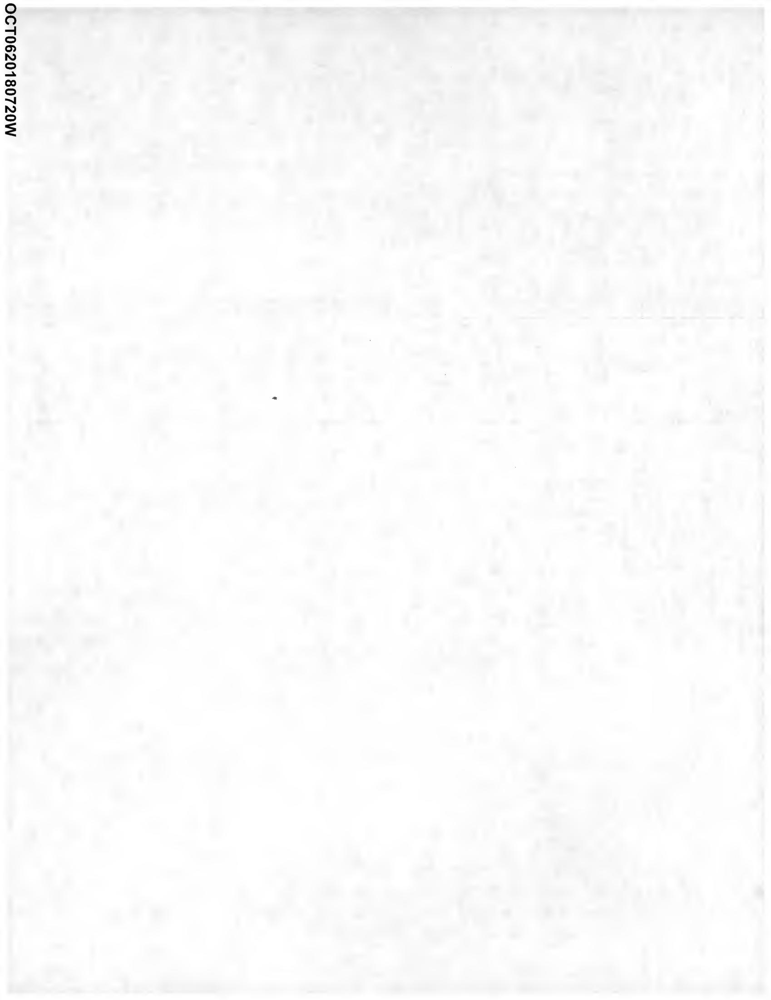
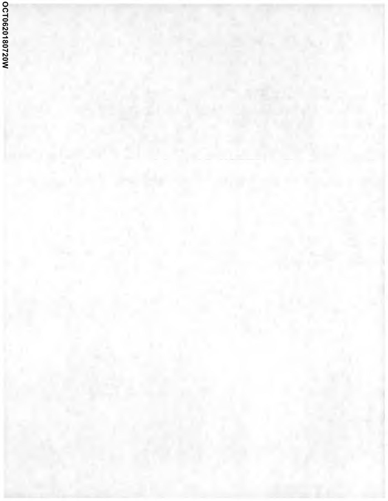

| ACCOUNT ID | 0043169106 |
| :--: | :--: |
| BILL MONTH | October 2018 |
| BILL DATE | 10/01/2018 |
| INVOICE NUMBER | 314612118101 |
| CURRENT CHARGES | \$7,783.03 DUE BY 10/16/2018 |
| TOTAL AMOUNT DUE | \$7,783.03 |

900 S CLARK ASSOCIATES LP
PO BOX 4697
LOGAN, UT 84323
-To ensure prompt credit to your account, please detach and include this top portion of your statement with your payment - SLM

| Payment Mailing Address   Dynegy Energy Services   27679 Network Place   Chicago, IL 60673 | To overnight a check:   JP Morgan Atin Lockbox 27679   Dynegy Energy Services   131 S Dearborn - 6th Floor   Chicago, IL 60603 | For ACH:   Bank ABA Number: 071000013   Bank Acct. Number: 581948291   Preferred Method:   ACH-CTX |
| :--: | :--: | :--: |

BILLING SUMMARY FOR ACCOUNT 0043169106

| Date | Description | Charge |
| :--: | :--: | :--: |
| 08/30/2018 | Prior Balance | \$9,037.61 |
| 09/12/2018 | Payment Received | - $\$ 9,037.61$ |
| 10/01/2018 | Block 1 Energy Charge | $\$ 4,326.76$ |
| 10/01/2018 | Distribution Losses Charge | $\$ 303.40$ |
| 10/01/2018 | Transmission Charge | $\$ 772.21$ |
| 10/01/2018 | Renewable Portfolio Standard (RPS) Charge | $\$ 156.04$ |
| 10/01/2018 | Ancillary Services Charge | $\$ 105.40$ |
| 10/01/2018 | Capacity Charge | $\$ 2,119.22$ |
| 10/01/2018 | Total Current Charges | $\$ 7,783.03$ |
| 10/01/2018 | Total Amount Due | $\$ 7,783.03$ |

For power outages and other electrical emergencies, please call your electric distribution company (ComEd) at (800) 334-7661.
Balances not received by the due date are subject to a $1.5 \%$ late fee.
For questions related to your account, please email Business Care Team at DESBusinessCare@Dynegy.com or call (844) 441-0716.
Thank you for the opportunity to supply your energy needs. We appreciate your business.

The image is a photo or illustration that appears to be mostly blank with a vertical text on the left side that reads "OCT62018720W". There are no other visible elements or details in the image.

# DYNEGY 

## ACCOUNT NUMBER

0043169106

## SERVICE LOCATION

BLDG / 900 S CLARK ST / CHICAGO, IL 60605

SERVICE PERIOD: 08/28/2018 TO 09/26/2018

| METER DETAIL |  |  |  |  |  |  |  |  |  |
| :--: | :--: | :--: | :--: | :--: | :--: | :--: | :--: | :--: | :--: |
| Meter Number | Service   Period | Days | Reading   Prior | $\begin{aligned} & \text { Con } \end{aligned}$ | Total   kWh | On-Pk   kWh | Off-Pk   kWh | Peak KW | Coincident   Peak KW |
| 230048080 | 8/28 - 9/26 |  | NA | NA | 22 | 22 | 0 | 19.0 at 09/10 07:00 | 0.00 |
| 230133826 | 8/28 - 9/26 |  | NA | NA | 22,807 | 10,881 | 11,926 | 36.0 at 09/06 19:00 | 32.58 |
| 230133827 | 8/28 - 9/26 |  | NA | NA | 101,300 | 51.129 | 50,171 | 290.0 at 09/17 14:00 | 290.28 |
| 230133828 | 8/28 - 9/26 |  | NA | NA | 12,751 | 6.310 | 6,441 | 21.0 at 09/04 19:00 | 20.68 |
| Total |  | 30 |  |  | 136,880 | 68,342 | 68,538 |  |  |
| Coincident Peak KW |  |  |  |  |  |  |  | 344.0 at 09/20 18:00 |  |
| CHARGE DETAIL |  |  |  |  |  |  |  |  |  |
| Description |  |  |  |  | Quantity | Units | Rate | Charge | Totals |
| ENERGY SUPPLY CHARGES |  |  |  |  |  |  |  |  |  |
| Block 1 Energy Charge (1) |  |  |  |  | 136,880 | KWH | \$0.0316100 | \$4,326.76 |  |
| Distribution Losses Charge |  |  |  |  | 9,185 | KWH | \$0.0330300 | \$303.40 |  |
| Transmission Charge ((\$34.5156 / 365) * 272.2007 * 30 Days) |  |  |  |  |  |  |  | \$772.21 |  |
| Renewable Portfolio Standard (RPS) Charge |  |  |  |  | 136,880 | KWH | \$0.0011400 | \$156.04 |  |
| Ancillary Service Charge |  |  |  |  | 136,880 | KWH | \$0.0007700 | \$105.40 |  |
| Capacity Charge (Capacity Obligation * 30 Days * Price) |  |  |  |  | 333.1637 | CAP OBL | \$0.2120300 | \$2,119.22 |  |
| TOTAL ENERGY SUPPLY CHARGES |  |  |  |  |  |  |  |  | \$7,783.03 |

TOTAL CURRENT CHARGES
\$7,783.03

The image is a photo or illustration of a blank or nearly blank page with a faint texture. The only visible text is vertically aligned on the left side: "OCT62018720W". There are no other discernible elements or features.

