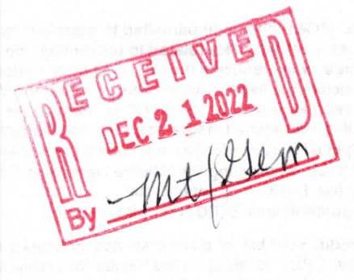
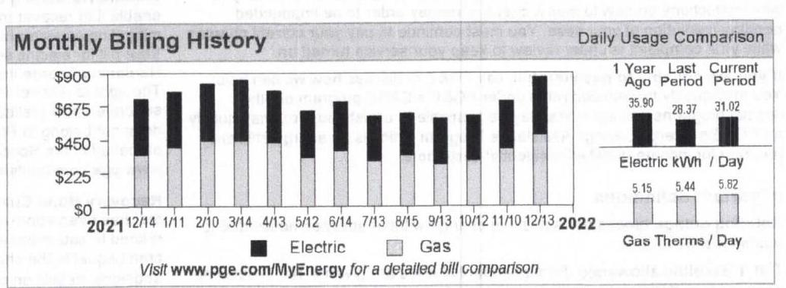
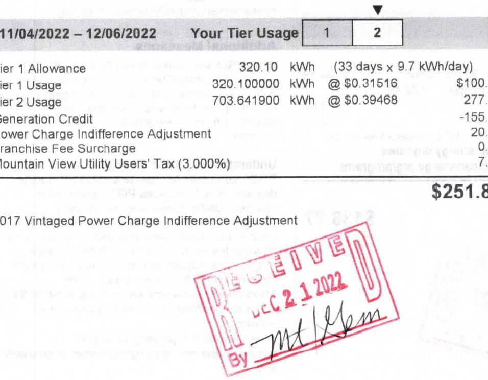
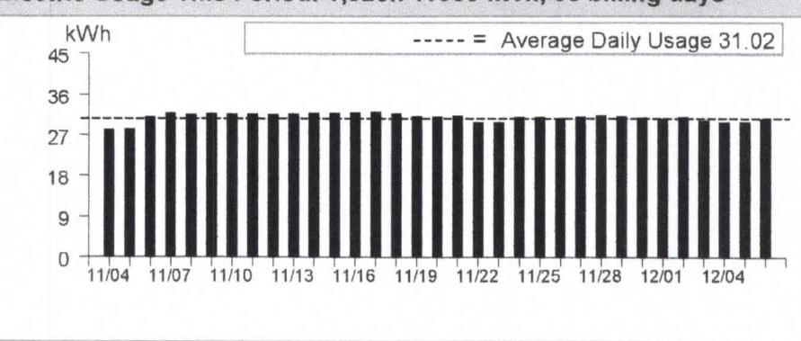
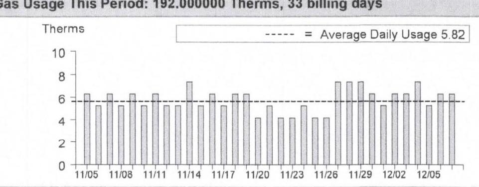
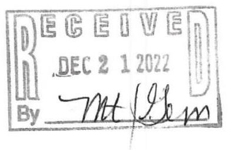

## Service For:

GEMELLO\&VIDOVICH PRTNR 2045 W EL CAMINO REAL MOUNTAIN VIEW, CA 94040

## Questions about your bill?

Mon-Fri 7 a.m.-7 p.m.
Saturday 8 a.m.-5 p.m.
Phone: 1-800-743-5000
www.pge.com/MyEnergy

## Ways To Pay

www.pge.com/waystopay

The image is a photo of a stamp. The stamp contains the following text:

- "RECEIVED"
- "DEC 2 1 2022"
- "By" followed by a handwritten signature.

## Your Account Summary

Amount Due on Previous Statement \$697.66
Payment(s) Received Since Last Statement -697.66
Previous Unpaid Balance \$0.00
Current PG\&E Electric Delivery Charges \$251.85
Silicon Valley Clean Energy Electric Generation Charges 136.77
Current Gas Charges 476.54

Total Amount Due by 01/03/2023
\$865.16

The image is a graph/chart.

- **Chart Type**: Bar chart
- **Title**: Monthly Billing History
- **Y-Axis**: No explicit title, but values range from $0 to $900
- **X-Axis**: Dates from 12/14 to 12/13, spanning 2021 to 2022
- **Legend**: 
  - Black bars represent "Electric"
  - Gray bars represent "Gas"
- **Data Points**:
  - 12/14: Electric and Gas combined around $675
  - 1/11: Electric and Gas combined around $900
  - 2/10: Electric and Gas combined around $900
  - 3/14: Electric and Gas combined around $900
  - 4/13: Electric and Gas combined around $675
  - 5/12: Electric and Gas combined around $450
  - 6/14: Electric and Gas combined around $675
  - 7/13: Electric and Gas combined around $450
  - 8/15: Electric and Gas combined around $450
  - 9/13: Electric and Gas combined around $450
  - 10/12: Electric and Gas combined around $450
  - 11/10: Electric and Gas combined around $675
  - 12/13: Electric and Gas combined around $900

- **Daily Usage Comparison**:
  - **1 Year Ago**: 35.90 Electric kWh / Day, 5.15 Gas Therms / Day
  - **Last Period**: 28.37 Electric kWh / Day, 5.44 Gas Therms / Day
  - **Current Period**: 31.02 Electric kWh / Day, 5.82 Gas Therms / Day

- **Styling**: The bars are color-coded with black for electric and gray for gas. The chart includes a note: "Visit www.pge.com/MyEnergy for a detailed bill comparison."

- **Yearly usage breakdown (monthly-based)**: The chart provides a monthly breakdown of electric and gas usage over the course of a year.

Important Messages
Your current electricity rate Your electricity usage is currently billed on a rate for a single-family home or common-use area of a multi-family complex. If this is incorrect, please call us at 1-800-743-5000 for a free rate analysis.

Please return this portion with your payment. No staples or paper clips. Do not fold. Thank you.

99907297096280800000865360000086536

The image is a logo illustration. It features the PG&E logo, which consists of the letters "PG&E" with a stylized design element. The logo is likely in black and white.

Account Number: Due Date: 7297096280-8 01/03/2023
Total Amount Due: \$865.16

Amount Enclosed: $\$$
\$

00238003004901 AV 0.4517778654
ЩЩЩщЩщЩщЩщЩщЩщЩщЩщЩщЩщЩщЩщЩщЩщЩщЩщЩщЩщЩщЩщЩщЩщЩщЩщЩщЩщЩщЩщЩщЩщЩщЩщЩщЩщЩщЩщЩщЩщЩщЩщЩщЩщЩщЩщЩщЩщЩщЩщЩщЩщЩщЩщЩщЩщЩщЩщЩщЩщЩщЩщЩщЩщЩщЩщЩщЩщЩщЩщЩщЩщЩщЩщЩщЩщЩщЩщЩщЩщЩщЩщЩщЩщЩщЩщЩщЩщЩщЩщЩщЩщЩщЩщЩщЩщЩщЩщЩщЩщЩщЩщ

## Details of PG\&E Electric Delivery Charges

11/04/2022 - 12/06/2022 (33 billing days)
Service For: 2045 W EL CAMINO REAL
Service Agreement ID: 7292163752 APARTMENT HOUSE METER
Rate Schedule: E1 X Residential Service

The image is a photo of a billing statement section detailing electric usage and charges. 

- **Date Range**: 11/04/2022 – 12/06/2022
- **Tier Usage**: 
  - **Tier 1 Allowance**: 320.10 kWh (33 days x 9.7 kWh/day)
  - **Tier 1 Usage**: 320.100000 kWh @ $0.31516 = $100.93
  - **Tier 2 Usage**: 703.641900 kWh @ $0.39468 = $277.57
- **Credits and Adjustments**:
  - **Generation Credit**: -$155.89
  - **Power Charge Indifference Adjustment**: $20.00
  - **Franchise Fee Surcharge**: $0.00
  - **Mountain View Utility Users' Tax (3.000%)**: $7.29
- **Total Charge**: $251.89
- **Additional Text**: "2017 Vintaged Power Charge Indifference Adjustment"
- **Stamp**: "RECEIVED DEC 2 1 2022" with a signature.

## Service Information

| Meter \# | 1006747607 |
| :--: | :--: |
| Total Usage | 1,023.741900 kWh |
| Baseline Territory | X |
| Heat Source | B - Not Electric |
| Serial | M |
| Rotating Outage Block | 30 |

## Additional Messages

From March 1, 2022 to February 28, 2023, the Wildfire Fund Charge is offset by $\$ 0.00109 / \mathrm{kWh}$ to reflect excess funds from the Department of Water Resources (DWR) Bond charge. The Wildfire Fund Charge is also offset by an additional $\$ 0.00084 / \mathrm{kWh}$ during this same period for excess funds from the DWR Power charge. These charges were included in your electric charges prior to 2021 and were related to bonds issued and energy provided to customers by DWR during the 2000-2001 California energy crisis.

Electric Usage This Period: 1,023.741900 kWh, 33 billing days

The image is a bar chart representing electric usage over a period. 

- **Chart Type**: Bar chart
- **X-Axis**: Dates from 11/04 to 12/04
- **Y-Axis**: kWh, ranging from 0 to 45
- **Legend**: Dashed line labeled as "Average Daily Usage 31.02"
- **Data Points**: Bars are consistently around the 31 kWh mark, indicating daily usage.
- **Styling**: The average daily usage is highlighted with a dashed line across the chart. 

This chart provides a **yearly usage breakdown (monthly-based)**, showing consistent daily electricity consumption.

## Details of Silicon Valley Clean Energy Electric Generation Charges

## 11/04/2022 - 12/06/2022 (33 billing days)

Service For: 2045 W EL CAMINO REAL
Service Agreement ID: 7297158605 ESP Customer Number: 7297096005

## 11/04/2022 - 12/06/2022

## Rate Schedule: E-1

Generation - Total
Local Utility Users Tax
Energy Commission Surcharge
Customers receive clean electricity and save money with SVCE. Please see SVCE electric rates and comparisons to PG\&E at www. svcleanenergy.org/rates.
For current customer offers and services, visit www.svcleanenergy.org/programs.

Account No: 7297096280-8
Statement Date: 12/13/2022
Due Date: 01/03/2023

## Service Information

Total Usage
For questions regarding charges on this page, please contact
SILICON VALLEY CLEAN ENERGY
1-844-474-7823
customerservice@SVCleanEnergy.org

## Additional Messages

About Silicon Valley Clean Energy (SVCE) Serving 13 Santa Clara County communities, SVCE is a locally-controlled, public agency providing residents and businesses with electricity from renewable and carbon-free sources.

Understanding SVCE Charges
PG\&E continues to provide and bill for electric delivery. SVCE replaces PG\&E generation charges. Under PG\&E Electric Delivery Charges, note the Generation Credit. This is what PG\&E would have charged for power, and now credits back to you. The Power Charge Indifference Adjustment and Franchise Fee are factored into SVCE rates. Learn more: https://www.svcleanenergy.org/your-bill/SV CE is committed to protecting customer privacy.
Learn about our privacy policy at www.svcleanenergy.org/customer-confidenti ality

## Details of Gas Charges

11/05/2022 - 12/07/2022 (33 billing days)
Service For: 2045 W EL CAMINO REAL
Service Agreement ID: 7297096010 APARTMENT
Rate Schedule: GM X Master-Metered Multi-Family Service
Number of Dwelling Units: 16
11/05/2022 - 11/30/2022

| Tier 1 Allowance | 278.72000 |  |
| :-- | --: | :-- |
| Tier 1 Usage | 151.272727 |  |
| Gas PPP Surcharge (\$0.10346 /Therm) |  |  |
| Mountain View Utility Users' Tax (3.000\%) |  |  |
|  |  | 10.44 |

12/01/2022 - 12/07/2022

| Tier 1 Allowance | 86.24000 |  |
| :-- | --: | :-- |
| Tier 1 Usage | 40.727273 |  |
| Gas PPP Surcharge (\$0.10346 /Therm) |  |  |
| Mountain View Utility Users' Tax (3.000\%) |  |  |

\$476.54

## G as Usage This Period: 192.000000 Therms, 33 billing days

The image is a bar chart.

- **Chart Type**: Bar chart
- **X-Axis**: Dates ranging from 11/05 to 12/07
- **Y-Axis**: Therms, ranging from 0 to 10
- **Legend**: Dashed line represents "Average Daily Usage 5.82"
- **Data Points**: Bars represent daily gas usage in Therms, with most bars around 5 to 7 Therms.
- **Styling**: A dashed line across the chart indicates the average daily usage of 5.82 Therms.
- **Yearly Usage Breakdown (Monthly-Based)**: The chart shows daily gas usage over a period from November 5 to December 7.

| 43973963 |
| :-- |
| 7.204 |
| 7.022 |
| 182 |
| 1.054378 |
| 192.000000 Therm |
| $X$ |
| $M$ |

Gas Procurement Costs (\$/Therm)
11/05/2022 - 11/30/2022 \$0.93988
12/01/2022 - 12/07/2022 \$0.98040

# 1   ENERGY STATEMENT 

## Important Messages (continued from page 1)

CARE Program You may qualify for a monthly discount with the California Alternate Rates for Energy (CARE) Program. To find out more and apply online, visit www.pge.com/care.

Usted podria reunir los requisitos de un descuento mensual con el California Alternate Rates for Energy Program (CARE). Para obtener más información y hacer su solicitud en internet, visite www.pge.com/espanol/care.

Energy Savings Assistance Program: provides free home improvements to help keep your home more energy efficient, safe and comfortable. Apply by answering a few simple questions at www.pge.com/energysavings or call 1-800-989-9744.

Programa Energy Savings Assistance: proporciona mejoras al hogar sin costo para ayudar a que este sea más eficiente en el consumo de energia, más seguro y más cómodo. Solicite respondiendo a unas pocas preguntas simples en www.pge.com/ahorreenergla o llamando al 1-800-989-9744.

Electric power line safety PG\&E cares about your safety. Be aware of your surroundings and keep yourself, tools, equipment and antennas at least 10 feet away from overhead power lines. If you see an electric power line fall to the ground, keep yourself and others away. Call 9-1-1.

Neighborhood payment centers Did you know it's FREE to pay your PG\&E bill at any of our 600 authorized neighborhood payment centers? Payments made by 5 p.m. will post to your PG\&E account the same day. Locations and times of operation may be more convenient for your schedule. Call 1-888-743-0011 to find a location near you.

Holiday wishes from PG\&E. From all of us at Pacific Gas and Electric Company, we wish you and your family a peaceful, safe and happy holiday season.

| Your Electric Charges Breakdown (from page 2) |  |
| :--: | :--: |
| Conservation Incentive | \$19.41 |
| Transmission | 50.84 |
| Distribution | 128.65 |
| Electric Public Purpose Programs | 22.49 |
| Nuclear Decommissioning | $-0.13$ |
| Wildfire Fund Charge | 4.70 |
| Recovery Bond Charge | 11.38 |
| Recovery Bond Credit | $-11.38$ |
| Wildfire Hardening Charge | 1.44 |
| Competition Transition Charges (CTC) | 0.24 |
| Energy Cost Recovery Amount | $-4.39$ |
| PCIA | 20.32 |
| Taxes and Other | 8.28 |
| Total Electric Charges | \$261.85 |

The image is a stamp with the following text:

- "RECEIVED"
- "DEC 2 1 2022"
- "By" followed by a handwritten signature.

