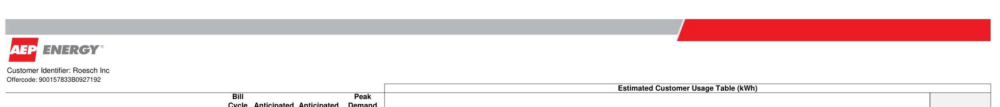

# Attachment A-1 

Customer Identifier
Utility/EDC
No. of Service Location(s)

## Roesch Inc

## Ameren Rate Zone III (IP) - IL

2

## Offer Information

Offer Generation Date
Offer Expiration Time
Billing Method
Days to Pay
Product Name
Earliest Anticipated Start Date**
Term
*Reference pg. 2 for Service Location-specific Anticipated Start Date(s)

## Roesch Inc

## Ameren Rate Zone III (IP) - IL

2

## Single Bill - Supplier Consolidated Billing

14
Fixed Price All Inclusive
$1 / 8 / 2010$
12 Months
Pricing Details

## Energy Price

## Pricing Notes

| Energy Price Includes |  |  |
| :--: | :--: | :--: |
| Energy | Included in Energy Price. |  |
| $\checkmark$ Energy | Included in Energy Price. |  |
| $\checkmark$ | Included in Energy Price. |  |
| $\checkmark$ Transmission | Included in Energy Price. |  |
| $\checkmark$ Energy Losses | Included in Energy Price. |  |
| $\checkmark$ Ancillaries | Included in Energy Price. |  |
| $\checkmark$ RPS | Included in Energy Price. |  |

Offlercode: 900157833B0927192

## Additional Terms

Applicable only to the Service Location(s) served under the Attachment A-1.
The General Terms and Conditions and Exhibit A most recently executed between the parties on or prior to the date hereof are hereby incorporated herein by reference and become a part of, and govern, the Attachment A-1. The pricing on the Attachment A-1 does not include any EDC or otherwise non-bypassable charge or any applicable (and not expressly included) tax.

Roesch Inc

## Customer Signature

## Name (Print)

## Title

Date

## AEP Energy, Inc.

Signature

## Scott D. Silsher

Name

## Chief Solutions Officer

Title

Date

The image is a photo of a document header. It features the logo "AEP ENERGY" prominently on the left side. Below the logo, the text reads "Customer Identifier: Roesch Inc" and "Offercode: 900157833B0927192." There is a horizontal gray bar at the top, with a red accent on the right side. Below this, there is a table header labeled "Estimated Customer Usage Table (kWh)."

Customer Identifier: Rotech Inc
Othercode: 90015783380027192

| No. | Account Number | Service Location Address | Bit   Cycle   No. | Anticipated Start Date | Anticipated End Date | Peak Demand (kW) | Jan | Feb | Mar | Apr | May | Jun | Jul | Aug | Sep | Oct | Nov | Dec | Total |
| :--: | :--: | :--: | :--: | :--: | :--: | :--: | :--: | :--: | :--: | :--: | :--: | :--: | :--: | :--: | :--: | :--: | :--: | :--: | :--: |
|  |  |  |  |  |  |  |  |  |  |  |  |  |  |  |  |  |  |  |  |
| 1 | 6154647053 | 502 Chestnut | 18 | 1/23/2018 | 1/23/2019 | 6.76 | 2,925 | 2,831 | 2,808 | 2,445 | 2,602 | 2,541 | 2,620 | 2,501 | 2,468 | 2,550 | 2,477 | 2,906 | 31,673 |
| 2 | 7049511850 | 100 N. 24th Street | 8 | 1/8/2018 | 1/8/2019 | 419.88 | 266,142 | 215,204 | 258,962 | 239,556 | 240,969 | 241,489 | 256,720 | 266,726 | 245,482 | 230,054 | 258,785 | 282,354 | 3,002,443 |
| Total |  |  |  |  |  | 426.64 | 269,067 | 218,035 | 261,770 | 242,001 | 243,571 | 244,030 | 259,339 | 269,228 | 247,949 | 232,604 | 261,262 | 285,259 | 3,034,115 |

