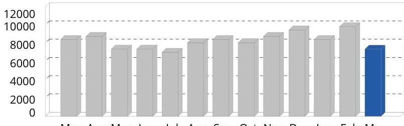

## 24 CHAMPION ENERGY SERVICES*

A Calpine Company
1500 Rankin Rd., Suite 200 | Houston, TX 77073

## Account Information

Account Name: EASYPAK, LLC
Account Number: 99615
Service Address: 40 JYTEK DR
LEOMINSTER MA 014535982
Premise ID: $\quad 2617064018$
Thanks for your business!

## Bill Summary

Bill Number: $\quad 230660019358065$
Billing Period: $\quad 02 / 06 / 2023$ - 03/06/2023
Usage This Period: $\quad 7,350 \mathrm{kWh}$
Previous Balance: $\quad \$ 508.57$
Previous Payment: $\quad-\$ 508.57$
Adjustments: $\quad \$ 0.00$
Current Charges: $\quad \$ 1,003.89$
Amount Due: $\quad \$ 1,003.89$
Due Date: $\quad 04 / 07 / 2023$

# Energy Usage Report 

| Meter Number | Previous Meter Read | Previous Read Date | Current Meter   Read | Current Read Date | Read Type | Multiplier | Total Usage | Demand | Power Factor |
| :--: | :--: | :--: | :--: | :--: | :--: | :--: | :--: | :--: | :--: |
| 2617064018 |  | 02/06/2023 |  | 03/06/2023 | Actual |  | 7,350 | 25.2 | 0 |

kWh

The image is a bar chart.

- **Chart Type**: Bar chart
- **Y-Axis**: Numerical values ranging from 0 to 12000
- **X-Axis**: Months labeled as Mar, Apr, May, Jun, Jul, Aug, Sep, Oct, Nov, Dec, Jan, Feb, Mar
- **Data Representation**: 
  - Bars for each month, with the last bar (representing March) highlighted in blue.
  - All other bars are in gray.
- **Yearly Usage Breakdown (Monthly-Based)**: The chart shows monthly usage, with the March bar distinctively colored to emphasize current usage.

Mar Apr May Jun Jul Aug Sep Oct Nov Dec Jan Feb Mar
Previous Months
This Month

## Champion Energy

1500 Rankin Road, Suite 200
Houston TX 77073

## Payment Instructions

To pay by check, make payable to: Champion Energy. To pay by phone call 1-877-635-5090.

EASYPAK, LLC
EASYPAK, LLC
24 JYTEK DRIVE
LEOMINSTER MA 01453

## Bill Summary

230660019358065
02/06/2023 - 03/06/2023
02/06/2023 - 03/06/2023
7,350 kWh
$\$ 508.57$
$\$ 508.57$
$\$ 1,003.89$
Amount Due: $\quad \$ 1,003.89$
Due Date: $\quad \square$

## Champion Energy

P.O. Box 787626

Philadelphia PA 19178-7626

# CHAMPION   ENERGY SERVICES* 

A Calpine Company
1500 Rankin Rd., Suite 200 | Houston, TX 77073

## Questions or Concerns?

Champion Energy (Toll-free 24hr)

## 844-694-2339

support@champion.energy

## For Outages and Emergencies

Massachusetts Electric (MECO) (Toll-free 24hr)

800-233-5325

## BIII Details

QTY RATE
AMOUNT
Electricity Charges for 02/06/2023 - 03/06/2023

## Champion Energy Charges

Generation
Adder Charge
Capacity (31.32 Obl $\times 23$ days)
Capacity (31.32 Obl $\times 5$ days)
Government Charges
State Sales Tax - 0\% Exempt
Total Electricity Charges this period
The average price you paid for electricity service this period:
TOTAL ACCOUNT NET NEW CHARGES
$\$ 373.24$
$\$ 426.30$
$\$ 121.42$
$\$ 23.84$

## Government Charges

State Sales Tax - 0\% Exempt
Total Electricity Charges this period
The average price you paid for electricity service this period:
13.7£ per kWh

TOTAL ACCOUNT NET NEW CHARGES
$\$ 1,003.89$

