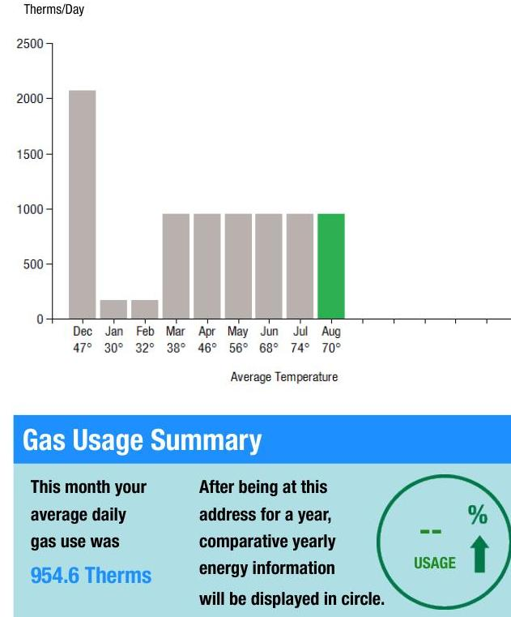
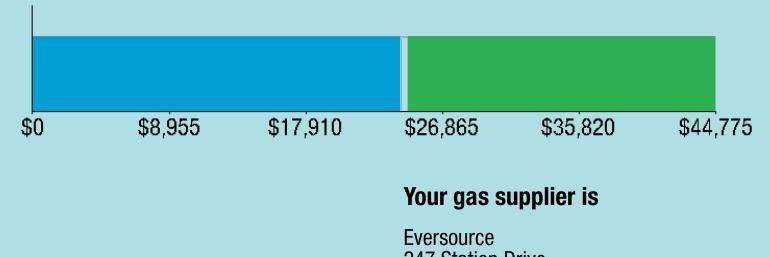

## EVERSEURCE

Account Number: 73002442157
Statement Date: 08/30/24
Service Provided To:
OCS GREEN LEAVES LLC

## Gas Usage History - Thermos

The image is a bar chart.

- **Chart Type**: Bar chart
- **X-Axis**: Average Temperature
  - Dec 47°
  - Jan 30°
  - Feb 32°
  - Mar 38°
  - Apr 46°
  - May 56°
  - Jun 68°
  - Jul 74°
  - Aug 70°
- **Y-Axis**: Therms/Day
- **Data Points**:
  - Dec: ~2200 Therms/Day
  - Jan: ~200 Therms/Day
  - Feb: ~200 Therms/Day
  - Mar: ~500 Therms/Day
  - Apr: ~500 Therms/Day
  - May: ~500 Therms/Day
  - Jun: ~500 Therms/Day
  - Jul: ~500 Therms/Day
  - Aug: ~1000 Therms/Day
- **Notable Styling**: The bar for August is highlighted in green, while the other bars are gray.
- **Yearly Usage Breakdown (Monthly-Based)**: The chart displays monthly gas usage in Therms per day across different months with corresponding average temperatures.

## Gas Usage Summary

| This month your   average daily   gas use was   954.6 Therms | After being at this   address for a year,   comparative yearly   energy information   will be displayed in circle. |  | Total Amount Due   by 09/24/24 | $\$ 143,708.47$ |
| :--: | :--: | :--: | :--: | :--: |
| Amount Due On 08/23/24 |  |  |  |  |
| Last Payment Received |  |  |  | $\$ 145,872.65$ |
| Balance Forward |  |  |  |  |
| Total Current Charges |  |  |  |  |
|  |  |  |  |  |

Current Charges for Gas

| Supply | Delivery |
| :--: | :--: |
| \$24,167.20 | \$20,601.78 |
| Cost of gas from Eversource | Cost to deliver gas from Eversource |

The image is a bar chart.

- **Chart Type**: Bar chart
- **X-Axis**: Dollar amounts
  - $0
  - $8,955
  - $17,910
  - $26,865
  - $35,820
  - $44,775
- **Notable Styling**: The bar is divided into two sections, with the left section in blue and the right section in green.
- **Embedded Text**: 
  - "Your gas supplier is"
  - "Eversource"
  - "247 Station Drive"

## News For You

SMELL LEAVE. TELL. If you smell an odor similar to rotten eggs in your home or business, it may be a natural gas leak. LEAVE IMMEDIATELY. Once you are in a safe location, dial 911 and then call Eversource to report the emergency at 800-592-2000. Remain outside until Eversource can check the odor.

Remit Payment To: Eversource, PO Box 56007, Boston, MA 02205-6007

GB20240830.M

## EVERSEURCE

Account Number: 73002442157
You may be subject to a $1.14 \%$ late payment charge if the "Total Amount Due" is not received by 09/24/24

Please make your check payable to Eversource or to make your payment today visit Eversource.com. If mailing your payment, please allow up to 5 business days to post to your account.

Total Amount Due by 09/24/24
\$143,708.47
Amount Enclosed

OCS GREEN LEAVES LLC
12 LATTI FARM RD
MILLBURY MA 01527-2131

Eversource
PO Box 56007
Boston, MA 02205-6007

## EVERSEURCE

Account Number: 73002442157
Customer name key: 0CS
Statement Date: 08/30/24
Service Provided To:
0CS GREEN LEAVES LLC

## Svc Addr: 12 LAIIT FAIIM HID MILLBURY MA 01527

Rate 53-C\&I Ext High Ann/Low Winter Cycle 16 Service from 05/23/24 - 06/25/24 34 Days
Next read date on or about: Sep 23, 2024

| Meter   Number | Current   Read | Previous   Read | Current   Usage | Reading   Type |
| :--: | :--: | :--: | :--: | :--: |
| 0007789 | 55806 | 52651 | 3155 | Estimate |

Service Reference: 91195564
3155 x Meter Constant of $10=31550$ Billed Usage for 34 Days
31550 x Therm factor of $1.0284=32446$ Therms Billed Usage for 34 Days

## Svc Addr: 12 LAIIT FAIIM HU MILLBURY MA 01527

Rate 53-C\&I Ext High Ann/Low Winter Cycle 16 Service from 06/25/24 - 07/24/24 29 Days
Next read date on or about: Sep 23, 2024

| Meter   Number | Current   Read | Previous   Read | Current   Usage | Reading   Type |
| :--: | :--: | :--: | :--: | :--: |
| 0007789 | 59498 | 55806 | 2692 | Estimate |

Service Reference: 91195564
2692 x Meter Constant of $10=26920$ Billed Usage for 29 Days
26920 x Therm factor of $1.0282=27679$ Therms Billed Usage for 29 Days

## Svc Addr: 12 LAIIT FAIIM HU MILLBURY MA 01527

Rate 53-C\&I Ext High Ann/Low Winter Cycle 16 Service from 07/25/24 - 08/22/24 29 Days
Next read date on or about: Sep 23, 2024

| Meter   Number | Current   Read | Previous   Read | Current   Usage | Reading   Type |
| :--: | :--: | :--: | :--: | :--: |
| 0007789 | 61191 | 58498 | 2693 | Estimate |

## Total Amount Due by 09/24/24

Gas Account Summary
Amount Due On 08/23/24
Last Payment Received
\$145,872.65
\$0.00
Balance Forward
\$145,872.65
Current Charges/Credits
Gas Supply Services
Delivery Services
Other Charges or Credits
Total Current Charges
Total Amount Due

## Total Charges for Gas

Supplier (Eversource)
Meter D007789

Service from 05/23/24-06/25/24
Supplier Services
Service from 06/26/24-07/24/24
Supplier Services
Service from 07/25/24-08/22/24
Supplier Services
Supplier Services
Subtotal Supplier Services

## Delivery

53-C\&I Ext High Ann/Low Winter
Meter D007789

Service from 05/23/24-06/25/24
Customer Charge
Distribution Charge
32446 Therms X . 00700
\$305.00
\$227.12

GB20240830.bd

Eversource is required to comply with Department of Public Utilities' billing and termination regulations. If you have a dispute please see the bill insert for more information.
For an electronic version of this insert, residential customers go to Eversource.com/about-residential-bill and business customers go to Eversource.com/about-business-bill. Then select "Monthly Bill Inserts" from the page. Budget Billing is also available to pay a more consistent bill each month. Please see the Customer Rights Supplement for more information.

## EVERSEURCE

Account Number: 73002442157
Customer name key: 0CS
Statement Date: 08/30/24
Service Provided To:
OCS GREEN LEAVES LLC

## Continued from previous page...

Service Reference: 91195564
2693 x Meter Constant of $10=26930$ Billed Usage for 29 Days
26930 x Therm factor of $1.0280=27684$ Therms Billed Usage for 29 Days

| Monthly Therm Use |  |  |  |  |  |
| :--: | :--: | :--: | :--: | :--: | :--: |
| Dec | Jan | Feb | Mar | Apr | May |
| 4139 | 4761 | 4716 | 31536 | 27715 | 27680 |
| Jul | Aug |  |  |  |  |
| 27679 | 27684 |  |  |  |  |

## Contact Information

Emergency: 800-592-2000
www.eversource.com
Pay by Phone: 888-783-6618
Customer Service: 800-340-9822

## Important Messages About Your Account

Please remit the balance forward amount of $\$ 112,899.62$. This amount is due immediately in order to avoid a possible service disconnection. Please disregard if you have made a payment or confirmed a payment arrangement.

Billing for this service includes a correction of a previously issued statement.

Reading(s) estimated because we were unable to read your meter(s).

Because the billing period spans a change in the rates, your usage has been calculated partly on the old rate and partly on the new rate.

Thank you for going paperless.

## Total Amount Due by 09/24/24

\$148,708.47

Continued from previous page...

Revenue Decoupling Charge
Distribution Adjustment Charge

Service from 06/26/24-07/24/24
Customer Charge
Distribution Charge
Revenue Decoupling Charge
Distribution Adjustment Charge

Service from 07/25/24-08/22/24
Customer Charge
Distribution Charge
Revenue Decoupling Charge
Distribution Adjustment Charge

Subtotal Delivery Services
Total Cost of Gas
$\$ 148,708.47$

## 32446 Therms X . 00820

32446 Therms X . 20900
$\$ 266.06$
$\$ 6,781.21$

## \$305.00

\$193.75
\$226.97
\$5,784.91

## \$305.00

\$193.79
\$227.01
\$5,785.96
\$20,601.78

## \$44,768.98

## Other Charges or Credits

Sales Tax
\$2,740.88
Payment Posting Correction
\$16,701.01
Prior Bill Adjustments
$\$ 32,973.03$
Subtotal Other Charges or Credits
$\$ 46,933.16$

Total Current Charges
$\$ 2,164.18$

