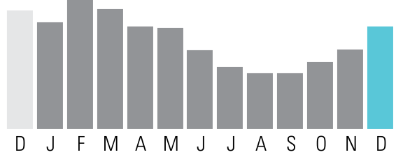

<!-- page_num: 1 -->
# Xcel Energy - Statement Summary

## Daily Averages

|                  | Last Year | This Year |
|------------------|-----------|-----------|
| Temperature      | 40° F     | 47° F     |
| Electricity kWh  | 687.3     | 720.0     |
| Electricity Cost | $62.87    | $70.03    |

## Summary of Current Charges

| Service                | Date Range         | Usage    | Amount    |
|------------------------|--------------------|----------|-----------|
| Electricity Service    | 11/11/21 - 12/14/21 | 23760 kWh | $2,311.10 |
| Natural Gas Service    | 11/12/21 - 12/15/21 | 1755 therms| $1,537.48 |
| **Current Charges**    |                    |          | **$3,848.58** |

## Account Balance (Balance de su cuenta)

| Description                  | Amount      |
|------------------------------|-------------|
| Previous Balance As of 11/11 | $3,309.76   |
| Payment Received Check 11/29 | -$3,309.76 CR |
| Balance Forward              | $0.00       |
| Current Charges              | $3,848.58   |
| **Amount Due (Cantidad a pagar)** | **$3,848.58** |

## Daily Averages

|                  | Last Year | This Year |
|------------------|-----------|-----------|
| Temperature      | 39° F     | 47° F     |
| Gas Therms       | 59.9      | 53.2      |
| Gas Cost         | $34.52    | $46.59    |

## Information About Your Bill

Save energy and money this winter. As we head into the heating season, there is a nationwide increase in natural gas prices. Discover some easy steps to help your business conserve and stay comfortable while saving on your bill. Learn more at [xcelenergy.com/NaturalGasUpdates](http://xcelenergy.com/NaturalGasUpdates).

Thank you for your payment.

Convenience at your service - Pay your bills electronically-fast and easy with Electronic Funds Transfer. Call us at 1-800-481-4700 or visit us at [www.xcelenergy.com](http://www.xcelenergy.com).

## Questions About Your Bill?

| Contact Method     | Details                   |
|--------------------|---------------------------|
| See our website:   | [xcelenergy.com](http://xcelenergy.com) |
| Email us at:       | Customerservice@xcelenergy.com |
| Please Call:       | 1-800-481-4700            |
| Hearing Impaired:  | 1-800-895-4949            |
| Fax:               | 1-800-311-0050            |
| Or write us at:    | XCEL ENERGY PO BOX 8 EAU CLAIRE WI 54702-0008 |

This image is a bar graph representing natural gas usage data over a year, with each bar corresponding to a month. The x-axis lists the months from January (D) to December (D), and the y-axis measures the data values.   The data points for each month are as follows: - January (D): Medium height - February (J): Slightly taller than January - March (F): Tallest bar - April (M): Slightly shorter than March - May (A): Same height as April - June (M): Same height as May - July (J): Shorter than June - August (A): Slightly shorter than July - September (S): Same height as August - October (O): Taller than September - November (N): Slightly shorter than October - December (D): Taller than November, marked in a different color (blue)  The graph shows variations in data with March having the highest value and the lowest values appearing in August and September. The bar for December is distinctively colored in blue.

---

## Payment Stub

| ACCOUNT NUMBER  | DUE DATE  | AMOUNT DUE | AMOUNT ENCLOSED |
|-----------------|-----------|------------|-----------------|
| 53-0011725717-6 | 01/06/2022| $3,848.58  |                 |

### January Calendar

| S  | M  | T  | W  | T  | F  | S  |
|----|----|----|----|----|----|----|
|    |    |    |    |    |    | 1  |
| 2  | 3  | 4  | 5  | 6  | 7  | 8  |
| 9  | 10 | 11 | 12 | 13 | 14 | 15 |
| 16 | 17 | 18 | 19 | 20 | 21 | 22 |
| 23 | 24 | 25 | 26 | 27 | 28 | 29 |
| 30 | 31 |    |    |    |    |    |

Please help our neighbors in need by donating to Energy Outreach Colorado. Please mark your donation amount on the back of this payment stub and CHECK THE RED BOX under your address below.

Please see the back of this bill for more information regarding the late payment charge. Make your check payable to XCEL ENERGY.

**Manifest Line**

BARCELONA RINO LLC  
20 KETCHUM ST STE 1  
WESTPORT CT 06880-5939

XCEL ENERGY  
P.O. BOX 9477  
MPLS MN 55484-9477
<!-- /page_num: 1 -->
<!-- page_num: 2 -->
## Electricity Service Details

**Service Address:**  
2900 Larimer St Denver, CO 80205-2309  
**Next Read Date:**  
01/19/22

**Premises Number:** 301802428  
**Invoice Number:** 0939554457

### Meter Reading Information

**Meter 81993717 - Multiplier x 120**  
Read Dates: 11/11/21 - 12/14/21 (33 Days)

| DESCRIPTION     | CURRENT READING | PREVIOUS READING | MEASURED USAGE | BILLED USAGE |
|-----------------|-----------------|------------------|----------------|--------------|
| Total Energy    | 8949 Actual     | 8751 Actual      | 198            | 23760 kWh    |
| Demand          | Actual          |                  |                | 50.28 kW     |
| Billable Demand |                 |                  |                | 50 kW        |

### Electricity Charges Rate: SG Secondary General

| DESCRIPTION           | USAGE UNITS | RATE       | CHARGE    |
|-----------------------|-------------|------------|-----------|
| Service & Facility    |             |            | $41.13    |
| Secondary General     | 23760 kWh   | $0.007910  | $187.94   |
| Elec Commodity Adj    | 23760 kWh   | $0.038600  | $917.14   |
| Distribution Demand   | 50 kW       | $6.170000  | $308.50   |
| Gen & Transm Demand   | 50 kW       | $9.090000  | $454.50   |
| Trans Cost Adj        | 50 kW       | $0.330000  | $16.50    |
| Demand Side Mgmt Cost | 50 kW       | $0.540000  | $27.00    |
| Purch Cap Cost Adj    | 50 kW       | $1.270000  | $63.50    |
| CACJA                 | 50 kW       | $0.030000  | - $1.50 CR|
| Trans Elec Plan       | 50 kW       | $0.130000  | $6.50     |
| Renew. Energy Std Adj |             |            | $20.23    |
| Colo Energy Plan Adj  |             |            | $20.23    |
| Energy Assistance Chg |             |            | $0.50     |
| **Subtotal**          |             |            | $2,062.17 |
| Franchise Fee         |             | 3.00%      | $61.86    |
| Sales Tax             |             |            | $187.07   |
| **Total**             |             |            | $2,311.10 |

The image is a photo showing an elderly couple in a cozy setting. The man, with white hair and a beard, is wearing glasses and holding a tablet. The woman, who has short brown hair, is embracing him from behind, resting her chin on his shoulder, and smiling. They appear to be in a room with a bookshelf filled with books in the background, suggesting a home environment. The scene conveys a sense of warmth and companionship as they engage with the tablet together.

### Together We Power Stability

Energy Outreach Colorado is a nonprofit partnering with Xcel Energy to provide energy bill payment assistance and energy-efficiency upgrades for affordable housing and nonprofit facilities. We need your help today!

There are two ways to contribute:

1. Visit the Energy Outreach Colorado website at [www.energyoutreach.org](http://www.energyoutreach.org) to make a one-time donation.

2. **CHECK THE RED BOX** on the front-left side of this payment stub AND select a tax-deductible contribution below.

#### Monthly Donation:

- $20
- $10
- $5
- Other
<!-- /page_num: 2 -->
<!-- page_num: 3 -->
# Xcel Energy Bill

## Account Information

- **Service Address:** 2900 LARIMER ST DENVER, CO 80205-2309
- **Account Number:** 53-0011725717-6
- **Due Date:** 01/06/2022
- **Statement Number:** 760194346
- **Statement Date:** 12/15/2021
- **Amount Due:** $3,848.58

## Natural Gas Service Details

- **Premises Number:** 301802428
- **Invoice Number:** 0464671642
- **Next Read Date:** 01/19/22

### Meter Reading Information

- **Meter:** 10015238
- **Read Dates:** 11/12/21 - 12/15/21 (33 Days)

| Description   | Current Reading | Previous Reading | Usage   |
|---------------|-----------------|------------------|---------|
| Total Energy  | 75023 Actual    | 72998 Actual     | 2025 ccf|

### Natural Gas Adjustments

| Description      | Value Units | Conversion | Value | Units  |
|------------------|-------------|------------|-------|--------|
| Therm Multiplier | 2025 ccf    | x 0.866929 | 1755  | therms |

### Natural Gas Charges

| Description               | Usage Units | Rate      | Charge   |
|---------------------------|-------------|-----------|----------|
| Service & Facility        |             |           | $43.88   |
| Usage Charge              | 1755 therms | $0.163600 | $287.12  |
| Interstate Pipeline       | 1755 therms | $0.057400 | $100.74  |
| DSMCA                     |             |           | $5.09    |
| Natural Gas 4 Qtr         | 1755 therms | $0.473700 | $831.34  |
| RDS                       |             |           | $19.66   |
| Pipe Sys Int Adj          | 1755 therms | $0.047610 | $83.56   |
| Energy Assistance Chg     |             |           | $0.50    |
| **Subtotal**              |             |           | $1,371.89|
| Franchise Fee             |             | 3.00%     | $41.14   |
| Sales Tax                 |             |           | $124.45  |
| **Total**                 |             |           | $1,537.48|

## Information About Your Bill

Xcel Energy is proposing to cancel the Clean Air-Clean Jobs Act (CACJA) Rider for all electric customers on either an energy usage (kWh) or a demand usage (kW) basis. Subject to Commission approval, this rider would no longer appear on bills effective Jan. 1, 2022.

The image is a photo of a person sitting on a desk in an office setting. They are looking at a tablet device, which they hold with both hands. The person is wearing a light denim shirt over a white top and dark pants. There are no visible text or values on the tablet. The office environment includes a modern chair, a wooden desk, and a stack of folders or books. The lighting is bright, suggesting it might be daytime, with large windows in the background.

## Enroll in Auto Pay

**No Late Fees, No Worries.**

Enjoy the benefits of automatic payment withdrawal from your checking account. Your payment will automatically post to your Xcel Energy account on your due date.

- To enroll, fill out the information below, cut off this form, and include it, along with your check and bill stub, in the remittance envelope. Money orders do not qualify.
- Watch for Automated Bank Payment to appear on your billing statement to ensure your enrollment is in effect.
- To enroll your business in Auto Pay online, visit [xcelenergy.com/AutoPay](https://xcelenergy.com/AutoPay). For more information, call our Business Solutions Center at 800-481-4700.

**Authorized Signature**

- Signature above must match name on the bank account
- Xcel Energy Account Number
- Date

I authorize Xcel Energy to initiate transfers from the bank account indicated on the enclosed check to make monthly payments on my Xcel Energy account on my due date. This authority will remain in effect until I notify Xcel Energy, or Xcel Energy notifies me, of the need to cancel the enrollment. I understand that a new authorization is required if I change my bank account. I have kept a record of this authorization.
<!-- /page_num: 3 -->
<!-- page_num: 4 -->
## Information About Your Bill

Xcel Energy is proposing to cancel the Clean Air-Clean Jobs Act (CACJA) Rider for all electric customers on either an energy usage (kWh) or a demand usage (kW) basis. Subject to Commission approval, this rider would no longer appear on bills effective Jan. 1, 2022.

---

## Enroll in Auto Pay

**NO LATE FEES, NO WORRIES.**

Enjoy the benefits of automatic payment withdrawal from your checking account. Your payment will automatically post to your Xcel Energy account on your due date.

- To enroll, fill out the information below, cut off this form, and include it, along with your check and bill stub, in the remittance envelope. Money orders do not qualify.
- Watch for **Automated Bank Payment** to appear on your billing statement to ensure your enrollment is in effect.
- To enroll your business in Auto Pay online, visit [xcelenergy.com/AutoPay](https://xcelenergy.com/AutoPay). For more information, call our Business Solutions Center at 800-481-4700.

**Authorized Signature**

- Signature above must match name on the bank account
- Xcel Energy Account Number
- Date

I authorize Xcel Energy to initiate transfers from the bank account indicated on the enclosed check to make monthly payments on my Xcel Energy account on my due date. This authority will remain in effect until I notify Xcel Energy, or Xcel Energy notifies me, of the need to cancel the enrollment. I understand that a new authorization is required if I change my bank account. I have kept a record of this authorization.

<!-- /page_num: 4 -->