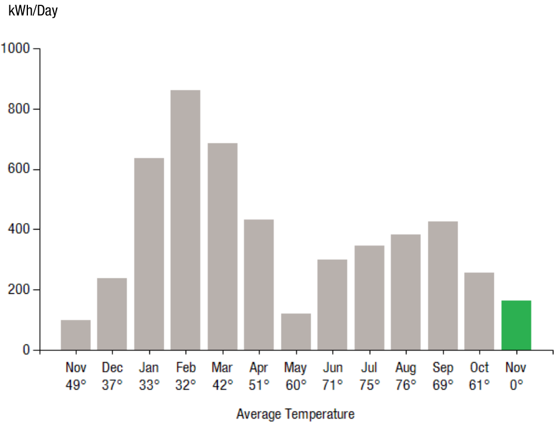
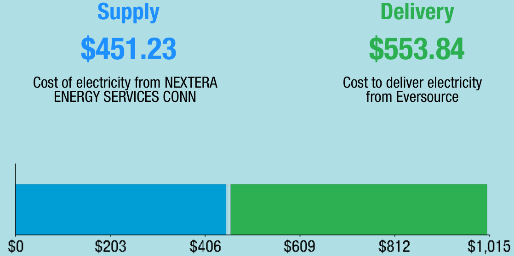
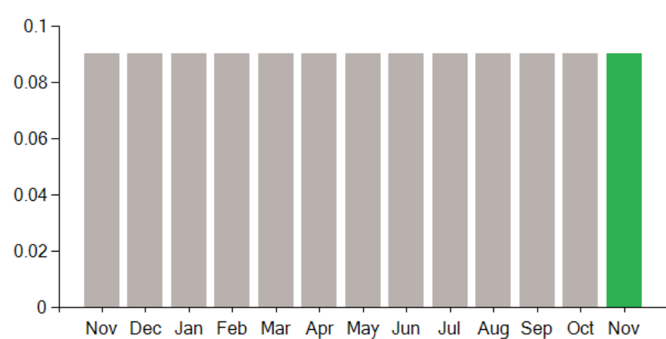
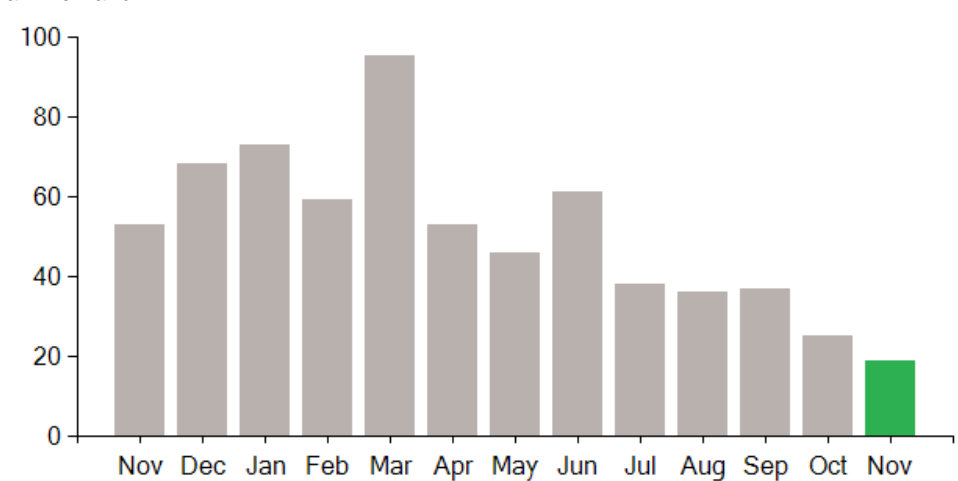

<!-- page_num: 1 -->

The image is a logo for "EVERSOURCE." The text "EVERSOURCE" is written in bold, black uppercase letters. The letter "O" is stylized with a circle design containing three horizontal bars: the top bar is blue, the middle is white, and the bottom is green. This design element represents a conceptual graphic within the logo, adding a visual emphasis to the brand name.

## Payment Information

**Payment will be sent to bank for processing on 11/02/21**  
**$1,059.81**

### Account Details

- **Account Number:** 5182 318 7091
- **Statement Date:** 11/01/21

| Description | Amount |
|-------------|--------|
| Amount Due On 10/29/21 | $1,471.59 |
| Last Payment Received On 10/04/21 | -$1,471.59 |
| Balance Forward | $0.00 |
| **Total Current Charges** | **$1,059.81** |

**Service Provided To:**  
BARCELONA WAY POINTE, LLC

## Electric Usage History

This image is a bar graph illustrating the relationship between energy usage (kWh/Day) and average temperature (°F) across different months.   - The x-axis represents the months, starting from November through October, with corresponding average temperatures listed below each month.  - The y-axis shows the energy usage in kWh/Day, ranging from 0 to 1000.  Data Points: - Nov (49°F): ~200 kWh/Day - Dec (37°F): ~400 kWh/Day - Jan (33°F): ~700 kWh/Day - Feb (32°F): ~900 kWh/Day - Mar (42°F): ~800 kWh/Day - Apr (51°F): ~500 kWh/Day - May (60°F): ~200 kWh/Day - Jun (71°F): ~300 kWh/Day - Jul (75°F): ~400 kWh/Day - Aug (76°F): ~600 kWh/Day - Sep (69°F): ~700 kWh/Day - Oct (61°F): ~400 kWh/Day - Nov (0°F): ~250 kWh/Day (marked in green)  Key Observations: - Energy usage peaks in February, with an average temperature of 32°F. - The lowest energy usage occurs in May, corresponding to an average temperature of 60°F. - The bar for the second November (marked in green) represents a forecast or different dataset with an average temperature of 0°F.

## Current Charges for Electricity

This is a cost comparison chart showing the breakdown of electricity expenses into supply and delivery components. The chart is structured into two main sections:  1. **Supply**:    - Label: "Supply"    - Cost: $451.23    - Description: "Cost of electricity from NEXTERA ENERGY SERVICES CONN"    - Color: Blue  2. **Delivery**:    - Label: "Delivery"    - Cost: $553.84    - Description: "Cost to deliver electricity from Eversource"    - Color: Green  The chart includes a horizontal bar graph at the bottom representing the total cost range from $0 to $1,015. The bar is divided into two colored sections: - The blue section represents the supply cost, extending from $0 to $451.23. - The green section represents the delivery cost, extending from $451.23 to $1,015.  The values on the x-axis are marked at intervals: $0, $203, $406, $609, $812, and $1,015.

Your electric supplier is **NEXTERA ENERGY SERVICES CONN**  
20455 STATE HIGHWAY 249  
HOUSTON TX 77070-2757  
800-882-1276

## Electric Usage Summary

- **This month your average daily electric use was:** 164.0 kWh
- **This month you used** 64.0% **more than at the same time last year**

## News For You

Do you know what it costs to power your home? The average Eversource customer pays about $5 per day in electricity costs to power their home. This includes keeping the lights on, your home at a comfortable temperature, your food fresh, devices charged and more. To learn more about the costs to power common items in your home visit [eversource.com/power-your-day](https://www.eversource.com/power-your-day).

### Remit Payment To:

Eversource  
PO Box 56002, Boston, MA 02205-6002

Please make your check payable to Eversource and consider adding $1 for Operation Fuel. To add more or make a payment today, visit [Eversource.com](https://www.eversource.com). If mailing, please allow up to 5 business days to post.

---

**Eversource**  
Account Number: 5182 318 7091

Payment will be sent to bank for processing on 11/02/21  
**$1,059.81**

**Amount Enclosed**

Eversource  
PO Box 56002  
Boston, MA 02205-6002

BARCELONA WAY POINTE, LLC  
STE 101  
20 KETCHUM ST  
WESTPORT CT 06880-5939
<!-- /page_num: 1 -->
<!-- page_num: 2 -->

The image is a logo for Eversource. It features the word "EVERSOURCE" in bold, black capital letters. The letter "O" is stylized with a circular design that includes three horizontal bands: a blue band on top, a white band in the middle, and a green band on the bottom. This design gives the logo a modern and clean look.

## Payment Information

### Payment will be sent to bank for processing on 11/02/21

**$1,059.81**

### Account Details

- **Account Number:** 5182 318 7091  
- **Customer name key:** BARC  
- **Statement Date:** 11/01/21  
- **Service Provided To:** BARCELONA WAY POINTE, LLC

## Electric Account Summary

| Description                      | Amount    |
|----------------------------------|-----------|
| Amount Due On 10/29/21           | $1,471.59 |
| Last Payment Received On 10/04/21| -$1,471.59 |
| Balance Forward                  | $0.00     |
| Electric Supply Services         | $451.23   |
| Delivery Services                | $553.84   |
| Other Charges or Credits         | $54.74    |
| **Total Current Charges**        | **$1,059.81** |
| **Total Amount Due**             | **$1,059.81** |

## Service Details

- **Svc Addr:** 515 WEST AVE  
- **STR 5 NORWALK CT 06850**  
- **Serv Ref:** 211953002  
- **Bill Cycle:** 02  
- **Service from 10/01/21 - 11/01/21**  
- **Next read date on or about:** Dec 02, 2021

| Meter Number | Current Read | Previous Read | Current Usage | Reading Type |
|--------------|--------------|---------------|---------------|--------------|
| 893884752    | 55903        | 50829         | 5074          | Actual       |

**Total Demand Use = 19.20 kW**

## Monthly kWh Use

| Nov | Dec | Jan | Feb | Mar | Apr | May |
|-----|-----|-----|-----|-----|-----|-----|
| 3088| 7363| 20104| 24144| 20588| 13849| 3498|

| Jun | Jul | Aug | Sep | Oct | Nov |
|-----|-----|-----|-----|-----|-----|
| 8983| 10042| 12273| 12735| 7455| 5074|

## Total Charges for Electricity

### Supplier

- **NEXTERA ENERGY**  
- **Service Reference:** 211953002

| Description             | Calculation        | Amount  |
|-------------------------|--------------------|---------|
| Generation Srvc Chrg**  | 5074.00kWh X $0.08893 | $451.23 |
| **Subtotal Supplier Services** |                    | **$451.23** |

### Delivery

- **(DISTRIBUTION RATE: 030)**  
- **Service Reference:** 211953002

| Description             | Calculation                  | Amount  |
|-------------------------|------------------------------|---------|
| Transmission Dmd Chrg   | 17.20KW X $8.31000           | $142.93 |
| Distr Cust Srvc Chrg    |                              | $44.00  |
| Distribution Dmd Chrg   | 17.20KW X $14.22000          | $244.58 |
| Electric Sys Improvements***| 17.20KW X $1.08000       | $18.58  |
| Revenue Adj Mechanism   | 5074.00kWh X $0.00162        | $8.22   |
| TS Isaias Performance Penalty | 5074.00kWh X $-0.00140 | -$7.10  |
| CTA Demand Chrg         | 17.20KW X $-0.34000          | -$5.85  |
| FMCC Delivery Chrg      | 5074.00kWh X $0.01412        | $71.64  |
| Comb Public Benefit Chrg*| 5074.00kWh X $0.00726       | $36.84  |
| **Subtotal Delivery Services** |                      | **$553.84** |
| **Total Cost of Electricity** |                       | **$1,005.07** |

## Explanation of your charges

*The Combined Public Benefits Charge represents a combination of three charges formerly known as: Conservation and Load Mgmt Charge, Renewable Energy Investment Charge, and Systems Benefits Charge. This charge also includes the Conservation Adjustment Mechanism approved by the Public Utilities Regulatory Authority in Docket No. 13-11-14.*

**Effective January 1, 2007, the Generation Services Charge (GSC) and the Bypassable Federally Mandated Congestion Charge (BFMCC) have been combined into the "GSC Charge" listed in the Supplier Services section of your bill. The GSC reflects all of the cost of procuring energy from Eversource wholesale suppliers. The BFMCC portion of this line item is -$0.0008 / kWh. If you multiply this BFMCC rate by the number of kWhs on your bill, you can calculate the dollar amount associated with the BFMCC.**

***Electric System Improvements: Recovers company investments that protect, strengthen or modernize the electric grid.***

## Contact Information

- **Emergency:** 800-286-2000
- **Website:** [www.eversource.com](http://www.eversource.com)
- **Email:** BusinessCenterCT@eversource.com
- **Pay by Phone:** 888-783-6618
- **Customer Service:** 888-783-6617
<!-- /page_num: 2 -->
<!-- page_num: 3 -->
## Account Summary

**Account Number:** 5182 318 7091  
**Customer name key:** BARC  
**Statement Date:** 11/01/21  
**Service Provided To:** BARCELONA WAY POINTE, LLC  

### Payment Information

**Payment will be sent to bank for processing on 11/02/21**  
**Total Amount:** $1,059.81  

### Charges Summary

| Description                                   | Amount   |
|-----------------------------------------------|----------|
| 6.35% CT Sales Tax after Exemption of $150.00 |          |
| CT Sales Tax Supplier                         | $28.65   |
| CT Sales Tax Delivery                         | $26.09   |
| Subtotal Other Charges or Credits             | $54.74   |
| **Total Current Charges**                     | **$1,059.81** |

### Supply Rate

Dollars / kWh

The image is a bar chart depicting data across different months. The horizontal axis represents the months of the year, starting from November and looping back to November again. The vertical axis is labeled from 0 to 0.1, and measures the values corresponding to each month.  - Each month from November to October has a grey bar with a value of approximately 0.09. - The final bar for November is colored green and also has a value of approximately 0.09.  This chart shows consistent data across all months with a slight visual distinction for the last November.

### Demand Profile

Max. Demand

The image is a bar chart showing monthly data. The x-axis represents months from November to November, while the y-axis measures values from 0 to 100.  Key data points are as follows:  - November: 40 - December: 70 - January: 80 - February: 60 - March: 100 - April: 60 - May: 50 - June: 70 - July: 60 - August: 50 - September: 50 - October: 30 - November: 20 (in green)  The highest value occurs in March (100) and the lowest is in the last November (20), which is highlighted in green.

### Important Messages About Your Account

Please note: Payment processes differ for each bank. Therefore, it may take longer than the date that appears on your bill for the funds to be deducted from your bank account.
<!-- /page_num: 3 -->