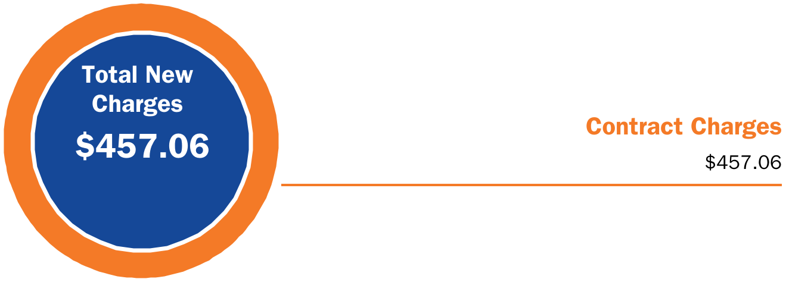
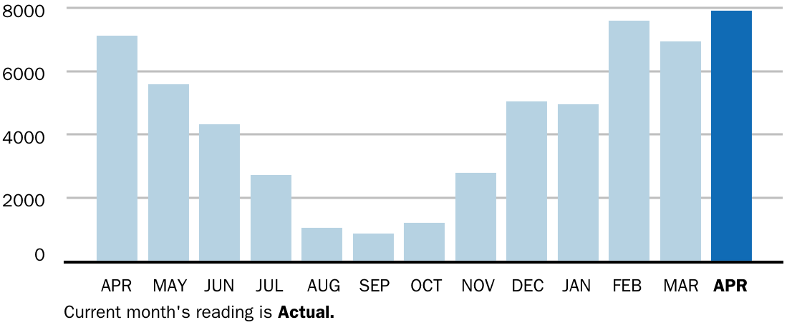

<!-- page_num: 1 -->
# Monthly Invoice

**Constellation**

**Statement Date:** 03/21/2024  
**Customer Number:** 7028334-0

**Lakewood Center Garage**  
1370 BELLE AVE  
LAKEWOOD, OH 44107  

## Account Details

| Details                | Information                   |
|------------------------|-------------------------------|
| **Rate Plan:**         | Fixed Price Solutions         |
| **Account ID:**        | 7679683                       |
| **Utility Number:**    | 08004667295000044205          |
| **Service Period:**    | 2/23/2024 to 3/20/2024        |
| **Statement Number:**  | 67956537901                   |

## Billing Summary

**Total Amount Due by 04/12/2024:** **$3,111.77**

| Description                  | Amount     |
|------------------------------|------------|
| Previous Balance:            | $2,631.39  |
| Payments Since Last Invoice: | $0.00      |
| Unpaid Balance:              | $2,631.39  |
| Late/Finance Charges:        | $23.32     |
| Credit/Adjustments:          | $0.00      |
| **Total New Charges:**       | **$457.06**|

The image is a billing summary visualization. It consists of two main components:  1. A circular infographic on the left side, which is predominantly blue with an orange border. Inside the circle, the text reads:    - "Total New Charges $457.06"  2. On the right side, aligned horizontally with the circle, there is text that reads:    - "Contract Charges $457.06"  An orange line connects the circle to the text on the right, indicating a direct relationship between the "Total New Charges" and "Contract Charges," both amounting to $457.06.

## Monthly Usage

**Consumption History**

The image is a bar graph displaying monthly data readings over the course of a year, with each bar representing a different month. The x-axis lists the months from April to April, while the y-axis represents the data values ranging from 0 to 8000.  Key details and data points are as follows: - APR: ~7900 - MAY: ~6700 - JUN: ~5500 - JUL: ~3500 - AUG: ~1500 - SEP: ~1000 - OCT: ~1500 - NOV: ~3300 - DEC: ~5000 - JAN: ~4800 - FEB: ~7400 - MAR: ~6700 - APR (current): ~8000 (marked as "Actual")  The current month's reading (April) is highlighted in a darker blue color, indicating it is the actual value as noted by the text "Current month's reading is Actual."

- **Current Month:** 7,920 kWh  
- **Increase:** 11.0% from last year  
- **Last Month:** 6,960 kWh  
- **Last Year:** 7,120 kWh  

You can also pay your bill online - go to [Energy Manager](https://energymanager.constellation.com) to get started. It's fast, simple, and secure.

---

**Statement Number:** 67956537901  
**Customer Number:** 7028334-0  

**Total Amount Due by 04/12/2024:** **$3,111.77**

**PO Box 4911**  
Houston, TX 77210-4911  

**ELECTRONIC STATEMENT**  
Rick Recny  
Lakewood Center Garage  
Avid Exchange- Ubar #233  
PO BOX 37323  
CHARLOTTE NC 28237  

**AMOUNT ENCLOSED**

$ 

**Make checks payable to:**  
CONSTELLATION NEWENERGY, INC.  
PO BOX 4640  
CAROL STREAM IL 60197-4640
<!-- /page_num: 1 -->
<!-- page_num: 2 -->
# Have a Question or Emergency?

To Contact Your Local Utility  
Cleveland Electric Illuminating  
800-334-7661  

## Total Amount Due by 04/12/2024

**$3,111.77**

## For Customer Care Contact Constellation

- **Website**: [https://energymanager.constellation.com](https://energymanager.constellation.com)
- **Email**: customercare@constellation.com
- **Phone**: 844-6ENERGY (844-636-3749)

## Usage Details

| Meter Number   | Previous Meter Read Date | Current Meter Read Date | Usage     |
|----------------|---------------------------|--------------------------|-----------|
| A11928740      | 02/23/2024                | 03/20/2024               | 7,920.000 |

## Detailed Charges

| Contract Charges     | Quantity     | Rate             | Amount   |
|----------------------|--------------|------------------|----------|
| Energy-Fixed Price   | 7,920.00 kWh | $0.0577100/kWh   | $457.06  |
| **Subtotal Contract Charges** |              |                  | **$457.06** |
| **Total New Charges**         |              |                  | **$457.06** |

## Other Ways to Pay Your Bill

- **Energy Manager**  
  Manage your account at: [https://energymanager.constellation.com](https://energymanager.constellation.com)

- **Phone**  
  Call 844-6ENERGY (844-636-3749) for our 24/7 phone payment option

- **ACH/WIRE**  
  CONSTEllATION NEWENERGY, INC.  
  ACH/WIRE: WELLS FARGO, ABA 121000248 / ACCOUNT 4879656445  
  ACH/WIRE NOTIFICATION: PAYMENTS@CONSTELLATION.COM
<!-- /page_num: 2 -->
<!-- page_num: 3 -->
## Detailed Fees/Adjustments

| Late/Finance Charge | Invoice Number | Utility Number         | Service Period       | Amount |
|---------------------|----------------|------------------------|----------------------|--------|
| Late Fee Charge     | 615970506      | 0800466729500004 4205  | 12/28/2021 - 01/25/2022 | $5.91   |
| Late Fee Charge     | 618192602      | 0800466729500004 4205  | 01/26/2022 - 02/22/2022 | $7.47   |
| Late Fee Charge     | 623014600      | 0800466729500004 4205  | 03/25/2022 - 04/23/2022 | $0.22   |
| Late Fee Charge     | 628230061      | 0800466729500004 4205  | 05/24/2022 - 06/24/2022 | $0.42   |
| Late Fee Charge     | 630462638      | 0800466729500004 4205  | 06/25/2022 - 07/26/2022 | $0.35   |
| Late Fee Charge     | 632775073      | 0800466729500004 4205  | 07/27/2022 - 08/24/2022 | $0.38   |
| Late Fee Charge     | 635136833      | 0800466729500004 4205  | 08/25/2022 - 09/26/2022 | $0.25   |
| Late Fee Charge     | 637438704      | 0800466729500004 4205  | 09/27/2022 - 10/25/2022 | $0.23   |
| Late Fee Charge     | 639640980      | 0800466729500004 4205  | 10/26/2022 - 11/23/2022 | $0.25   |
| Late Fee Charge     | 641555083      | 0800466729500004 4205  | 11/24/2022 - 12/20/2022 | $0.20   |
| Late Fee Charge     | 646276222      | 0800466729500004 4205  | 01/24/2023 - 02/20/2023 | $0.22   |
| Late Fee Charge     | 648888237      | 0800466729500004 4205  | 02/21/2023 - 03/22/2023 | $0.24   |
| Late Fee Charge     | 651499283      | 0800466729500004 4205  | 03/23/2023 - 04/24/2023 | $0.28   |
| Late Fee Charge     | 653972151      | 0800466729500004 4205  | 04/25/2023 - 05/22/2023 | $0.23   |
| Late Fee Charge     | 659462365      | 0800466729500004 4205  | 06/22/2023 - 07/24/2023 | $1.08   |
| Late Fee Charge     | 664948636      | 0800466729500004 4205  | 08/25/2023 - 09/25/2023 | $1.20   |
| Late Fee Charge     | 670141887      | 0800466729500004 4205  | 10/24/2023 - 11/24/2023 | $0.32   |
| Late Fee Charge     | 672682154      | 0800466729500004 4205  | 11/25/2023 - 12/22/2023 | $4.07   |

**Total Late/Finance Charges**: $23.32

## Message Center

Energy Charge includes renewable energy resource compliance costs of $4.70 as required by state of OH code 4901:1-21-19.

If your complaint is not resolved after you have called Constellation or for general utility information, customers may call the "Public Utilities Commission of Ohio" (PUCO) at:

1-800-686-7826 or for TDD/TTY (toll free) or for TTY at 1-800-686-1570 (toll free) from 8:00 a.m. to 5:00 p.m. weekdays, or at www.PUCO.ohio.gov.

Thank you for your prompt payment. A finance charge of 1.5% per month may be assessed on all past due invoices.

Thank you for choosing Constellation as your electric supplier.

To ensure timely application of your payment, please include your Statement Number on your payment remittance. Thank you for being a valued Constellation Customer!
<!-- /page_num: 3 -->
<!-- page_num: 4 -->
## Total Amount Due by 04/12/2024

**$3,111.77**

### Adjustments

Any adjustments that were made to your account within the invoice period. Adjustments may be made for a variety of reasons, including special contract calculations, corrections to prior bills, or settlement of disputed charges.

### Administration Fee or Service Charge

The fee or charge set forth for each account per billing cycle.

### Ancillary Service Charges

Charges regarding ancillary services as set forth in the applicable Independent Service Operator (ISO) Open Access Transmission Tariff (OATT) and for other ISO costs not included in the definition of Capacity Costs, Energy Costs, and Transmission Costs. Generally, these costs are associated with ensuring the reliability of the electrical grid.

### Capacity Charge

Charge for fulfilling the capacity requirements for the Account(s) imposed by the ISO or otherwise. Generally, these costs are associated with ensuring there is enough generating capacity available now and in the future to meet customer requirements.

### Energy Charge - Non-Time of Use (TOU)

Charge per kWh for electricity supplied for all hours of each day.

### Kilowatt Hour (kWh)

A measure of the quantity of electricity (energy) that you use.

### Late Fees or Finance Charges

Additional charges assessed to accounts for late payment of invoices. Payment terms and charge calculations are specified in your contract.

### Line Loss Charges

The cost associated with the loss of electricity as it travels over the transmission and distribution wires.

### Reliability Must Run (RMR)

Ancillary service administered by the ISO. Generation resources scheduled to operate out-of-merit order and identified by the ISO as necessary to preserve regional system reliability.

### Renewable Portfolio Standards Cost (RPS)

NewEnergy's cost of procuring renewable energy to comply with Renewable Portfolio Standards (RPS) requirements, usually established by individual states. Generally, these costs are associated with requirements to support generating units that produce power using renewable fuels such as water (hydro-electric) and solar.

### Retail Service Charge

A contracted charge for supplying electricity to an account, based upon total kWh consumption per billing cycle.

### Retail Trade Transaction (RTT)

The fixed unit Price and Quantity for a specific commodity for a specific delivery point and pattern.

### Transmission Service Charge

The charge for Network Transmission Service as identified in the applicable OATT Tariff for the provision of transmission service by the ISO within the Utility's service territory. Generally, these costs are associated with building and maintaining the electric transmission lines.

### Disputed Invoices

Should you question any portion of your Constellation NewEnergy invoice, please call 844-6ENERGY (844-636-3749) Monday to Friday 8AM-8PM Eastern Time, email or write to: Constellation NewEnergy, c/o Customer Care, PO Box 4911 Houston, TX 77210-4911. If your complaint is not resolved after you have called your electric supplier and/or your electric utility, or for general utility information, residential and business customers may contact the public utilities commission of Ohio (PUCO) for assistance at 1-800-686-7826 (toll-free) from eight a.m. to five p.m. weekdays or at [PUCO Website](http://www.puco.ohio.gov). Hearing or speech impaired customers may contact the PUCO via 7-1-1 (Ohio relay service).

### Ohio Consumers' Counsel (OCC)

The Ohio consumers' counsel (OCC) represents residential utility customers in matters before the PUCO. The OCC can be contacted at 1-877-742-5622 (toll-free) from eight a.m. to five p.m. weekdays, or at [OCC Website](http://www.pickocc.org).

### Service Interruption or Electric Emergency

In the event of a service interruption or electric emergency, please contact your utility directly at:

- **Cleveland Electric Illuminating**: 800-334-7661

### Disclaimer

**General Understanding** - This glossary is for informational purposes only. Please refer to your agreement with us for the defined terms that govern the contractual obligations applicable to us supplying you. Not all defined terms set forth above may be applicable to your agreement with Constellation NewEnergy.

---

You may access the Environmental Disclosure information on our website - [Constellation Energy](http://www.constellation.com/business-energy/pages/ohio-energy.aspx)
<!-- /page_num: 4 -->