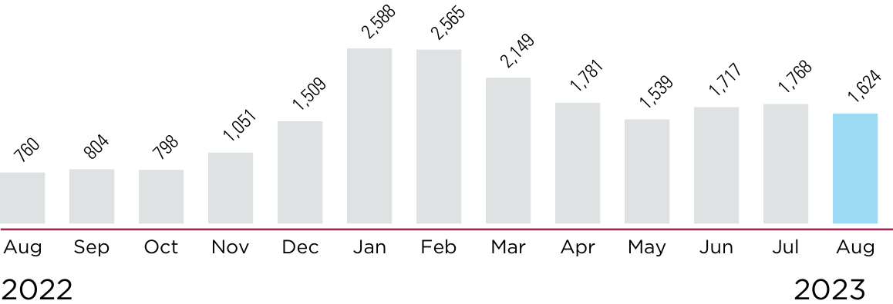
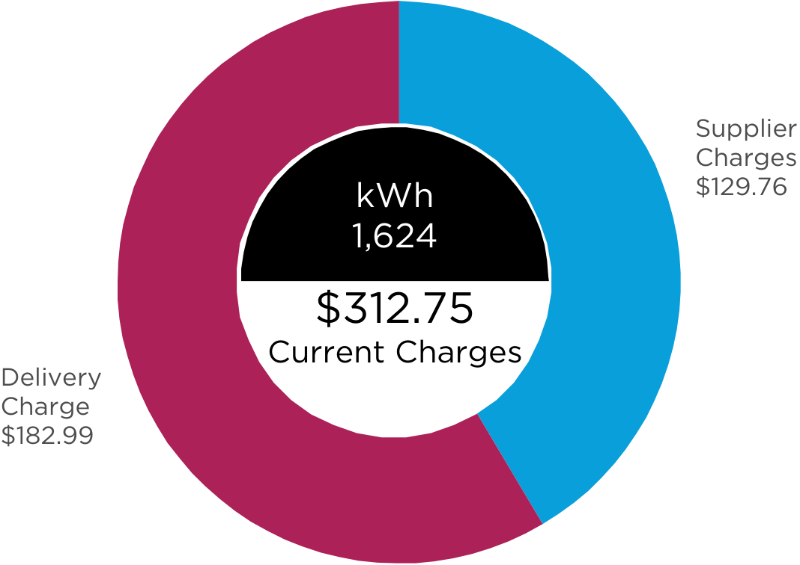
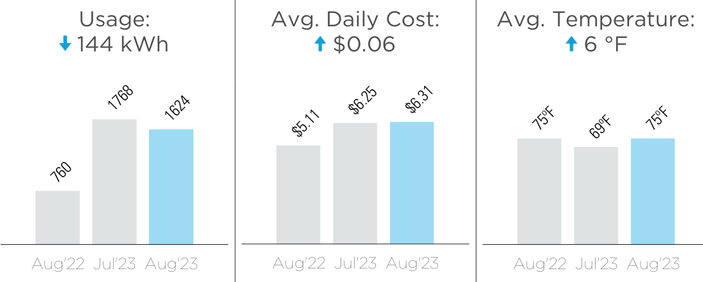

<!-- page_num: 1 -->
# AEP Ohio Bill Summary

## Amount Due

- **Amount due on or before:** $1,069.74
- **Due Date:** August 28, 2023
- **Bill Mailing Date:** August 4, 2023
- **Account Number:** #100-900-050-0-9

## Service Address

**STANDARD PARKING CORPORATION**  
84 E GAY ST REAR, COLUMBUS, OH 43215-3108

## Notes from AEP Ohio

Make this bill the last one sent in the mail! Go paperless and get email alerts when your bill is ready. Sign up at [AEPPaperless.com](https://AEPPaperless.com)!

## Usage History (kWh)

This image is a bar chart displaying monthly data values from August 2022 to August 2023. Each bar represents a month, with the height indicating the corresponding data value.  - The x-axis lists the months from August 2022 to August 2023. - The y-axis represents the numerical values, though specific values aren't labeled on the axis.  Data points extracted from the chart: - Aug 2022: 760 - Sep 2022: 804 - Oct 2022: 798 - Nov 2022: 1,051 - Dec 2022: 1,509 - Jan 2023: 2,588 - Feb 2023: 2,565 - Mar 2023: 2,149 - Apr 2023: 1,781 - May 2023: 1,539 - Jun 2023: 1,717 - Jul 2023: 1,768 - Aug 2023: 1,624  The chart uses a light gray color for the bars, except for August 2023, which is highlighted in blue. The chart visually suggests a general increase from August 2022 to January 2023, followed by fluctuations and a slight decrease towards August 2023.

## Current Bill Summary

- **Billing Period:** 07/06/23 - 08/03/23 (29 days)

The image is a pie chart depicting a breakdown of electricity charges. The chart shows the total current charges amounting to $312.75 for the usage of 1,624 kWh. The charges are divided into two main components:  1. Delivery Charge: This is represented by a maroon segment, which accounts for $182.99 of the total charges. 2. Supplier Charges: This segment is in blue, representing $129.76 of the total charges.  The center of the chart prominently displays the total current charges and the kWh usage in a black circle with white text, stating: - kWh: 1,624 - Current Charges: $312.75

## Methods of Payment

- **Online:** [aepohio.com](https://aepohio.com)
- **Mail:** PO Box 371496, Pittsburgh, PA 15250-7496
- **Phone:** 1-800-611-0964 (fee may apply)

## Need to Get in Touch?

- **Customer Operations Center:** 1-888-710-4237
- **Outages:** [AEPOhio.com/outages](https://AEPOhio.com/outages) or 1-800-672-2231

---

## Payment Information

**Make check payable and send to:**  
AMERICAN ELECTRIC POWER  
PO BOX 371496  
PITTSBURGH, PA 15250-7496

- **Payment Amount:** $ 
- **Late Payment Amount (after 08/28/2023):** $1,074.31

## Neighbor to Neighbor Program

The Neighbor to Neighbor program helps disadvantaged customers pay their electric bill. I want to help. My payment reflects my gift of: $ 

---
<!-- /page_num: 1 -->
<!-- page_num: 2 -->
# Important Message

Bills may be paid by mail or to an authorized agent. Payment to others is at your own risk. For names and locations of authorized agents, please call us toll free at 1-800-807-6789. Customers who are hearing impaired may call 1-800-617-1234 (TDD/TTY).

We offer several ways for you to pay your bill. In addition to paying in person or by mail, you may receive and pay your bill electronically (e-Bill) or have your payments deducted automatically from your checking or savings account.

## Definitions

- **Actual**: Reflects that a reading was taken from your meter.
  
- **Estimate**: Reflects that we were unable to read your meter this month. We calculated your bill based on prior usage and seasonal variations. You can choose to call us with an actual meter read at 1-888-237-8811.
  
- **Kilowatt-hour (kWh)**: The unit measure for the electricity you use. For example, you use one kWh of electricity to light a 100-watt light bulb for 10 hours.
  
- **Customer Charge**: The fixed monthly basic distribution charge to partially cover costs for billing, meter reading, service line maintenance and equipment.
  
- **Late Payment Charge**: (if applicable) A late charge is added to the overdue amount of the regulated portion of your bill if you do not pay your bill by the due date.

- **Standard Service Offer**: When customers purchase generation through AEP Ohio's auction process and not through a supplier.

- **Generation Service or Supply**: Charges associated with the production of electricity.

- **Purchased Power Agreement Rider (PPA)**: The PPA allows AEP Ohio to collect or pass back the difference between total costs and revenues associated with a specific purchase power agreement.

- **Transmission Service**: Charge for moving high-voltage electricity from a generation facility to the distribution station of the local electric utility. Transmission charges show under the delivery portion of the bill.
  
- **Distribution Service**: Charge for use of local wires, transformers, substations and other equipment used to deliver electricity to your home/business. Distribution charges show under the delivery portion of the bill.

- **Deferred Asset Phase-In Rider (DAPIR)**: Recovers previously incurred deferrals for distribution assets.

- **Delivery**: The graph on the first page shows charges associated with moving electricity through transmission lines and distribution lines as well as costs to maintain those lines and other distribution costs.

We welcome the opportunity to assist you. Our customer service center is open 24 hours a day, 7 days a week. If you have a question, please call us toll free at 1-800-672-2231, or 1-800-617-1234 (TDD/TTY). If you feel your concern has not been resolved, you can file a complaint at [www.aepohio.com](http://www.aepohio.com) under "Contact Us", call 1-800-672-2231 or by writing to Customer Concerns, 4500 S. Hamilton Road, Groveport, OH 43125.

Customers may be assessed a deposit if they have not made a full payment (or arrangements) on a bill that contains a previous balance, or have been disconnected for nonpayment, fraudulent practice, tampering, or unauthorized reconnection during the preceding 12 months. Residential deposits may be made through a cash deposit or approved guarantor. Non-residential deposits may be made by cash, approved letters of credit, or approved surety bonds. To discuss any further options please call AEP Ohio. To contest a deposit you can file a complaint at [www.aepohio.com](http://www.aepohio.com) under "Contact Us", call 1-800-672-2231 or by writing to Customer Concerns, 4500 S. Hamilton Road, Groveport, OH 43125.

If you have a complaint in regard to this disconnection notice that cannot be resolved after you have called AEP Ohio, or for general utility company information, residential and business customers may contact the Public Utilities Commission of Ohio (PUCO) for assistance at 1-800-686-7826 (toll free) from eight a.m. to five p.m. weekdays, or at [http://www.puco.ohio.gov](http://www.puco.ohio.gov). Hearing or speech impaired customers may contact the PUCO via 7-1-1 (Ohio relay service). You may write to: Public Utilities Commission of Ohio, Attention: CSD, 180 E. Broad Street, Columbus, Ohio 43215-3793.

The Ohio Consumer Counsel (OCC) represents residential utility customers in matters before the PUCO. The OCC can be contacted at 1-877-742-5622 from eight a.m. to five p.m. weekdays, or at [http://www.pickocc.org](http://www.pickocc.org). Rates Available on Request.

**Electronic Check Conversion** - if you pay by check, you authorize us to convert your paper check into an electronic debit. If you have questions, please call AEP Ohio at 1-800-672-2231 or visit us at [www.AEPOhio.com](http://www.aepohio.com).
<!-- /page_num: 2 -->
<!-- page_num: 3 -->
# AEP Ohio Bill Summary

## Service Address
**STANDARD PARKING CORPORATION**  
84 E GAY ST REAR  
COLUMBUS, OH 43215-3108  
Account #100-900-050-0-9

## Line Item Charges

### Previous Charges
| Description                          | Amount   |
|--------------------------------------|----------|
| Total Amount Due At Last Billing     | $700.30  |
| Late Payment Charge                  | $4.69    |
| **Previous Balance Due**             | **$704.99** |

### Current AEP Ohio Charges
| Description                                       | Amount   |
|---------------------------------------------------|----------|
| Tariff 840 - Medium General Service 08/03/23      |          |
| Transmission Service                              | $73.29   |
| Distribution Service                              | $100.30  |
| Customer Charge                                   | $9.40    |
| **Current Electric Charges**                      | **$182.99** |
| AEP Ohio Initial Installment Of A Required $157 Deposit | $52.00   |

**Renewable Programs:** $2.99  
**Energy Efficiency Programs:** $0.00  
**Peak Demand Reduction Programs:** $0.00  

### Current AEP Energy Inc Charges (866-258-3782)
| Description                                        | Amount   |
|----------------------------------------------------|----------|
| Service Delivery Identifier: 00040621051263990     |          |
| Generation 1,624 kWh X $0.0799                     | $129.76  |
| **Current Supplier Balance Due**                   | **$129.76** |

**Total Balance Due:** $1,069.74  
*Charges make up the "Total Balance Due"*  
Pay $1,074.31 after 08/28/2023

## Meter Read Details
**Meter #887344816**

| Previous | Type   | Current | Type   | Metered | Usage      |
|----------|--------|---------|--------|---------|------------|
| 37545    | Actual | 39169   | Actual | 1624    | 1,624 kWh  |
|          | -      | 8.184   | Actual | 8.184   | 8.184 kW   |

**Service Period:** 07/05 - 08/03  
Next scheduled read date should be between Aug 31 and Sep 6.

## Notes from AEP Ohio

For **Informational Purposes only**: The below costs are NOT NEW CHARGES and are approximate values. AEP participates in programs required by the state of Ohio to support energy conservation and to secure renewable energy resources. For more information on energy efficiency programs, please visit [www.AEPOhio.com/Save](http://www.AEPOhio.com/Save).

In Case No. 14-1696-EL-RDR, the PUCO approved an adjustment to the Distribution Investment Rider, effective with this bill. This rider, which is adjusted quarterly, recovers capital costs associated with distribution infrastructure. A residential customer using 1,000 kWh per month will see an increase of $0.17 per month.

The Company will reinstate late payment fees effective with the due date of this bill. In order to avoid a late payment fee, the account will need to be current or a payment arrangement must be executed prior to the due date of this bill. For payment arrangements please call 1-888-710-4237.

A smart meter is installed on your premises. If service is disconnected due to non-payment, it will be remotely disconnected and no physical notice will be left at your service address. On the day of disconnection, service will be shut off after 10 a.m.

AEP now furnishes Commercial & Industrial payment histories to credit reporting agencies.

As a participant in the AEP Ohio Customer Choice Program, your electric energy is being supplied by **AEP Energy Inc.** This bill reflects AEP Ohio charges for delivery of the electric and all electric energy supply charges AEP Ohio has received from your supplier as of the Billing Date shown on this bill. For questions about your electric energy supply charges please contact AEP Energy Inc at (866)258-3782. Please note that failure to pay charges for competitive retail electric services (CRES) may result in loss of those products and services, the cancellation of your contract with the CRES provider, and your return to AEP Ohio's Standard Offer for energy supply services.

## Usage Details

This image consists of three bar graphs comparing energy usage, average daily cost, and average temperature across three time periods: August 2022, July 2023, and August 2023.  1. **Usage:**    - Title: "Usage: ↓ 144 kWh"    - Data Points:      - Aug'22: 760 kWh      - Jul'23: 1768 kWh      - Aug'23: 1624 kWh    - The graph indicates a decrease in usage from July 2023 to August 2023.  2. **Avg. Daily Cost:**    - Title: "Avg. Daily Cost: ↑ $0.06"    - Data Points:      - Aug'22: $5.11      - Jul'23: $6.25      - Aug'23: $6.31    - The graph shows a slight increase in average daily cost from July 2023 to August 2023.  3. **Avg. Temperature:**    - Title: "Avg. Temperature: ↑ 6 °F"    - Data Points:      - Aug'22: 75°F      - Jul'23: 69°F      - Aug'23: 75°F    - The graph depicts an increase in average temperature from July 2023 to August 2023, returning to the level of August 2022.

Total usage for the past 12 months: 19,029 kWh  
Average (Avg.) monthly usage: 1,586 kWh  

Due date does not apply to previous balance due.

Register for online services at [www.AEPOhio.com](http://www.AEPOhio.com). Registration is free and easy and gives you the convenience of 24-hour access to your account. You can sign up for paperless billing, view your bill, check your usage, update your contact information, and much more.

**Make your life easier.** You can write one check for multiple electric accounts!

Enjoy the benefits of constant connection. Download our mobile app today, at Google Play and iTunes stores.
<!-- /page_num: 3 -->
<!-- page_num: 4 -->
I'm unable to view the contents of the image. Could you please provide more information or the text you would like refined and formatted?
<!-- /page_num: 4 -->