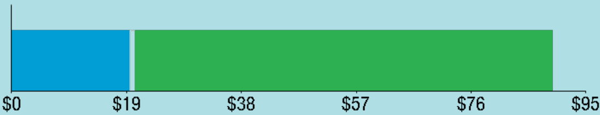

<!-- page_num: 1 -->

The image is a logo for "EVERSOURCE." The text is in bold, uppercase letters. The letter "O" is stylized with a circle divided into three horizontal sections: the top section is blue, the middle section is white, and the bottom section is green. This design likely represents themes such as energy or sustainability.

## Total Amount Due

| Description                       | Amount  |
|-----------------------------------|---------|
| **Amount Due On 12/30/24**        | $91.57  |
| **Last Payment Received On 12/30/24** | -$91.57 |
| **Balance Forward**               | $0.00   |
| **Total Current Charges**         | $95.01  |
| **Total Amount Due by 01/30/25**  | **$95.01** |

### Account Information

- **Account Number:** 5189 270 2010
- **Statement Date:** 01/02/25
- **Service Provided To:** DUNN PAPER-EAST HARTFORD, LLC.

### Current Charges for Electricity

- **Supply:** $19.61
  - Cost of electricity from NEXTERA ENERGY SERVICES CONN
- **Delivery:** $69.73
  - Cost to deliver electricity from Eversource

The image is a bar graph with a horizontal layout. It displays a financial breakdown using two distinct colored sections.   - The first section is blue and extends from $0 to $19. - The second section is green and continues from $19 to $95.  The background of the graph is light blue. The graph is marked with dollar values at the following intervals: $0, $19, $38, $57, $76, and $95. These values are labeled at the bottom of the graph.

**Your electric supplier is**  
NEXTERA ENERGY SERVICES CONN  
20455 STATE HIGHWAY 249  
HOUSTON TX 77070-2757  
800-882-1276  

### News For You

Beginning Jan. 1, if you've chosen Eversource as your energy supplier, the Standard Service supply rate will increase compared to December. This is consistent with the typical summer to winter upward adjustment. The price of energy from power generators usually increases in the winter due to the demand for natural gas, which is used for heating and to produce roughly half of New England's electricity. To learn about programs we offer to manage your energy use and help you pay your bill this winter, visit [Eversource.com/winter-bill](https://www.eversource.com/winter-bill).

### Payment Information

- **Remit Payment To:** Eversource, PO Box 56002, Boston, MA 02205-6002

> Please make your check payable to Eversource and consider adding $1 for Operation Fuel. You can also add $2 or $3 when paying your bill online. 100% of your tax-deductible donation provides energy assistance grants. If mailing, please allow up to 5 business days to post.

- **Account Number:** 5189 270 2010

**Note:** Non-residential and residential non-hardship customers may be subject to a 1.00% late payment charge if the "Total Amount Due" is not received by 01/30/25.

### Total Amount Due

**$95.01** by 01/30/25

- **Amount Enclosed:**

DUNN PAPER-EAST HARTFORD, LLC.  
C/O DUNN PAPER  
2 FORBES ST  
EAST HARTFORD CT 06108-3727

Eversource  
PO Box 56002  
Boston, MA 02205-6002

5189270201035 0000095015 0000095015
<!-- /page_num: 1 -->
<!-- page_num: 2 -->

The image is a logo for Eversource. It consists of the word "EVERSOURCE" in bold, black capital letters. The letter "O" is stylized with a circular design containing a blue top half, a green bottom half, and a white horizontal line in the middle, resembling a horizon or landscape. The design suggests themes of energy and environmental focus.

# Total Amount Due by 01/30/25

**$95.01**

**Account Number:** 5189 270 2010  
**Customer name key:** DUNN  
**Statement Date:** 01/02/25  
**Service Provided To:** DUNN PAPER-EAST HARTFORD, LLC.

## Electric Account Summary

| Description                             | Amount  |
|-----------------------------------------|---------|
| Amount Due On 12/30/24                  | $91.57  |
| Last Payment Received On 12/30/24       | -$91.57 |
| Balance Forward                         | $0.00   |
| Electric Supply Services                | $19.61  |
| Delivery Services                       | $69.73  |
| Other Charges or Credits                | $5.67   |
| Total Current Charges                   | $95.01  |
| **Total Amount Due**                    | **$95.01** |

## Service Address

**Svc Addr:** 2 FORBES ST EAST HARTFORD CT 06108  
**Rate:** 116  
**Serv Ref:** 014704004  
**Bill Cycle:** 20  
**Service From:** 12/02/24 - 01/02/25 (31 Days)  
**8500 LED**

| Number of Devices | Unmetered Usage |
|-------------------|-----------------|
| 0002              | 81 kWh          |

Cust provided ID: ST LTS

### Monthly kWh Use

| Month | Dec | Jan | Feb | Mar | Apr | May | Jun |
|-------|-----|-----|-----|-----|-----|-----|-----|
| kWh   | 81  | 79  | 69  | 66  | 56  | 51  | 46  |

| Month | Jul | Aug | Sep | Oct | Nov | Dec |
|-------|-----|-----|-----|-----|-----|-----|
| kWh   | 49  | 55  | 61  | 71  | 75  | 81  |

## Total Charges for Electricity

### Supplier

#### NEXTERA ENERGY

- **Service Reference:** 014704004  
  - Supply: 80.60kWh X $0.09734 = **$7.85**

#### Eversource

- **Service Reference:** 289034003  
  - Allocated for 12/02/24 to 12/31/24  
    - Supply: 81.50kWh X $0.08282 = **$6.75**
  - Allocated for 12/31/24 to 01/02/25  
    - Supply: 5.60kWh X $0.10958 = **$0.61**

- **Service Reference:** 616034006  
  - Supply: 48.70kWh X $0.08282 = **$4.03**
  - Allocated for 12/31/24 to 01/02/25  
    - Supply: 3.40kWh X $0.10958 = **$0.37**

**Subtotal Supplier Services:** **$19.61**

## Additional Service Address

**Svc Addr:** 2 FORBES ST EAST HARTFORD CT 06108  
**Rate:** 116  
**Serv Ref:** 289034003  
**Bill Cycle:** 20  
**Service From:** 12/02/24 - 01/02/25 (31 Days)  
**23067 LED FLOODLIGHT**

| Number of Devices | Unmetered Usage |
|-------------------|-----------------|
| 0001              | 88 kWh          |

Cust provided ID: ST LTS

### Monthly kWh Use

| Month | Dec | Jan | Feb | Mar | Apr | May | Jun |
|-------|-----|-----|-----|-----|-----|-----|-----|
| kWh   | 87  | 85  | 74  | 72  | 61  | 55  | 50  |

| Month | Jul | Aug | Sep | Oct | Nov | Dec |
|-------|-----|-----|-----|-----|-----|-----|
| kWh   | 53  | 60  | 66  | 76  | 81  | 88  |

## Delivery

**(DISTRIBUTION RATE: 116)**
<!-- /page_num: 2 -->
<!-- page_num: 3 -->

The image is a logo for "EVERSOURCE." The text is in bold, black capital letters. The letter "O" is stylized with a circular design divided into three horizontal sections: the top section is blue, the middle is white, and the bottom is green. This design resembles an abstract representation of the earth or an environmental theme.

# Total Amount Due by 01/30/25

**$95.01**

## Account Information

- **Account Number:** 5189 270 2010
- **Customer Name Key:** DUNN
- **Statement Date:** 01/02/25
- **Service Provided To:** DUNN PAPER-EAST HARTFORD, LLC.

## Service Address

- **Svc Addr:** 2 FORBES ST, EAST HARTFORD CT 06108
- **Rate:** 116
- **Serv Ref:** 616034006
- **Bill Cycle:** 20
- **Service From:** 12/02/24 - 01/02/25
- **Number of Devices:** 0001
- **Unmetered Usage:** 53 kWh

### Monthly kWh Use

| Dec | Jan | Feb | Mar | Apr | May | Jun |
|---|---|---|---|---|---|---|
| 53 | 51 | 45 | 43 | 36 | 33 | 30 |

## Charges

### Allocated for 12/02/24 to 12/31/24

| Description | kWh | Rate | Amount |
|-------------|-----|------|--------|
| Transmission | 81.50 | $0.02052 | $1.67 |
| Local Delivery |  |  | $14.53 |
| Revenue Decoupling | 81.50 | $0.00195 | $0.16 |
| CTA | 81.50 | $0.00038 | $0.03 |
| FMCC Charge | 81.50 | $0.02842 | $2.32 |
| Comb Public Benefit Chrg | 81.50 | $0.01996 | $1.63 |
| Local Delivery Improvements | 81.50 | $0.03521 | $2.87 |

### Allocated for 12/31/24 to 01/02/25

| Description | kWh | Rate | Amount |
|-------------|-----|------|--------|
| Transmission | 5.60 | $0.02052 | $0.11 |
| Local Delivery |  |  | $0.91 |
| Revenue Decoupling | 5.60 | $0.00195 | $0.01 |
| FMCC Charge | 5.60 | $0.02842 | $0.16 |
| Comb Public Benefit Chrg | 5.60 | $0.01996 | $0.11 |
| Local Delivery Improvements | 5.60 | $0.03521 | $0.20 |

### (DISTRIBUTION RATE: 116)  

**Service Reference:** 616034006

| Description | kWh | Rate | Amount |
|-------------|-----|------|--------|
| Transmission | 48.70 | $0.02052 | $1.00 |
| Local Delivery |  |  | $12.97 |
| Revenue Decoupling | 48.70 | $0.00195 | $0.09 |
| CTA | 48.70 | $0.00038 | $0.02 |
| FMCC Charge | 48.70 | $0.02842 | $1.38 |
| Comb Public Benefit Chrg | 48.70 | $0.01996 | $0.97 |
| Local Delivery Improvements | 48.70 | $0.03521 | $1.71 |

### Allocated for 12/31/24 to 01/02/25

| Description | kWh | Rate | Amount |
|-------------|-----|------|--------|
| Transmission | 3.40 | $0.02052 | $0.07 |
| Local Delivery |  |  | $0.81 |
| Revenue Decoupling | 3.40 | $0.00195 | $0.01 |
| FMCC Charge | 3.40 | $0.02842 | $0.10 |

## Contact Information

- **Emergency:** 800-286-2000
- **Website:** [www.eversource.com](http://www.eversource.com)
- **Pay by Phone:** 888-783-6618
- **Customer Service:** 888-783-6617

## Important Messages About Your Account

Because the billing period spans a change in the rates, your usage has been calculated partly on the old rate and partly on the new rate.

Thank you for participating in the Online Bill and Payment Service.
<!-- /page_num: 3 -->
<!-- page_num: 4 -->

The image is a logo for "EVERSOURCE." The word is in bold, uppercase black letters. The letter "O" is stylized with a circular design, divided horizontally into three segments: the top is blue, the middle is white, and the bottom is green. This design might represent elements such as sky, energy, or land.

## Total Amount Due by 01/30/25

**$95.01**

**Account Number:** 5189 270 2010  
**Customer name key:** DUNN  
**Statement Date:** 01/02/25  
**Service Provided To:** DUNN PAPER-EAST HARTFORD, LLC.

---

### Charges

| Description                    | Rate                | Amount |
|--------------------------------|---------------------|--------|
| Comb Public Benefit Chrg       | 3.40kWh X $0.01996  | $0.07  |
| Local Delivery Improvements    | 3.40kWh X $0.03521  | $0.12  |
| **Subtotal Delivery Services** |                     | $69.73 |
| **Total Cost of Electricity**  |                     | $89.34 |

### Other Charges or Credits

| Description                        | Amount |
|------------------------------------|--------|
| CT Sales Tax Supplier              | $1.25  |
| CT Sales Tax Delivery              | $4.42  |
| **Subtotal Other Charges or Credits** | $5.67  |

**Total Current Charges: $95.01**
<!-- /page_num: 4 -->