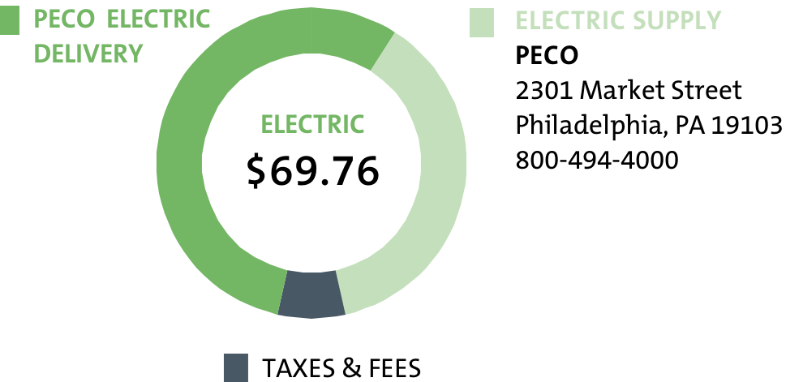
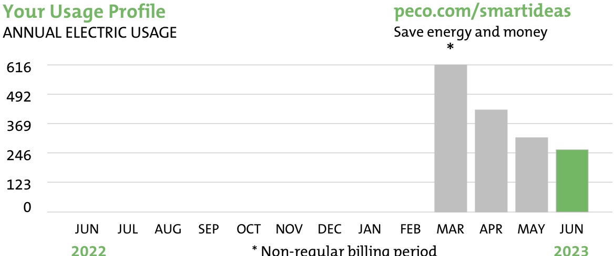

<!-- page_num: 1 -->
# PECO® - An Exelon Company

## Customer Information

| Name:             | CENTRAL PARKING                        |
|-------------------|----------------------------------------|
| Account Number:   | 65337-51036                            |
| Phone Number:     | 215-568-4025                           |
| Service Address:  | 417 S Broad St, Park Lot, Philadelphia |

### Emergency and Repair

- **800-841-4141**  
  This is the number to call to report power outages, gas leaks or odors, and safety hazards related to PECO Equipment.

This image is a pie chart illustrating the breakdown of an electric bill totaling $69.76. The chart is divided into three sections:  1. PECO ELECTRIC DELIVERY: Represented by the darkest green section, indicating the portion of the bill attributed to delivery services. 2. ELECTRIC SUPPLY: Shown in a lighter green, representing the cost associated with the electric supply. 3. TAXES & FEES: Depicted by a dark grey segment, indicating the portion of the bill that covers taxes and fees.  To the right of the pie chart, there is textual information providing contact details for PECO (the electric supplier): - Address: 2301 Market Street, Philadelphia, PA 19103 - Phone: 800-494-4000

## Billing Summary

| Description                    | Amount    |
|--------------------------------|-----------|
| **Bill Date**                  | 06/20/2023|
| Thank you for your payment of  | $76.91 on 06/16/2023 |
| Charges from previous bill     | $100.84   |
| Late payment charge            | $2.93     |
| **Total Other Charges**        | $103.77   |
| **Current Period Charges**     |           |
| Electric                       | $69.76    |
| **Total New Charges**          | $69.76    |
| **Total Amount Due on 07/12/2023** | $173.53 |

## General Information

- **Next scheduled meter reading:** 07/19/2023
- **Customer Service:** 1-800-494-4000  
  If you have any questions or concerns, please call 800-494-4000 before the due date.  
  Si tiene alguna pregunta, favor de llamar al numero 1-800-494-4000 antes de la fecha de vencimiento.

- [peco.com/service](http://peco.com/service)  
  Customer Self Service - Manage Your Account 24/7  
  Start, stop and move your service.

### Payment Options

- **Online:** [peco.com](http://peco.com)
- **In Person:** 2301 Market St., Philadelphia, PA 19103
- **By Phone:** 1-800-494-4000

## Payment Instructions

- **Return only this portion with your check made payable to PECO. Please write your account number on your check.**

- **Pay Today!**  
  - **Account #** 65337-51036  
  - **Amount Due by 07/12/2023:** $173.53  
  - **Pay by phone:** 877-432-9384 (a convenience fee will apply)
  - [peco.com/ebill](http://peco.com/ebill)  
    Go paperless: receive and pay your bill online.
<!-- /page_num: 1 -->
<!-- page_num: 2 -->
# Account Number: 65337-51036

## Meter Information

| Read Dates | Meter Number | Load Type      | Reading Type | Meter Reading - Previous | Meter Reading - Present | Difference | Multiplier | Total Usage |
|------------|--------------|----------------|--------------|--------------------------|-------------------------|------------|------------|-------------|
| 05/18-06/18| 121954575    | General Service| Tot kWh      | 99414 Estimate           | 99675 Estimate          | 261        | 1          | 261         |
| 05/18-06/18| 121954575    | General Service| Pk kW        | 0.00 Estimate            | 2.15 Estimate           | 2.15       | 1          | 2.15        |

*Distribution kW - Calculated: 1.5 Transmission kW - Calculated: 1.5 Generation kW - Calculated: 1.5*

### Total kWh Used: 261

## Electric Commercial Service 0-100kW

**Service Period 05/18/2023 to 06/18/2023 - 31 days**

| PECO ELECTRIC DELIVERY                  |               | $38.54 |
|-----------------------------------------|---------------|--------|
| Customer Charge                         |               | 24.21  |
| Distribution Charges                    | 1.50 kW X 9.02226 | 13.53  |
| Distribution Charges                    | 261 kWh X -0.00060 | -0.16  |
| Distribution System Improvement Charge  |               | 0.02   |
| Energy Efficiency Charge                | 261 kWh X 0.00360 | 0.94   |

| ELECTRIC SUPPLY                         |               | $26.09 |
|-----------------------------------------|---------------|--------|
| Generation Charges                      | 261 kWh X 0.08784 | 22.93  |
| Transmission Charges                    | 1.50 kW X 2.10807 | 3.16   |

| TAXES & FEES                            |               | $5.13  |
|-----------------------------------------|---------------|--------|
| State Tax Adjustment                    |               | -0.04  |
| Sales Tax                               |               | 5.17   |

**Total Current Charges**: $69.76

### Message Center

From PECO: Estimated Meter Reading.

5.90% estimated Gross Receipts Tax of $3.81 included in new charges.

Your electric price to compare is $0.1000 per kWh. This may change in March, June, September, and December. For more information and supplier offers visit [PAPowerSwitch.com](http://PAPowerSwitch.com).

### Shopping Information Box

When shopping for a competitive electric/natural gas supplier, please provide the following:

- **Account Number**: 65337-51036
- **Electric Rate**: Electric Commercial Service 0-100kW

If you are purchasing the energy you use from a competitive supplier, it is important to understand the terms of your contract and expiration date.

The image is a bar graph titled "Your Usage Profile" that displays "ANNUAL ELECTRIC USAGE" from June 2022 to June 2023. The vertical axis represents electric usage in unspecified units, with markers at 0, 123, 246, 369, 492, and 616. The horizontal axis lists the months from June 2022 to June 2023.  Data points for each month are as follows: - JUN 2022: No bar displayed - JUL 2022: No bar displayed - AUG 2022: No bar displayed - SEP 2022: No bar displayed - OCT 2022: No bar displayed - NOV 2022: No bar displayed - DEC 2022: No bar displayed - JAN 2023: No bar displayed - FEB 2023: No bar displayed - MAR 2023: Approximately 615 - APR 2023: Approximately 430 - MAY 2023: Approximately 310 - JUN 2023: Approximately 245  There is a note at the bottom indicating that MAR is a "Non-regular billing period." The top right corner contains a URL "peco.com/smartideas" with the phrase "Save energy and money." The bars representing 2023 are shown in green for June and gray for previous months.

### Ways to Pay

- **Online**  
  Visit [peco.com/paybill](http://peco.com/paybill) where you can enroll in AutoPay, or make a one-time payment using your credit card or bank account.

- **Mobile App**  
  Download the PECO mobile app for your Apple or Android device for the quickest and easiest way to manage your account and pay your bill with one swipe of the finger.

- **Mail**  
  Mail checks payable to PECO and write your account # on your check. Make sure to include the tear-off portion of your bill at the bottom of page 1.

- **Phone**  
  Call 1-877-432-9384 to make a payment with a credit card, debit card, or your bank account.*

\* Fees apply for card & phone payments.  
No fees apply when you create a PECO My Account and pay using your bank account.
<!-- /page_num: 2 -->